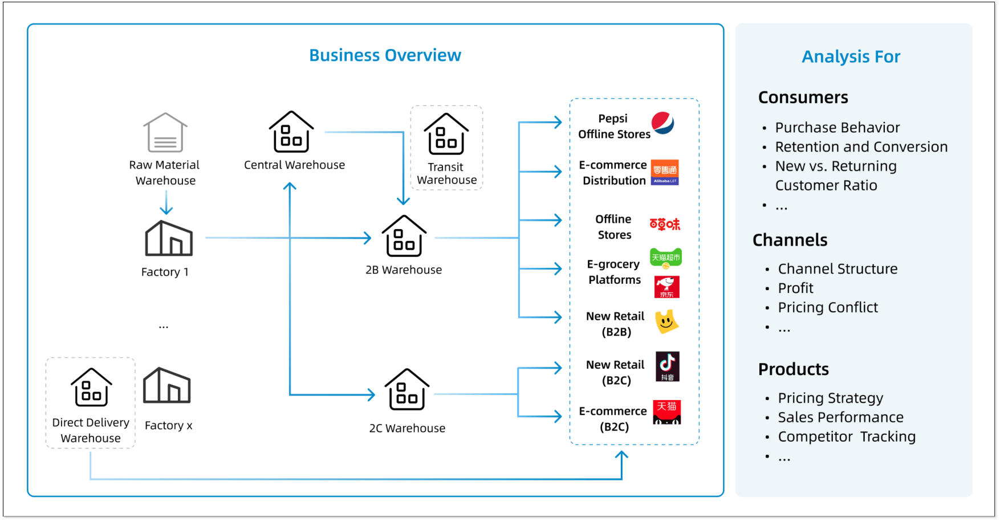
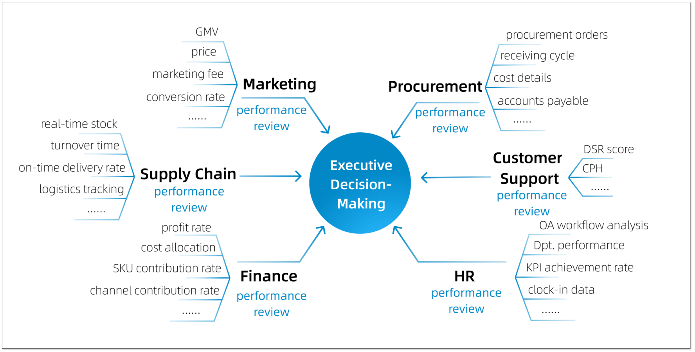
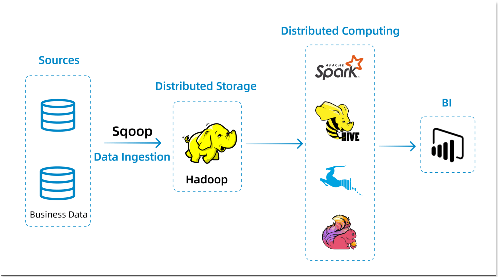
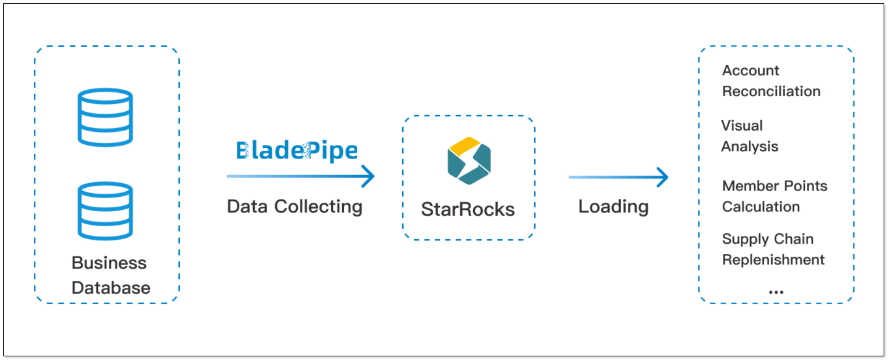
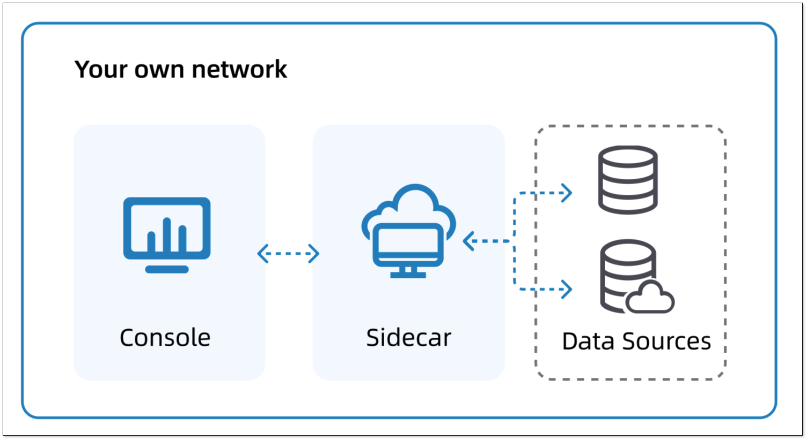
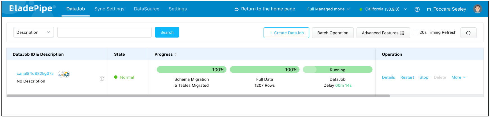
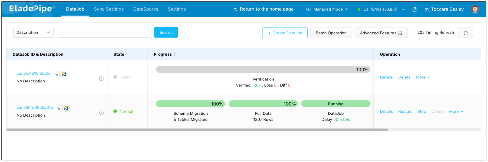
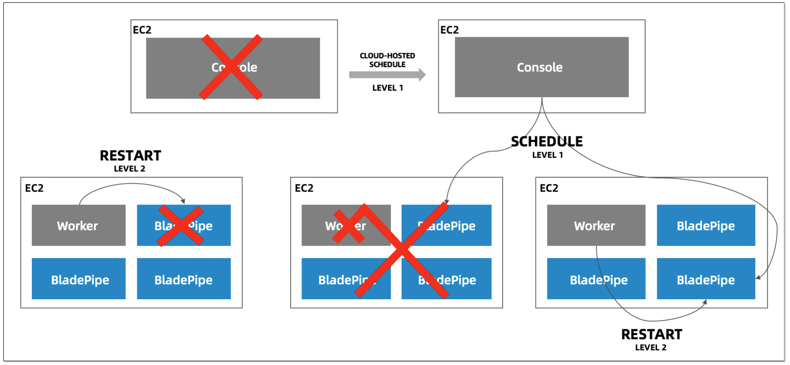

**Author**: Zhu Qitian, Data Lead at Be & Cheery

## About Be & Cheery
Founded in 2003, Be & Cheery is one of China’s largest snack brands, offering a broad portfolio that includes nuts, dried fruit, meat snacks, etc. With hundreds of SKUs and a strong digital retail presence, the brand serves **more than 200 million** consumers across major e-commerce platforms.

In 2020, **PepsiCo** acquired Be & Cheery for US$705 million. The acquisition strengthened Be & Cheery’s capabilities in supply chain, product development, and global operations. With PepsiCo’s support and international expertise, Be & Cheery has expanded its reach and elevated its position beyond the domestic market, opening the door for future global growth.

As the business expanded, the volume of data generated across sourcing, supply chain operations, and omnichannel sales grew rapidly. Data became essential to daily operations, yet increasingly difficult to manage. To support this data-driven growth, Be & Cheery partnered with **BladePipe** to build a unified, stable, and real-time data-integration platform. The goal was straightforward: deliver consistent, trusted data to every team without increasing operational burden.

## Rapid Growth Created Data Complexity
Be & Cheery operates a complex value chain: raw material sourcing, manufacturing, warehousing, logistics, online and offline retail. Each step generates data, and each system, such as ERP, WMS, OMS and CRM, comes with its own schema and refresh cycle.

Every day, teams depend on up-to-date information to track orders, manage inventory, evaluate promotions, and monitor supply chain performance. But as data volumes grew, Be & Cheery faced several issues:
- Data resided in siloed systems with inconsistent structures.
- Latency increased, slowing down reporting and analysis.
- Manual monitoring consumed significant engineering time.

These challenges became more visible as the company’s original Hadoop-based architecture approached its limits.

## Challenges of the Legacy Architecture
Be & Cheery's data platform journey began in 2017 with an infrastructure based on **CDH**. This setup used **Sqoop** to ingest data from sources into **Hadoop**. Offline reporting relied on **Hive**, while real-time reporting used **Apache Spark**, with BI tools handling visualization.

However, as the number of data sources increased, several limitations emerged:

+ **Complex deployment and maintenance**: The multitude of components led to long implementation cycles and high maintenance costs.
+ **Unstable pipelines:**: Tightly coupled tasks caused frequent data delays and interruptions, preventing timely data delivery.
+ **Lack of high availability**: Architectural single point of failure made it difficult to recover from interruptions.
+ **No central management**: Disconnected systems prevented a centralized, clear view of data flow status.

As a result, the data team often found itself focusing on pipeline stability rather than delivering new business value. A more reliable, real-time, and high-availability integration layer became essential.

## The Solution: Shorten Pipelines with BladePipe
In 2022, Be & Cheery evaluated multiple options for modernizing its data-integration architecture. The team required a platform that could **handle high throughput**, **deliver low latency**, and **reduce operational overhead**. BladePipe matched these requirements and offered an architecture that was both simpler and more resilient.

With BladePipe, the team built real-time pipelines from MySQL and other operational databases into StarRocks, establishing a unified analytics layer that supports both operational reporting and executive dashboards.

## Why BladePipe?
When compared to open-source alternatives or in-house development, **BladePipe** stood out for its **rapid time-to-value** and **operational simplicity**.

As a one-stop data-integration platform, BladePipe enabled Be & Cheery to build a high-availability sync infrastructure with a simpler architecture, more stable pipelines, and significantly lower operational overhead.

### Secure and Controlled Data Transfer
BladePipe uses a minimal end-to-end path. Data flows directly from source to target, eliminating intermediate services that can introduce risk.
Private deployment keeps all data inside Be & Cheery’s infrastructure, supporting strict internal compliance.

### Second-Level Real-Time Sync
By reading binlogs, BladePipe provides second-level latency for incremental updates. Teams across supply chain, operations, and retail can now monitor core metrics, such as orders, stock levels and fulfillment trends, in near real time.

### Built-in Data Verification
BladePipe offers data verification function, which compares source and target data, flags inconsistencies, and supports secondary verification. This ensures that downstream reports, especially financial and operational metrics, remain accurate and trustworthy.

### High Availability by Design
Capabilities such as checkpoint resume, auto-retry, and node-level recovery give pipelines strong resilience. When failures occur, tasks recover automatically, reducing manual workload and improving end-to-end reliability.

Beyond the robust platform features, two additional factors solidified the decision.

### Engineering-Level Support
The BladePipe engineering team works directly with Be & Cheery during evaluation, deployment, and production operations. This shortens troubleshooting cycles and accelerates onboarding.

### Predictable, Transparent Pricing
BladePipe On-prem uses a task-based pricing model. Costs scale with business growth in a controlled and predictable way, without billing based on data volume or compute usage. This model helped Be & Cheery reduce long-term expenses without compromising on performance or security.

## Key Results
After adopting BladePipe, Be & Cheery significantly streamlined its data pipelines while improving delivery performance.

+ **Secure and stable operations**: Over the past **three years**, nearly 100 pipelines have run reliably in production without major interruptions. At the same time, thanks to **private deployment** and **end-to-end data transfer**, data remains closed-loop within the its own environment, effectively ensuring data security.
+ **Faster, More Accurate Data Delivery**: Incremental sync ensures that order and inventory data reaches the analytics platform within seconds. Automated verification provides consistent, high-quality data to downstream systems.
+ **Better Cross-Team Decision-Making**: With core reports and metrics updating in real-time, marketing, supply chain, and finance  teams always work with unified, up-to-date datasets. Reporting cycles are faster, and decisions are made with greater confidence.
+ **Reduced Operational Overhead**: Pipeline maintenance time has dropped by approximately **50%**. BladePipe's **24/7 professional support** also ensures quicker response 

## Looking Ahead

Be & Cheery plans to expand its collaboration with BladePipe as it advances its enterprise data strategy.
The future roadmap includes:

+ **Deep Integration with Scheduling Systems**: Be & Cheery plans to integrate BladePipe with its internal scheduling platforms. This will embed data pipelines into business processes, enhancing data governance and automation.
+ **Extending AI Capabilities**: Leveraging BladePipe's support for heterogeneous data sources, Be & Cheery aims to extend synchronization to files and other unstructured sources. Combined with new frameworks like **MCP**, the goal is to fuel enterprise-grade AI applications with richer, more diverse data assets.

As Be & Cheery continues its digital transformation, BladePipe’s real-time architecture and high availability provide a strong foundation for scalable, data-driven operations.

Ready to experience what reliable, low-latency data integration looks like?     
Get started with a [free BladePipe trial](https://www.bladepipe.com/) or [request a tailored demo](https://cal.com/bladepipe-xxypci/30min) from our engineers.