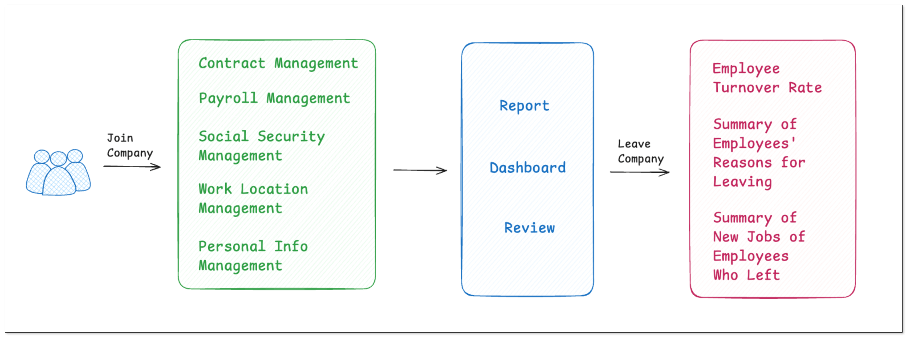
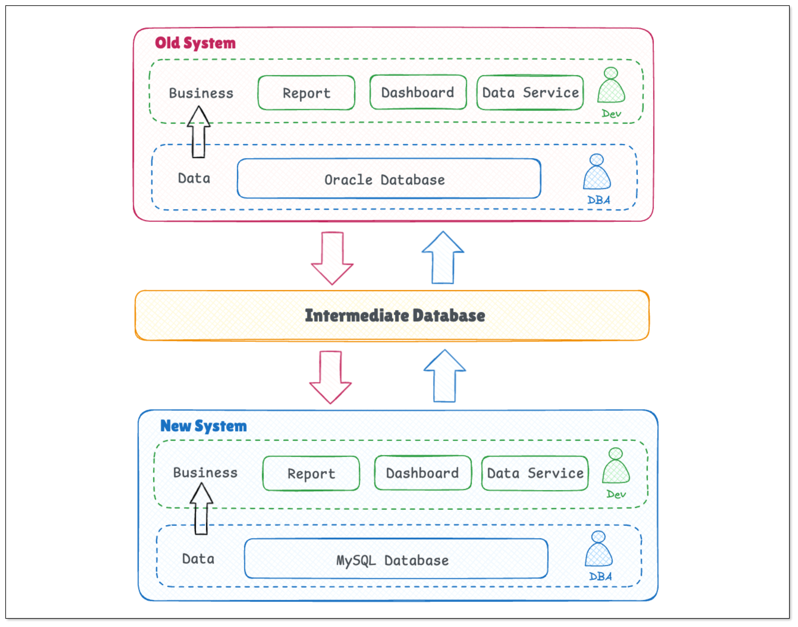
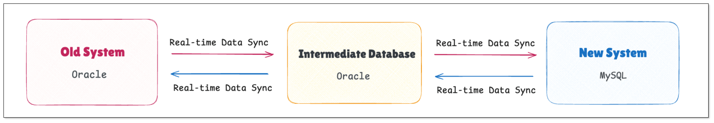

Replacing a system in an organization can happen for many reasons: the business requires a more intelligent system to boost growth, or the organization finds a cost-effective alternative. It is not always a piece of cake. One pain point is how to minimize the downtime while replacing a system.

In this article, we will dive into a real case from a top HR service company to see how it replaced its HR management system seamlessly.

## Business Architecture
In this case, the objective of the company was to replace the outdated HR management system with a new one. The old system integrated the management of employees' contracts, payroll, social security, locations, etc. To satisfy the new demands of the company, a system with enriched functions was to be developed. That involved the reconstruction of data stored in the system.

## Technology Architecture
The old system was based on Oracle databases, and the new one is based on MySQL databases. The data exchange was performed through an intermediate Oracle database.

The reasons why an intermediate database was added in the architecture include:
- Network complexity
- Requirement of continuous HR service based on production data and data security
- Differences in using data stored in the databases for the old system and the new system

The following picture depicts how the system was replaced seamlessly:

## Challenges
To replace the system in a smooth way while maintaining the HR service, real-time data movement was a critical step. Several data pipelines had to be built to realize the following data movement:
- Transform and move the existing data in the old system to the intermediate database, and sync the incremental data to the intermediate database in real time.
- Move the required data from the new system to the intermediate database, and then load the data from the intermediate database to the old system in real time.

This process contained the following pain points:
- Maintain the stability of several data pipelines. 
- Ensure the data accuracy when replicating data between heterogeneous data sources.
- Minimize the latency. Control the latency to be within seconds.

## Why BladePipe?
The HR service company selected BladePipe after comparing several data movement tools. The key factors that drove the company to choose BladePipe include:
- The intuitive interface makes data pipeline configuration easier than ever before. No code is needed in the configuration process.
- The schema migration, full data migration and incremental data sync can be done automatically. 
- Continuous monitoring and automated alert notification significantly lower the O&M cost and pressure.
- It has strong capabilities of data movement between heterogeneous data sources. The embedded data pruning, mapping and filtering functionalities help developers to work more efficiently.
- Support for custom code, allowing great flexibility for personalization.

## Result
The HR service company successfully replaced the system using BladePipe. The new system has been put into operation for several months. 

## Conclusion
To replace systems while not affecting the business, real-time data sync is usually an indispensable step. BladePipe perfectly meets the needs, presenting great advantages, such as ease of use, powerful functions and ultra-low latency. It is proven to be a powerful tool to help companies replace systems in a reliable and efficient manner.