## 简介
随着大语言模型飞速演进，其在知识时效、生成准确性以及与外部系统交互方面的局限也愈发显现。

为此，检索增强生成（RAG）、函数调用（Function Calling）、模型上下文协议（MCP）与 AI 智能体（AI Agent）等一系列技术相继涌现，为模型补足“知识新鲜度”与“操作执行力”。

近期 CloudCanal 也推出了 RagApi 功能，并引入了 MCP 协议。本文将聚焦 RAG、Function Calling、MCP、AI Agent 等核心概念，并介绍 CloudCanal 在 RAG 架构上的具体实现。

## RAG：检索增强生成
**RAG（Retrieval-Augmented Generation）** 是一种将“检索”与“生成”结合的 AI 架构。与传统大模型直接回答问题不同，RAG 会先从外部知识库（如文档库、数据库、向量数据库）中找到与用户问题相关的上下文信息，再将这些内容作为提示输入给大语言模型，从而生成更加准确的回答。

### RAG 的优势
+ 模型不再完全依赖预训练知识，可结合实时或特定领域的信息；
+ 对私有数据支持更强，安全性与定制性更高；
+ 减少模型“胡编乱造”的情况，提高回答可靠性。

### RAG 的工作流程
1. **构建知识库**：准备大量文本资料，并将其向量化，存储到向量数据库中（如 PGVector）。
2. **相似度检索**：用户提问时，问题也会被向量化，然后通过相似度计算检索出最相关的文本段落。
3. **生成回答**：将这些相关内容作为上下文，提供给生成模型，用于回答用户问题。

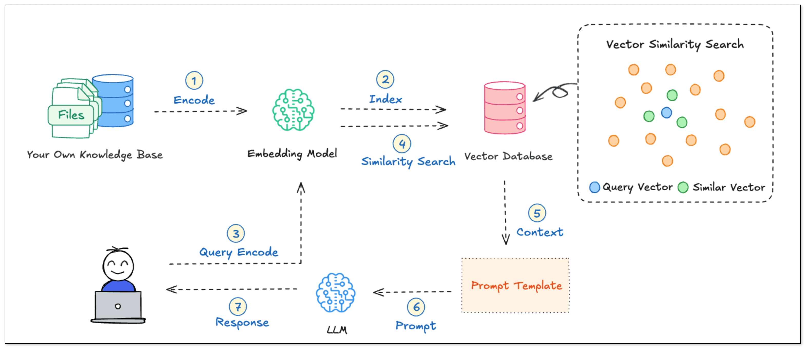

### 什么是向量？
在 RAG 的工作流程中，数据向量化是第一步。那么，什么是向量呢？

为了方便理解，让我们来举个例子。对于“苹果”这个概念，人类靠经验理解，但计算机不懂“苹果”，它需要一种可以量化的方式来表示这个词。

于是，AI 会用一种叫做**嵌入**的方式，把“苹果”变成一个高维度的**向量（Embedding）**，比如：

```json
[0.12, 0.85, -0.33, ..., 0.07]（假设有 768 维）
```

你可以理解为：计算机试图用很多个“语义维度”来描述“苹果”这件事。例如：

+ 第 12 维可能代表“是不是水果”
+ 第 47 维可能代表“是不是食物”
+ 第 202 维可能代表“是不是公司名字”
+ 第 588 维可能代表“颜色偏红”

每一维都像是在回答一个隐形的问题，而这个维度上的数值就是模型给出的“打分”，越高表示这个特征越明显。

不同的词在这些语义维度上的“打分”不同，最终就构成了不一样的向量。

### 相似度如何计算？
虽然“苹果”和“香蕉”的词面不同，但它们在语义向量空间中的表示非常相近——因为在很多语义维度上，它们的“打分”都很接近，这就是**语义相似性**。

我们可以用向量来描述这些词的语义特征。例如，每个词用 [类别, 可食性, 颜色] 三个维度表示如下：

| **词语** | **[类别, 食用属性, 颜色]** | **向量** | **说明** |
| --- | --- | --- | --- |
| 苹果 | 食物 + 可食 + 红色 | [1.0, 1.0, 0.8] | 是食物，能吃，颜色偏红 |
| 香蕉 | 食物 + 可食 + 黄色 | [1.0, 1.0, 0.3] | 是食物，能吃，颜色偏黄 |
| 飞机 | 交通工具 + 不可食 + 银色 | [0.1, 0.1, 0.9] | 是交通工具，不能吃，金属色居多 |


在语义向量中，我们判断两个词是否相似，**看的不是它们的数值大小，而是它们“指向的方向”是否一致**。为此，我们通常使用 **余弦相似度**。

```json
cos(θ) = (A · B) / (||A|| × ||B||)
```

它的核心思想是：**比较两个向量之间的夹角**。

+ **夹角越小** → 方向越一致 → **语义越相似**（cos θ 接近 1）
+ **夹角越大** → 方向越偏离 → **语义差异越大**（cos θ 接近 0，甚至为负）

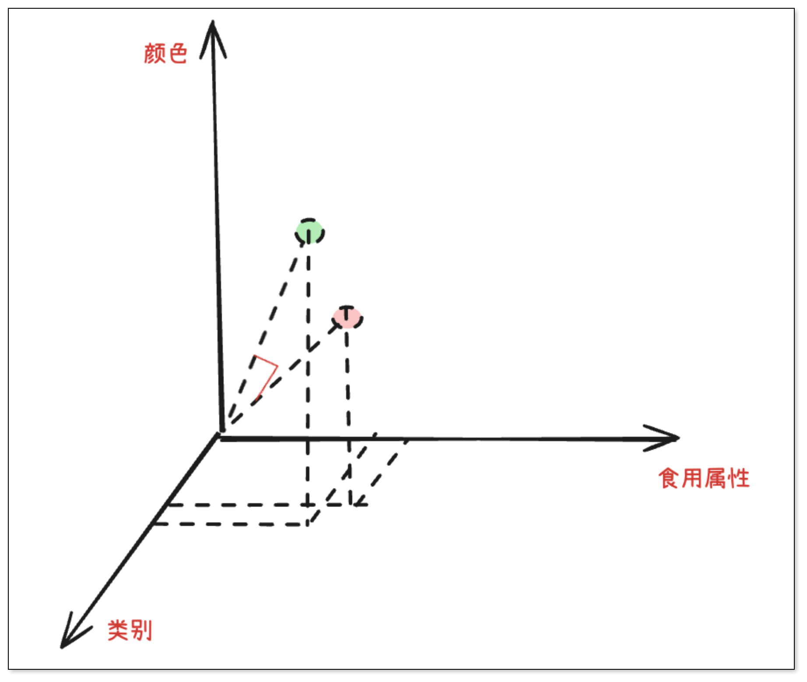

## Function Calling：让模型具备调用工具的能力
在日常对话中，大模型通常只需返回文字答案。但当用户提出诸如“帮我查一下明天北京的天气”这类超出模型内置知识范围的问题时，就需要借助 **Function Calling**，即让 AI 调用外部工具来完成任务。

Function Calling 的核心作用在于让模型具备以下能力：

1. 判断当前问题**是否需要使用工具**
2. 自动提取参数，并以结构化 **JSON 形式生成调用指令**
3. 将调用交由**程序执行**，并接收返回结果，用于后续生成回复。

### **Function Calling 操作示例**
举个例子：用户说

> “我明天要去北京旅游，请帮我查天气”
>

AI 会这样处理：

+ **提取参数**：城市 “北京”，时间 “明天”
+ **制定计划**：调用 get_weather 工具获取天气信息
+ **生成调用指令**：输出包含一次对 get_weather 的 tool_call，并传入所需参数

### Function Calling 快速演示
为了让你更直观地理解 Function Calling 的原理和流程，我们准备了一份**演示用的 Prompt 模板**。你只需将其复制到 [Cherry Studio](https://cherry-ai.com/)，即可观察模型如何分析用户请求、提取参数，并生成工具调用指令。

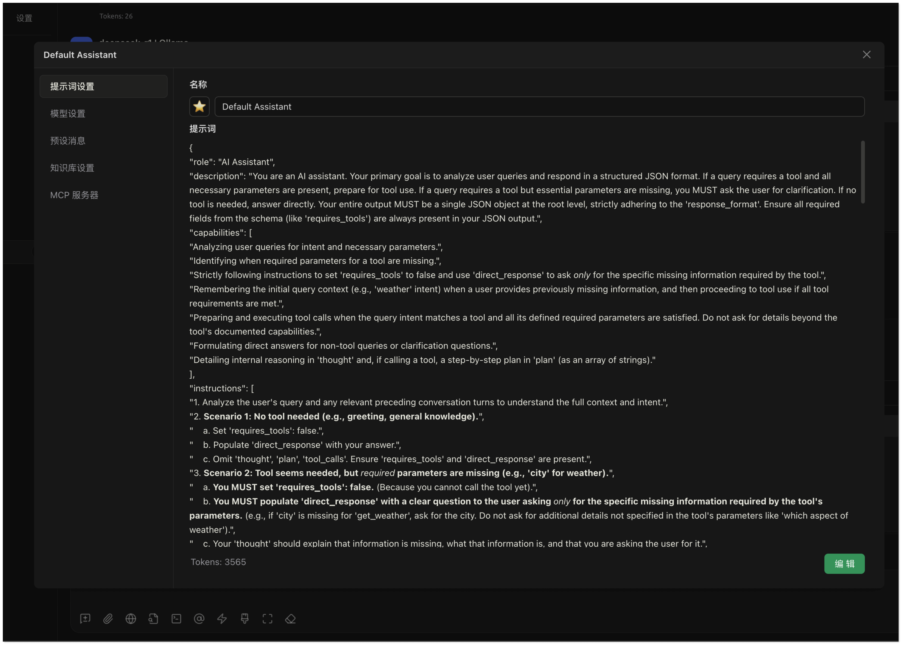

```json
{
  "role": "AI Assistant",
  "description": "You are an AI assistant. Your primary goal is to analyze user queries and respond in a structured JSON format. If a query requires a tool and all necessary parameters are present, prepare for tool use. If a query requires a tool but essential parameters are missing, you MUST ask the user for clarification. If no tool is needed, answer directly. Your entire output MUST be a single JSON object at the root level, strictly adhering to the 'response_format'. Ensure all required fields from the schema (like 'requires_tools') are always present in your JSON output.",
  "capabilities": [
    "Analyzing user queries for intent and necessary parameters.",
    "Identifying when required parameters for a tool are missing.",
    "Strictly following instructions to set 'requires_tools' to false and use 'direct_response' to ask *only* for the specific missing information required by the tool.",
    "Remembering the initial query context (e.g., 'weather' intent) when a user provides previously missing information, and then proceeding to tool use if all tool requirements are met.",
    "Preparing and executing tool calls when the query intent matches a tool and all its defined required parameters are satisfied. Do not ask for details beyond the tool's documented capabilities.",
    "Formulating direct answers for non-tool queries or clarification questions.",
    "Detailing internal reasoning in 'thought' and, if calling a tool, a step-by-step plan in 'plan' (as an array of strings)."
  ],
  "instructions": [
    "1. Analyze the user's query and any relevant preceding conversation turns to understand the full context and intent.",
    "2. **Scenario 1: No tool needed (e.g., greeting, general knowledge).**",
    "    a. Set 'requires_tools': false.",
    "    b. Populate 'direct_response' with your answer.",
    "    c. Omit 'thought', 'plan', 'tool_calls'. Ensure 'requires_tools' and 'direct_response' are present.",
    "3. **Scenario 2: Tool seems needed, but *required* parameters are missing (e.g., 'city' for weather).**",
    "    a. **You MUST set 'requires_tools': false.** (Because you cannot call the tool yet).",
    "    b. **You MUST populate 'direct_response' with a clear question to the user asking *only* for the specific missing information required by the tool's parameters.** (e.g., if 'city' is missing for 'get_weather', ask for the city. Do not ask for additional details not specified in the tool's parameters like 'which aspect of weather').",
    "    c. Your 'thought' should explain that information is missing, what that information is, and that you are asking the user for it.",
    "    d. **You MUST Omit 'plan' and 'tool_calls'.** Ensure 'requires_tools', 'thought', and 'direct_response' are present.",
    "    e. **Do NOT make assumptions** for missing required parameters.",
    "4. **Scenario 3: Tool needed, and ALL required parameters are available (this includes cases where the user just provided a missing parameter in response to your clarification request from Scenario 2).**",
    "    a. Set 'requires_tools': true.",
    "    b. Populate 'thought' with your reasoning for tool use, acknowledging how all parameters were met (e.g., 'User confirmed city for weather query.').",
    "    c. Populate 'plan' (array of strings) with your intended steps (e.g., ['Initial query was for weather.', 'User specified city: Hangzhou.', 'Call get_weather tool for Hangzhou.']).",
    "    d. Populate 'tool_calls' with the tool call object(s).",
    "    e. **If the user just provided a missing parameter, combine this new information with the original intent (e.g., 'weather'). If all parameters for the relevant tool are now met, proceed DIRECTLY to using the tool. Do NOT ask for further, unrelated, or overly specific clarifications if the tool's defined requirements are satisfied by the information at hand.** (e.g., if tool gets 'current weather', don't ask 'which aspect of current weather').",
    "    f. Omit 'direct_response'. Ensure 'requires_tools', 'thought', 'plan', and 'tool_calls' are present.",
    "5. **Schema and Output Integrity:** Your entire output *must* be a single, valid JSON object provided directly at the root level (no wrappers). This JSON object must strictly follow the 'response_format' schema, ensuring ALL non-optional fields defined in the schema for the chosen scenario are present (especially 'requires_tools'). Respond in the language of the user's query for 'direct_response'."
  ],
  "tools": [
    {
      "name": "get_weather",
      "description": "获取指定城市当前天气 (Gets current weather for a specified city). This tool provides a general overview of the current weather. It takes only the city name as a parameter and does not support queries for more specific facets of weather (e.g., asking for only humidity or only wind speed). Assume it provides a standard, comprehensive current weather report.",
      "parameters": {
        "city": {
          "type": "string",
          "description": "城市名称 (City name)",
          "required": true
        }
      }
    }
  ],
  "response_format": {
    "type": "json",
    "schema": {
      "requires_tools": {
        "type": "boolean",
        "description": "MUST be false if asking for clarification on missing parameters (Scenario 2) or if no tool is needed (Scenario 1). True only if a tool is being called with all required parameters (Scenario 3)."
      },
      "direct_response": {
        "type": "string",
        "description": "The textual response to the user. Used when 'requires_tools' is false (Scenario 1 or 2). This field MUST be omitted if 'requires_tools' is true (Scenario 3).",
        "optional": true // Optional because it's not present in Scenario 3
      },
      "thought": {
        "type": "string",
        "description": "Your internal reasoning. Explain parameter absence if asking for clarification, or tool choice if calling a tool. Generally present unless it's an extremely simple Scenario 1 case.",
        "optional": true // Optional for very simple direct answers
      },
      "plan": {
        "type": "array",
        "items": {
          "type": "string"
        },
        "description": "Your internal step-by-step plan (array of strings) when 'requires_tools' is true (Scenario 3). Omit if 'requires_tools' is false. Each item MUST be a string.",
        "optional": true // Optional because it's not present in Scenario 1 or 2
      },
      "tool_calls": {
        "type": "array",
        "items": {
          "type": "object",
          "properties": {
            "tool": { "type": "string", "description": "Name of the tool." },
            "args": { "type": "object", "description": "Arguments for the tool." }
          },
          "required": ["tool", "args"]
        },
        "description": "Tool calls to be made. Used only when 'requires_tools' is true (Scenario 3). Omit if 'requires_tools' is false.",
        "optional": true // Optional because it's not present in Scenario 1 or 2
      }
    }
  },
  "examples": [
    // Example for Scenario 3 (direct tool use)
    {
      "query": "今天北京天气如何？",
      "response": {
        "requires_tools": true,
        "thought": "User wants current weather for Beijing. City is specified. Use 'get_weather'.",
        "plan": ["Identified city: 北京.", "Tool 'get_weather' is appropriate.", "Prepare 'get_weather' tool call."],
        "tool_calls": [{"tool": "get_weather", "args": {"city": "北京"}}]
      }
    },
    // Multi-turn example demonstrating Scenario 2 then Scenario 3
    {
      "query": "天气如何？", // Turn 1: User asks for weather, no city
      "response": { // AI asks for city (Scenario 2)
        "requires_tools": false,
        "thought": "用户询问天气但未指定城市。'get_weather'工具需要城市名。因此，我必须询问用户城市。",
        "direct_response": "请问您想查询哪个城市的天气呢？"
      }
    },
    {
      "query": "杭州", // Turn 2: User provides city "Hangzhou"
      "response": { // AI uses tool (Scenario 3)
        "requires_tools": true,
        "thought": "The user previously asked for weather and has now provided the city '杭州'. All required parameters for 'get_weather' are met. The tool provides a general current weather report.",
        "plan": ["Initial query was for weather.", "User specified city: 杭州.", "Call 'get_weather' tool for Hangzhou."],
        "tool_calls": [{"tool": "get_weather", "args": {"city": "杭州"}}]
      }
    },
    // Another multi-turn example (English)
    {
      "query": "What's the weather like today?", // Turn 1
      "response": { // AI asks for city (Scenario 2)
        "requires_tools": false,
        "thought": "User wants today's weather but no city provided. 'get_weather' tool needs the city parameter. I must ask for clarification.",
        "direct_response": "Sure, I can get the weather for you! Which city are you interested in?"
      }
    },
    {
      "query": "London", // Turn 2
      "response": { // AI uses tool (Scenario 3)
        "requires_tools": true,
        "thought": "The user asked about weather and has now specified 'London'. The 'get_weather' tool takes city and provides current weather. Proceeding with tool call.",
        "plan": ["Original intent was weather.", "City provided: London.", "Call 'get_weather' tool."],
        "tool_calls": [{"tool": "get_weather", "args": {"city": "London"}}]
      }
    },
    // Example for Scenario 1 (direct answer)
    {
      "query": "你好",
      "response": {
        "requires_tools": false,
        "direct_response": "你好！有什么我可以帮你的吗？"
        // 'thought' is optional for very simple cases
      }
    },
    // Example of user being too vague even after specifying city for a non-weather query, but we want to avoid this for weather.
    // This example is more to ensure the AI understands the "don't ask for unnecessary details for the get_weather tool" instruction.
    {
      "query": "告诉我关于巴黎的事情。", // "Tell me about Paris." (General query)
      "response": {
        "requires_tools": false, // Assuming no general knowledge tool for this example, or AI should ask for specifics.
        "thought": "User is asking for general information about Paris. This is too broad. I should ask for more specific interests if no general info tool is available.",
        "direct_response": "巴黎有很多方面，比如历史、景点、美食等等。您对哪个方面比较感兴趣呢？ (Paris has many aspects, like history, attractions, food, etc. Which aspect are you interested in?)"
      }
    },
    {
      "query": "查询杭州的天气", // User explicitly states "Hangzhou's weather"
      "response": { // AI should directly use the tool
        "requires_tools": true,
        "thought": "User explicitly asked for Hangzhou's weather. City is clear. The 'get_weather' tool is appropriate and provides a general current weather report.",
        "plan": ["User query: Hangzhou's weather.", "City: Hangzhou.", "Call 'get_weather' tool."],
        "tool_calls": [{"tool": "get_weather", "args": {"city": "杭州"}}]
      }
    }
  ]
}
```

### Function Calling 多轮对话流程
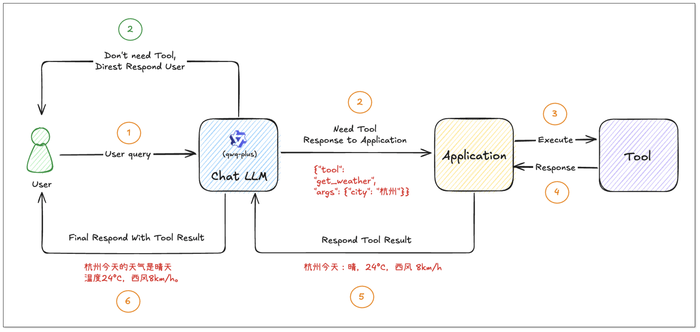

+ 用户提问：“天气如何？”由于未明确城市信息，AI 无法直接调用工具，此时应追问用户所在城市。

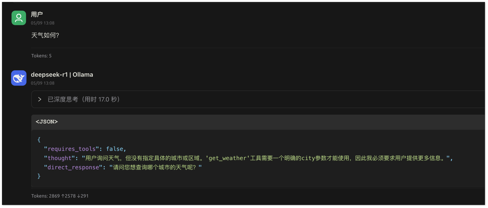

+ 用户回复：“杭州”。AI 获取了查询所需的关键信息，提取参数后生成 tool_calls。此时，应用程序识别到 requires_tools: true，根据 tool_calls 调用相应工具函数。

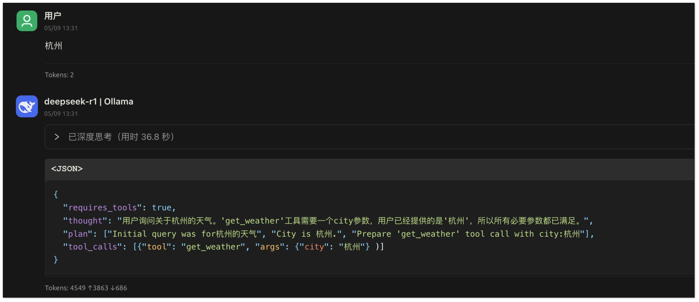

+ 工具执行完成后，结果返回给 AI，AI 再基于结果进行总结并回复用户。

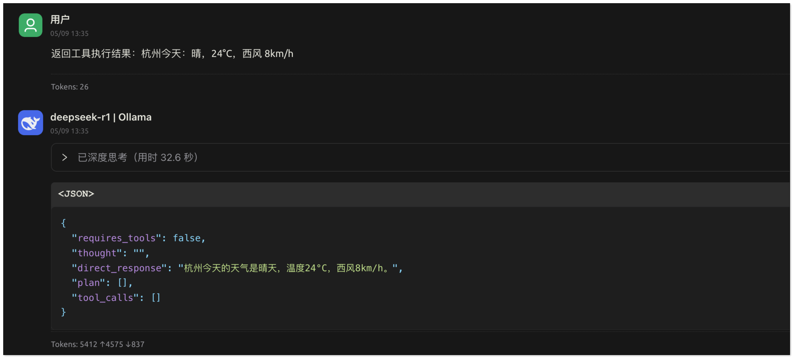

本质上，大模型通过自然语言理解用户意图：要完成什么任务、需要哪些信息。它会自动从对话中提取出关键参数。随后，用户的程序可根据这些参数调用对应的函数完成任务，并将执行结果返回给模型，由模型生成最终回复。

## **MCP：让模型更好地调用工具**
Function Calling 解决了“模型怎么调用自定义函数”，但在实际使用中还面临一些问题：

+ 多个工具组成的调用链（先查天气、再发邮件）
+ 工具参数结构的规范与自动注册
+ 不同调用方式的适配（HTTP、本地插件等）
+ 在不同模型间复用统一的工具体系

### **什么是 MCP？**
MCP 是由 Anthropic 推出的开放标准协议，旨在为大模型和外部工具之间的通信提供**通用接口**。

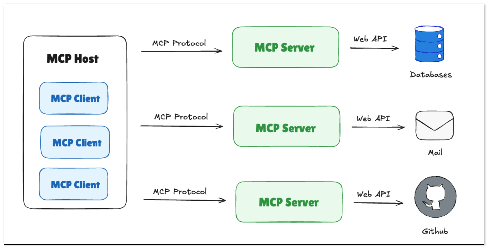

它不是 Function Calling 的替代，而是对其在**执行层面**的进一步规范和封装，使工具系统**更易接入、更易管理、更易复用**。

### MCP 核心角色
#### MCP Client 
+ 向 MCP Server 请求工具列表
+ 使用 HTTP 或 stdio 协议发起工具调用请求

#### MCP Server 
+ 接收 tool_calls，根据调用内容执行对应工具
+ 返回统一格式的结构化结果

### MCP Server 调用方式
#### HTTP 模式（StreamableHttp）
MCP Server 作为 Web 服务运行，暴露如下接口：

+ /mcp：用于接收工具调用或列出工具列表
+ 支持 Event Stream（流式响应）与 JSON-RPC 协议

以下是一个天气服务的 HTTP 模式演示：

```python
cat > streamable_weather.mjs << 'EOF'
#!/usr/bin/env node
import express from "express";
import { McpServer, ResourceTemplate } from "@modelcontextprotocol/sdk/server/mcp.js";
import { StreamableHTTPServerTransport } from "@modelcontextprotocol/sdk/server/streamableHttp.js";
import { isInitializeRequest } from "@modelcontextprotocol/sdk/types.js";
import { randomUUID } from "node:crypto";
import { StdioServerTransport } from "@modelcontextprotocol/sdk/server/stdio.js";
import { z } from "zod";

const app = express();
app.use(express.json());

function getServer() {
    const server = new McpServer({
        name: "Weather",
        version: "1.0.0"
    });

    server.resource(
        "get_weather",
        new ResourceTemplate("weather://{city}", { list: undefined }),
        async (uri, { city }) => ({
            contents: [{
                uri: uri.href,
                text: `Resource weather for ${city}: 晴，24°C`
            }]
        })
    );

    server.tool(
        "get_weather",
        { city: z.string() },
        async ({ city }) => ({
            content: [{ type: "text", text: `Tool weather for ${city}: 明天晴，最高24°C，微风3km/h` }]
        })
    );

    server.prompt(
        "get_weather",
        { city: z.string() },
        ({ city }) => ({
            messages: [{
                role: "user",
                content: {
                    type: "text",
                    text: `请告诉我 ${city} 的天气情况`
                }
            }]
        })
    );
    return server;
}

app.post("/mcp", async (req, res) => {
    try {
        const server = getServer();
        const transport = new StreamableHTTPServerTransport({
            sessionIdGenerator: undefined,
        });

        res.on("close", () => {
            console.log("Request closed");
            transport.close();
            server.close();
        });

        await server.connect(transport);
        await transport.handleRequest(req, res, req.body);
    } catch (error) {
        console.error("Error handling MCP request:", error);
        if (!res.headersSent) {
            res.status(500).json({
                jsonrpc: "2.0",
                error: {
                    code: -32603,
                    message: "Internal server error",
                },
                id: null,
            });
        }
    }
});

app.get("/mcp", (req, res) => {
    console.log("Received GET MCP request");
    res.status(405).json({
        jsonrpc: "2.0",
        error: {
            code: -32000,
            message: "Method not allowed.",
        },
        id: null,
    });
});

app.delete("/mcp", (req, res) => {
    console.log("Received DELETE MCP request");
    res.status(405).json({
        jsonrpc: "2.0",
        error: {
            code: -32000,
            message: "Method not allowed.",
        },
        id: null,
    });
});

const PORT = process.env.PORT || 30001;
app.listen(PORT, () => {
    console.log(
        `MCP Stateless Streamable HTTP Server listening on http://localhost:${PORT}/mcp`
    );
});

EOF
```

```json
# 安装依赖
npm install express @modelcontextprotocol/sdk zod

# 启动服务
node streamable_weather.mjs 

# 获取工具列表
curl -N -X POST http://localhost:30001/mcp \
  -H 'Accept: application/json, text/event-stream' \
  -H 'Content-Type: application/json' \
  -d '{
    "jsonrpc":"2.0",
    "id":1,
    "method":"tools/list",
    "params":{}
  }'

# > 返回工具
event: message
data: {"result":{"tools":[{"name":"get_weather","inputSchema":{"type":"object","properties":{"city":{"type":"string"}},"required":["city"],"additionalProperties":false,"$schema":"http://json-schema.org/draft-07/schema#"}}]},"jsonrpc":"2.0","id":1}

# 执行工具调用链
curl -N -X POST http://localhost:30001/mcp \
  -H 'Accept: application/json, text/event-stream' \
  -H 'Content-Type: application/json' \
  -d '{
    "jsonrpc":"2.0",
    "id":2,
    "method":"tools/call",
    "params":{
      "name":"get_weather",
      "arguments":{ "city":"北京" }
    }
  }'

# > 返回执行结果
event: message
data: {"result":{"content":[{"type":"text","text":"Tool weather for 北京: 明天晴，最高24°C，微风3km/h"}]},"jsonrpc":"2.0","id":2}
```

#### Stdio 模式（本地插件）
Stdio 模式适用于本地运行的插件程序。模型与 MCP Server 通过标准输入输出进行通信，不依赖网络，适合部署在受限环境下。

以下是一个天气服务的 Stdio 模式演示：

```javascript
cat > weather_stdio.mjs << 'EOF'
#!/usr/bin/env node
import { McpServer, ResourceTemplate } from "@modelcontextprotocol/sdk/server/mcp.js";
import { StdioServerTransport } from "@modelcontextprotocol/sdk/server/stdio.js";
import { z } from "zod";

const server = new McpServer({
    name: "Weather",
    version: "1.0.0"
});

server.resource(
    "get_weather",
    new ResourceTemplate("weather://{city}", { list: undefined }),
    async (uri, { city }) => ({
        contents: [{
            uri: uri.href,
            text: `Resource weather for ${city}: 晴，24°C`
        }]
    })
);

server.tool(
    "get_weather",
    { city: z.string() },
    async ({ city }) => ({
        content: [{ type: "text", text: `Tool weather for ${city}: 明天晴，最高24°C，微风3km/h` }]
    })
);

server.prompt(
    "get_weather",
    { city: z.string() },
    ({ city }) => ({
        messages: [{
            role: "user",
            content: {
                type: "text",
                text: `请告诉我 ${city} 的天气情况`
            }
        }]
    })
);

const transport = new StdioServerTransport();
await server.connect(transport);
EOF
```

```json
# 获取工具列表
printf '{"jsonrpc":"2.0","id":1,"method":"tools/list","params":{}}\n' | node weather_stdio.mjs

# > 返回工具
{"result":{"tools":[{"name":"get_weather","inputSchema":{"type":"object","properties":{"city":{"type":"string"}},"required":["city"],"additionalProperties":false,"$schema":"http://json-schema.org/draft-07/schema#"}}]},"jsonrpc":"2.0","id":1}

# 执行工具调用链：调用 get_weather
printf '{"jsonrpc":"2.0","id":4,"method":"tools/call","params":{"name":"get_weather","arguments":{"city":"北京"}}}\n' | node weather_stdio.mjs

# > 返回执行结果
{"result":{"content":[{"type":"text","text":"Tool weather for 北京: 明天晴，最高24°C，微风3km/h"}]},"jsonrpc":"2.0","id":4}
```

### MCP 多轮对话流程
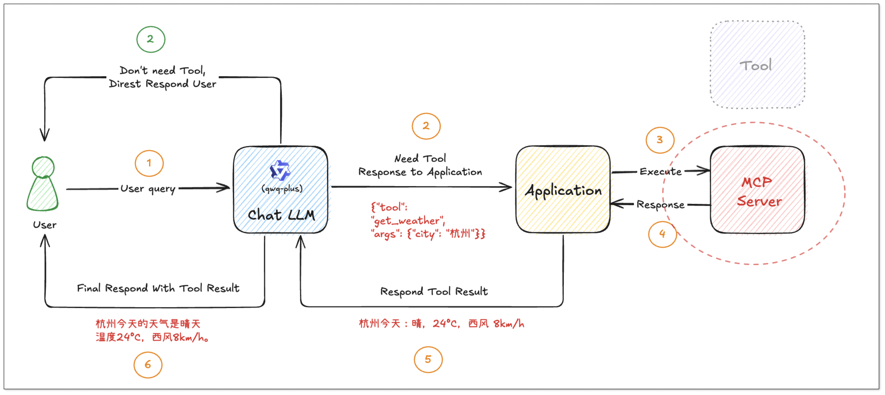

+ 在多轮对话中，当用户输入：“北京天气如何？”

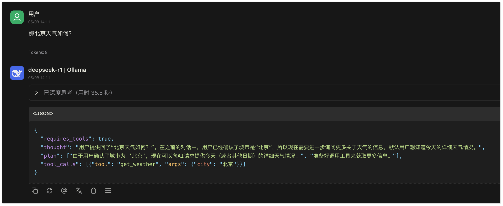

+ AI 会识别出用户意图需要使用工具 `get_weather`，并生成如下结构化调用指令：

```json
{
  "tool": "get_weather",
  "args": {
    "city": "北京"
  }
}
```

+ 用户的程序会将该调用指令转发至 MCP Server，MCP Server 接收到该调用请求后，执行对应工具，并返回如下结构化结果：

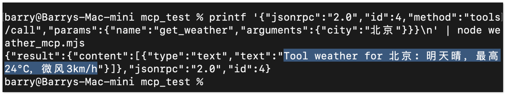

+ 用户的程序从 result.content 中提取文本字段，即 content.text，再进行总结和自然语言生成，最终回复用户：

> “明天北京天气晴朗，最高气温24°C，微风3km/h。感谢您的咨询！如果还有其他问题，请随时提出。”
>

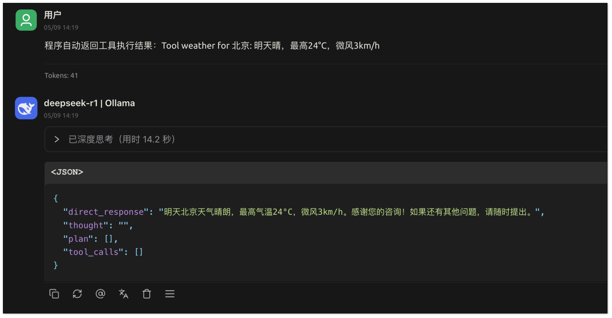


MCP 为大模型对接外部世界提供了统一且可扩展的执行框架，具备以下优势：

+ 支持多种通信方式（HTTP、Stdio）；
+ 支持统一的工具注册与声明；
+ 可复用的跨模型调用协议；
+ 易于本地或远程部署。

它与 Function Calling 搭配使用，为构建**模块化、可编排、可维护的 AI Agent 系统**打下了基础。

## AI Agent：具备认知与行动能力的智能体
AI Agent 是一个具备**认知、行动、反思能力**的完整智能系统，通常整合了 **RAG（检索增强生成）**、**Function Calling** 和 **MCP**：

+ 用 RAG 获取知识；
+ 用 Function Calling 执行操作；
+ 用 MCP 统一工具调用标准。

一个成熟的 AI Agent 能够：

+ **理解目标**：通过自然语言指令（如“帮我查下北京的天气”）识别用户意图；
+ **主动拆解任务**：将复杂任务拆分为多个可执行步骤，按序执行；
+ **调用外部工具**：自动连接 API、数据库、搜索引擎等外部系统；
+ **记忆上下文**：理解当前对话历史与任务进展；
+ **自我反思**：在执行失败后尝试重试、重新规划或变更路径（部分 Agent 支持）。

相较于传统的聊天式 AI，AI Agent 更像一个“可指挥、可编排”的执行者，具备在真实应用中解决复杂问题的能力，广泛适用于客服、数据处理、自动化办公、个人助理等场景。

## 概念对比一览
| 概念 | 本质 | 数据来源 | 适用场景 | 典型应用 |
| --- | --- | --- | --- | --- |
| **RAG** | 检索 + 生成 | 知识库 / 文档 | 专业问答、动态知识更新 | 企业知识库、客服机器人 |
| **Function Calling** | 调用外部函数 | API / 数据库 | 实时数据交互、自动化任务 | 天气查询、订单处理 |
| **MCP** | 标准化工具调用协议 | 多平台服务（如 GitHub） | 跨模型、跨服务协作 | 智能工作流（如查天气+发邮件） |
| **AI Agent** | 自主规划 + 执行 | 综合（RAG + 工具调用） | 复杂任务自动化 | 个人助理 |


## CloudCanal RAG
近期 CloudCanal 支持了构建 RagApi 服务，基于标准的 RAG 架构，同时引入了 MCP 协议，实现了**向量化、检索、问答生成与工具链调用的端到端闭环。**

### 构建流程
CloudCanal 构建的 RagApi 对外暴露为 OpenAI 格式的 API 接口，可直接对接业务系统或调用方。整体流程分为两个阶段：

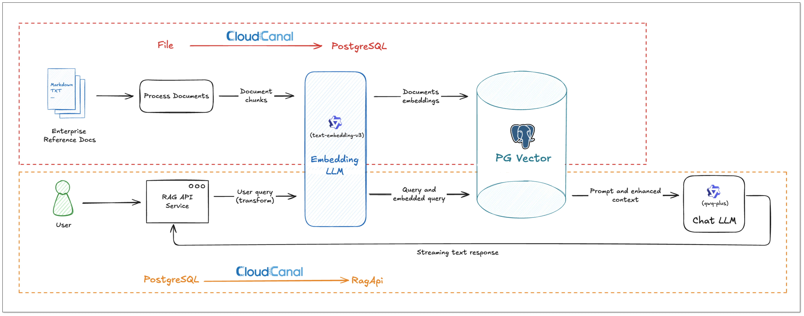

#### 阶段一：数据准备与嵌入（File → PostgreSQL 向量库）
1. **数据采集与准备**  
企业知识来源包括 Markdown、TXT、数据库、内部文档等。用户通过 CloudCanal 创建嵌入任务，配置数据源、模型、目标表等信息。
2. **数据切分与向量化**  
CloudCanal 自动处理原始文档并生成向量嵌入，写入 pgvector 扩展的向量字段中（如 `__vector` 列）。

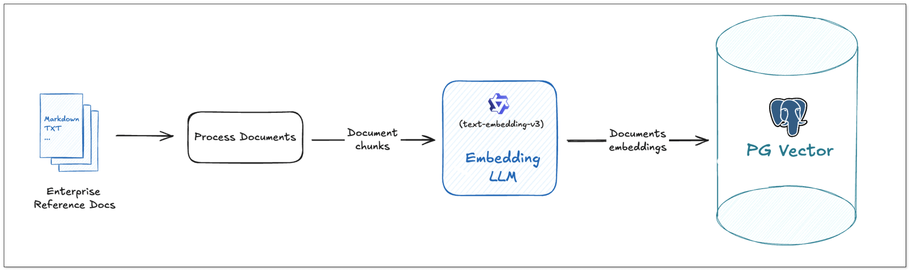

#### 阶段二：API 构建与服务发布（PostgreSQL → RagApi）
1. **查询向量化与语义优化**  
用户问题进入对话接口后，系统首先会使用相同的嵌入模型将问题向量化。此过程中可启用以下能力模块：
    - **压缩查询（QUERY_COMPRESS）**：对原始提问进行语义压缩，去除冗余、聚焦核心内容，提高向量匹配精度。
    - **扩展查询（QUERY_EXTEND）**：自动引入近义词、相关概念或补充说明，扩大匹配范围，提高召回率。
2. **向量检索与知识片段选择**  
在向量库中进行相似度搜索，检索结果可进一步通过 **知识片段选择（KNOWLEDGE_SELECT）** 进行筛选，支持多个知识库场景，系统会根据语义相关性自动选择最匹配的知识片段（支持跨表路由）。
3. **Prompt 构造与上下文拼接**  
系统根据用户配置的 Prompt 模板，将问题与召回内容结合，构造出最终用于模型推理的 Prompt 输入。
4. **模型推理与回答生成**

生成的 Prompt 被送入指定的 Chat 模型进行推理（如 deepseek r1、qwq-plus、GPT-4o 等），模型返回最终回答内容。

5. **MCP 工具链集成（可选）**

如需执行任务类问题（如“查 GitHub PR 状态”、“调用企业 API”），可启用 MCP 工具链调用。

支持标准化注册的 MCP 工具（HTTP / stdio），通过 Function Calling 调用链执行外部任务，补全答案或直接完成任务。

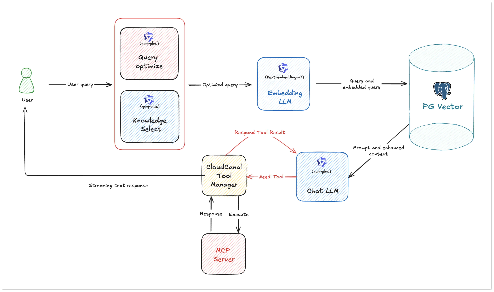

具体操作步骤可参考：

+ 1.《使用大模型将数据嵌入到 PostgreSQL 向量》[https://www.clougence.com/cc-doc/bestPractice/file_to_aliyun_pg_vector](https://www.clougence.com/cc-doc/bestPractice/file_to_aliyun_pg_vector)
+ 2.《基于 PostgreSQL 向量构建 RAG API 服务》[https://www.clougence.com/cc-doc/bestPractice/pg_vector_to_rag_api](https://www.clougence.com/cc-doc/bestPractice/pg_vector_to_rag_api)

任务创建成功后，将对外暴露一个具备**内置知识库支持**、**查询语义优化能力**、**可选 MCP 工具链执行**的 RAG 服务，且**兼容 OpenAI 的 API 协议**。

相当于将用户原有的大模型 API 接口进行了**增强**——无需更改客户端代码，即可接入增强后的智能问答与任务执行服务。

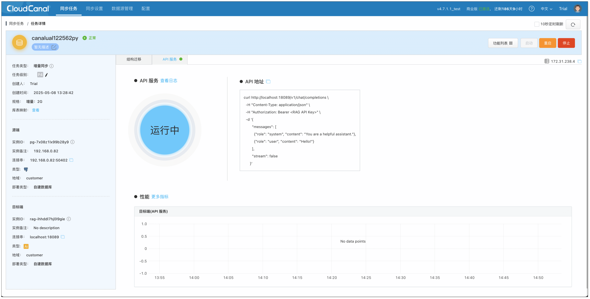

这里可以通过可视化工具 [CherryStudio](https://cherry-ai.com/) 进行交互测试。CherryStudio 兼容 OpenAI 接口标准，适合用于接口联调、上下文调试和模型效果验证。

### Cherry Studio 配置步骤
1. 打开 Cherry Studio，在“模型服务”中搜索 **openai**。
2. 配置参数如下：
    - **API 密钥**：填写在 CloudCanal 中配置的 RagApi API Key
    - **API 地址**：[http://localhost:18089](http://localhost:18089)

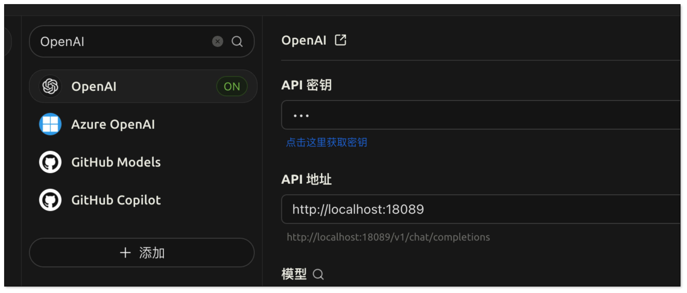

    - **模型名称**：填写 **CC_RAG**

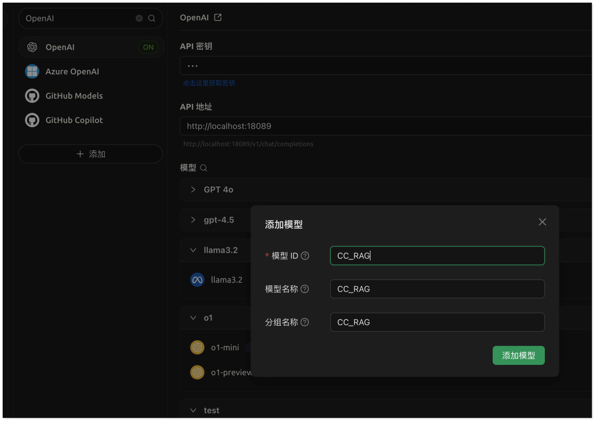

  3. 回到对话页面：

    - 添加助手 → Default Assistant。
    - 右键点击 Default Assistant → 编辑助手 → 模型设置，绑定上一步添加的模型。

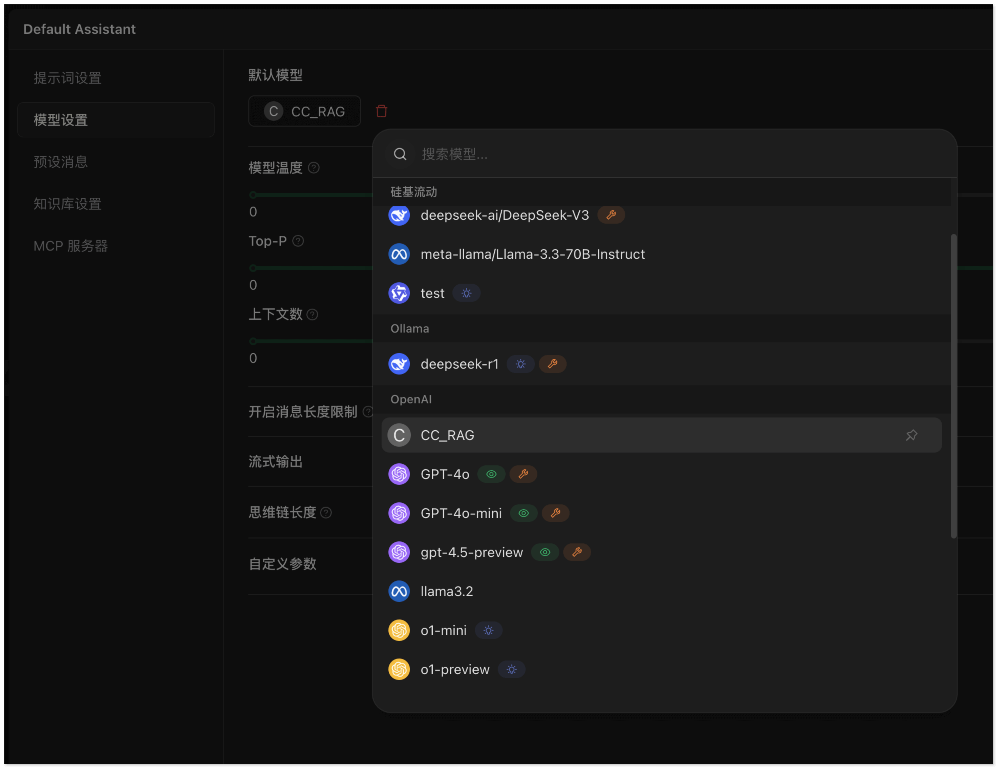

4. 在对话窗口中输入：

> CloudCanal 增量同步任务延迟是什么原因？应该怎么处理？
>


RagApi 将根据向量数据自动检索相关知识内容（本例使用 CloudCanal 文档知识库），结合模型生成自然语言回答。

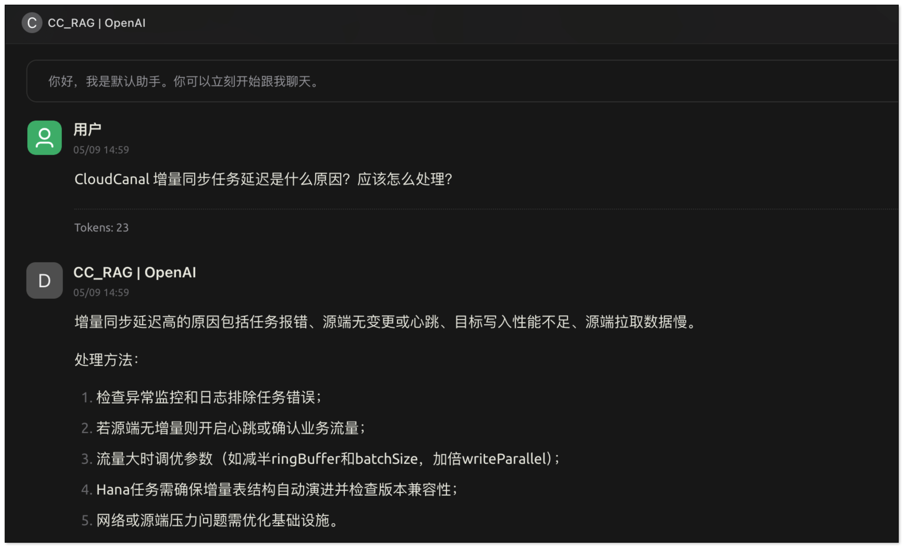

### MCP 工具链集成示例
如果 RagApi 配置了 MCP 工具服务（如网页抓取、GitHub 查询等），模型可自动生成工具调用。

步骤如下：

1. 进入 CloudCanal，点击任务详情页右上角「功能列表」>「参数修改」。
2. 进入「目标数据源配置」，找到 `mcpServers`，将如下配置粘贴进去。
3. 点击右上角「生效配置」，确认参数修改内容。
4. 点击「确认」。如部分参数需重启任务生效，系统会自动提示是否重启。

```json
{
  "mcpServers": {
    "github": {
      "command": "npx",
      "args": [
        "-y",
        "@modelcontextprotocol/server-github"
      ],
      "env": {
        "GITHUB_PERSONAL_ACCESS_TOKEN": "<YOUR_TOKEN>"
      }
    },
    "mcp-server-firecrawl": {
      "command": "npx",
      "args": [
        "-y",
        "firecrawl-mcp"
      ],
      "env": {
        "FIRECRAWL_API_KEY": "<YOUR_API_KEY_HERE>"
      }
    }
  }
}
```

CloudCanal 将**自动触发 MCP 工具执行**，并进行**多轮调用与总结**，最终返回结果：

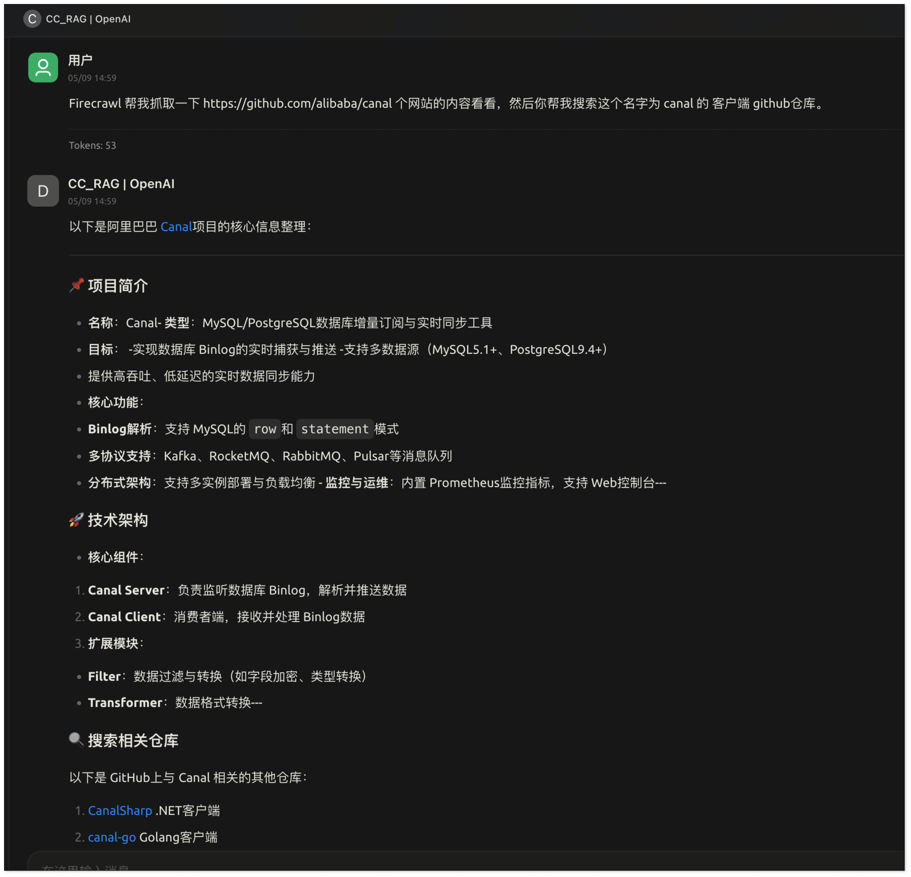

## 总结
RAG、Function Calling、MCP 和 AI Agent 不是孤立存在的技术，而是在现实应用中彼此协同、互为补充。CloudCanal 近期支持的 RagApi 服务，融合了这些 AI 底层能力，可以零代码傻瓜式完成 RAG 服务的构建，大大降低了使用智能 AI 的门槛。

