在大模型（LLM）驱动的问答系统中，RAG（Retrieval-Augmented Generation）架构正迅速成为主流；然而在实际应用中，即便接入了如 GPT-4 或 Claude 等先进模型，但生成结果仍然不够理想。

问题的根源往往并不在于模型本身，而在于——它没有检索到相关信息，这就引出了评估 RAG 检索质量的核心指标：**召回率（Recall）**。

本文将深入探讨召回率的本质，以及如何通过构建一个结构化、丰富且高质量的知识库，显著提升 RAG 系统的召回效果，从而增强问答系统的准确性与实用性。

## 召回率是什么？
在 RAG 检索系统中，召回率指的是在所有真正相关的文档中，有多少被成功地检索了出来。

计算方式：

> **召回率 = 检索到的相关内容数量 ÷ 所有相关内容的总数量**
>

举个例子，假设你有一个技术文档知识库，里面记录着产品安装、配置、调优等各类信息。

某个用户提问：“如何在 Kubernetes 上部署？”

假设知识库中有 6 条与这个问题高度相关的内容，但系统只返回了其中 3 条。那么，召回率就是 3 ÷ 6 = 50%。

在 RAG 系统中，召回率尤为关键，因为大模型能不能“答对”，很大程度取决于有没有拿到相关内容；召回率越高，LLM 在生成答案时能参考的有效信息就越多，回答的质量和准确性也就越有保障。

## 召回不准的原因
很多人将注意力放在向量数据库、查询优化、模型推理上，却忽视了最根本的基础设施 —— **知识库构建**。

召回失败，往往源于三个层面：

1. **数据覆盖不足**：知识来源单一，未能全面汇聚 FAQ、产品文档、技术手册、历史工单等高价值内容。
2. **语义表达偏差**：不合理的 **分块策略**（如按固定字数切割）会割裂上下文；**Embedding 模型** 选择不当则会无法精准捕捉文本的深层语义，导致向量表达失真。
3. **结构策略粗糙**：没有上下文信息、缺少结构化字段或文档元数据。

## 如何构建高召回率的知识库
### **提高数据覆盖率**
任何检索的前提是知识库中**有**相关信息。因此在构建 RAG **专属知识库时**，需要聚焦以下能力：

+ **汇聚多渠道内容**：FAQ、文档、部署手册、工单记录等
+ **支持多种接入方式**：数据库、OSS/S3、Google Docs、语雀、本地文件等

### **提高语义嵌入质量**
选择合适的 Embedding 模型，决定了 **用户问题** 能否成功匹配到 **知识块**。

目前业界有许多优秀的 Embedding 模型，以下是一个简单对比：

| **模型名称** | **适用语言** | **优势** | **局限** | **部署方式** |
| --- | --- | --- | --- | --- |
| **text-embedding-3**（OpenAI） | 英文 / 多语言 | 精度高，覆盖全面，是当前最强通用模型之一 | 需联网，调用成本高 | API |
| **text-embedding-v3**（Alibaba） | 中文为主 | 中文语义理解深，适合企业知识库 | 模型大，本地部署门槛略高 | Ollama / API |
| **Qwen-Embedding-7B** | 中文为主 | 中文结构化问答效果好，向量表达自然 | 显存占用高，不适合轻量场景 | 本地部署 |
| **BGE-M3** | 中文 | 轻量、开源，适合本地快速部署和测试 | 英文能力较弱 | 本地部署 |


### 分块策略合理
**分块（Chunking）** 是指将长文档切割成适合 RAG 检索的、更小的文本单元：

+ 若分块太小：上下文缺失，回答不准确。
+ 若分块太大：Embedding 过于抽象，无法命中具体问题。

在具体实践中，应考虑：

+ 按语义、标题、段落切块，避免语义断层。
+ 支持 Chunk Overlap，每块有一定重叠，如每 300 个 Token 滑动切，同时根据语义分段，召回命中率更高。

### 结构化向量库
传统向量检索仅依赖 Embedding 相似度，虽具备语义匹配能力，但仍存在明显短板：**向量相似但语义不相关的内容易被误召回**。

结构化向量库在此基础上引入了丰富的**元信息结构字段**，进一步提升了召回的准确性。

+ 使用大模型提取 FAQ、摘要、标签、时间字段等，可有效补充语义缺失的上下文信息。
+ 将 Markdown、客服记录等非结构化内容转为统一格式，显著提升整体检索命中率。
+ 利用结构化 Schema 支撑后续精准检索、过滤、排序。

## 构建高质量知识库
在实际落地过程中，**CloudCanal** 提供了一套面向企业的自动化知识库构建能力，支持：

+ 多源文档采集（OSS、S3、SSH、Google Docs、语雀）
+ LLM 提取结构化字段，支持自定义 Prompt
+ 段落分块 + 重叠控制 + 元信息附带
+ 向量化写入 StarRocks 等向量库，支持 Qwen 等主流模型接入

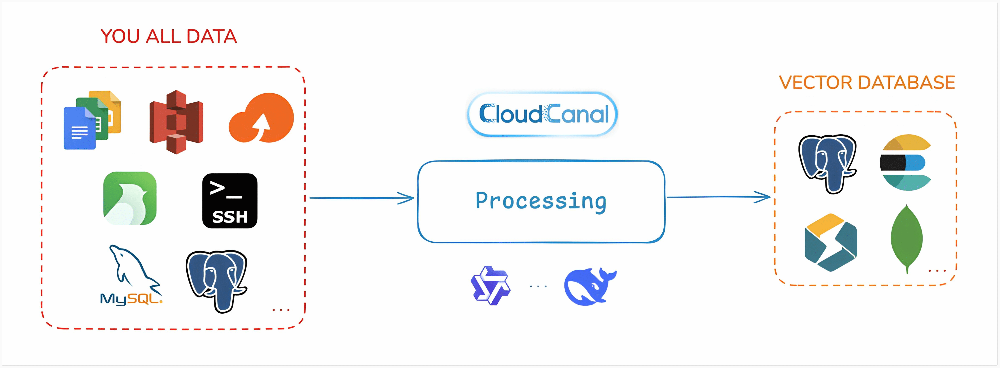


下面将使用 StarRocks 作为目标向量库，展示如何在 CloudCanal 中快速构建高质量的知识库。

### 添加数据源
登录 CloudCanal 控制台，点击 **「数据源管理」>「新增数据源」**，添加以下数据源：

#### 文件数据源（SshFile）
用于读取本地或远程服务器中的 Markdown 文档。添加步骤如下：

+ **类型选择**：自建 > SshFile（同理可配置 S3、OSS 等）
+ **基础配置**：填写服务器 IP、端口、用户名和密码。
    - **网络地址**：localhost:22
    - **用户名**：root
    - **密码**：***
+ **额外参数**：
    - **fileSuffixArray**：填写 `.md`，仅处理 Markdown 文件
    - **enableLLMExtraction**：`true`，启用 LLM 提取 **额外信息** 的功能。
    - **defaultLineSchemaJson**：定义需要 LLM 提取的 **结构化字段**（第一行 line 表示原文）

```json
[
    {
        "column": "line",
        "jdbcType": 12,
        "typeName": "TEXT"
    },
    {
        "column": "doc_title",
        "jdbcType": 12,
        "typeName": "TEXT",
        "desc": "从文本中提取出文档的明确标题"
    },
    {
        "column": "summary",
        "jdbcType": 12,
        "typeName": "TEXT",
        "desc": "为这段文本生成一个不超过100字的简明摘要"
    },
    {
        "column": "keywords",
        "jdbcType": 12,
        "typeName": "TEXT",
        "desc": "提取5个最能代表文本核心内容的关键词，以逗号分隔"
    },
    {
        "column": "faq_pairs",
        "jdbcType": 12,
        "typeName": "TEXT",
        "desc": "从文本中提取出潜在的问答对（FAQ），以[{'question':'...', 'answer':'...'}]的JSON数组格式返回"
    }
]
```

  - **dbsJson**：用于指定要同步的文档目录，你可以将其中的 **schema 字段** 修改为你实际存放 Markdown 文件的根目录路径。

```json
[
  {
    "db":"cc_virtual_fs",
    "schemas":[
      {
        "schema":"/Users/barry/source/cloudcanal-doc-v2",
        "tables":[]
      }
    ]
   }
]
```

> + **db**：虚拟文件库的逻辑名称，默认保持为 cc_virtual_fs 即可，无需修改。
> + **schema**：表示你希望读取的**本地或远程目录路径**，CloudCanal 会以该路径作为文档扫描入口。例如：/Users/barry/source/cloudcanal-doc-v2。该字段必须填写为绝对路径。
> + **tables**：用于指定目录中要处理的**具体文件名**，若设置为空数组（[]），则表示**自动抓取该目录下所有符合后缀规则（如 .md）的文件**，无需逐一列出文件名。
>

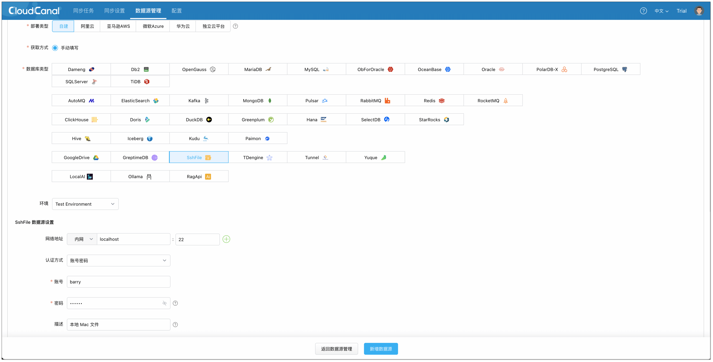

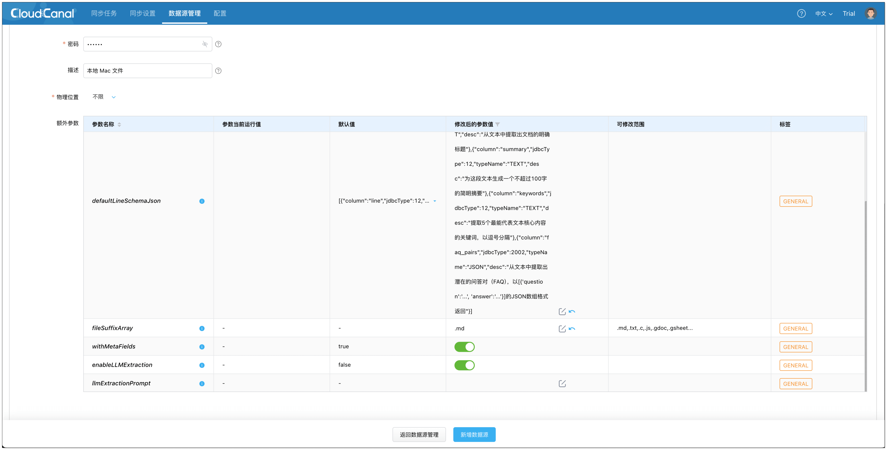

#### 向量数据库（StarRocks）
用于存储通过大模型编码后的文档向量，是整个 **RAG** 检索流程的核心数据源。

+ 类型选择：自建 > StarRocks
+ 准备工作：
    - 部署 StarRocks：[参考文档](https://docs.starrocks.io/docs/quick_start/shared-nothing/)
    - 版本要求：3.4 及以上
    - 打开 Vector Index

```sql
ADMIN SET FRONTEND CONFIG ("enable_experimental_vector" = "true");
```

+ 配置说明：
    - **网络地址**：localhost:9030
    - **用户名**：root
+ **额外参数**：
    - privateHttpHost：填写 localhost:8030。用于 Stream Load 写入，可填写 FE 或 BE 的地址。

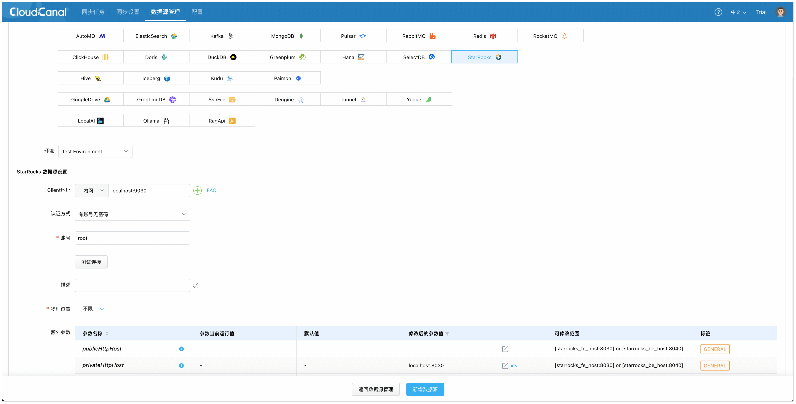

#### 大模型平台（Ollama）
**CloudCanal** 支持通过 **Ollama** 提供完整的向量生成与推理能力，适用于完全私有化的 RAG 场景。

+ 类型选择：自建 > Ollama
+ 配置说明：
    - 部署 Ollama：[参考文档](https://ollama.com/)
    - **网络地址**：localhost:11434
- **额外参数**
        * **llmEmbedding**：嵌入大模型配置

```python
{
  "qwen3:8b": {
    "dimension": 4096
  }
}
```
         * **llmChat**：对话大模型配置

```python
{
  "deepseek-r1": {
    "temperature": 0.9,
    "topP": 0.9,
    "showReasoning": false
  }
}
```

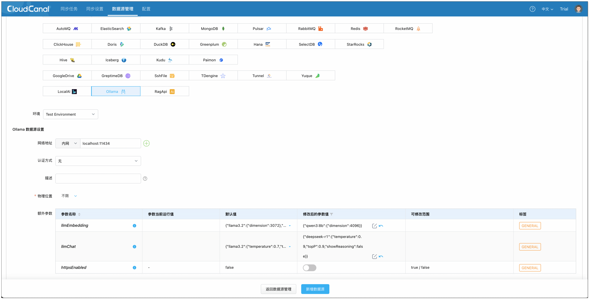

### 创建任务：构建知识库
1. 点击 **同步任务** > **创建任务**。   
2. 选择以下数据源，并点击 **测试连接** 确认网络与权限正常。
    - 源端：**SshFile**
    - 目标端：**StarRocks**

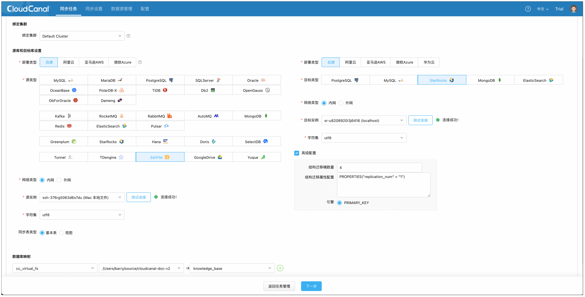

3. 在 **功能配置** 页面，任务类型选择 **全量迁移**，任务规格选择默认 2 GB 即可。
4. 在 **表&action过滤** 页面，进行以下配置：
    1. 点击 **配置大模型** > **Ollama**，选择刚添加的大模型实例
        1. 嵌入模型选择 `qwen3:8b`（用于数据嵌入）
        2. 对话模型选择 `deepseek:r1`（用于结构化信息提取）
    2. 选择需要定时数据迁移的文件，可同时选择多个。
    3. 点击 **批量修改目标名称** > **统一表名** > 填写表名（如 **my_knowledge**），并确认，方便将不同文件向量化并写入同一个表。

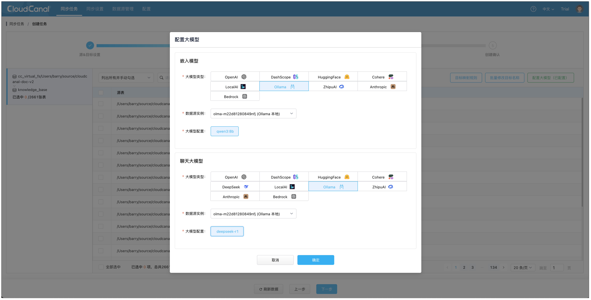
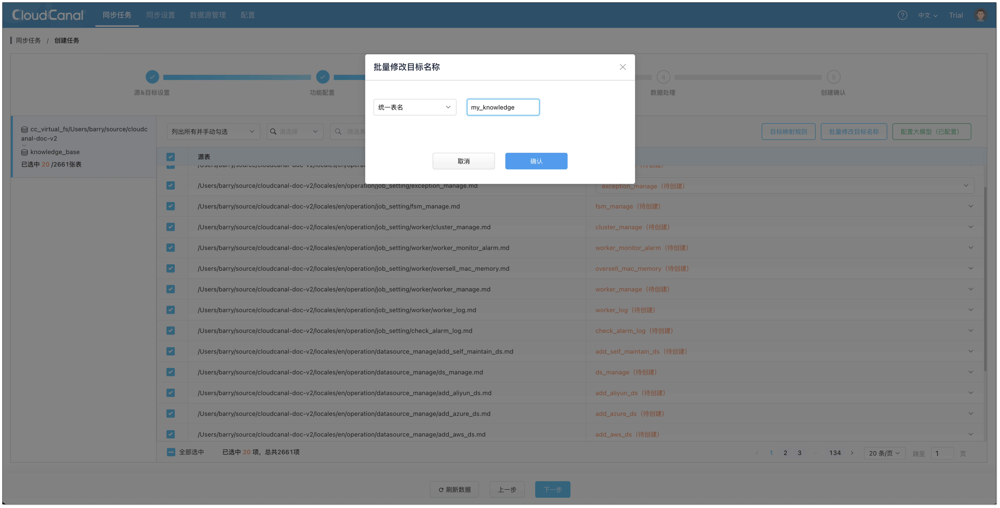

5. 在 **数据处理** 页面，点击 **批量操作** > **大模型嵌入**：
    1. 设置数据分隔长度 1000，分隔重叠 100。
    2. 选择需要嵌入的字段，并全选表。

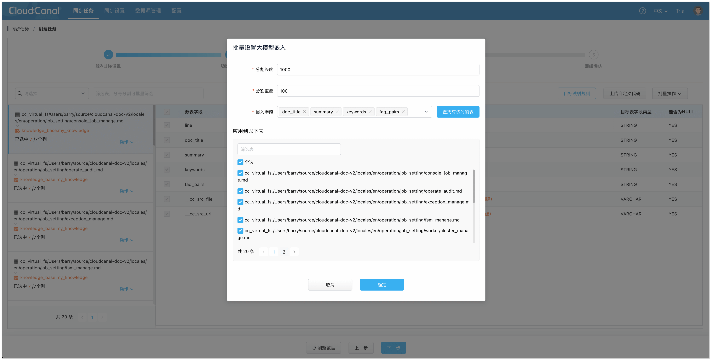

6. 在 **创建确认** 页面，点击 **创建任务**，开始运行。任务会自动根据源端定义的格式，**自动在 StarRocks 中创建向量表**，并把源端文件处理分块后，嵌入，最终导入到 StarRocks。

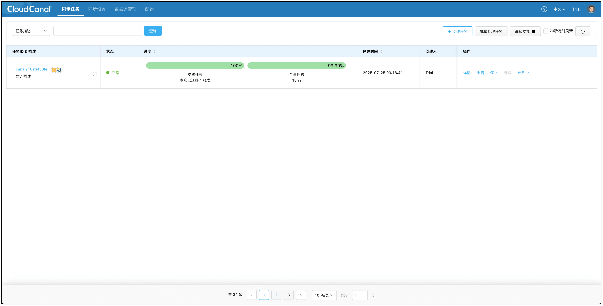

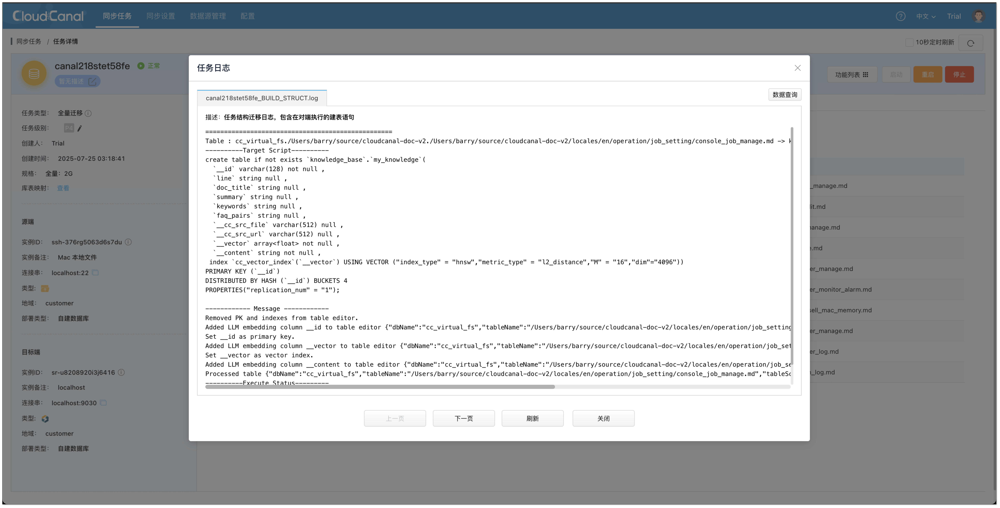

7. 到 StarRocks 中查询知识库数据。

```sql
select 
  doc_title, -- 标题
  summary,   -- 总结
  keywords,  -- 关键词
  faq_pairs, -- 问答
  __content  -- 原始内容
from my_knowledge limit 3 \G
```

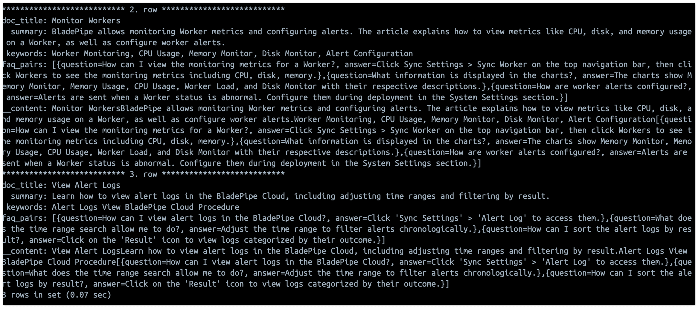

至此，我们就构建好了一个结构化、丰富且高质量内容的知识库，后续可在 CloudCanal 中继续创建任务，构建 RAG API，直接与你的知识库对话。

## 总结
召回率决定了 RAG 系统的检索表现，也影响最终生成结果的准确性，只有策略得当、工具可靠，才能构建真正智能的问答能力。

通过 **CloudCanal RAG**，可在 **更短周期内**，以 **更简单的方式** 实现更高检索质量的知识库，为企业打造实用、可信的 AI 应用打下坚实基础。

