## 简述
[CloudCanal](https://www.clougence.com?src=cc-doc-blog-mysql-elasticsearch-widetable) 2.0.X 版本近期支持了宽表构建能力，在数据预处理领域向前走了一步。

方案特点
- 相对灵活，对业务数据和结构贴合性好
- 能很好的支持事实表与维表打宽表需求

本文以 MySQL 到 Elasticsearch 单事实表双维表为案例，介绍 CloudCanal 宽表构建和同步的操作步骤。

## 技术点

### 打宽表的必要性
关系型数据库为了应对在线业务对于并发、毫秒级响应，同时操作相对趋向 kv 化,一般基于关系范式进行设计，通过外键或约定外键（非物理约束）进行关联。

当业务需求涉及到多张关联表(业务运营、报表、BI 需求)，查询表的先后顺序成为操作响应时间的关键要素，但排列组合式种类随关联表数量(n)增加会膨胀非常快(n!)，导致查询效率低下。

关联表数量|排列种类|
--------------|--|
2|2|
3|6|
4|24|
5|120|
6|720|
7|5040 |
8|40320 |
9|362880|
10| 3628800 |
11| 39916800 |

数据库或者数仓做 join 查询（特别是5张表以上），最难的事情变成了如何从这么多可能性中（搜索空间）找到最好的那一个。

数据迁移和同步 以相对比较小的代价，将多张关联表进查询库或者数据仓库之前，通过 **反查** 或者 **窗口等待变更数据**做关联，打成一张宽表写入对端，显著减轻后续查询对于 SQL 优化器的要求。

### 宽表的种类和方式
这里的宽表种类指其数据来源表种类(常见但不全面)，常见的我们分 **事实表** 和 **维度表**,比如订单表被定义成事实表，用户表被定义成维度表，商品表被定义成维度表。

一般事实表和维度表数据具备类似 n:1 的关系，也就是 1 个用户会有 n 个订单 (1个订单属于1个用户)，1 个商品也会存在 n 个订单 (1个订单会关联 1 个或有限个数商品)。

打宽表的方式有多种，根据场景，最常见的包含以下两种

- 多事实表 打宽表
  - 一般场景是在有限的时间内，关联的变更在这些表上发生（多流join），打宽表工具只要在一定的时间范围内等到这些数据（window），即可打成宽表数据。
- 单事实表和多维度表打宽表
  - 一般场景是事实表变更，但是维度表没有任何变化，这时打宽表工具需要通过事实表变更数据反查维度表数据，打成宽表。

CloudCanal 目前打宽表的方式主要通过反查实现，对于多流 join , 实际上也可以通过反查实现，只是可能缺乏数据一致性。

## 操作示例

### 前置条件:
- 下载安装 [CloudCanal 私有部署版本](https://www.clougence.com?src=cc-doc-blog-mysql-elasticsearch-widetable),使用参见[快速上手文档](https://www.clougence.com/docs/productOP/docker/install_linux_macos)
- 准备好 MySQL 数据库（本例使用 5.7 版本）和 Elasticsearch 数据库（本例使用 6.x 版本）
- MySQL 上创建 1 张事实表(order)和 2 张维表 (user 、product)
- Elasticsearch 上创建 1 个索引 order , 并额外包含两张维表相关数据
  - user_id (关联user.id), user_name(对应user.name)
  - product_id(关联product.id) ,product_name(对应product.name),product_price (对应product.price)

### 开发宽表代码
- 代码工程 [cloudcanal-data-process](https://gitee.com/clougence/cloudcanal-data-process) ，并找到代码类 [MySqlToEsOnlyFact_one_fact_two_dim.java](https://gitee.com/clougence/cloudcanal-data-process/blob/master/wide-table/src/main/java/com/clougence/cloudcanal/dataprocess/widetable/MySqlToEsOnlyFact_one_fact_two_dim.java)
- 修改必要信息
  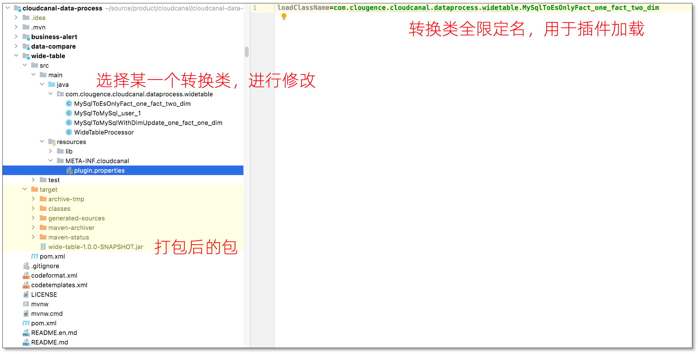
  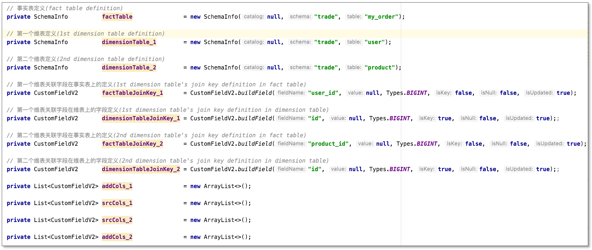
  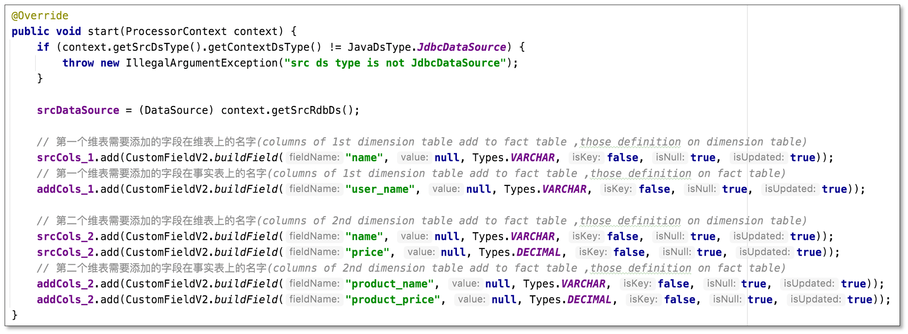
### 打包
- 进入工程目录，使用命令进行打包
  ```
  % pwd
  /Users/zylicfc/source/product/cloudcanal/cloudcanal-data-process
  % mvn -Dtest -DfailIfNoTests=false -Dmaven.javadoc.skip=true -Dmaven.compile.fork=true clean package
  ```
### 自定义代码包
- 打包命令后，代码包位于工程目录下的 wide-table/target 目录
  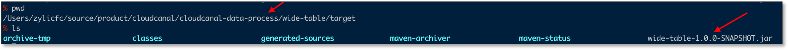

### 添加数据源
- 登录 CloudCanal 平台
- **数据源管理**->**新增数据源**
- 将**MySQL** 和 **Elasticsearch** 分别添加
  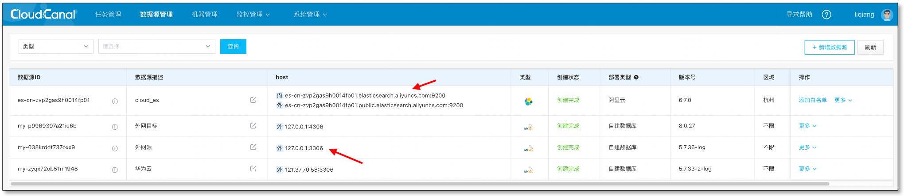

### 任务创建
- **任务管理**->**任务创建**
- 选择 **源** 和 **目标** 数据源
- 选择 **数据同步**，并勾选 **全量数据初始化**, 其他选项默认
- 选择需要迁移同步的表, 此处只要选择事实表即可，维表会通过自定义代码反查补充
  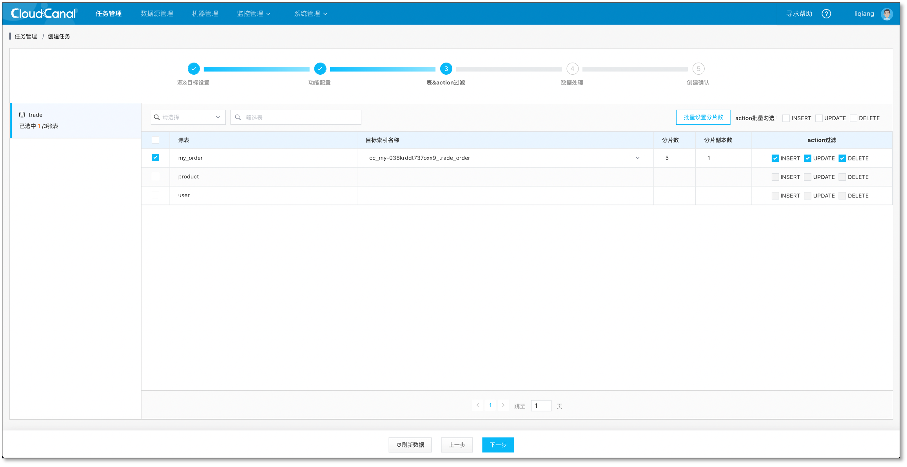
- 选择列,默认全选，**选择上传代码包(路径如上所示)**
  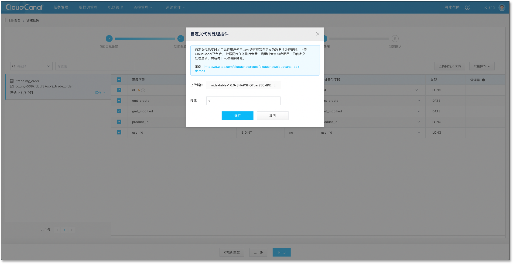
- 确认创建,并自动运行
  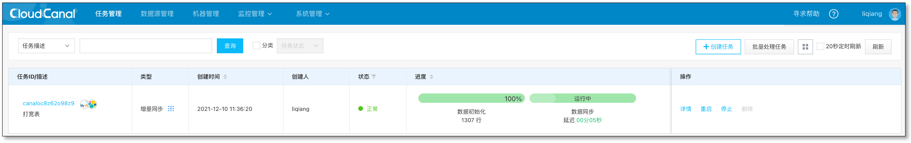

### 校验数据
- 变更事实表数据
  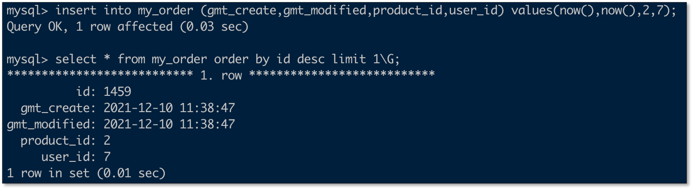
  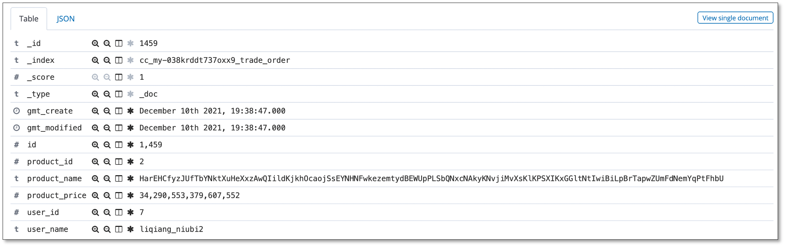
- 变更维表数据
  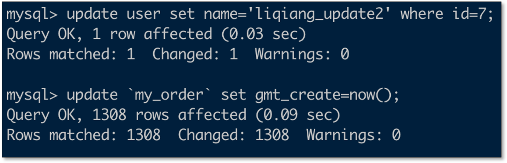
  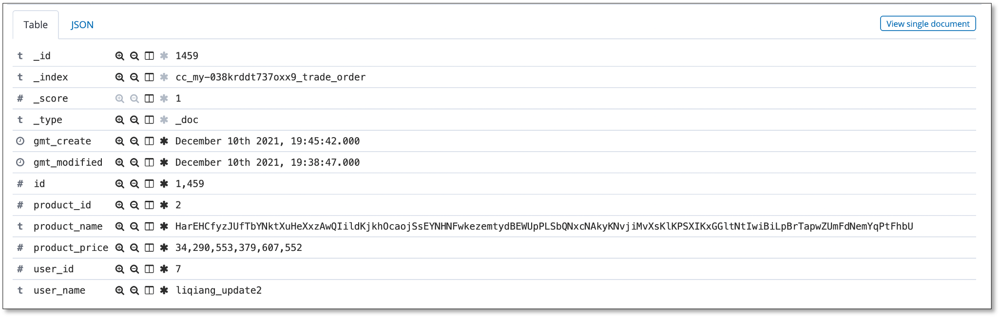

### 数据变化规律
- 事实表插入，更新都会反查维表最新数据并写入对端
- 维表更新，基础模式中，需要触发事实表更新才能带上最新的维表变更数据写入对端
- 维表数据删除，基础模式中，如果触发事实表更新，默认将会把对应的维表数据（已删除）置为null,  但是根据对端数据源不同，效果可能会有所差别（比如不会置空）

## 常见问题

### 维表变化后怎么办？

目前我们提供的基础模式，维表变化不会直接触发事实表更新，因为这个基本上意味着大规模对端数据变更，可能影响对端数据服务稳定性。所以源端触发事实表更新（比如变更一个时间字段），带上最新的维表数据进行对端数据刷新。

另外对于维表数据的删除，如果触发事实表更新从而刷新对端数据，则默认置为null。

### 不会开发 java 代码怎么办？
如果能打包不会 java 开发，在 [cloudcanal-data-process](https://gitee.com/clougence/cloudcanal-data-process) 寻找相应模版，修改配置即可。

如果不能打包也不会开发，找 CloudCanal  同学协助。

### 如果遇到出错或者问题怎么办？

如果会 java 开发，建议打开任务的 **printCustomCodeDebugLog** 观察输出的数据是否符合预期，如果不符合预期，可以打开任务的 **debugMode** 参数，对数据转换逻辑进行调试。

如果不会 java 开发, 找 CloudCanal  同学协助。

### 还支持其他数据源么？

这个是 CloudCanal 通用能力，只要源和目标之间实现了全量迁移和增量同步，即支持。

## 总结
本文简单介绍了如何使用 [CloudCanal](https://www.clougence.com?src=cc-doc-blog-mysql-elasticsearch-widetable) 进行 MySQL -> Elasticsearch 的宽表构建,帮助业务快速构建数据搜索服务。