## 简述
TiDB 是国内非常火热的一款分布式数据库，参考 Google Percolator 和 Spanner 模型进行构建，具备很好的扩展性，并且支持强一致事务和一定的计算能力，应用广泛。

[CloudCanal](https://www.clougence.com?src=cc-doc-blog-mysql-tidb-sync) 提供了从传统关系型数据库实时同步到 TiDB 的能力，并且附带**数据迁移**、**数据校验**、**数据订正**等能力。此文章简要介绍如何快速构建一条长期稳定运行的 MySQL->TiDB 数据链路。

## 技术要点

### MySQL  协议兼容性
TiDB 对于 MySQL 协议兼容做得不错(4.X 版本)，但是其中也有瑕疵点，对于数据迁移同步来说，关注 2 个方面的信息：**数据类型**、**DDL 支持层面**。

**数据类型** ，层面主要是要考虑 TiDB 对于 MySQL 数据类型的兼容性，基于MySQL 8.0 官方文档中类型的定义在 TiDB 5.1 版本上
- 支持的类型如下：
  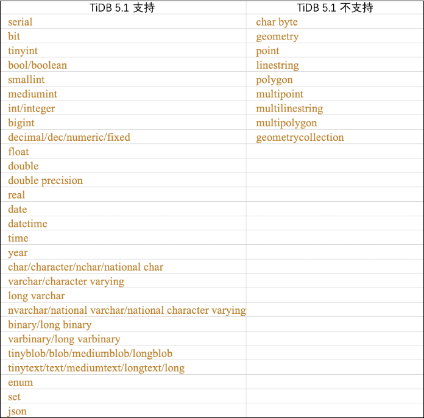

**DDL 支持层面**，比较明显的是不支持同时做多次 DDL action , 比如: alter table add column col1 varchar(255), add col2 bigint(20) not null, modify col3 datetime  。**而往往这种 SQL 在数据库运维中非常常见(提高 DDL 效率)**。

针对差异点，CloudCanal 都做了兼容，特别是 DDL 同步的兼容，加上库、表、列映射，存在一定的工作量。

## 举个 "栗子"
### 准备 CloudCanal
- 下载安装 [CloudCanal 私有部署版本](https://www.clougence.com?src=cc-doc-blog-mysql-tidb-sync),使用参见[快速上手文档](https://www.clougence.com/docs/productOP/docker/install_linux_macos)

### 添加数据源
- 登录 CloudCanal 平台
-  **数据源管理** -> **添加数据源**
- 选择 **自建数据源** ，并填写相关数据库信息，其中 **网络地址** 请按提示带上端口号
  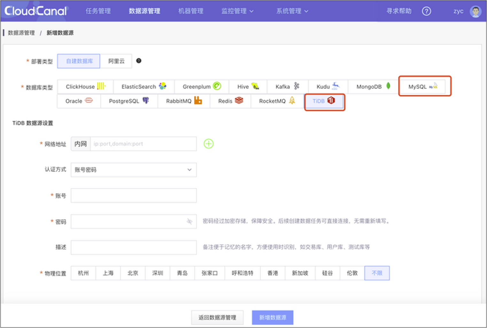

- 如下已添加完 MySQL 和 TiDB
  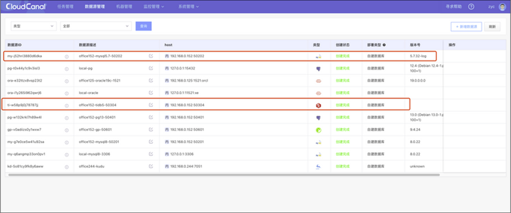

### 创建同步任务
- **任务管理**->**新建任务**
  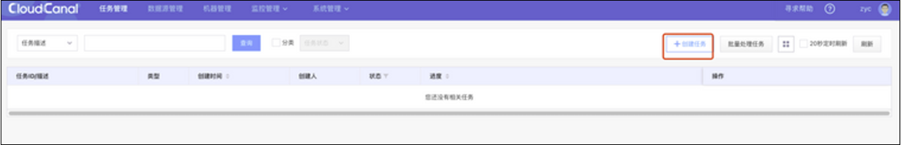

- 源端选择刚添加的 MySQL 数据源，目标选择 TiDB, 分别点击 **测试连接** 按钮以测试数据库连通性和获取 schema 级别元信息
- 选择源端和目标端 schema , 可以选取多个
- 点击**下一步**
  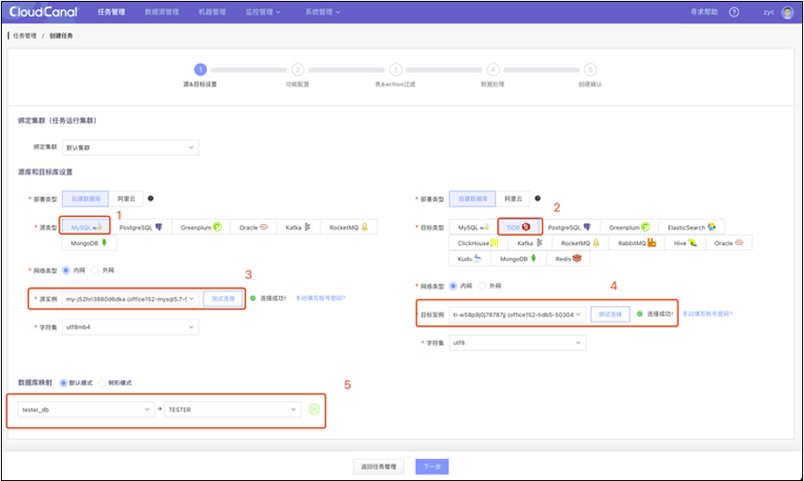

- 选择 **数据同步**，并且勾选**全量数据初始化**
- 规格可以根据任务重要度以及部署机器的内存容量合理选择，一般 2GB 内存规格即可
- 勾选 **DDL 同步**， CloudCanal 将同步常用的 create table /alter table/rename table DDL ，但是不同步其他 DDL
- 勾选 **开启xx校验** , 则自动为同步任务创建一个子任务，在同步 catch up 后 ,自动运行数据校验。当然也可以单独创建数据校验任务
- 点击**下一步**
  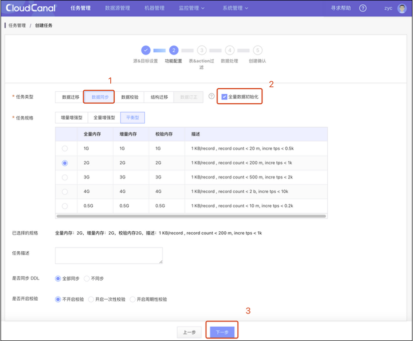

- 勾选需要同步的表，如果目标表为橙色，表示不存在同名表，任务创建完成后自动进行**结构迁移**。也可以下拉框选择表进行映射
- 勾选需要同步的 INSERT/UPDATE/DELETE 操作，默认全选
- 点击**下一步**
  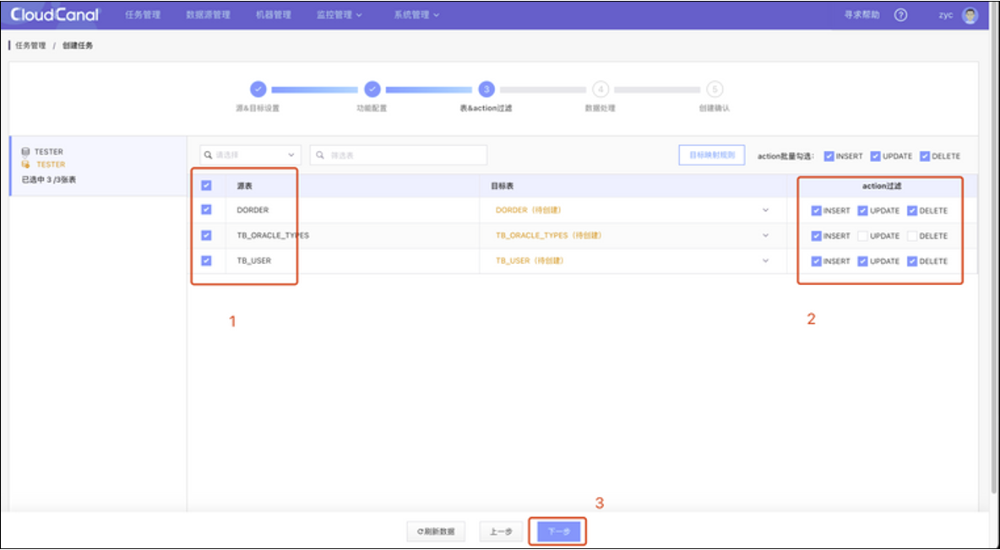

- 通过勾选做**列映射**和**列裁剪**
- 点击**下一步**
  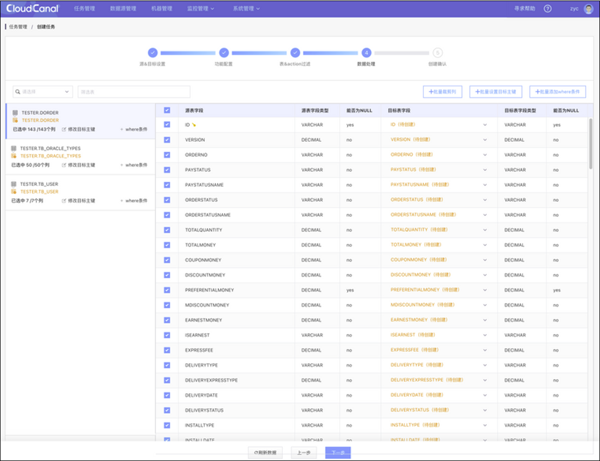

- 对任务内容进行创建 ，如果任务不需要立刻运行 , 可置灰**自动启动任务** 按钮
- 点击**确认创建**
  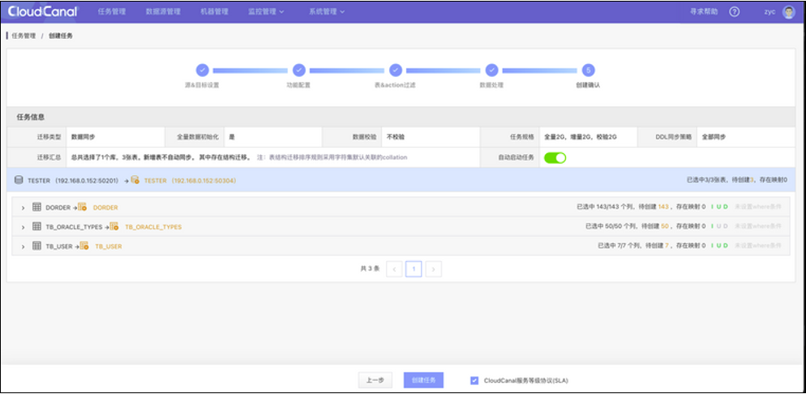

### 任务同步
- 任务分为 3 个阶段：**结构迁移**、**数据初始化**、**数据同步**，每一个阶段完成时，状态自动流转，直到同步稳态
  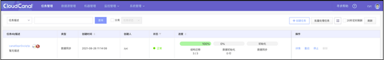

  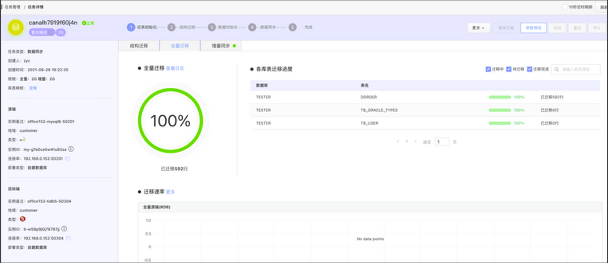
  - 结构迁移：当对端数据源不存在对应的库表结构时自动创建，包括RDB库表、消息 topic、搜索引擎 index 等
  -  数据初始化：将源端所选库表数据以全量迁移方式搬迁到对端
  - 数据同步：准实时的同步增量数据，即源端数据库上发生的增、删、改操作将以亚秒级延迟出现在对端数据源上

## FAQ

### 目前源端还支持哪些数据源？
除了 MySQL 到 TiDB 之外，截止社区版 1.0.2 版本，还支持 Oracle -> TiDB 链路，更多的链路如果有需求，可以按需添加，请[联系我们](https://www.clougence.com/about#contact)进行反馈

## 总结
本文简单介绍了如何使用 [CloudCanal](https://www.clougence.com?src=cc-doc-blog-mysql-tidb-sync)  快速构建 MySQL->TiDB 数据迁移同步链路，更多的源端和目标端陆续开放。