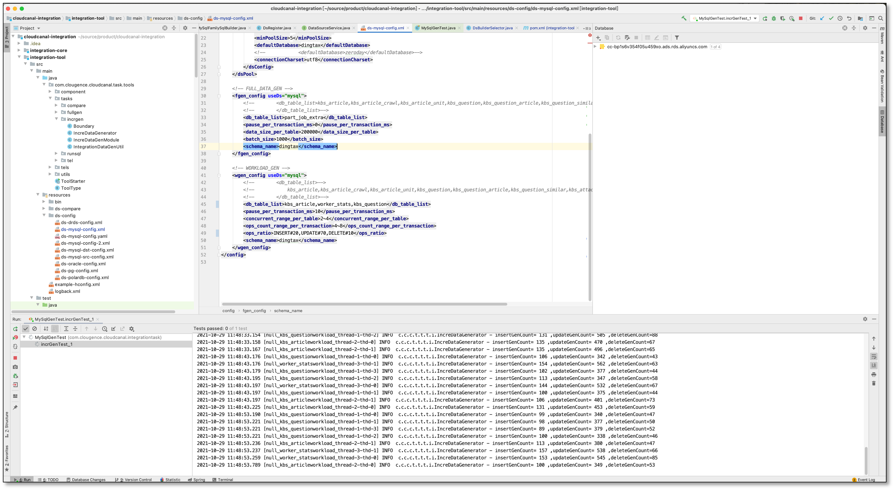
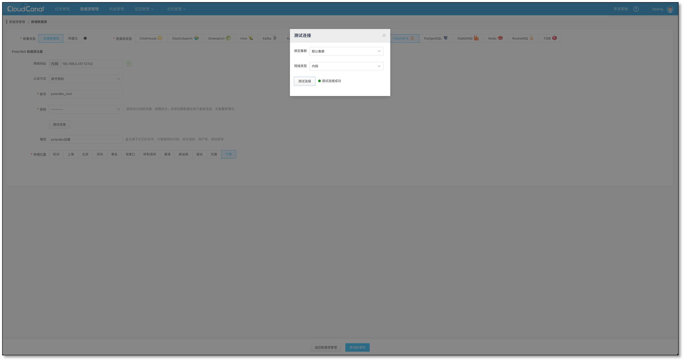
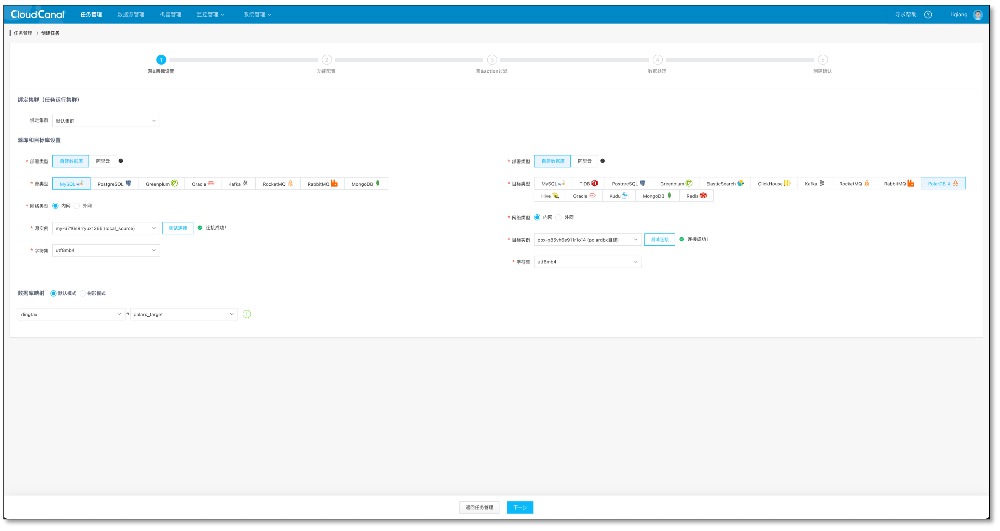
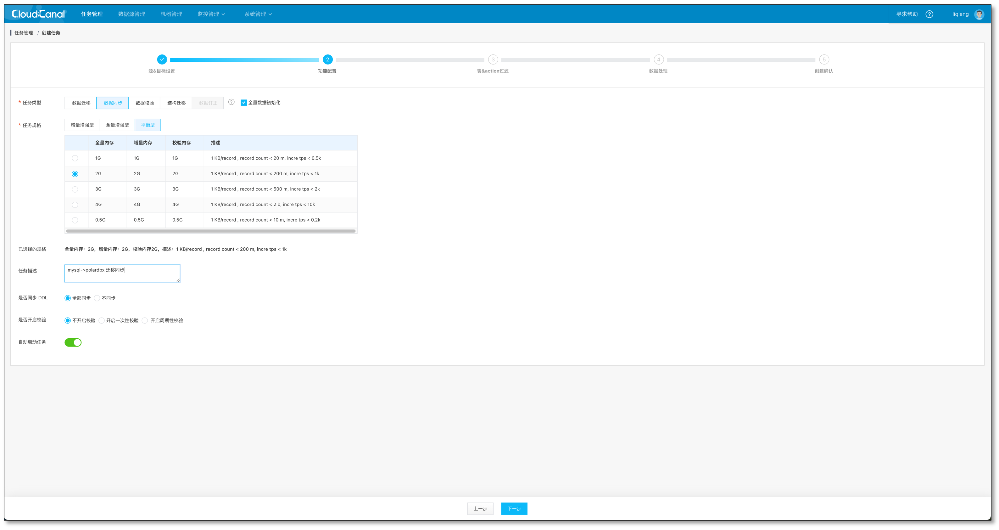
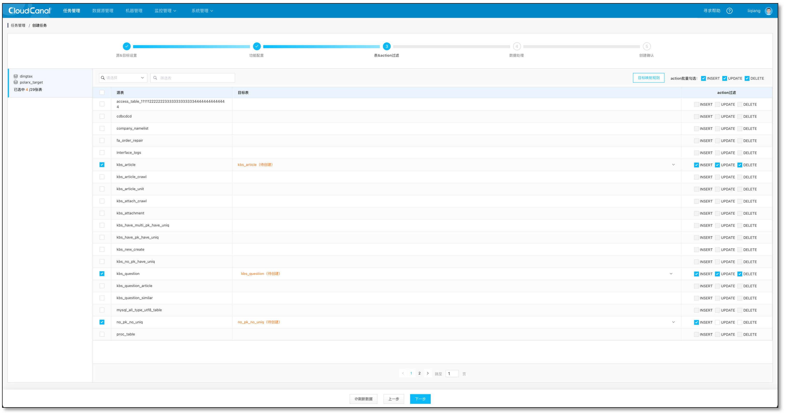
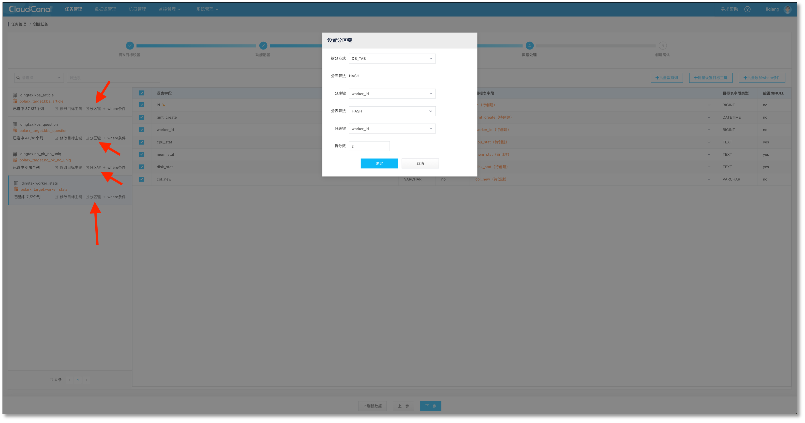
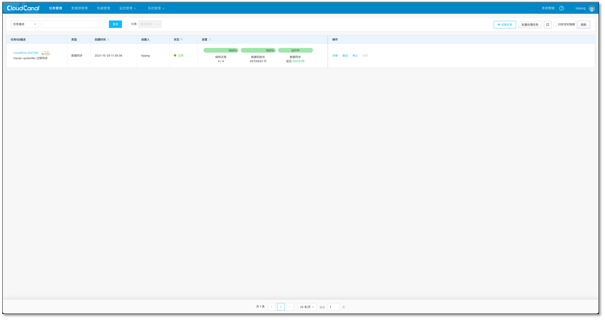
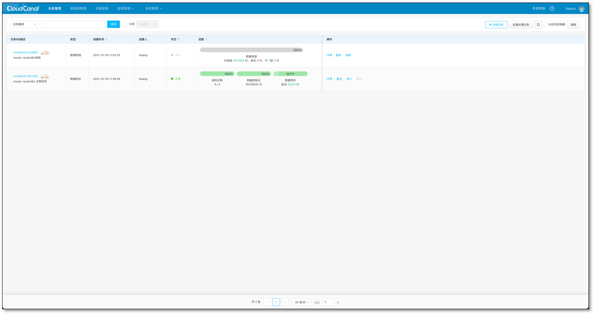

## 简述
[CloudCanal](https://www.clougence.com?src=cc-doc-blog-mysql-polardbx-sync)  近期支持了 PolarDB-X 对端, 目前开放的链路为 MySQL 到 PolarDB-X 。

本链路特点包括
- 完整支持结构迁移、全量迁移、增量同步、数据校验
- 支持 PolarDB-X  云版本 API 级对接(自动获取实例、添加白名单)
- 支持 PolarDB-X  开源自建版

PolarDB-X  前身 DRDS (内部产品名称 TDDL),经过 10 几年发展, 很好解决了 ToC 端业务对数据库超高并发、严苛事务的需求，并且近几年也努力尝试解决企业级数据需求(复杂SQL、分布式事务、在线数据的实时计算)，而这样的一个产品，目前有云版本，同时近期也进行了开源。所以我们认为有必要对其生态做良好支撑。

## 技术点

### 结构迁移

PolarDB-X 是分布式数据库领域产品，所以存在 partition 概念 ，提供了两种拆分模型:`sharding`(即分库分表)和`partitioning`。 前者按用户自定义拆分，后者对应用透明。可以通过类似 `create database d1 partition_mode="sharding"` 或`create database d1 partition_mode="partitioning"` 指定。

`sharding`模式下，具体创建语句和算法可参考 [官方文档](https://help.aliyun.com/document_detail/316575.html)

对于响应时间、RPS 要求的严苛应用场景(相对较窄),设定业务感知的分库分表算法是合理的，这也是为何很多分布式数据库在类似 sysbench 或 tpcc 或 天猫双十一 场景中达到难以置信性能的朴素原理。

CloudCanal 目前自动创建 database 为 `sharding` 模型，并且通过产品化方式支持这个能力-选择相应的算法和字段。

目前支持分库分表类型包括
- DB(只分库不分表)
- DB_TAB(既分库又分表)
- NONE(单表)

设定分库分表字段的时候，支持的算法包括
- HASH
- WEEK
- MM
- DD
- MMDD

一张普通的表，如果应用 DB_TAB 分库分表类型，并且选择常用的 HASH 算法，字段都选择`worker_id`, 经过 CloudCanal 结构迁移，会在 PolarDB-X 中生成如下表

```
CREATE TABLE `worker_stats` (
	`id` bigint(20) NOT NULL AUTO_INCREMENT BY GROUP,
	`gmt_create` datetime NOT NULL DEFAULT CURRENT_TIMESTAMP,
	`worker_id` bigint(20) NOT NULL,
	`cpu_stat` text,
	`mem_stat` text,
	`disk_stat` text,
	`col_new` varchar(255) NOT NULL DEFAULT '123',
	PRIMARY KEY (`id`),
	KEY `auto_shard_key_worker_id` USING BTREE (`worker_id`)
) ENGINE = InnoDB AUTO_INCREMENT = 278489 DEFAULT CHARSET = utf8mb4 DEFAULT COLLATE = utf8mb4_0900_ai_ci  dbpartition by hash(`worker_id`) tbpartition by hash(`worker_id`) tbpartitions 4
```

### 任务对分库分表的处理

与普通单机数据库不同, 如果需要达到 PolarDB-X 最好的写入性能, 增量同步需要处理分库分表字段,对于 update 和 delete 操作, 带上拆分字段。数据校验进行对端数据获取时，也需要带上拆分字段，并且保证数据的获取效率。

```java
if (col.isKey() || (partitionKeys != null && partitionKeys.contains(col.getName()))) {
       if (col.isUpdated()) {
               // put before column in it , PK/UKs may be change.
               pkCols.add(SqlUtilCommon.pickBeforeColumn(rowData, col.getName()));
        } else {
               pkCols.add(col);
        }

        if (firstPk) {
              where.append("`").append(col.getName()).append("`= ?");
              firstPk = false;
       } else {
             where.append(" AND `").append(col.getName()).append("`= ?");
        }
}
```

另外，如同变更主键,如果变更拆分字段值, 目前 PolarDB-X 能够自行处理这种变化，无需用户自己删除老数据,插入新数据。

## 操作示例

### 前置条件:
- 下载安装 [CloudCanal 私有部署版本](https://www.clougence.com?src=cc-doc-blog-mysql-polardbx-sync),使用参见[快速上手文档](https://www.clougence.com/docs/productOP/docker/install_linux_macos)
- PolarDB-X 开源版已经安装,参见[PolarDB-X 集群部署文档](https://github.com/ApsaraDB/galaxysql/blob/main/docs/zh_CN/quickstart-pxd-cluster.md)
- 带有增量流量的 MySQL 运行中

### 造数据
- 混合负载，IUD 比例 2:7:1
  

### 添加数据源
- 登录 CloudCanal 平台
- **数据源管理**->**新增数据源**
- 分别选择 **自建** 部署模式下的 **PolarDB-X** 和 **MySQL** 并添加
  

### 任务创建
- **任务管理**->**任务创建**
- 选择源和目标数据源
  

- 选择数据同步，并勾选 **全量数据初始化**, 其他选项默认
  

- 选择需要迁移同步的表
  

- 选择列,默认全选
- 设定分库分表算法和字段
  

- 确认创建,并自动运行
  

### 校验任务
- 停止增量负载
- 创建校验任务
  - 目前类似任务创建开发中，暂时库表列选择和拆分选择请和同步任务保持一致
- 校验完毕数据一致
  

## 常见问题

### 是否会支持 PolarDB-X  源端?
目前 PolarDB-X 版本支持 CDC , 和 MySQL binlog 交互很相似(外在表现出些许差别),我们将在不久推出 PolarDB-X 源端,目标端仍首选 MySQL (让业务有去有回)。

### 是否会支持更多源端?
CloudCanal 新增数据源之后，后续相互打通相对简单，目前 Oracle 是首选源端。之后 PostgreSQL、SqlServer(开发中)都是候选。

### 目前这条链路还存在什么不足？
功能层面目前自动创建数据库未支持 PolarDB-X 的 `partitioning` 模式，另外已存在表，无法感知对端分库分表字段(急需修复)。性能层面则需要更多调优。

## 总结
本文简单介绍了使用 [CloudCanal](https://www.clougence.com?src=cc-doc-blog-mysql-polardbx-sync) 进行 MySQL 到 PolarDB-X 的数据迁移同步，帮助用户快速构建一条验证分布式数据库的数据链路。