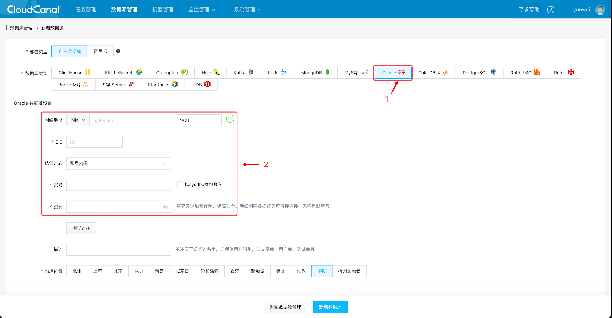
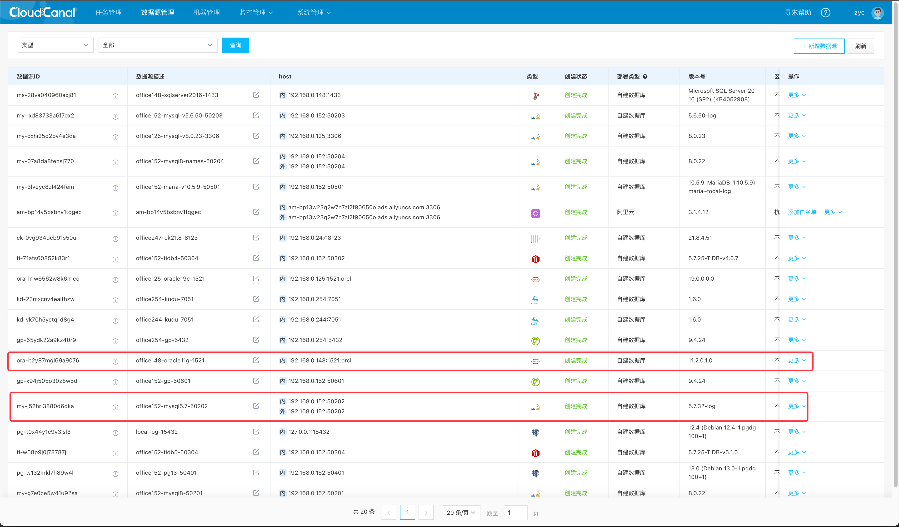
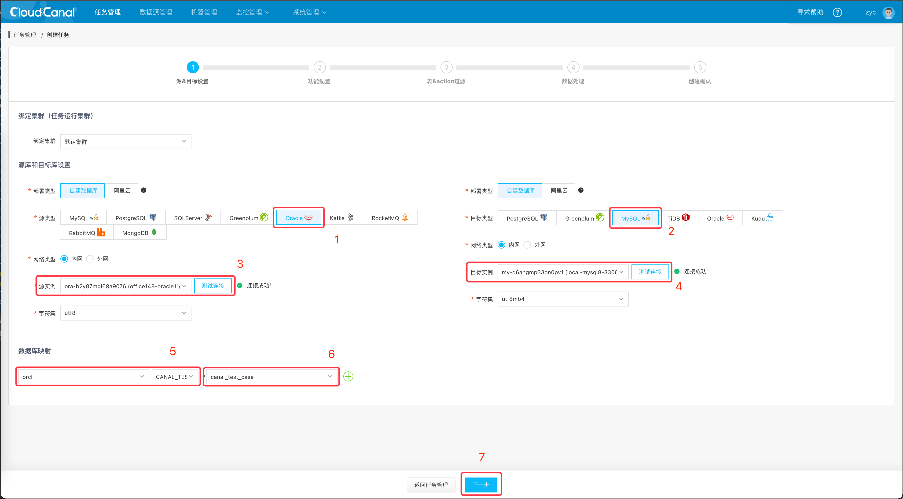
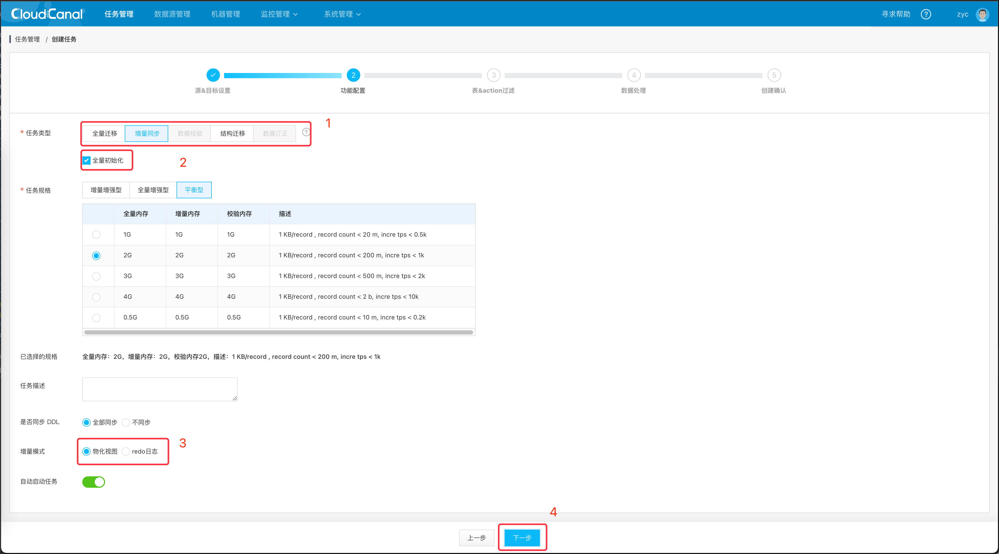
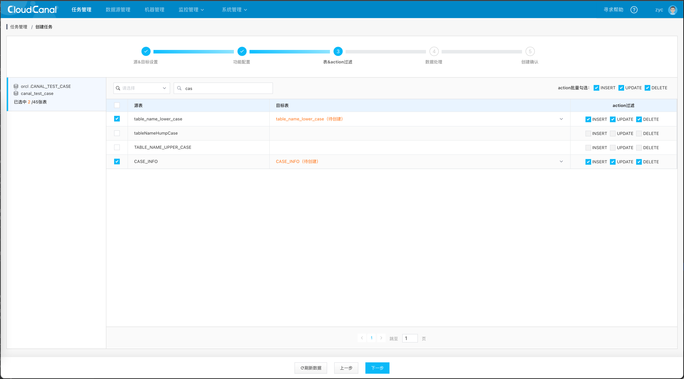
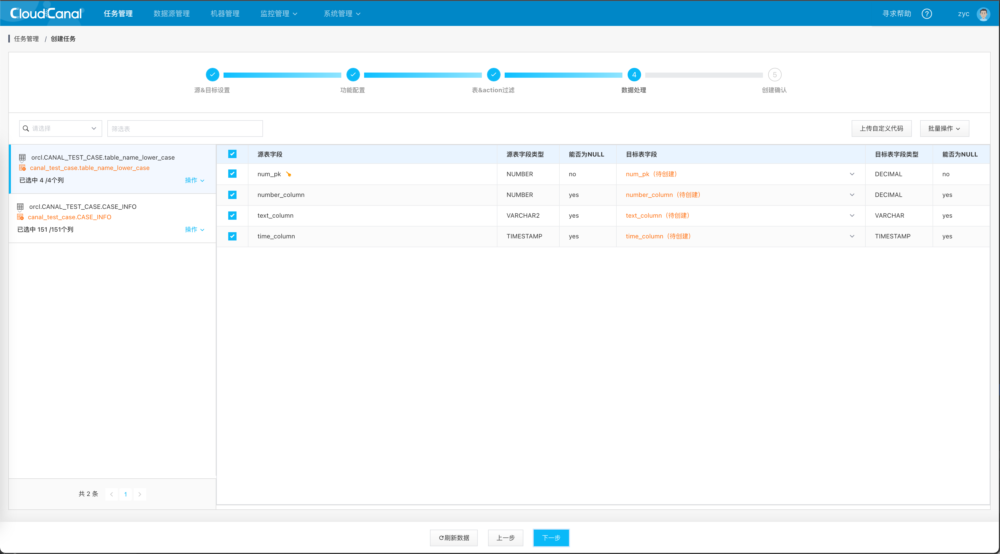
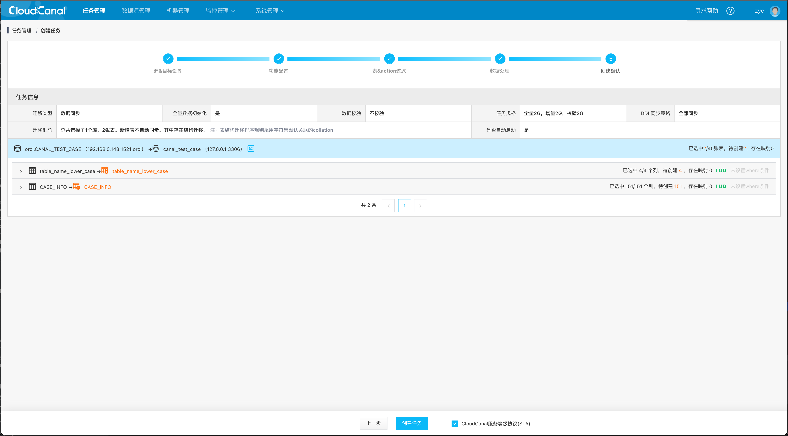
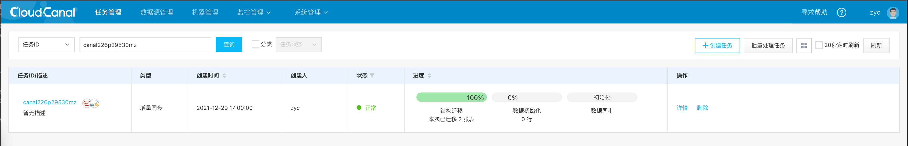
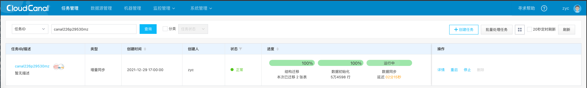
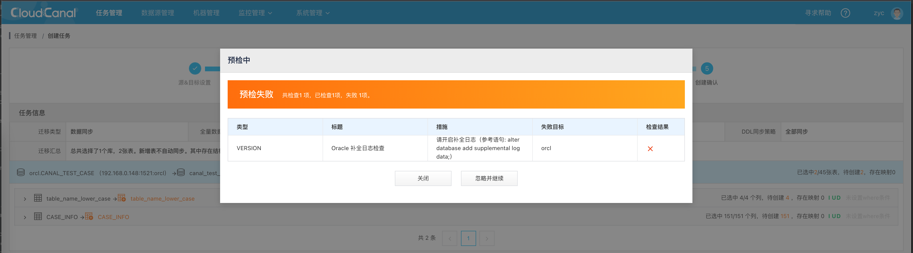

## 简述
[CloudCanal](https://www.clougence.com?src=cc-doc-blog-oracle-mysql-sync) 2.1.0.x 版本开始支持 Oracle 作为源端的数据迁移同步能力。

本文通过 Oracle 到 MySQL 的数据迁移同步案例简要介绍这个源端的能力。链路特点：

结构迁移、全量迁移、增量同步(数据)、数据校验俱全流程全自动化

此文章简要介绍如何快速构建一条长期稳定运行的 Oracle->MySQL 数据链路。

## 技术要点

将数据从 Oracle 中同步出来有两种方式可以选择
- 物化视图日志
- 使用 Redo 日志

#### 权限问题
请确保添加的数据源账号可以访问如下 13 张表 ，或者使用一个具有 DBA 权限的 Oracle 账号。
- 表 SYS.DBA_USERS
- 表 SYS.DBA_TABLES
- 表 SYS.DBA_TAB_COLS
- 表 SYS.DBA_TAB_COMMENTS
- 表 SYS.DBA_COL_COMMENTS
- 表 SYS.PRODUCT_COMPONENT_VERSION
- 表 SYS.DBA_CONSTRAINTS
- 表 SYS.DBA_CONS_COLUMNS
- 表 SYS.DBA_INDEXES
- 表 SYS.DBA_IND_COLUMNS
- 表 v$version
- 表 v$database
- 表 v$tablespace

对于物化视图方案来讲需要有额外的下列权限
- 语句 `CREATE MATERIALIZED VIEW LOG ON xxx`
- 语句 `CREATE INDEX xxxx`

对于 Redo 方案来将需要有 LOGMNR 相关的权限
- 表 SYS.ALL_LOG_GROUPS
- 表 v$logfile
- 表 v$log
- 表 v$archived_log
- 表 v$logmnr_logs
- 存储过程 SYS.DBMS_LOGMNR_D.BUILD
- 存储过程 SYS.DBMS_LOGMNR.ADD_LOGFILE
- 存储过程 SYS.DBMS_LOGMNR.START_LOGMNR
- 存储过程 SYS.DBMS_LOGMNR.END_LOGMNR
- 语句 `ALTER TABLE xxxx DROP SUPPLEMENTAL LOG xxx`
- 语句 `ALTER TABLE xxxx ADD SUPPLEMENTAL LOG xxx`
- 语句 `ALTER SYSTEM ARCHIVE LOG CURRENT`

在配置同步任务之前需要确保上面的 Oracle 权限，另外作为源端 Oracle 全量阶段还需要读取对应表的权限。

## 操作示例
### 准备 CloudCanal
- 下载安装 [CloudCanal 私有部署版本](https://www.clougence.com?src=cc-doc-blog-oracle-mysql-sync),使用参见[快速上手文档](https://www.clougence.com/docs/productOP/docker/install_linux_macos)

### 添加数据源
- 登录 CloudCanal 平台
-  **数据源管理** -> **添加数据源**
- 选择 **自建数据源** ，并填写相关数据库信息，其中 **网络地址** 请按提示带上端口号
  

- 如下已添加完 Oracle 和 MySQL
  

### 创建同步任务
- **任务管理**->**新建任务**
- 源端选择刚添加的 Oracle 数据源，目标选择 MySQL, 分别点击 **测试连接** 按钮以测试数据库连通性和获取 schema 级别元信息
- 点击**下一步**
  

- 选择 **数据同步**，并且勾选**全量数据初始化**
- 规格可以根据任务重要度以及部署机器的内存容量合理选择，一般 2GB 内存规格即可
- 点击**下一步**
  

- 勾选需要同步的表，如果目标表为橙色，表示不存在同名表，任务创建完成后自动进行**结构迁移**。也可以下拉框选择表进行映射
- 勾选需要同步的 INSERT/UPDATE/DELETE 操作，默认全选
- 点击**下一步**
  

- 通过勾选做**列映射**和**列裁剪**
- 点击**下一步**
  

- 对任务内容进行创建 ，如果任务不需要立刻运行 , 可置灰**自动启动任务** 按钮
- 点击**确认创建**
  

### 任务同步
- 任务分为 3 个阶段：**结构迁移**、**数据初始化**、**数据同步**，每一个阶段完成时，状态自动流转，直到同步稳态
  
  
  - 结构迁移：当对端数据库不存在对应的库表时 CloudCanal 会自动将 Oracle 的表在对端创建出来
  -  数据初始化：将源端所选库表数据以全量迁移方式搬迁到对端
  - 数据同步：准实时的同步增量数据，即源端数据库上发生的增、删、改操作同步到对端数据库上

## FAQ

### 目前 Oracle 源端还支持哪些数据源？
除了 Oracle 到 MySQL 之外，截止社区版 2.0.1.1 版本，还支持下面这些链路
- Oracle -> PostgreSQL
- Oracle -> Greenplum
- Oracle -> TiDB
- Oracle -> Oracle
- Oracle -> Kudu  。

### 预检失败会有哪些影响？
一些小伙伴可能在创建任务的时候遇到类似如下报错信息，可能会有一些疑惑。

在创建任务的最后阶段我们会进行一些检测，Oracle 作为源端会存在如下一些检测项目。

物化视图模式下
- 如果表已经创建了物化视图日志表那么预检失败。

Redo 模式下
- 开启日志归档模式 `alter database archivelog` 开启过程需要数据库离线。
- 需要开启最小补全日志 `alter database add supplemental log data`

## 总结
本文简单介绍了如何使用 [CloudCanal](https://www.clougence.com?src=cc-doc-blog-oracle-mysql-sync) 快速构建Oracle-> MySQL 数据迁移同步链路，更多的源端和目标端陆续开放。