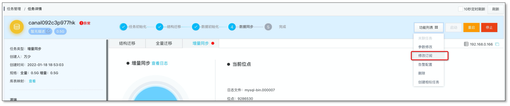
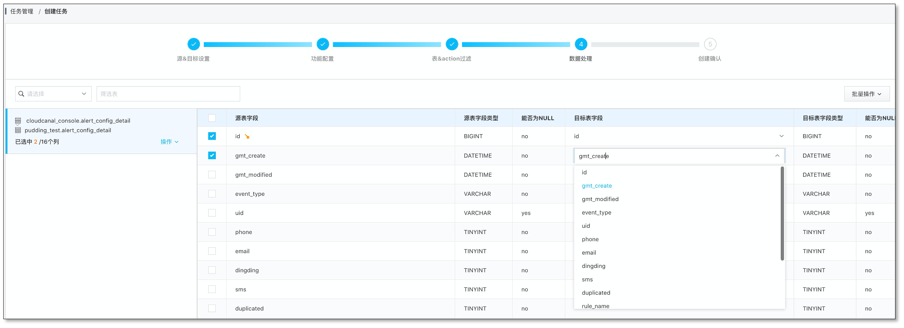
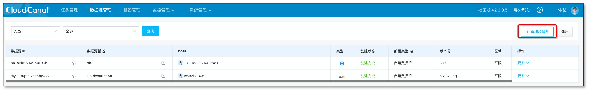
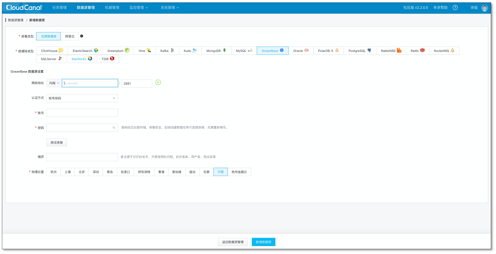
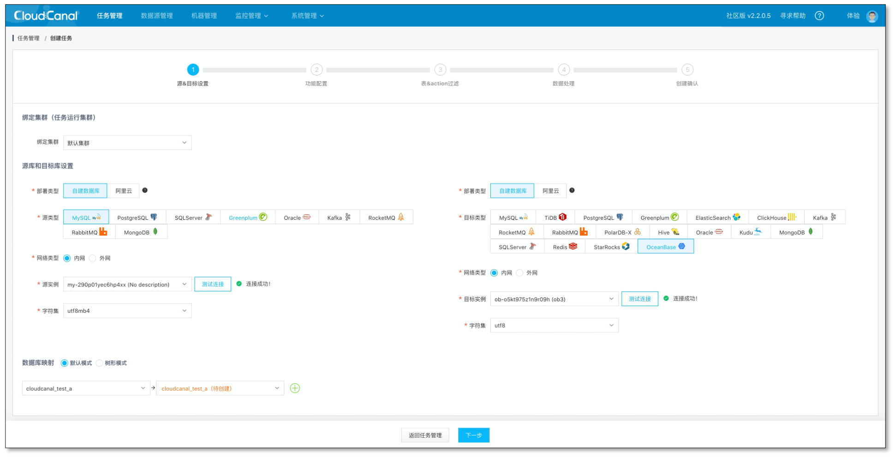
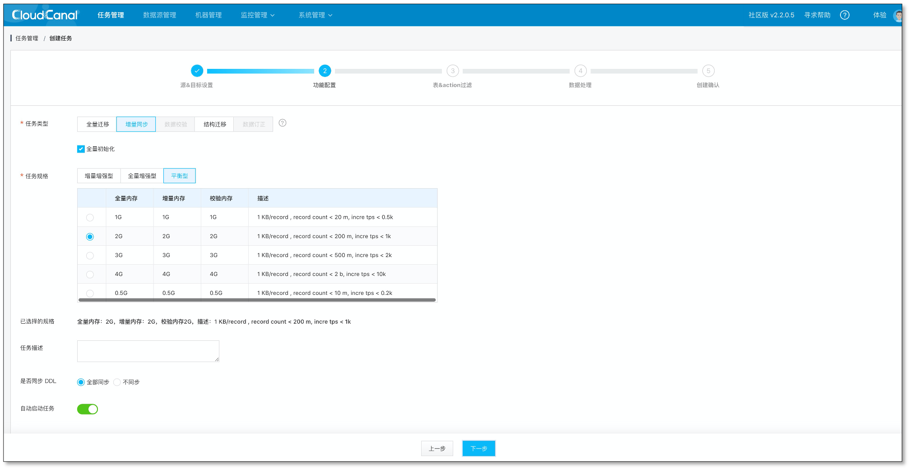
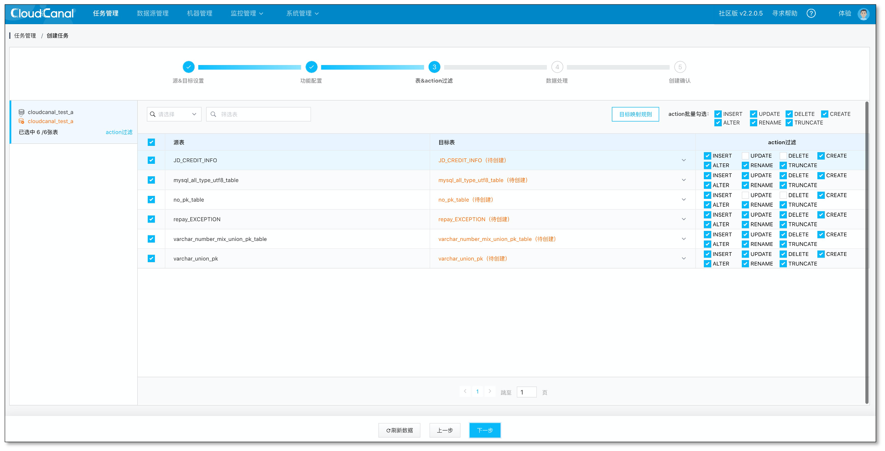
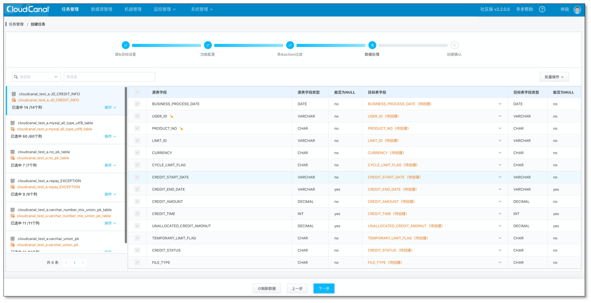
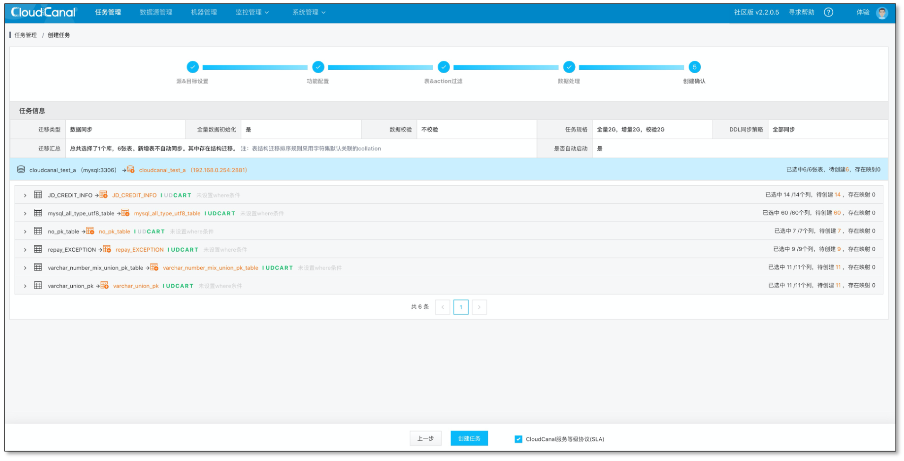
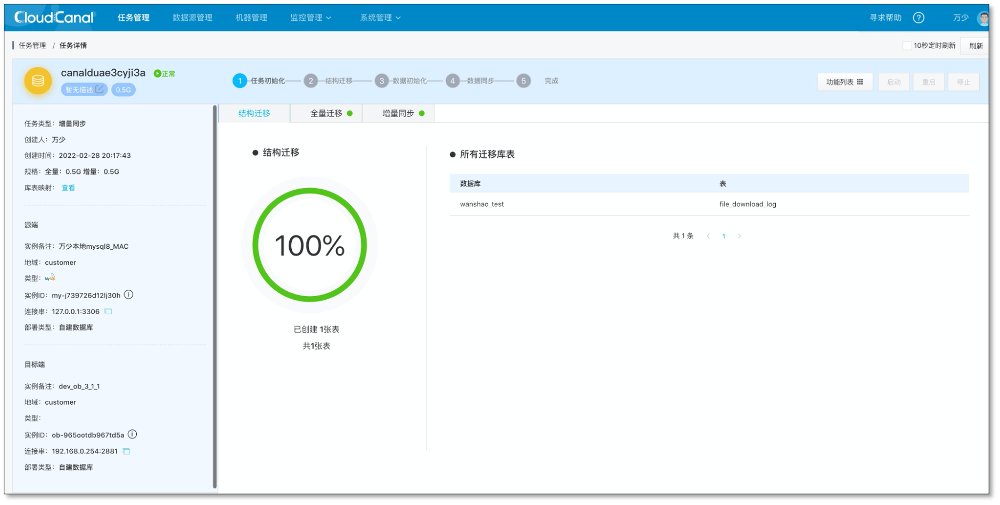

## 简述
[CloudCanal](https://www.clougence.com?src=cc-doc-blog-oceanbase-target-sync) 2.2.0.7 版本开始支持 OceanBase 作为对端的数据迁移同步能力

本文通过 MySQL->OceanBase的数据迁移同步案例简要介绍这个源端的能力。链路特点：

- 结构迁移、全量迁移、增量同步(数据)
- 流程全自动化
- 高度产品化：任务管理、监控、审计一应俱全

## 使用须知
- 仅支持 OceanBases MySQL 模式
- 支持的源端数据源类型为 Oracle/PostgreSQL/MySQL，本文主要以 MySQL 源端为例说明使用方法。
- DDL同步当前仅支持 MySQL->OceanBase

## 技术点
### 面向在线业务的编辑订阅能力
数据长周期增量同步过程中，常有订阅表增减的情况，CloudCanal **编辑订阅** 能力，可在原有任务基础上进行变更。其中新增表会产生一个子任务，自动完成数据全量迁移和增量同步，然后和原有主任务合并，自动完成整个过程。

### 全自动化
CloudCanal 自动帮用户完成 **结构迁移**、**全量数据迁移**、**增量数据同步**，大大提升创建数据同步任务的效率。

### 自定义代码加工
CloudCanal 允许用户添加自定义代码处理数据，应用场景包括**数据清洗**、**数据脱敏**、**宽表构建**、**新系统数据库重构**等。可参考文章《[5分钟搞定 MySQL 到 ElasticSearch 宽表构建和同步》](https://www.clougence.com/blog/data_sync_sample/mysql_elasticsearch_widetable_sync) 以了解基本使用。

### 库表列裁剪映射
CloudCanal 提供了数据迁移同步中常用的产品化能力-在库、表、列等级别进行裁剪和映射，有效提升数据迁移同步任务的适配性。

### 断点续传
CloudCanal 支持迁移和同步任务的断点续传，通过定期记录的位点，让任务重启后自动从上一次位点开始继续迁移或同步。

## 操作示例
- 下载安装 [CloudCanal 私有部署版本](https://www.clougence.com?src=cc-doc-blog-oceanbase-target-sync),使用参见[快速上手文档](https://www.clougence.com/docs/productOP/docker/install_linux_macos)
- 准备好源端和目标端数据库以及对应的测试数据

### 添加数据源
- 登录 CloudCanal 平台
- 选择 数据源管理->新增数据源
- 选择 自建数据库中的OceanBase
  

  

### 创建任务
- 任务管理->任务创建
- 选择 源 和 目标 数据库
- 点击 下一步
  

- 选择 增量同步，并且启用 全量数据初始化
- 点击下一步
  

- 选择订阅的表，结构迁移自动创建的表会按照默认类型映射进行处理。对端表如果已经提前建好，这里也可以直接映射对端已经存在的表
- 点击下一步
  

- 配置列映射、点击下一步
  
  >如果是通过 CloudCanal 结构迁移自动建表，这边不允许重命名、裁剪以及列映射; 如果映射的是对端已经提前建好的表，这边支持列的裁剪和映射

- 创建任务
  

- 查看任务状态。任务创建后，会自动完成结构迁移、全量、增量阶段。
  

## 总结
本文简单介绍了如何使用 [CloudCanal](https://www.clougence.com?src=cc-doc-blog-oceanbase-target-sync) 进行 MySQL 到OceanBase 的数据迁移同步。