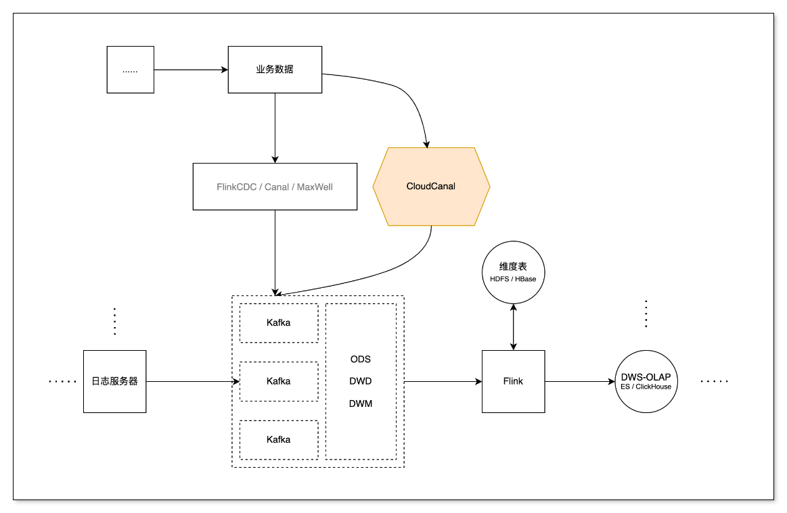
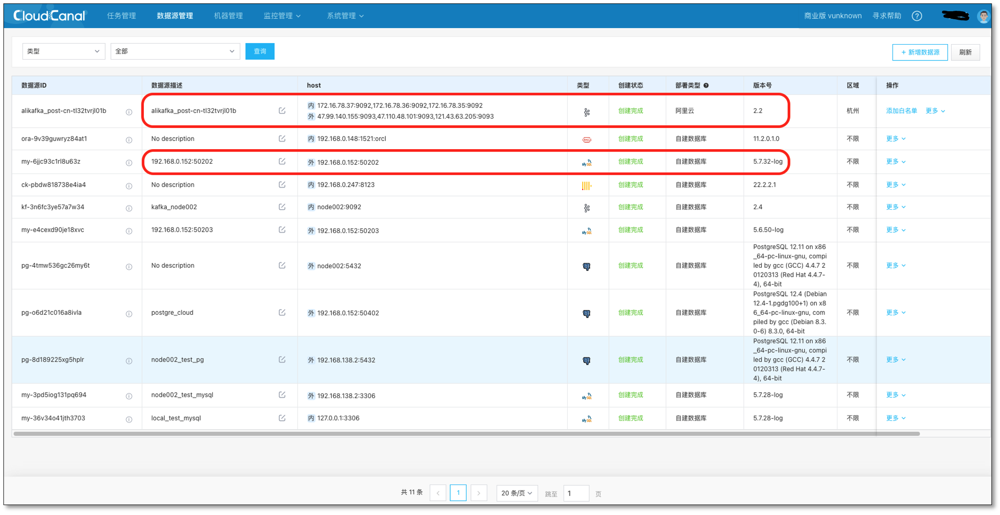
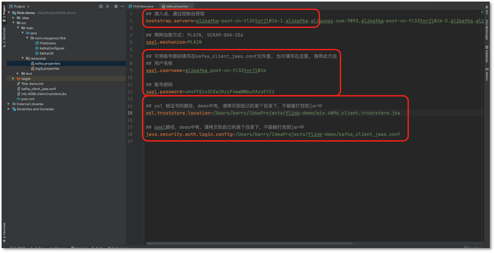
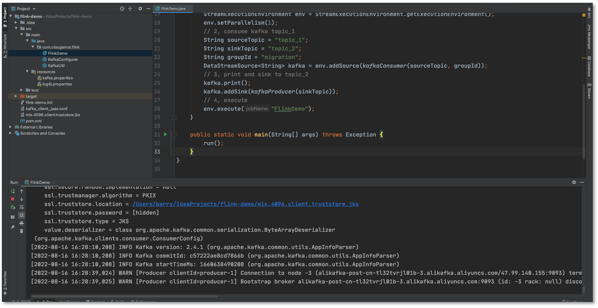
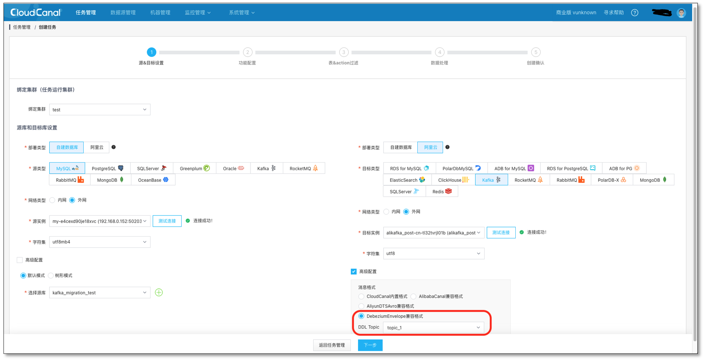
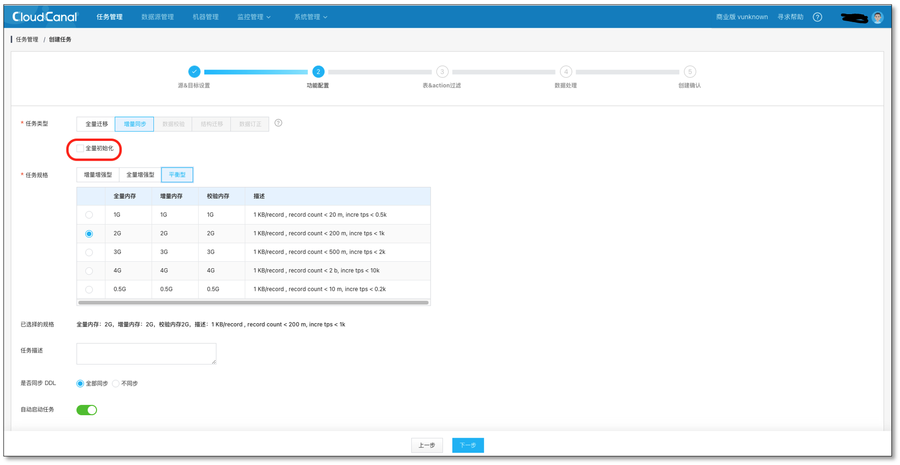
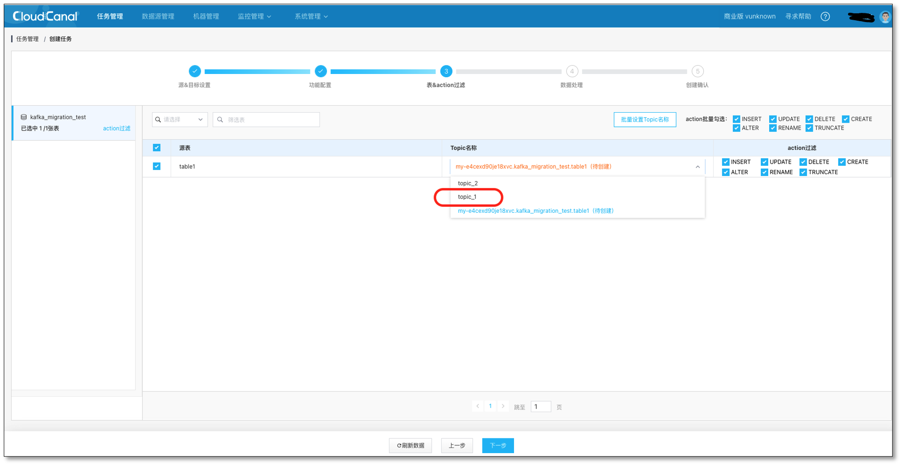
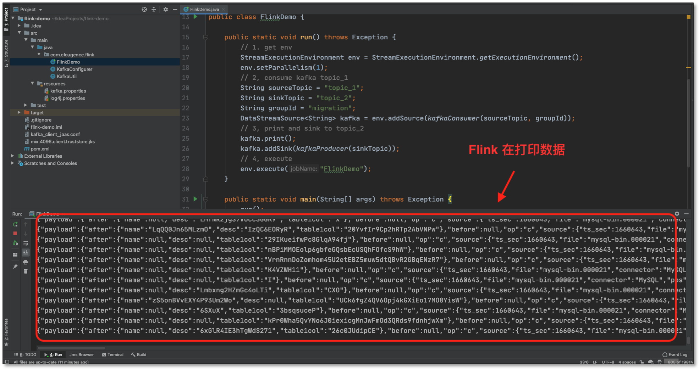

## 简述
实时数据处理领域中，使用 Flink 方式，除了从日志服务订阅埋点数据外，总离不开从关系型数据库订阅并处理相关业务数据，这时就需要监测并捕获数据库增量数据，将变更按发生的顺序写入到消息中间件以供计算（或消费）。

本文主要介绍如何通过 [CloudCanal](https://www.clougence.com?src=cc-doc-blog-rdb-flink-sync) 快速构建一条高效稳定运行的 MySQL -> Kafka -> Flink 数据同步链路。

## 技术点
### 兼容多种常见消息结构
CloudCanal 目前支持 **Debezium Envelope (新增)**、**Canal**、**Aliyun DTS Avro** 等多种流行消息结构，对数据下游消费比较友好。
本次对 Debezium Envelope 消息格式的支持，我们采用了一种轻量的方式做到完全兼容，充分利用 CloudCanal 增量组件，扩展数据序列化器 (EnvelopDeserialize)，得到 Envelop 消息并发送到 Kafka 中。
其中 Envelop 的消息结构分为 **Payload** 和 **Schema** 两部分

- Payload:存储具体数据
- Schema:定义 Payload 的解析格式 (默认关闭)
```json
{
  "payload":{
    "after":{
      "column_1":"3",
      ...
    },
    "before":null,
    "op":"c",
    "source":{
      "db":"kafka_test",
      "table":"new_table"
      "pos":110341861,
      "ts_ms":1659614884026,
      ...
    },
    "ts_ms":1659614884026
  },
  "schema":{
    "fields":[
      {
        "field":"after",
        "fields":[
          {
            "field":"column_1",
            "isPK":true,
            "jdbType":4,
            "type":"int(11)"
          },
          ...
        ],
        "type":"struct"
      },
      ...
    ],
    "type":"struct"
  }
}
```
### 高度可视化的CDC
CDC 工具如 **FlinkCDC**、**Maxwell**、**Debezium ...** 各有特色，CloudCanal 相对这些产品，最大的特点是高度可视化，自动化，下表针对目标端为Kafka 的 CDC 简要做了一些对比。

|                 | CloudCanal                                   | FlinkCDC                                     | Maxwell |
|-----------------|----------------------------------------------|----------------------------------------------|---------|
| 产品化             | 完备                                           | 基础                                           | 无       |
| 同步对象配置          | 可视化                                          | 代码                                           | 配置文件    |
| 封装格式            | 多种常用格式	                                      | 自定义	                                         | JSON    |
| 高可用             | 有                                            | 有                                            | 无       |
| 数据初始化（snapshot） | 实例级                                          | 实例级                                          | 单表      |
| 源端支持            | ORACLE,MySQL,SQLServer,MongoDB,PostgreSQL... | ORACLE,MySQL,SQLServer,MongoDB,PostgreSQL... | MySQL   |

CloudCanal 在平衡性能的基础上，提供多种关系型数据源的同步，以及反向同步。

提供便捷的可视化操作、轻巧的数据源添加、轻便的参数配置。

提供多种常见的消息格式，仅仅通过鼠标点击，就可以使用其他 CDC 的消息格式的传输，让数据处理变的异常的快捷、方便。

其中经过我们在相同环境的测试下， CloudCanal 在高写入的 MySQL 场景中，处理数据的效率表现的很出色，后续我们会继续对 CloudCanal 进行优化，提升整体的性能。

综上，相比与类似的 CDC 产品来说，CloudCanal 简单轻巧并集成一体化的操作占据了很大的优势。

### 无缝对接 Flink 流式计算
Flink 流式计算中不仅要订阅日志服务器的日志埋点信息，同样需要业务数据库中的信息，通过 CDC 工具订阅数据，能减少查询对业务数据库产生的压力还能以流的形式传输，方便与日志服务器中的数据进行关联处理。

实际开发中，可以将业务数据库中的信息提取过滤之后动态的放入 Hbase 中作为维度数据，方便相关联的宽表进行关联查询。

也可以对数据进行开窗、分组、聚合，同样也可以下沉到其他的 Kafka 消费者组中，实现数据的分层。


## 操作示例

### 前置条件

- 本例使用 Envelop 消息格式，关系型数据库 MySQL 为示例，展示 MySQL 对接 Flink 的 Demo
- 下载安装 [CloudCanal 私有部署版本](https://www.clougence.com?src=cc-doc-blog-rdb-flink-sync),使用参见[快速上手文档](https://www.clougence.com/docs/productOP/docker/install_linux_macos)
- 准备好 1 个 MySQL 实例，1 个 Kafka 实例（本例使用自己搭建的 MySQL 5.6，阿里云 Kafka 2.2）
- 准备好 Flink 消费端程序，配置好相关信息：[flink-demo 下载](https://gitee.com/clougence/flink-demo)
- 登录 CloudCanal 平台，添加 Kafka，MySQL
  

- Kafka 自定义一个主题 **topic_1**，并创建一条 MySQL -> Kafka 链路作为增量数据来源
### 任务创建

- 首先配置 **FlinkDemo程序的**阿里云 Kafka 相关信息
  

- 运行 **FlinkDemo** 程序，等待消费 MySQL 同步 Kafka 的数据（程序不要关闭）
  

- **任务管理** -> **任务创建**
- **测试链接**并选择 **源** 和 **目标** 数据库，**并选择 DebeziumEnvelope 消息格式，和 topic_1 主题**(在阿里云里提前创建)
  

- 选择 **数据同步**，不勾选 **全量数据初始化**，其他选项默认
  
- 选择需要迁移同步的表 **table1**和对应的 Kafka 主题 **topic_1**
  
- 持续点击下一步，并创建出数据同步任务。

## Flink 消费数据
- 向 **MySQL**生成数据，**MySQL**-> **Kafka(topic_1) -> Flink**
- **FlinkDemo** 接收到 **Kafka(topic_1)** 数据，下沉到 topic_2 主题，打印并输出；这里 Flink 程序**可以做更多的流式计算的操作**，FlinkDemo 只是演示了**最基本的数据传输案例**。
  

## 常见问题
### 还支持哪些源端数据源呢？
目前开放  MySQL、Oracle，SQLServer，Postgres，MongoDB 到 Kafka，如果各位有需求，可以在社区反馈给我们。

### 支持 DDL 消息同步吗?
目前 关系型数据到 kafka 是支持 DDL 消息的同步的，可以将 关系型数据库 DDL 的变化同步到 Kafka 当中。

## 总结
本文简单介绍了如何使用 [CloudCanal](https://www.clougence.com?src=cc-doc-blog-rdb-flink-sync) 进行 **MySQL -> Kafka -> Flink** 数据迁移同步。
 
