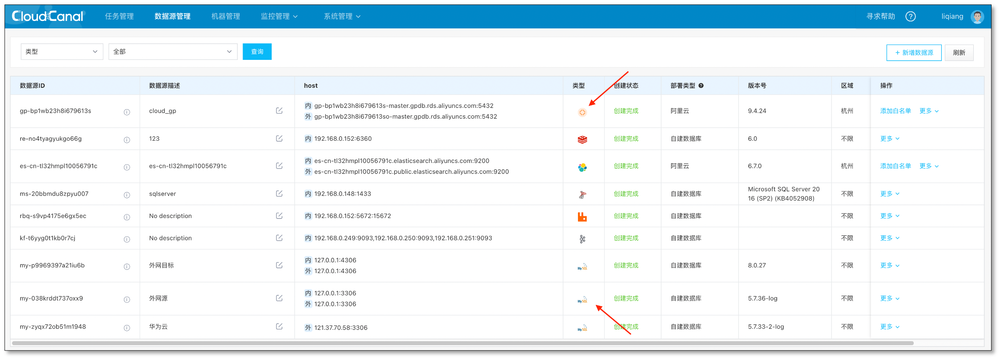
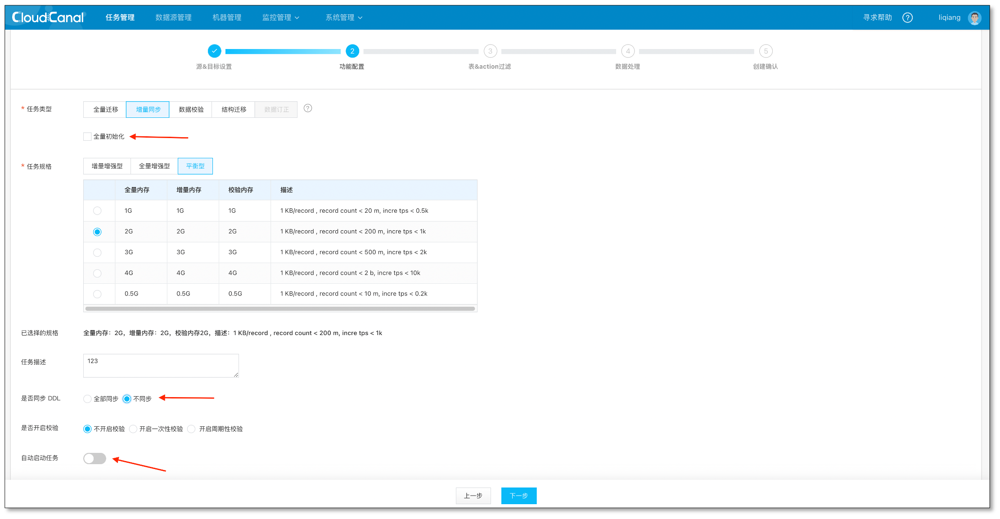
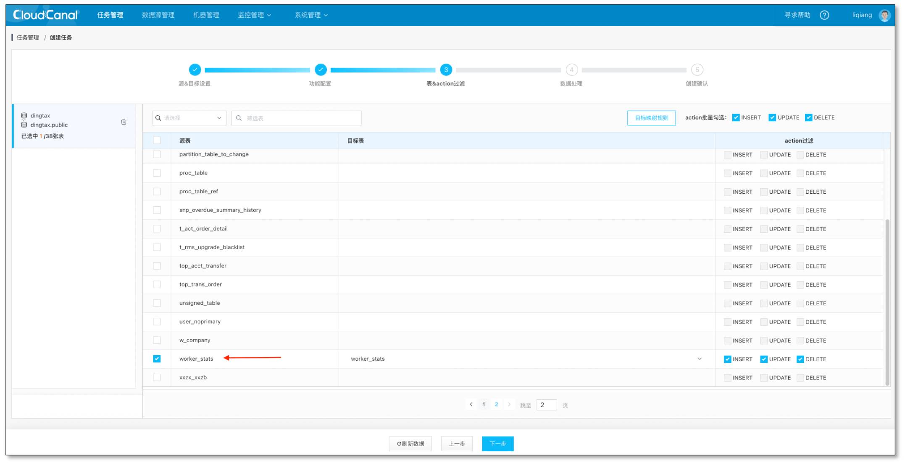
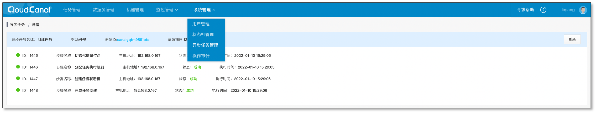
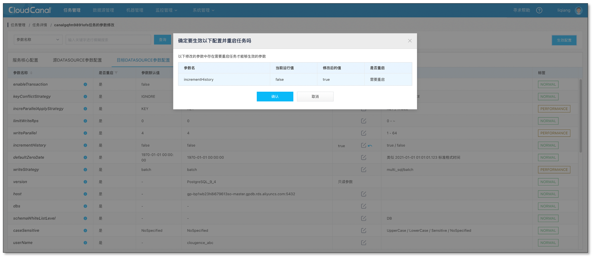
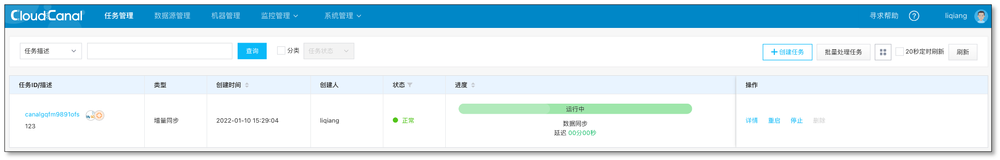
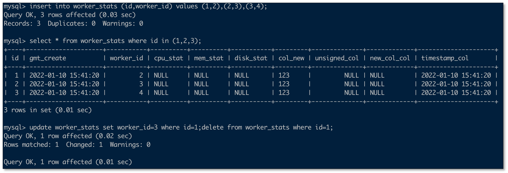
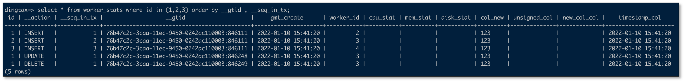
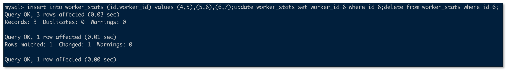
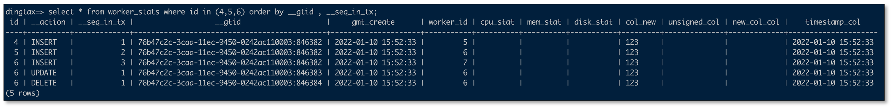

## 简述
[CloudCanal](https://www.clougence.com?src=cc-doc-blog-history-data-sync) 为满足用户对于核心数据风控需求，在 MySQL->Greenplum 链路支持了历史数据能力，构建的历史数据特点包括:
- exactly once(有且仅有一次)
- 支持事务内多次变更，反复写入删除等特殊场景

本文通过一个实际案例简要介绍如何使用这个功能。

## 技术点

### 核心数据变更风控的必要性
用户数据、交易数据的变更追踪，常用方式是通过应用埋点、数据网关或代理、数据管理控制平台等方法进行，通过**规则预防**、**事后止损**两大方向控制风险。

通过数据库增量日志追踪数据变更历史，从风控角度属于**事后止损**方向，常见落地方案如**准实时数据对账**，**数据历史算法分析与统计**等。

CloudCanal 目前根据用户需求，支持 MySQL->Greenplum 链路数据实时变更历史追踪功能。

### 历史数据结构形态

历史数据构建过程中，幂等性能够大幅度便利用户数据分析，用户无需分辨相类似数据是否是业务层面变更还是系统原因造成的重复数据。为此，我们结合具体数据链路，构建了幂等历史数据表结构。表结构如下。

```
CREATE TABLE "public"."worker_stats" (
  "id" bigint NOT NULL ,
  "__action" varchar(64),
  "__seq_in_tx" bigint,
  "__gtid" varchar(255),
  ...other column...
  PRIMARY KEY ("id","__action","__seq_in_tx","__gtid")
) ;
```

其中 id 为原始表主键，可以为联合主键（也就会有多个字段），`__action `为此变更操作类型，包含 **INSERT/UPDATE/DELETE** 3个候选值， `__seq_in_tx` 为本变更在事务中的序号，`__gtid ` 表示事务号。以上几个字段，在历史数据表结构中构成联合主键，达到幂等目标。

## 操作示例

### 前置条件:
- 下载安装 [CloudCanal 私有部署版本](https://www.clougence.com?src=cc-doc-blog-history-data-sync),使用参见[快速上手文档](https://www.clougence.com/docs/productOP/docker/install_linux_macos)
- 准备好 MySQL  数据库(本例版本为 8.0) 和 Greenplum 数据库(本例为阿里云 ADB for PG)
- 准备好 MySQL 示例表以及 Greenplum 中表,并造一些数据。

```
-- MySQL

CREATE TABLE `worker_stats` (
  `id` bigint(20) NOT NULL AUTO_INCREMENT,
  `gmt_create` datetime NOT NULL DEFAULT CURRENT_TIMESTAMP,
  `worker_id` bigint(20) NOT NULL,
  `cpu_stat` text,
  `mem_stat` text,
  `disk_stat` text,
  `col_new` varchar(255) NOT NULL DEFAULT '123',
  `unsigned_col` bigint(20) unsigned DEFAULT NULL,
  `new_col_col` varchar(123) DEFAULT NULL,
  `timestamp_col` timestamp NOT NULL DEFAULT CURRENT_TIMESTAMP,
  PRIMARY KEY (`id`)
) ENGINE=InnoDB AUTO_INCREMENT=503723 DEFAULT CHARSET=utf8mb4;

-- Greenplum

CREATE TABLE "public"."worker_stats" (
  "id" bigint NOT NULL ,
  "__action" varchar(64),
  "__seq_in_tx" bigint,
  "__gtid" varchar(255),
  "gmt_create" timestamp NOT NULL,
  "worker_id" bigint NOT NULL,
  "cpu_stat" text,
  "mem_stat" text,
  "disk_stat" text,
  "col_new" varchar(255) NOT NULL DEFAULT '123',
  "unsigned_col" bigint DEFAULT NULL,
  "new_col_col" varchar(123) DEFAULT NULL,
  "timestamp_col" timestamp NOT NULL,
  PRIMARY KEY ("id","__action","__seq_in_tx","__gtid")
) ;
``` 

### 添加数据源
- 登录 CloudCanal 平台
- **数据源管理**->**新增数据源**
- 将源端**MySQL**和目标端**Greenplum** 分别添加
  

### 任务创建
- **任务管理**->**任务创建**
- 选择 **源** 和 **目标** 数据源
- 选择 **数据同步**，不勾选 **全量数据初始化**, DDL 选择 **不同步**,并且选择 **不自动启动**任务（为了修改参数）
  
- 选择需要做历史同步的表
  
- 选择列,默认全选
- 确认创建
- 查看异步任务，确认创建步骤正常
  
- 进入 任务详情->修改参数->目标DATASOURCE配置，修改参数 **incrementHistory** 为 true
  
- 启动任务，并正常同步
  

### 验证历史数据
-  手动造几条增删改,查看历史数据效果
   
   
- 再手动增删改几条数据，重启任务，查看幂等效果
  
  


## 常见问题

### 是否支持其他链路

暂时没有支持，并且目前源端强依赖MySQL GTID,以防止主备切换等情况，如果源端是PostgreSQL,SQLServer,Oracle 可以选择对应事务的 lsn 或 scn 作为替代。

## 总结
本文简单介绍了如何使用 [CloudCanal](https://www.clougence.com?src=cc-doc-blog-history-data-sync) history功能精确构建数据变更历史。