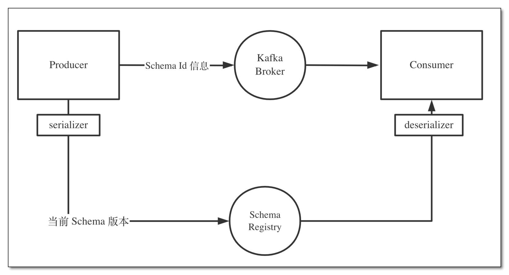
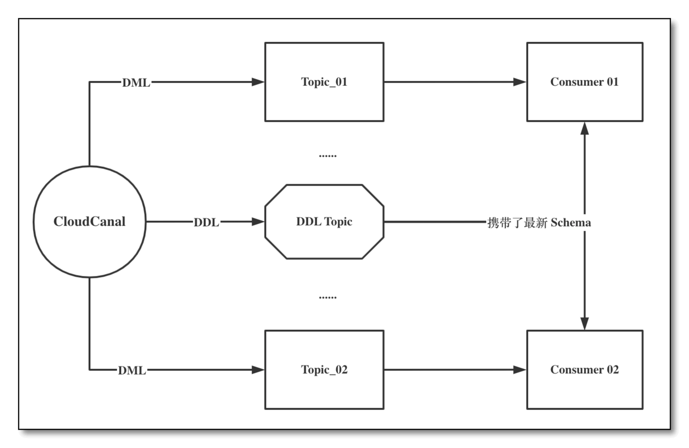
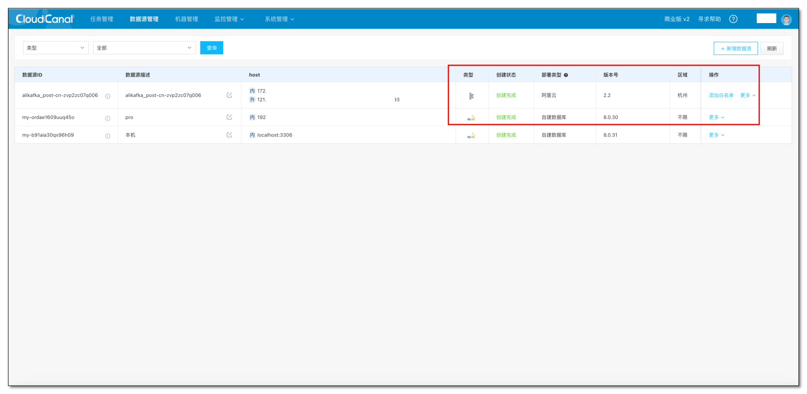
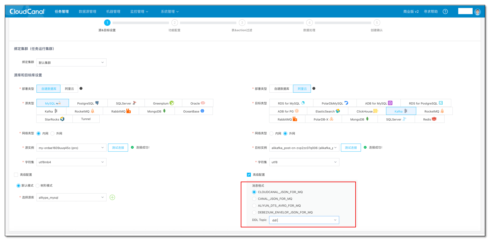
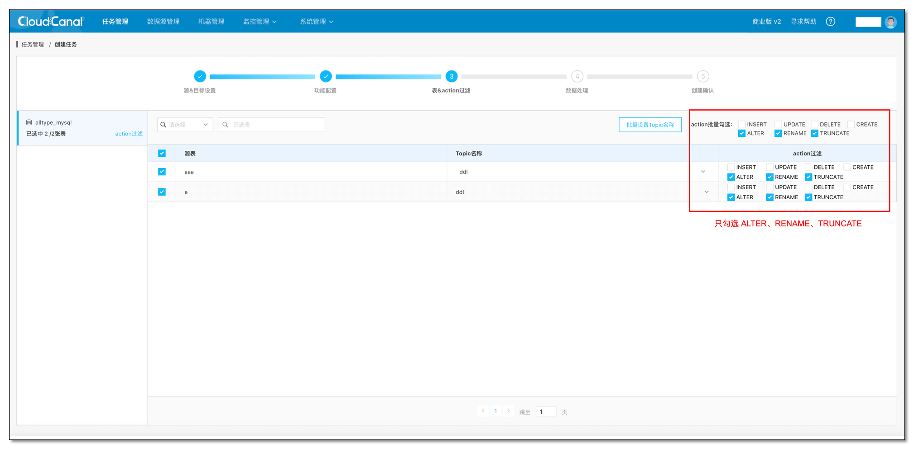
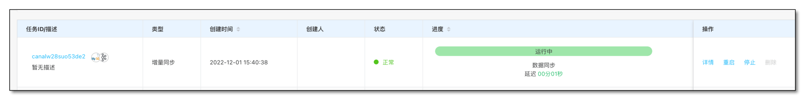
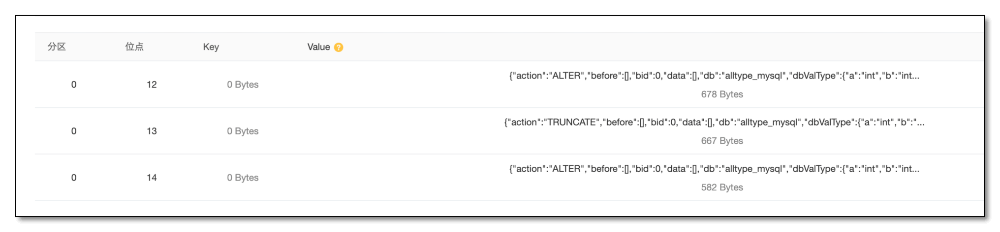
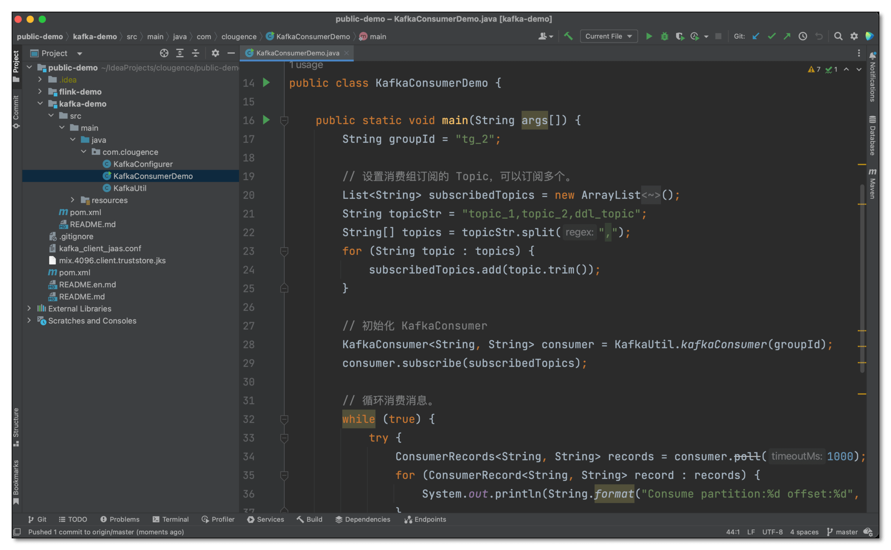

## 简介
本文主要介绍通过 [CloudCanal](https://www.clougence.com?src=cc-doc-blog-multi-version-schema) 快速构建一条 MySQL -> Kafka 同步链路，以订阅源端数据库 DDL 变更和相关 schema 信息来构建数据库的多版本Schema仓库。

## 技术点
### 轻量便利的 SCHEMA 管理
常见的 Schema 管理方式如 Schema Registry, 用来管理 Schema 的演变历史，所有数据序列化反序列化需要用到的 Schema 保存在注册表里（构成一个多版本 Schema 仓库）。

每一个数据引用 Schema ID ，序列化或反序列化时从注册表里拉取对应的 Schema 进行相应动作。



CloudCanal 使用的是一种**相对轻巧便利的解决方案**：将 DDL 消息携带上最新的 Schema 信息直接发送到指定的 DDL Topic 上，有如下好处：

- **集中化管理**：DML消息会发送到对应的 Topic 中，DDL 变更发送到指定的 DDL Topic，更加集中。
- **消费者无需解析DDL**：下游不需要做任何处理直接消费（不需要做 SQL 解析，不需要序列化等前置操作）。
- **Schema信息实时复用**：多个应用程序可以直接复用实时的 Schema 信息。
- **简单轻巧**：不需要依赖第三方组件，轻巧方便，自主可控。



### 新增 SCHEMA 元信息字段
CloudCanal 2.3.x 版本之前之前的 DDL 只是携带了对应的 DDL SQL，用户侧一些数据入湖的场景需要有数据的 Schema，否则数据湖的消费者要从每条消息去解析 Schema 信息，十分浪费计算资源，也不能给其他应用复用。

2.3.x 版本之后，发送到 Kafka 的 DDL 消息携带了整个表的结构化数据(Schema信息)，并且支持将 DDL 同步到指定的 Topic 中，方便下游的 DDL 的统一化管理。

在CloudCanal发给消息系统的消息体中， tableChanges 字段携带的就是具体的源数据库的 Schema 信息，该 tableChanges 字段包含一个数组，其中包含表中每一列的元信息。由于结构化数据以 JSON 呈现数据，因此消费者无需先通过 DDL 解析器处理消息即可轻松读取消息。具体信息如下，其他字段详情见 [Kafka 消息同步格式](https://www.clougence.com/docs/reference/kafka_msg_format_type)。

| 字段 | 类型 | 说明 |
| --- | --- | --- |
| type | String | DDL 类型。 |
| primaryKeyColumnNames | List | 主键名列表。 |
| columns | Json | 列信息。 |
| jdbcType | String | jdbc 类型。 |
| name | String | 字段名称。 |
| position | String | 字段的顺序。 |
| typeExpression | String | 类型描述，如：varchar(20)，int。 |
| typeName | String | 类型名称，如：varchar，int。 |

## 前置条件
- 下载安装 [CloudCanal 私有部署版本](https://www.clougence.com?src=cc-doc-blog-multi-version-schema),使用参见[快速上手文档](https://www.clougence.com/docs/productop/docker/install_linux_macos)
- 准备一个 MySQL 数据库，和 Kafka 实例（本例分别使用自建 MySQL 8.0.30 和 Kafka 2.2）
- 登录 CloudCanal 平台 ，添加 MySQL 和 Kafka
- Kafka 需要先创建一个 **DDL** **Topic**，用于后续 Topic 订阅。
  

## 任务创建
- **任务管理**-> **任务创建。**
- **测试链接**并选择 **源** 和 **目标** 数据库。
- 选择 Kafka 消息同步格式，这里选择 **CloudCanal** 默认消息格式，其他详情见 [Kafka 消息同步格式](https://www.clougence.com/docs/reference/kafka_msg_format_type)。
- 选择 **DDL Topic**，后续所有的 **DDL** 都将发送到这个 **Topic。**
- 点击下一步。
  

- 因为这里只订阅 DDL，只勾选**ALTER，RENAME，TRUNCATE**。
  

- 持续点击下一步，并创建出数据同步任务。
- 任务自动做**增量同步，进行 DDL 订阅。**
  

## 消费订阅数据

- 源端 MySQL 执行模拟多条 DDL 执行，最后会以用户选择的序列化器，同步到对端 Kafka 中。
```sql
alter table alltype_mysql.aaa add c int null;

truncate table e;

alter table alltype_mysql.aaa drop column d;
...

```

- 由于我们使用的是阿里云 kafka，可以直接查看对端 Kafka 消息内容。



- 同样也可以使用 Kafka 消费程序直接消费 DDL 信息，多个消费程序可以对 Schema 信息进行复用，具体 Demo 详情见：[Kafka 消费实例程序](https://gitee.com/clougence/public-demo)



- 消费示例消息：

```json
{
    "action":"ALTER",
    "before":[],
    "bid":0,
    "data":[],
    "db":"alltype_mysql",
    "dbValType":{
        "a":"int",
        "b":"int",
        "c":"int"
    },
    "ddl":true,
    "entryType":"ROWDATA",
    "execTs":1669880624000,
    "jdbcType":{
        "a":4,
        "b":4,
        "c":4
    },
    "pks":[],
    "schema":"alltype_mysql",
    "sendTs":1669880625842,
    "sql":"alter table aaa add c int null",
    "table":"aaa",
    "tableChanges":{
        "table":{
            "columns":[
                {
                    "jdbcType":4,
                    "name":"a",
                    "position":0,
                    "typeExpression":"int",
                    "typeName":"int"
                },
                {
                    "jdbcType":4,
                    "name":"b",
                    "position":1,
                    "typeExpression":"int",
                    "typeName":"int"
                },
                {
                    "jdbcType":4,
                    "name":"c",
                    "position":2,
                    "typeExpression":"int",
                    "typeName":"int"
                }
            ],
            "primaryKeyColumnNames":[]
        },
        "type":"ALTER"
    }
}
```
## 常见问题
### 支持订阅哪些携带 Schema 消息的数据源
目前源端只支持 MySQL 订阅携带 Schema 的消息，而 Oracle、PostgreSQL 等支持普通 DDL 订阅，后续会陆续支持。

## 总结
本文简单介绍了如何使用 [CloudCanal](https://www.clougence.com?src=cc-doc-blog-multi-version-schema) 进行 DDL 消息订阅，可以方便的选择多种 Kafka 消息格式，将 DDL 发送到指定的 Topic，方便了下游的 Schema 管理。
