## 简介
[CloudCanal](https://www.clougence.com?src=cc-doc-blog-oceanbase-enterprise-sync) 从 2.3.1.1 版本开始支持 OceanBase 企业版( MySQL 兼容模式)源端的订阅。本文将介绍如何使用 CloudCanal 构建一条 OceanBase 到 OceanBase 的迁移同步链路。

## 技术点

### 同时兼容社区版和企业版

OceanBase 增量变更的订阅依赖其官方提供的日志代理组件 [oblogproxy](https://github.com/oceanbase/oblogproxy) 。

部署对应版本的 oblogproxy server，即可使用 CloudCanal 订阅企业版或社区版 OceanBase。

### 支持集群模式和 cluster url 订阅

CloudCanal 支持订阅集群，添加数据源填写 **root server list** 或 **cluster url** 即可。

社区版需要额外部署 **config server** 才可以使用 **cluster url**，企业版则需要部署 **OCP**。

使用 **cluster url** 好处是 CloudCanal 可自动完成 OceanBase 集群节点的变化感知，而使用 **root server list** 则无法达成此目标，当集群节点发生变化时，需要手动调整 CloudCanal 任务配置。

登录 OceanBase 后采用如下命令即可获取 **root server list** 和 **cluster url**

```sql
## 使用 sys 用户执行时，返回的 value 字段即为该值。 
show parameters like 'obconfig_url' 
## 使用 sys 用户执行时，返回的 value 字段即为该值。
show parameters like 'rootservice_list' 
```

### 支持常用DDL实时同步
OceanBase 源端支持同步到多个异构数据源对端，并且均支持常用 DDL 的同步，目前支持常用的**新增列**、**删除列**、**新增和删除索引**操作。

### 编辑订阅功能
CloudCanal 提供了平滑的修改订阅能力。

对于一个已经创建好正在运行的增量同步任务，如果由于业务需求有新增表需要订阅，可在原有任务基础上新增需要订阅的表，**生成子任务**，自动完成**全量**、**增量**同步，在完成后会**子任务会自动与原有的任务合并**。

## 支持的能力
### 支持的 OceanBase 版本
3.0、3.1、3.2、4.0

### OceanBase 源端支持的对端
MySQL、StarRocks、OceanBase、Kafka

## 前置准备
### 部署增量订阅组件 oblogproxy
社区版 OceanBase 请部署[社区版oblogproxy](https://github.com/oceanbase/oblogproxy) 。

企业版 OceanBase 请联系 OceanBase 官方人员协助部署企业版 oblogproxy server。

在下文的例子中，使用企业版 oblogproxy 2.1.2

### 部署企业版 OceanBase
企业版 OceanBase 请联系OceanBase官方人员协助部署，并自行准备好测试数据。

## 操作示例
### 添加数据源
点击 **数据源管理** -> **新增数据源** 选择自建数据库中的OceanBase

- **网络地址**
  - 格式为 ip1:sql_port1;ip2:sql_port2
  - 多个root server 用英文分号分隔
  - 支持填写 obproxy 地址，格式为 proxy_ip:proxy_port
- **额外参数**：
  - **obLogProxyHost**
    - oblogproxy server 的地址，格式为 ip:port，默认端口统一为 2983，如果需要订阅增量，该参数不可为空
  - **clusterUrl**
    - 可以为空，为空时订阅增量时会使用 root server list，不为空时订阅增量会优先使用 cluster url
  - **rpcPortList**
    - 订阅增量时，该参数不可为空，默认端口为2882。如果网络地址包含多个root server(假设为3个)，此处填写格式为2882:2882:2882

  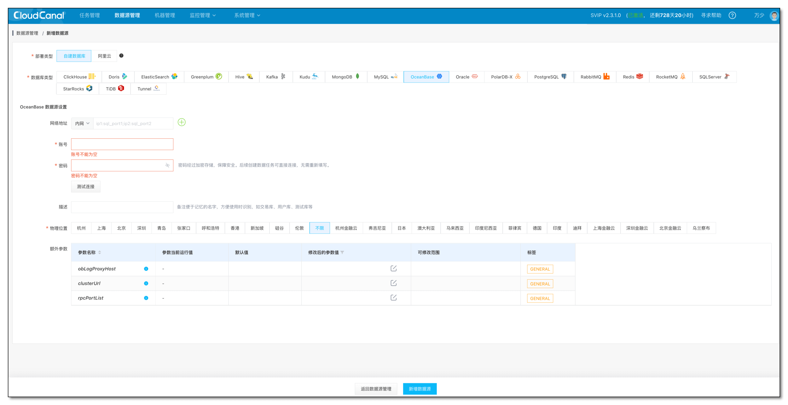

### 创建任务

- 选择 **任务管理** -> **创建任务**
- **第一步 配置源端和目标端**，测试连通性通过后选择需要订阅的源端库和目标端 并选择订阅和映射的库
- 源端勾选高级配置可以设置OceanBase的租户，默认为sys。CloudCanal的一个任务只支持订阅属于一个租户下的表。此处请设置需要订阅的表所属的租户。
  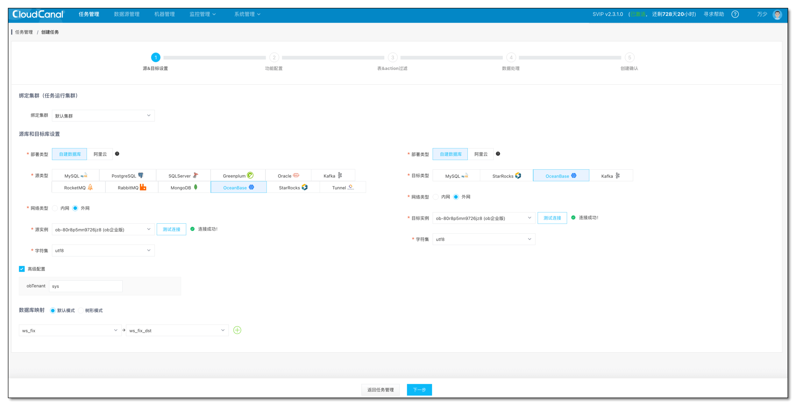

- **第二步 选择任务类型和规格**，一般需要同时进行全量初始化和长周期增量同步可以按照如图的配置。
  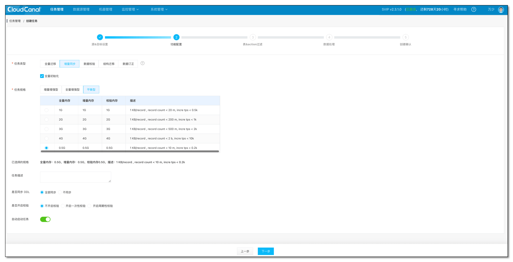

- **第三步 表和Action过滤**，在第三步用户可以勾选自己需要订阅的表以及事件类型
  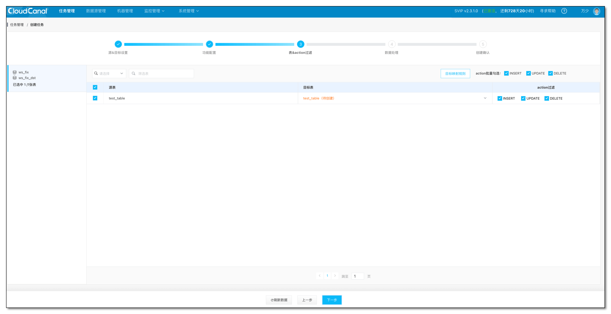

- **第四步 数据处理**：在这一步用户可以进行列裁剪和映射；如果有自定义实时处理数据的需求，在这一步也可以上传自定义代码进行自定义处理。自定义代码处理可以参考[样例工程](https://gitee.com/clougence/cloudcanal-data-process) 。
  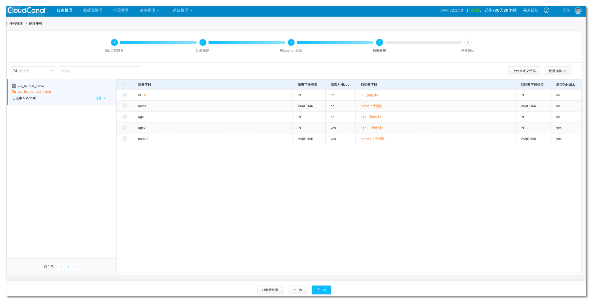

- **第五步 确认配置**：这一步用户可以确认任务的完整配置，确认无误后点击创建任务即可完成任务创建的流程。
  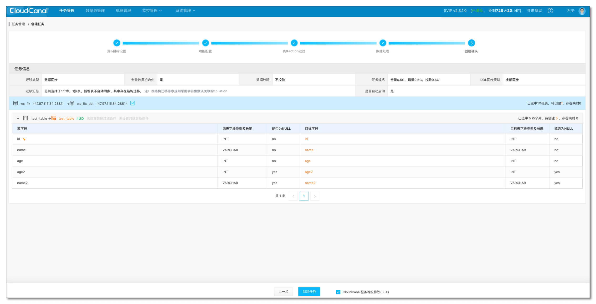

### 任务运行
- 任务创建完毕后会自动开始表结构迁移、全量迁移和增量同步
  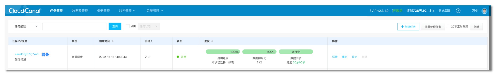

### [可选]老版本 CloudCanal 订正数据源配置
- 支持填写集群模式的host，原有OceanBase数据源的网络地址需要替换成新的格式，即ip:sql_port，或者直接填写obproxy的ip和port。点击 **数据源管理->更多 修改内网/外网地址 **修改**。**
  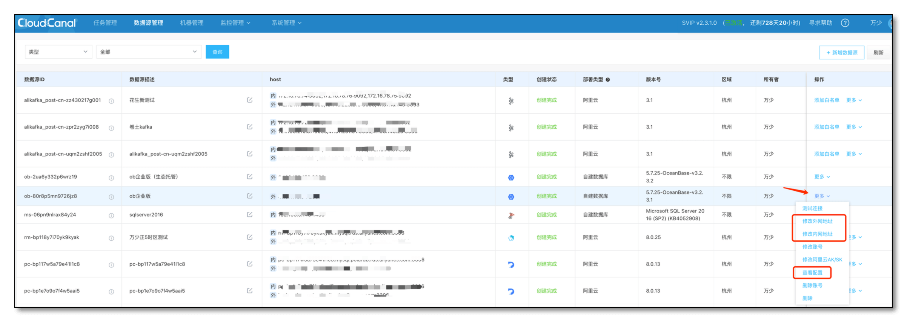
  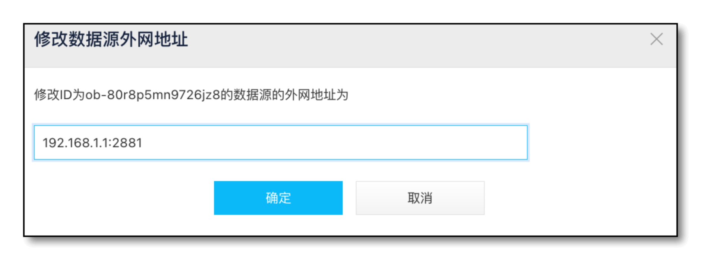

- 支持了独立的数据源额外配置参数，点击 **数据源管理->更多->查看配置** 修改。补充obLogProxyHost、rpcPortList等信息
  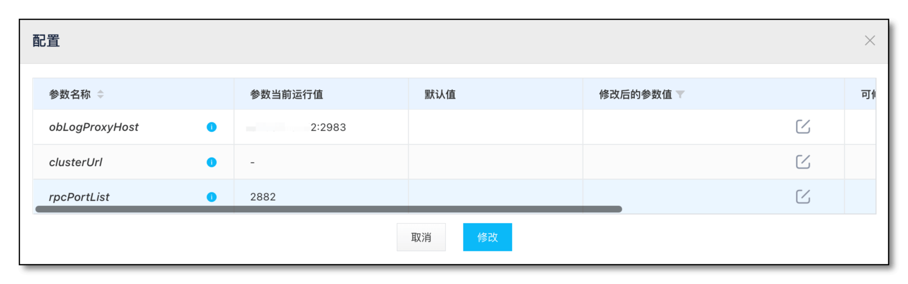

- 完成以上配置后，新创建的任务即可正常进行全量迁移和增量实时同步。

### [可选]老版本 CloudCanal 订正任务配置
#### 方法一：创建相似任务（推荐）
- 任务管理点击任务进入任务详情页，选择 **功能列表->创建相似任务**
- 创建相似任务，**不勾选自动启动，不勾选全量初始化**，然后点击下一步直到完成相似任务的创建
  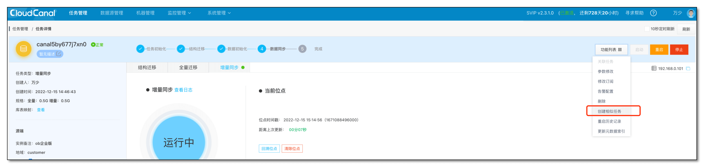
  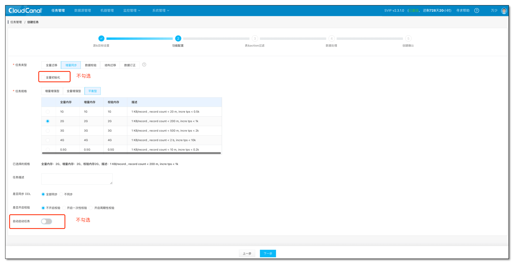

- 停止老的增量任务，并且记录其位点时间戳T1
  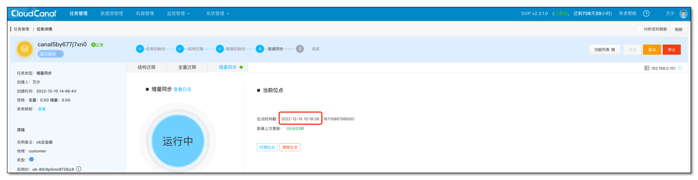

- 对通过相似任务创建出来的任务在任务详情页选择 **回溯位点，**设置一个**比之前记录的时间戳T1更早的一个时间**，启动任务，即可将老的OceanBase源端历史任务升级成支持新版代码的任务
  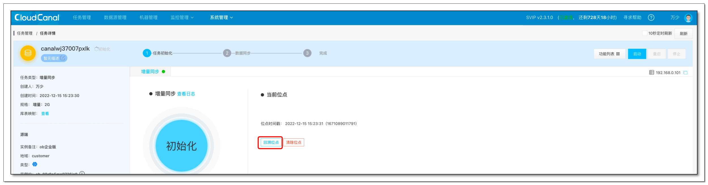

#### 方法二：修改任务配置
- 任务管理点击任务进入任务详情页，选择 **功能列表->参数修改->源端数据配置**
  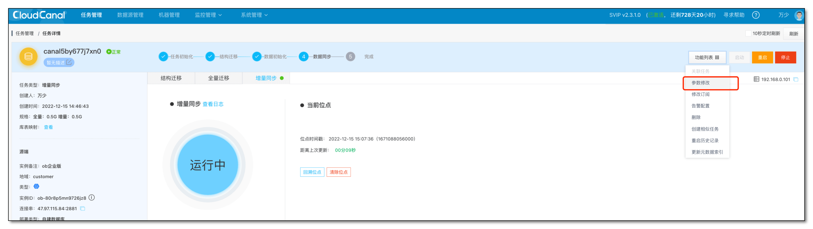

- 新版CloudCanal针对OceanBase源端新增了以下参数，补全新增参数的值

  | 新增参数 | 填写值 |
  | --- | --- |
  | workingMode | storage |
  | timezone | 非跨时区情况设置+8:00 |
  | clusterUrl | 如果有configServer或者OCP则填写对应地址，格式为ip:port |
  | obLogProxyHost | 填写oblogproxy server的地址，格式为ip:port，默认端口为2983 |
  | rpcPortList | OceanBase的RPC PORT，默认为2882，如果使用多个root server，则格式为2882;2882;2882 |


## FAQ
### 问：报错message: "Failed to parse configuration"
答：出现该报错应该是添加数据源时没有正确配置host、rpcPortList、logproxy host等地址引起。请检查相关配置是否正确配置。

### 问：报错message: "Failed to auth"
答：如果oblogproxy server开启了鉴权，CloudCanal需确保配置的租户有相关库表的权限。默认情况下CloudCanal使用的租户名为SYS，这可能与用户实际订阅的库表所属的租户不同。请在 **任务详情->功能列表->修改参数** 搜索obTenant参数设置正确的值。


