## 简述
本篇文章主要介绍如何使用 [CloudCanal](https://www.clougence.com?src=cc-doc-blog-sqlserver-starrocks-sync) 构建一条 **SQLServer** 到 **StarRocks** 的数据同步链路。

## 技术点
### 源端SQLServer基于CDC代理
当数据库启用 CDC 能力后，SQL Server 代理上会生成一个专门分析ldf文件的作业，再将具体的表启用 CDC, 则该作业开始持续分析文件中的变更事件到指定的表中。

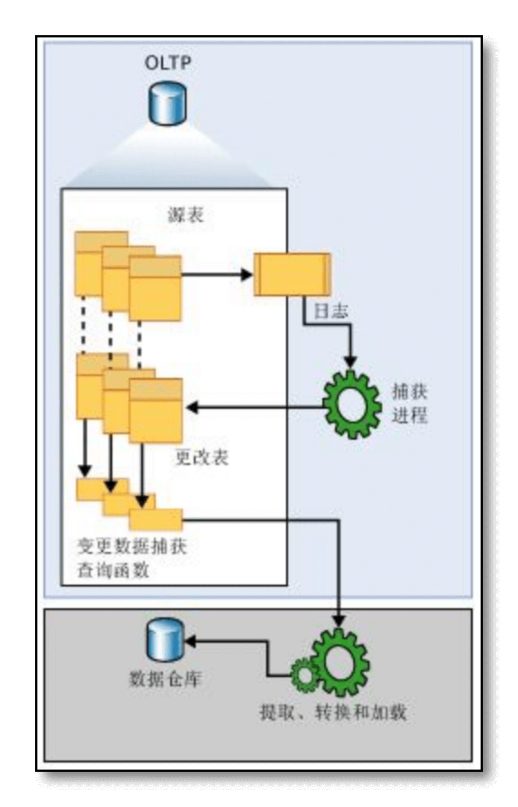

### 写入StarRocks采用StreamLoad导入方式
CloudCanal 采用了 StarRocks StreamLoad 方式进行导入，源端数据和变更转成字节流，以通过 HTTP 协议批量写入 StarRocks。

基于 StreamLoad 方式，写入对端的操作均为 INSERT，CloudCanal 自动将 INSERT / UPDATE / DELETE 转成 INSERT 语句，并填入 __op 值(删除标识符)，StarRocks 将自动进行数据合并。


## 准备工作
### SQL Server源端准备工作

- 源库需要启用 CDC 执行命令
    - 建议使用 sa 账号，启用 CDC 需要 sysadmin 权限
    - 切换数据库，可以采用以下命令(假设你的数据库名称为example)
  ```
  use example;
  ```

- 执行启用 CDC 功能 可以执行如下命令
  ```
  exec sys.sp_cdc_enable_db
  ```

- 准备一个 CloudCanal 同步账号，并为这个账号授权(**db_owner** 和 **public** 权限)
  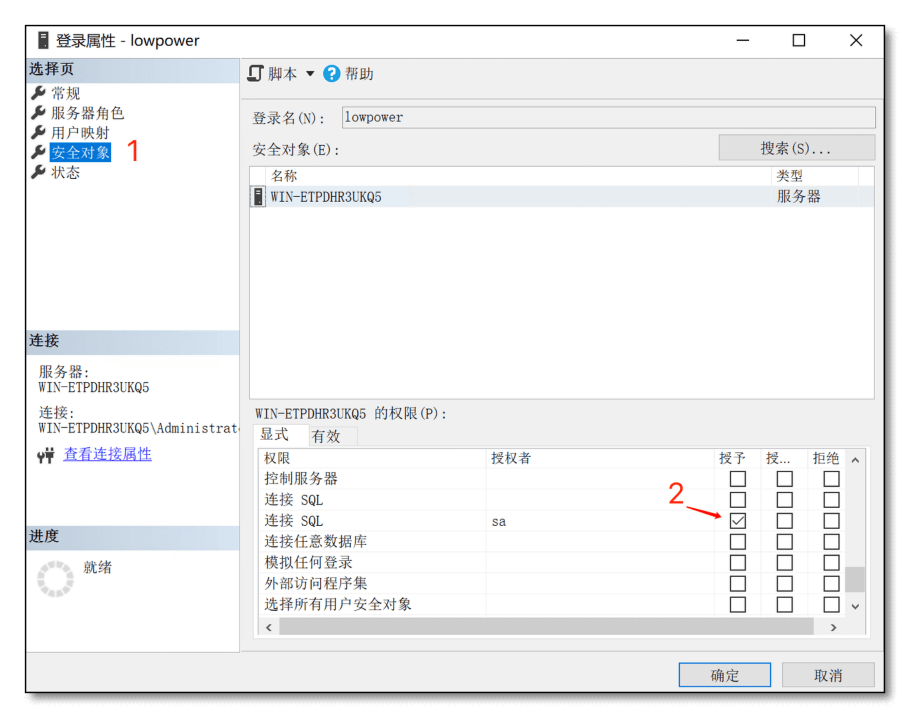
  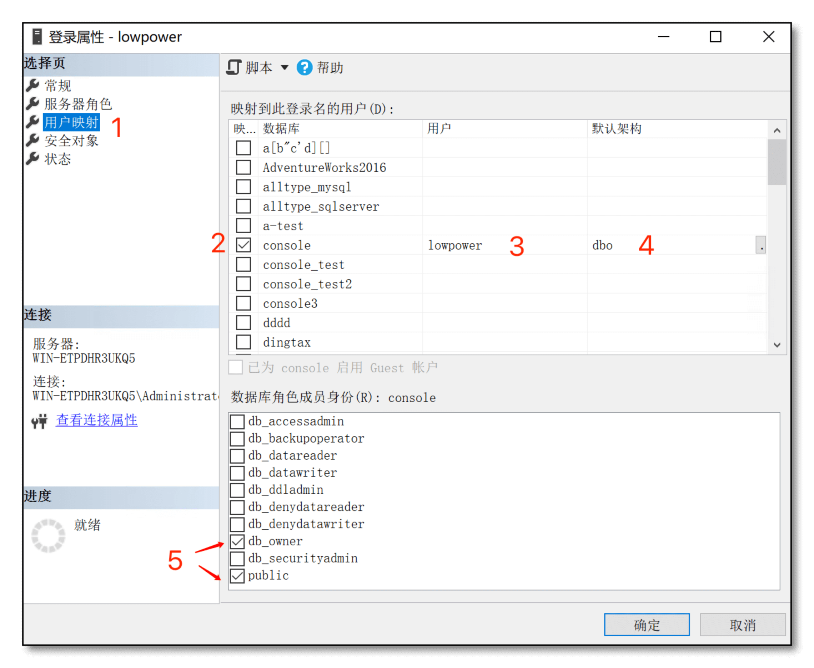

- 确认 SQL SERVER 代理是启用状态
  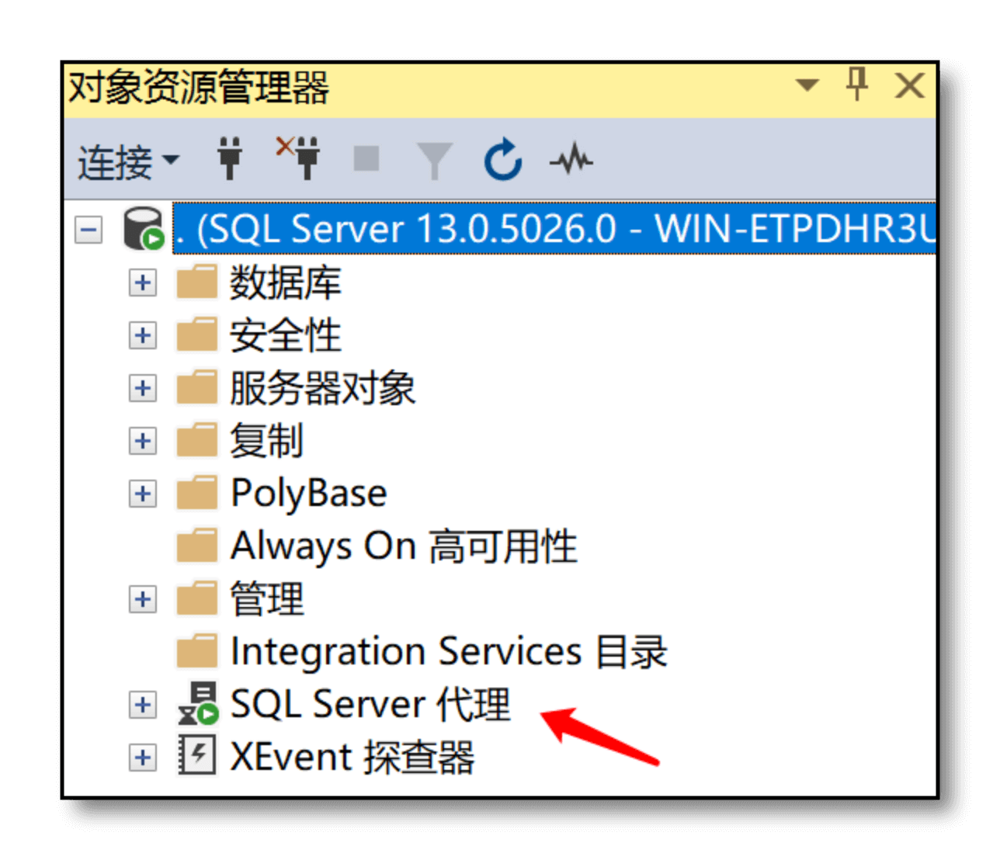

- 源端 SQL Server 实例中待同步的表需具备主键（CloudCanal 在创建同步任务的时候会帮你自动选择有主键的表）

### StarRocks 对端准备工作

- StarRocks 最高支持版本为：2.4.0
- Cloudcanal 添加StarRocks 数据源
  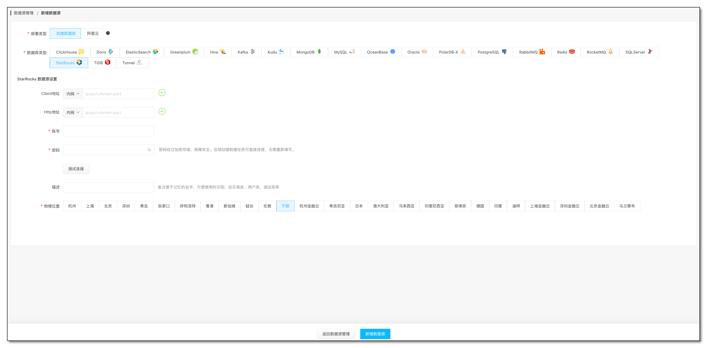
  - **Client 地址**
    - MySQL 协议端口，用于查询元数据，对应 StarRocks QueryPort，默认为 IP:9030
  - **Http 地址**
    - Stream Load 导入数据用途，对应 StarRocks HttpPort，默认为 IP:8030

## 注意事项

- SQL SERVER 作为源端结构迁移仅中支持 Schema、Table 迁移。

## SQL Server -> StarRocks 的数据类型支持
CloudCanal 结构迁移和数据迁移同步时会自动进行数据类型映射。详情见下表：

| SQL Server | StarRocks |
| --- | --- |
| BIGINT | BIGINT |
| BINARY | Not Supported |
| BIT | TINYINT |
| CHAR | CHAR |
| DATE | DATE |
| DATETIME | DATETIME |
| DATETIME2 | DATETIME |
| DATETIMEOFFSET | DATETIME |
| DECIMAL | DECIMAL |
| FLOAT | FLOAT |
| GEOGRAPHY | STRING |
| GEOMETRY | STRING |
| HIERARCHYID | Not Supported |
| IMAGE | Not Supported |
| INT | INT |
| MONEY | FLOAT |
| NCHAR | CHAR |
| NTEXT | STRING |
| NUMERIC | DECIMAL |
| NVARCHAR | VARCHAR |
| REAL | DOUBLE |
| ROWVERSION | LARGEINT |
| SMALLDATETIME | DATETIME |
| SMALLINT | SMALLINT |
| SMALLMONEY | FLOAT |
| SQL_VARIANT | Not Supported |
| TEXT | STRING |
| TIME | STRING |
| TIMESTAMP | LARGEINT |
| TINYINT | SMALLINT |
| UNIQUEIDENTIFIER | VARCHAR |
| VARBINARY | Not Supported |
| VARCHAR | VARCHAR |
| XML | STRING |
| sysname | VARCHAR |

## 操作示例
### 前置条件

- [登录ClouGence官网](https://www.clougence.com/) 下载私有部署版，使用参见[快速上手文档](https://www.clougence.com/docs/productop/docker/install_linux_macos)
- 准备一个 SQL Server 数据库，和 StarRocks 实例（本例分别使用自建 SQL Server 2016 和 StarRocks 2.4.0）
- 登录 CloudCanal 平台 ，添加 SQL Server 和 StarRocks
  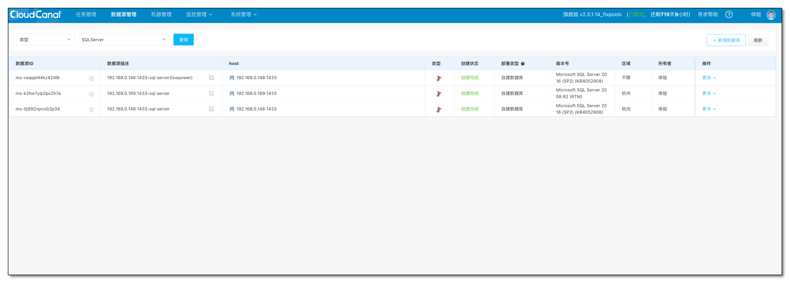

- 创建一条 SQL Server -> StarRocks 链路作为增量数据来源

### 任务创建

- **任务管理** -> **任务创建**
- **测试链接**并选择 **源** 和 **目标** 数据库
- 点击下一步
  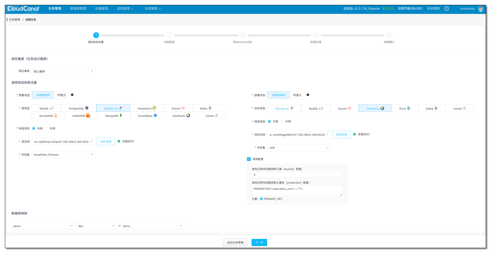

- 选择 **增量同步**，其它默认
  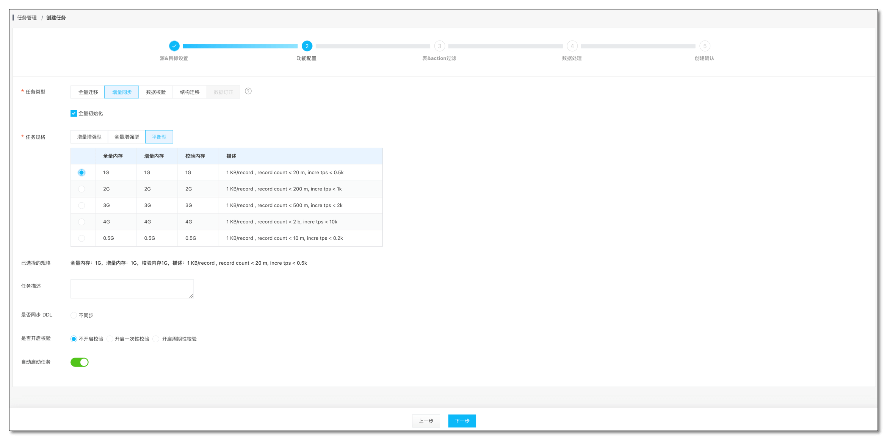

- 此时如果 SQL Server 上数据库还没有启用 CDC 功能，则会在点击下一步的时候提示如何启用 CDC。只要按照提示的参考语句执行即可。
  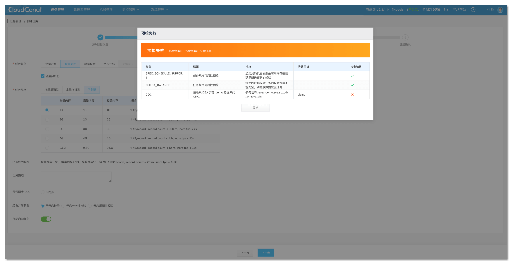

- 选择需要迁移同步的**表**和**列**
  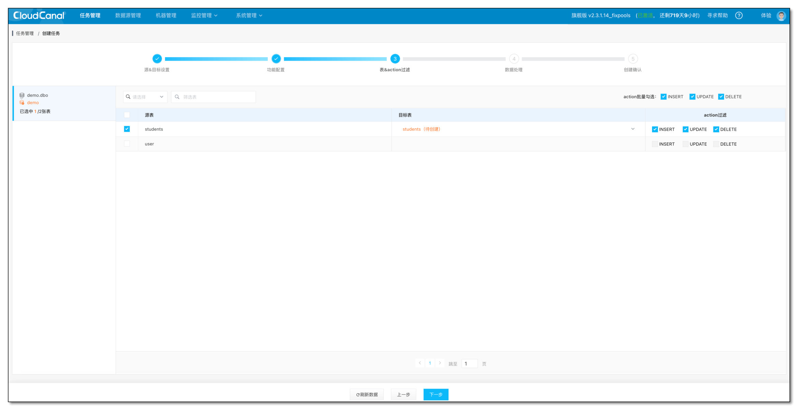
  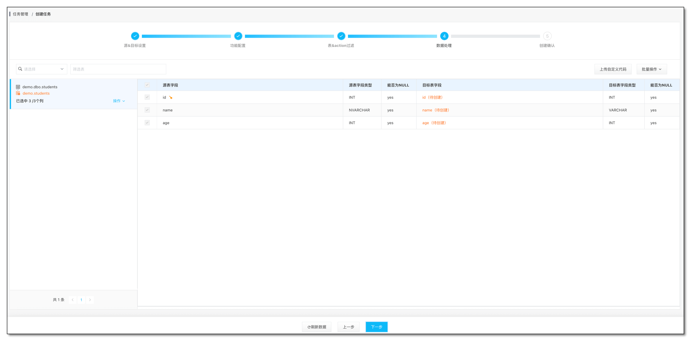

- 确认创建任务
  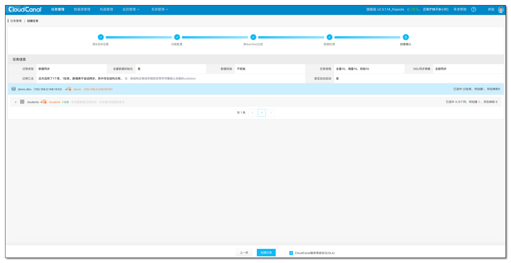

- 任务自动做**结构迁移**、**全量迁移**、**增量同步**
  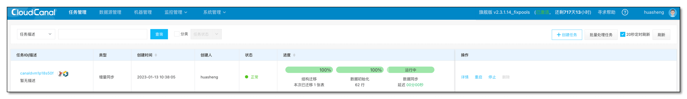

## 常见问题

### 数据不同步了都有那些情况？

- SQL Server CDC 需要依赖 SQL Server 代理，首先要确定 SQL Server 代理服务是否启动
- 表在启动 CDC 的时候会确定要捕获的列清单，此时如果修改列的类型可能会导致 CDC 中断。目前解决办法只能重建任务。
- 增/减 同一个列名的列，对一个列删除后在增加。虽然 CDC 表中字段依然存在但是也会导致整个 CDC 中断。

### 什么情况下会影响稳定的数据同步？

- 如果任务在同步期间出现了异常导致任务延迟。这时候需要格外注意，如果过长时间的延迟，即便是修复了延迟的问题（比如对端数据库长时间出现不可用）在后续数据同步上也可能存在丢失数据的风险。
- SQL Server 为了防止 CDC 表数据无限膨胀 SQL Server 会每天定时执行清理作业，清理超过 3天的数据。
- 为了增加延迟的容忍度可以执行这条 SQL 来增加 CDC 数据的保存时间，代价是这些数据需要存放到数据库表中，如果每日数据变更很多对磁盘开销会有额外的要求。
    - execute sys.sp_cdc_change_job @job_type = n'cleanup', @retention = 4320
    - msdb.dbo.cdc_jobs 表中保存了具体 捕获任务的数据保存时间。

## 总结
本文简单介绍了如何使用 [CloudCanal](https://www.clougence.com?src=cc-doc-blog-sqlserver-starrocks-sync) 进行 SQL Server -> StarRocks 数据迁移同步。


