## 简述
[SAP HANA](http://help.sap.com/hana) 是由 SAP 开发的一款内存列式数据库, 具有预测分析、空间数据处理、文本分析、文本搜索、流分析、图形数据处理等高级分析功能。

HANA 内存列式数据库特性，即启动后可以把所有数据载入内存，相比传统基于硬盘的数据库，性能提升10~10,000倍。

HANA 一般内置在 SAP ERP 系统中提供服务，在制造业应用广泛。 

现如今企业尝试建立统一数据分析平台，SAP HANA 保存了ERP相关数据，如何实时同步 HANA 数据到数据平台成为困扰企业的一个难题。

[CloudCanal](https://www.clougence.com?src=cc-doc-blog-hana-starrocks-sync) 最新版本已支持 HANA 作为源端迁移同步数据到 StarRocks 来构建实时数仓, 本文简要介绍使用 CloudCanal 快速构建一个 **HANA 到 StarRocks 数据迁移同步任务**。

## 技术要点
### 数据同步整体流程
CloudCanal 实现 HANA 增量数据同步主要使用其触发器捕获变更事件，整体流程如下：
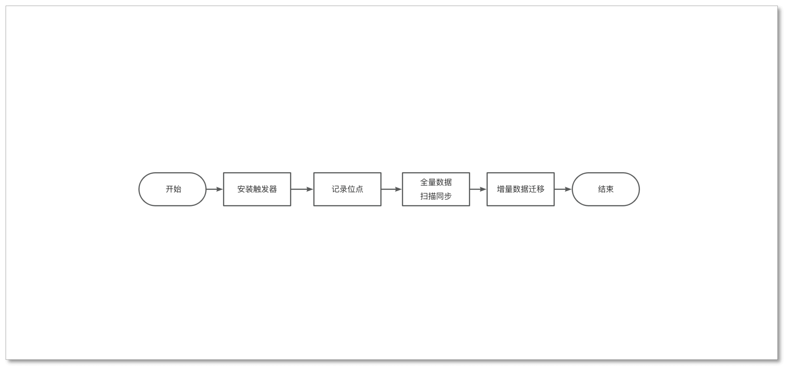
- 安装触发器，通过触发器捕获增量变更数据 
- 记录位点，记录增量数据数据同步的起点
- 执行全量数据迁移
- 执行增量数据同步

#### 数据捕获触发器

触发器是一种自动触发执行的存储过程，它可以在数据变更前执行也可以在数据变更后执行，因为本质也是存储过程，所以存储过程支持的操作触发器均支持。

不同数据库对触发器的支持程度不同，HANA 的触发器支持监听 I(新增)/U(更新)/D(删除) 三种事件，因此数据的所有变更都可以通过触发器捕获。

安装触发器的方式与创建存储过程类似，即通过执行 SQL 创建触发器。

通过触发器实现增量数据同步，需要触发器捕获数据的I/U/D变更事件并写入**增量 CDC 数据表**，数据的变更事件最终都会写到**增量 CDC 数据表**,执行流程如下：
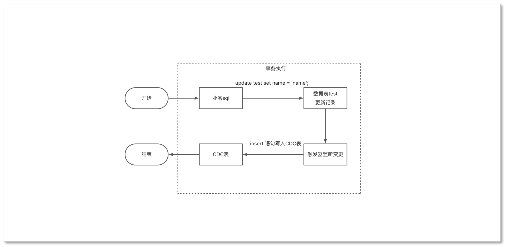

### 其他 HANA 同步方案
目前支持同步 HANA 数据的产品还有 Informatica、Qlik 等，实现方案也是通过触发器。

因为 HANA 的触发器不能监听 DDL 变更，因此 CloudCanal 与 Informatica、Qlik 一样，都不支持DDL同步。

## 操作示例
### 准备动作
- 下载安装 [CloudCanal 私有部署版本](https://www.clougence.com?src=cc-doc-blog-hana-starrocks-syn)，使用参见[快速上手文档](https://www.clougence.com/docs/productop/docker/install_linux_macos)
- 准备好源端和目标端数据库及对应数据
- 参考 [HANA 权限准备](https://www.clougence.com/docs/dataMigrationAndSync/datasource_func/Hana/privs_for_hana) 做账号授权

### 添加数据源

- 登录 CloudCanal ,**数据源管理**->**添加数据源**
  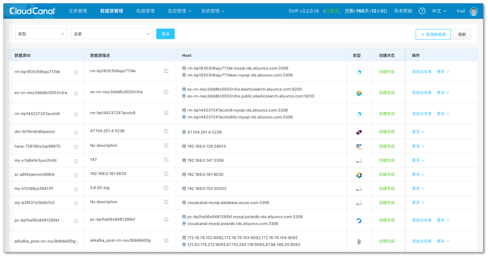

- 创建源端数据源, 选择**自建数据源**，选择 HANA 并填写相关信息
  > **默认数据库**: 即需要同步的数据所在数据库，常见默认数据库：SYSTEMDB、HXE、DB0
  
  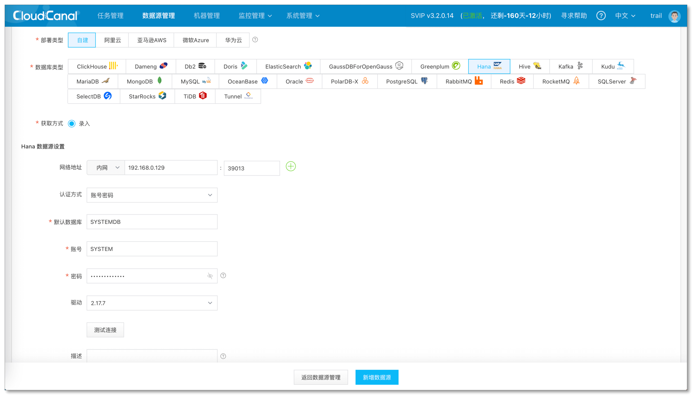

- 创建目标端数据源，选择**自建数据源**，选择StarRocks，并填写相关信息
  > **Client地址**: CloudCanal 用其查询库表表的元数据信息，对应 StarRocks QueryPort，默认端口为 9030

  > 额外参数 **Http地址**: StarRocks 接收 streamload 的 http 请求，此处可填写 BE 节点地址，默认端口为 8040 , 如需负载均衡也可直接填写 FE节点 地址和端口，FE节点默认端口 8030

  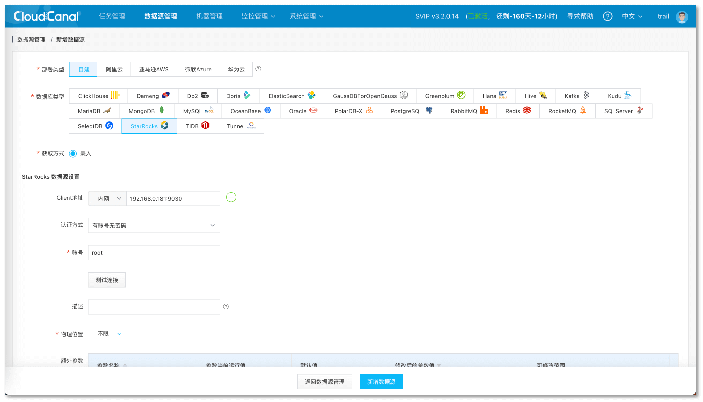

- 数据源创建成功
  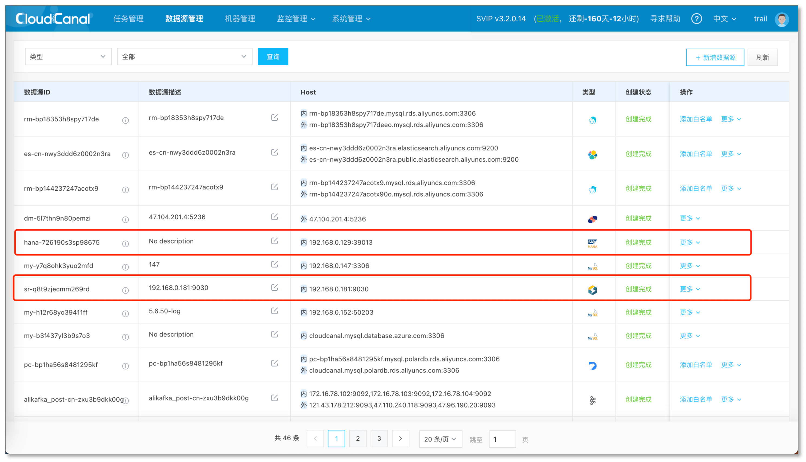

### 任务创建

- **任务管理** > **创建任务**
  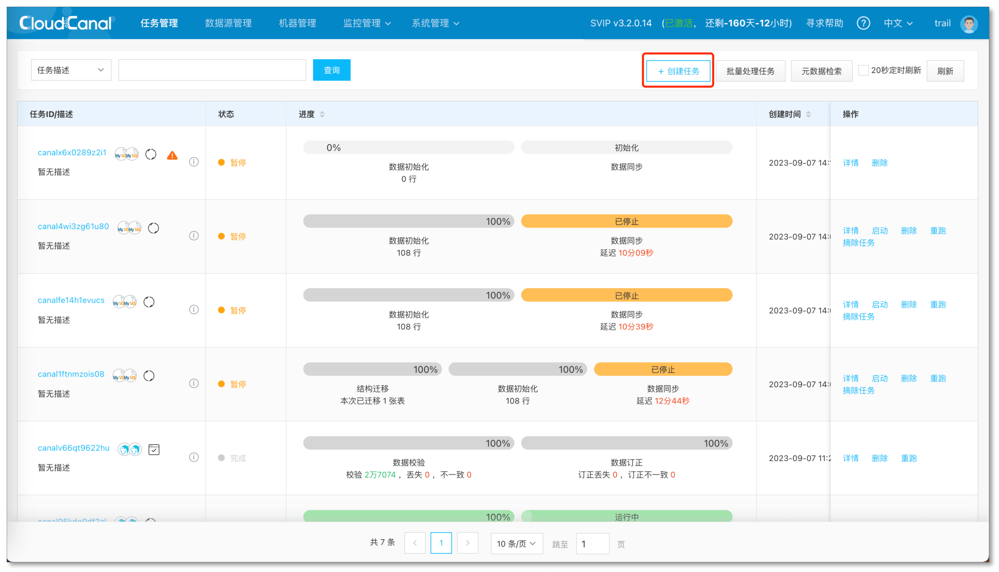

- 源端选择 **HANA** 数据源，目标端选择 **StarRocks** 数据源，分别点击**测试连接**按钮并设置数据库映射关系
- 点击下一步
  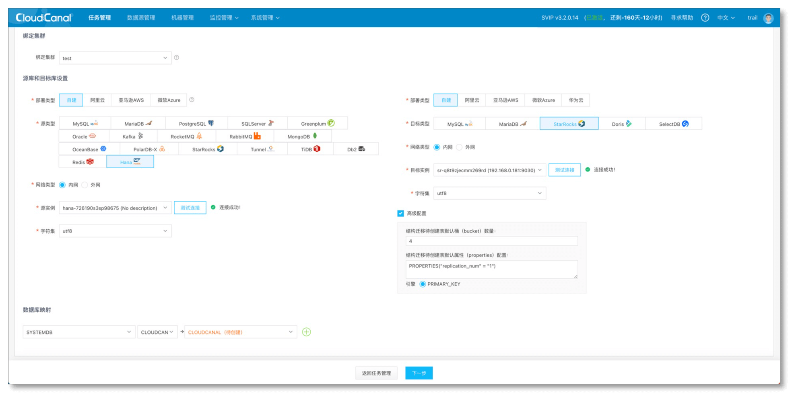

- 选择 **增量同步**，并且勾选 **全量初始化**
- 点击下一步
  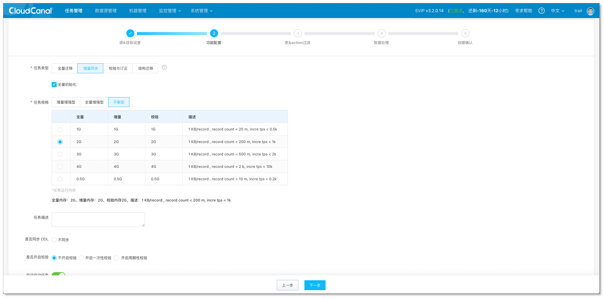

- 选择订阅的表
- 点击下一步
  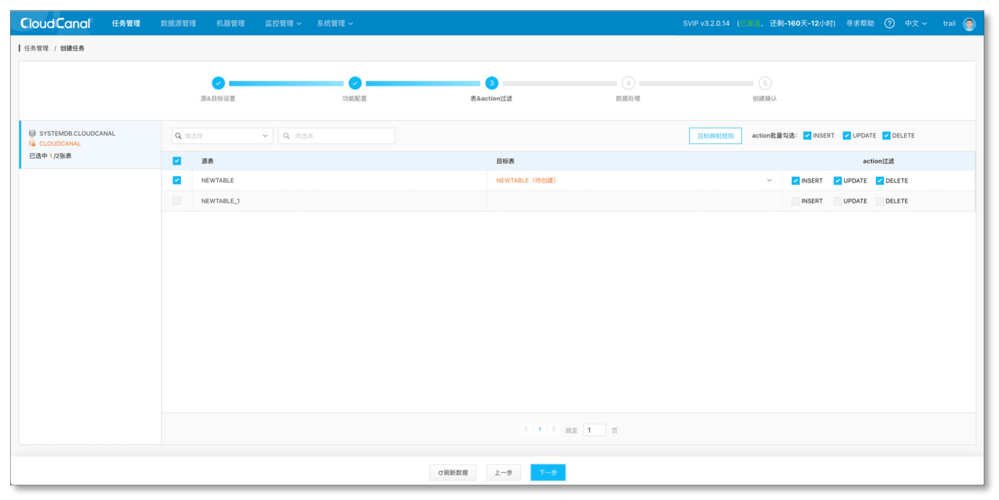

- 配置列映射
- 点击下一步
  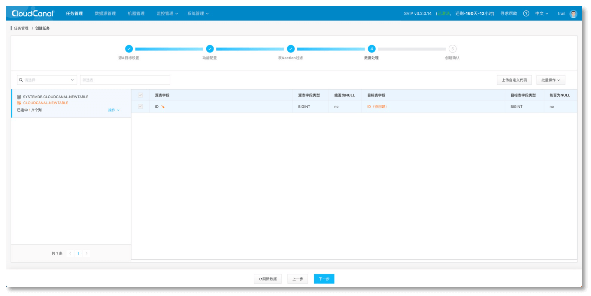

- 点击创建任务
  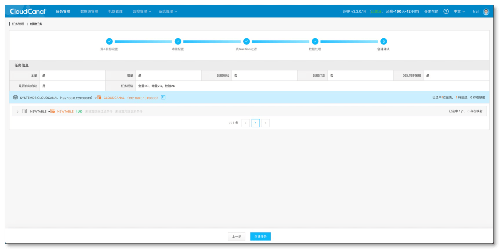

- 任务创建成功并启动后，会自动执行结构迁移、全量迁移、增量同步
  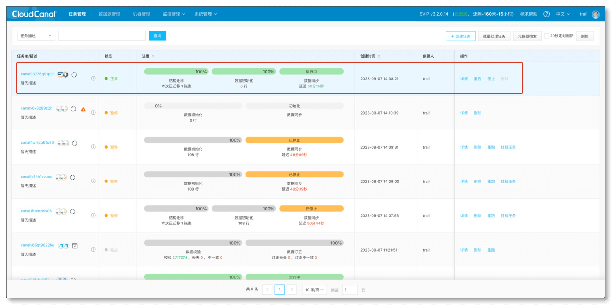

## 总结
本文简单介绍了如何使用 [CloudCanal](https://www.clougence.com?src=cc-doc-blog-hana-starrocks-syn) 进行 HANA 到 StarRocks 数据迁移同步。

StarRocks 作为新兴的**实时数仓**产品，为传统数据业务带去更加**实时、一致**的体验，让数据得到更加广泛的使用，CloudCanal希望助一臂之力，让数据流动更加平滑顺畅。

