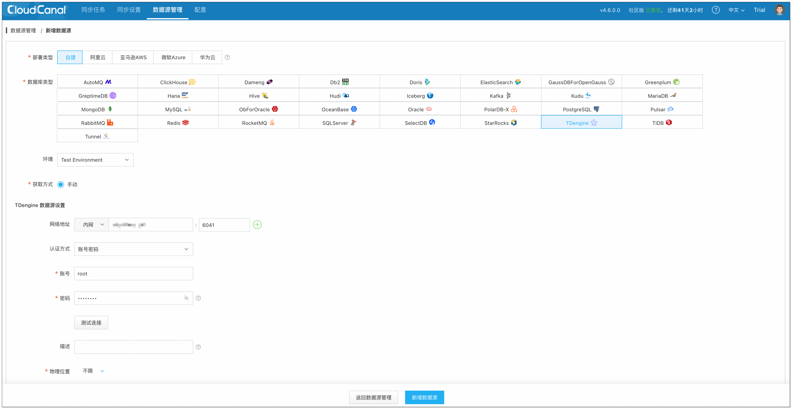
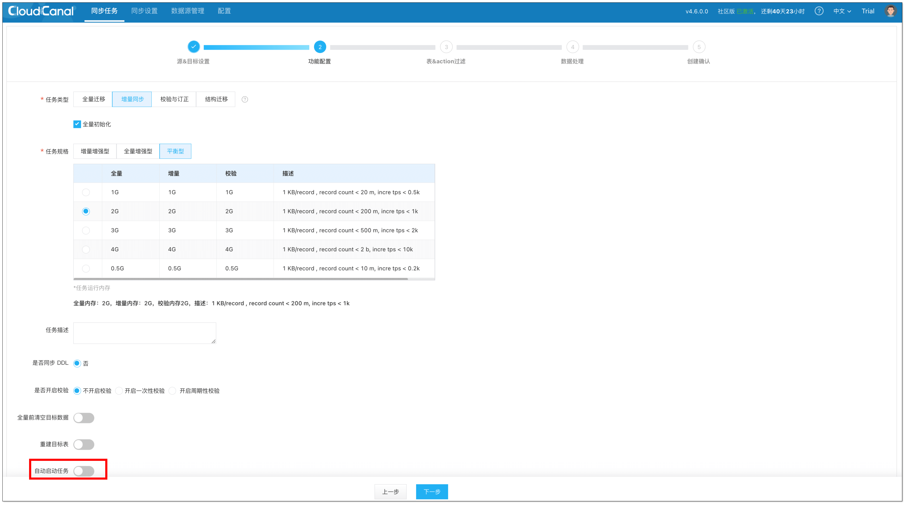
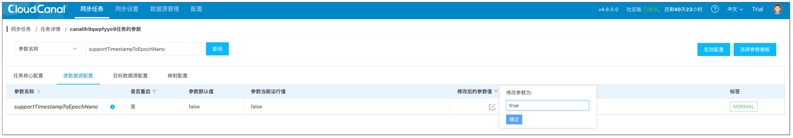
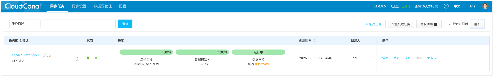

## 简述

TDengine 是一款开源、高性能、云原生的时序数据库，专为物联网、车联网、工业互联网、金融、IT 运维等场景优化设计。在工业自动化的时代，时序数据库在电力、轨道交通、智能制造等领域有着广泛的应用。

MySQL 是全球广泛使用的开源关系型数据库，能够高效处理大量数据和复杂查询需求，并且具有较强的稳定性和可靠性。

本文主要介绍如何通过 [CloudCanal](https://www.clougence.com?src=cc-doc-blog-redis-redis-sync) 实现 TDengine 到 MySQL 数据迁移同步。

## 应用场景
- **数据备份与归档**：将 TDengine 的数据迁移到 MySQL 作为备份或归档，确保数据长期保存和恢复，提升数据的安全性和高可用性。
- **复杂查询**：MySQL 支持复杂 SQL 查询和事务处理，适合需要对时序数据进行深度分析或关联查询的场景。
- **数据集成与共享**：企业通常会同时使用多种数据库，将 TDengine 的数据同步到 MySQL，便于将时序数据与其他业务数据进行关联分析。
- **数据分析**：将 TDengine 的数据同步到 MySQL 后，可再通过 CloudCanal 将数据同步到其他分析型数据库或数仓，支持更复杂的数据分析和操作，满足更多业务需求。

## 技术点

### 增量数据同步整体流程
CloudCanal 基于 Query Topic 实现 TDengine 到 MySQL 的数据同步，同步流程如下：
1. 创建 Topic，通过 Topic 订阅 TDengine 数据库的变更事件（无法捕获 DELETE 事件）。
2. 执行增量数据同步。
3. 捕获变更事件，记录表级 offset 位点。

### 表级别多位点
CloudCanal 支持 TDengine 源端表级别多位点，即可以在表级别进行多位点的配置，确保每个表能够消费各自对应的增量同步位点。位点的具体体现为：
```json
[
  {
    "db": "us_power",
    "table": "s1",
    "topic": "canalt7g262cm6jy_increment_us_power_s1",
    "offset": 1010,
    "vgroup": 3,
    "timestamp": 1715828416114 
  },
  {
    "db": "us_power",
    "table": "s2",
    "topic": "canalt7g262cm6jy_increment_us_power_s2",
    "offset": 2093,
    "vgroup": 3,
    "timestamp": 1715828311123
  },
  ...
]
```

### 纳秒级时间戳同步
TDengine 最高支持纳秒级 Timestamp 类型，而 MySQL 最高支持微秒级 Timestamp 类型。CloudCanal 支持纳秒级时间戳同步，将 TDengine 纳秒级时间戳转换为 MySQL BIGINT 类型数据。

## 操作示例

### 步骤 1: 安装 CloudCanal

请参考 [全新安装(Docker Linux/MacOS)](https://www.clougence.com/cc-doc/productOP/docker/install_linux_macos)，下载安装 [CloudCanal 私有部署版本](https://www.clougence.com?src=cc-doc-blog-redis-redis-sync)。

### 步骤 2: 添加数据源

登录 **CloudCanal 控制台**，点击 **数据源管理** > **新增数据源**。


### 步骤 3: 创建任务

1. 点击 **同步任务** > [**创建任务**](https://www.clougence.com/cc-doc/operation/job_manage/create_job/create_full_incre_task)。
2. 配置源和目标数据源。
3. 选择 **数据同步** 并勾选 **全量初始化**。
   :::info
   先取消勾选 **自动启动任务**，后续仍需要修改个别参数。
   :::
   
4. 选择需要同步的表。
5. 选择表对应的列。

   :::info
   如果是超级表增量同步，可以点击 **操作 > 子表订阅过滤条件**，设置子表订阅过滤条件，具体可参考 [TDengine Query Topic](https://docs.tdengine.com/advanced-features/data-subscription/#query-topic)，默认订阅所有子表。
   
   如果需要进行纳秒级时间戳同步，需在对端手动创建表，源端 Timestamp 列要映射到对端 BIGINT 类型列。
   :::
6. 点击 **确认创建**。

   :::info
   任务创建过程将会进行一系列操作，点击 **同步设置** > [**异步任务**](https://www.clougence.com/cc-doc/operation/job_setting/console_job_manage)，找到任务的创建记录并点击 **详情** 即可查看。

   TDengine 源端的任务创建会有以下几个步骤：
    - 分配任务执行机器
    - 创建任务状态机
    - 完成任务创建
   :::
7. 进入任务详情页，点击右上角 **功能列表** > [**修改任务参数**](https://www.clougence.com/cc-doc/operation/job_manage/job_op/job_params)，修改以下任务参数：   
   - 源端参数 **srcTimezone**：源端时区，默认 UTC，需要与源端时区保持一致。
   - 源端参数 **supportTimestampToEpochNano**：是否开启 Timestamp-Number 数值转换，默认 false。
   - 对端参数 **dstTimezone**：对端时区，需要与对端时区保持一致。
  
  
8. 启动任务，CloudCanal 会自动进行任务流转，其中的步骤包括：
    - **全量数据迁移**: 已存在的存量数据将会完整迁移到对端。
    - **增量数据同步**: 增量数据将会持续地同步到对端数据库，并且保持实时（秒级别延迟）。
  
  

## 总结
TDengine 适用于高吞吐的时序数据存储与查询，而 MySQL 适用于事务处理和复杂查询。使用 [CloudCanal](https://www.clougence.com?src=cc-doc-blog-redis-redis-sync) 进行 TDengine 到 MySQL 数据迁移同步，能够兼顾时序数据的高效存储与业务数据的灵活分析，从而实现时序数据价值的最大化。


