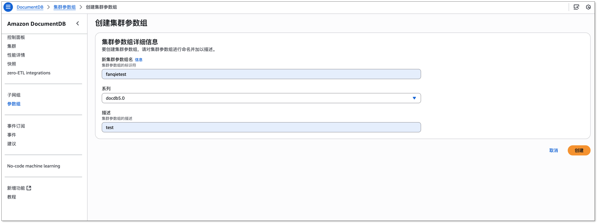
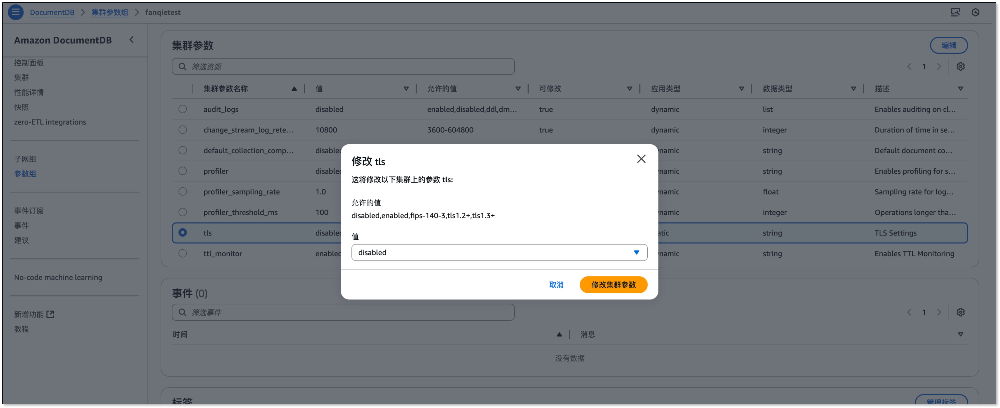
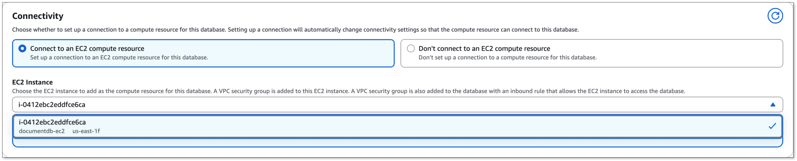
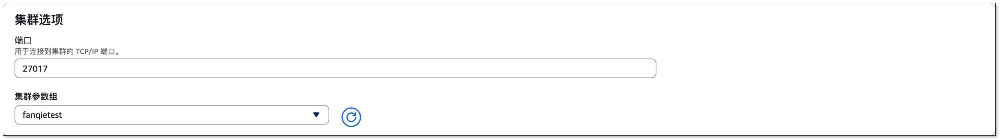
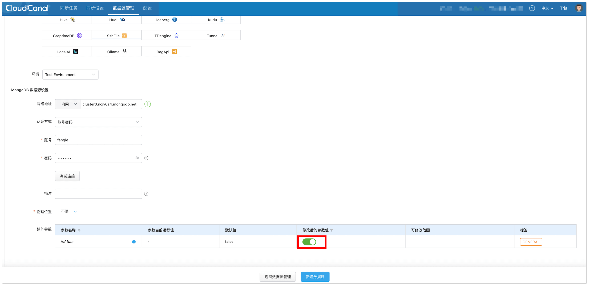
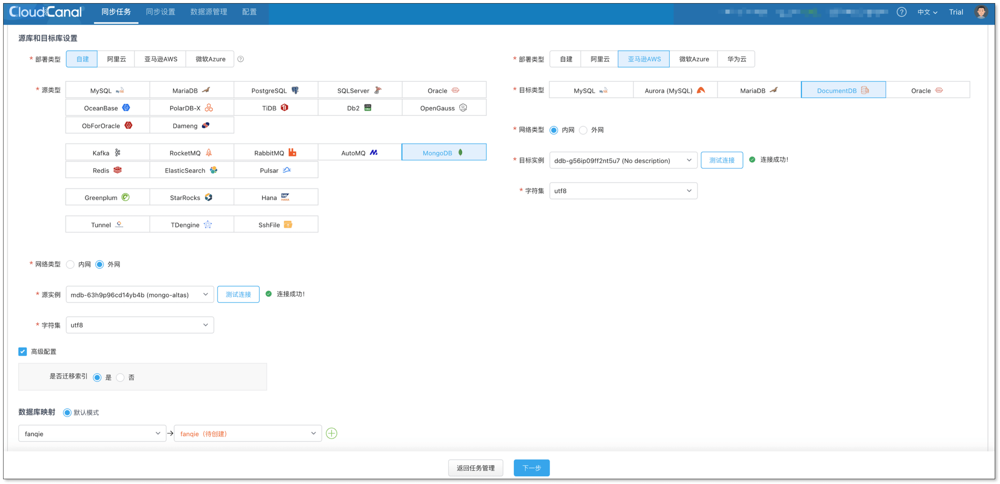
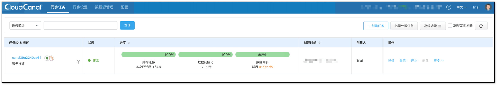

## 简述

MongoDB Atlas 是一个全托管的云数据库即服务 (DBaaS)，由 MongoDB 官方提供，支持在主流云平台（AWS、Azure、GCP）上快速部署、扩展和管理 MongoDB 集群，为用户提供高可用、安全合规的数据库托管服务。

本文主要介绍 [CloudCanal](https://www.clougence.com?src=cc-doc-mongo-atlas-mongo-sync) 如何快速构建一条 MongoDB Atlas 到 DocumentDB 数据迁移同步链路。链路特点包括：
- 基于 ChangeStream 增量订阅方式
- 支持索引迁移

## 技术点

### 基于 ChangeStream 增量订阅方式

CloudCanal 利用 MongoDB **Change Stream** 的能力来实时订阅数据库的数据变更，当数据库中的数据发生 DML 等操作时，MongoDB Change
Stream 会立即将这些 DML 事件，以流的形式实时推送给 CloudCanal。

CloudCanal 在消费 ChangeStream 事件时，会持久化保存其同步位点。当任务因异常或重启而中断后，CloudCanal 会将位点发送给
MongoDB，从而实现从上一次中断的位置 **无缝续传**，保证数据变更事件的“不重不漏”。

### 支持索引迁移

CloudCanal 提供对 MongoDB 索引的迁移支持，确保目标端数据库 **继承与源端一致的查询性能优化**，保障业务的无缝过渡。

:::info
由于 DocumentDB 不支持哈希（Hashed）索引，CloudCanal 会在迁移时自动识别并忽略此类索引，从而保障其余所有兼容索引能够成功迁移，确保任务的平滑进行。
:::

## 操作示例

### 步骤 1: 安装 CloudCanal

请参考 [全新安装(Docker Linux/MacOS)](https://www.clougence.com/cc-doc/productOP/docker/install_linux_macos)，下载安装 [CloudCanal 私有部署版本](https://www.clougence.com?src=cc-doc-mongo-atlas-mongo-sync)。

### 步骤 2: 准备数据源
1. 登录 **AWS** 管理控制台并启动一台 EC2 实例，启动时开启公网以便 CloudCanal 连接。
2. 切换至 Amazon DocumentDB 管理控制台，在左侧面板点击 **参数组**，创建参数组：
   1. 填写 **新集群参数组名** 和 **描述** 后，点击 **创建**。
   
   
      
   2. 进入刚创建的参数组，选择 `tls` 参数，点击 **编辑**，设置为 **disabled**，保存生效。

   
   
3. 在左侧面板点击 **集群**，创建集群：
   1. 在 **连接** 部分中，选择 **连接到 EC2 计算资源**，并选择第一步创建的 EC2。

   
   
   2. 在 **高级设置** > **集群选项** 中，切换集群参数组为第二步创建的参数组。

   

   3. 其他所有选项保持默认，并点击 **创建**。
   

### 步骤 2: 添加数据源

登录 **CloudCanal 平台**，点击 **数据源管理** > **添加数据源**，分别添加 2 个数据源。

1. 添加 MongoDB Atlas 集群实例时，需设置额外参数 `isAtlas` 为 true。


2. 添加 DocumentDB 数据源时，需要在 Sidecar 容器中创建 SSH 隧道，参考以下命令。

  ```sql
  ssh -i "ec2Access.pem" -L 27017:sample-cluster.node.us-east-1.docdb.amazonaws.com:27017 ubuntu@ec2-34-229-221-164.compute-1.amazonaws.com -N 

  -- 使用 SSH 隧道时，建议使用集群端点连接到集群
  ```
创建 SSH 隧道后，连接 localhost:27017 即可。

### 步骤 3: 创建任务

1. 点击 **同步任务** > [**创建任务**](https://www.clougence.com/cc-doc/operation/job_manage/create_job/create_full_incre_task)。
2. 配置源和目标数据源。
   1. 选择源和目标实例，并分别点击 **测试连接**。
   2. 在源端实例下方 **高级配置** 中选择 **是否迁移索引**：是 / 否。
   
  

3. 选择 **数据同步** 并勾选 **全量初始化**。

4. 点击 **确认创建**。

  :::info
  任务创建过程将会进行一系列操作，点击 **同步设置** > [**异步任务**](https://www.clougence.com/cc-doc/operation/job_setting/console_job_manage)，找到任务的创建记录并点击 **详情** 即可查看。

  MongoDB 源端的任务创建会有以下几个步骤：
   - 结构迁移
   - 分配任务执行机器
   - 创建任务状态机
   - 完成任务创建
  :::

5. 任务启动，自动进行流转。

  :::info
  当任务创建完成，CloudCanal 会自动进行任务流转，其中的步骤包括：
    - **结构迁移**: MongoDB 源端的集合/索引将会迁移到对端，如果同名集合/索引在对端已经存在，则会忽略。
    - **全量数据迁移**: 已存在的存量数据将会完整迁移到对端。
    - **增量数据同步**: 增量数据将会持续地同步到对端数据库，并且保持实时（秒级别延迟）。
  :::

  

## 总结

本文简要介绍了使用 [CloudCanal](https://www.clougence.com?src=cc-doc-mongo-atlas-mongo-sync) 实现 MongoDB Atlas 到 DocumentDB 数据迁移同步，加速数据的自由流动，满足多样的业务需求。