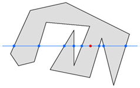
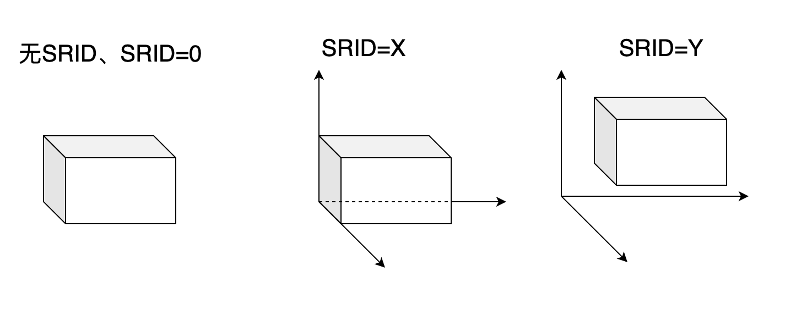
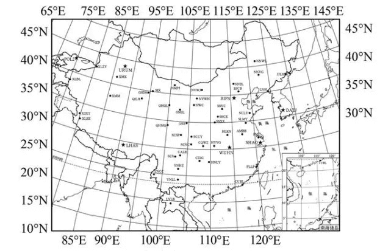
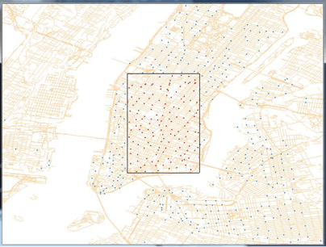
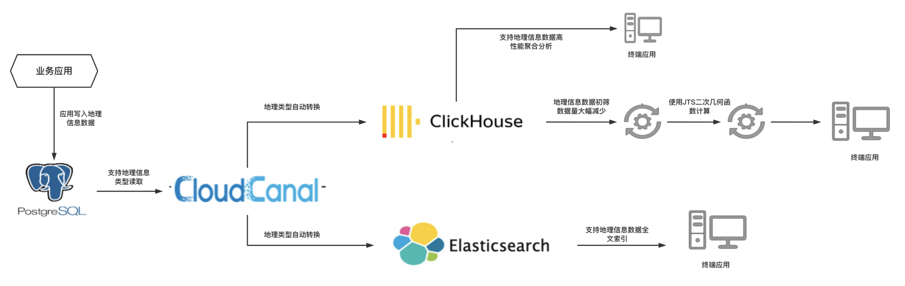

## 背景知识
### 什么是地理信息数据


地理信息数据的定义主要来自于我们熟知的星球——地球。我们知道地球表面是一个凸凹不平的表面，是一个近似的椭球体。以海平面为参照已知最高点和最低点之间有接近 2 万米的差距。

- 珠穆朗玛峰，8848.86米含冰层（人民日报：2020年12月8日）
- 马里亚纳海沟，相对海平面深10909米（人民日报：2020年11月30日）

即便是海平面也会在月球潮汐引力的作用下变化着，更不要提气候变化导致的海平面升高。因此要想找到一个确切的数学模型来表示地球还是挺困难的一件事。

于是人们以北极南极为两个定点，将地球按照这个轴线进行旋转。地球在这个旋转形态的下就会呈现一个椭球体的形态，这个就是理想的地球椭球体。这个椭球体就可以利用数学模型来进行表示。

正是基于这样一个共识，在 1975 年国际大地测量与地球物理联合会推荐下地球椭球体的模型数据被推荐为：半长径 6378140 米，半短径 6356755 米，扁率 1∶298.257，后续该数值有一些修正。

基于这些精准的测量数据，我们可以通过数学表示来定义地球上所有的点，从而利用现代化的定位技术我们可以精确定位地球上所有的位置。

### 定位技术


在地球上要想知道我们精确位置可以使用导航软件，导航软件的正常工作需要依赖全球定位系统。目前世界上共有四大导航系统，分别是

- 中国的 北斗

- 美国的 GPS

- 欧盟的 伽利略

- 俄罗斯的 格洛纳斯

这些定位系统最主要的部分是人造卫星，它们按照固定的规律围绕地球运转，其中有一些是运行在圆形的地球同步轨道上。

由于每个卫星和我们的距离不同，因此它们同一时刻发送的信标会以微小的时间间隔先后抵达我们的设备上。这样我们就有了带有延迟的信标信号，每一个延迟是可以被看作是一个距离。

我们事先知道每一个卫星的确切位置，再加上这些距离信息。当我们得到最少 3个信号之后就可以利用著名的三角定位法得到我们的准确位置，这也是所有卫星定位技术使用的核心原理。

### 空间数据



现有空间数据库标准主要有如下两套，两套标准之间大体是相互兼容的。

- **Simple Feature Access SQL，简称 SFA SQL**：SFA SQL是 开放地理空间信息联盟（Open Geospatial Consortium，简称 OGC）制定的标准。

- **SQL Multimedia Part3: Spatial，简称 SQL/MM**：SQL/MM 是 国际标准化组织（International Standard Organization，简称 ISO）制定的标准。

通过空间数据的描述我们可以定义一个具体的几何体。在这两种标准中公共的部分中都定义了下面 3 组共 6 个基础类型，这些是经常用到的类型。

- 点、多个点
- 线、多个线
- 多边形、多个多边形

为了方便存储和使用这些数据 OGC 组织通过 OpenGIS 规范定了两种具体格式

- Well-Known Text (WKT) format
- Well-Known Binary (WKB) format

WKB/WKT 都只是通过标记语言描述点、线、面 的几何体数据，当用于几何计算时一般不需要坐标系。但是当数据需要展示在地图上时则需要将其原始的空间数据投射到大地坐标系上（这个过程称为投影）才可以得到这个几何图形具体的地理坐标。

### 空间引用识别号(SRID)
要将几何图形投影到坐标系，必须需要使用SRID。SRID可以理解为唯一标识了将某个几何体空间数据映射成某个具体坐标系中的方式。

当SRID为0或者不使用SRID时，表示一个几何图形实例没有被放到任何一个坐标系中，我们无法定位其位置。例如通过长宽高的具体值我们可以知道一个正方体的形状，但是我们没法知道他的具体坐标。

不同SRID值代表了将几何体映射到坐标系中的不同方式。几何体本身的空间数据结合SRID就可以具体定位这个几何体在坐标系中的位置。

下图简单演示了有无SRID得差异。像欧洲石油测绘组 (EPSG) 定义的 SRID是根据地球地理信息构建的坐标系，几何图形根据几何体空间数据以及EPSG标准的SRID值可以转成真实的地理坐标。



目前有多种公认的标准 SRID，例如欧洲石油测绘组 (EPSG) 定义的 SRID。不同数据库对于不同SRID标准的适配性也不同。

某些数据库和空间类型（如 PostgreSQL 中的 PostGIS 几何和地理或 Microsoft SQL Server 中的地理类型）使用预定义的 EPSG 代码子集，只可使用具有这些 SRID 的空间参考。

如今编制 SIRD 的工作已经转交给了国际石油和天然气生产商协会(OGP) 的手中，要想了解更多的EPSG信息，可以访问 https://epsg.io/

### 常见SRID标准与地理坐标系

在中国常用的坐标系有下面四个

- WGS84：美国 GPS 系统上使用的坐标系。
- GCJ02：由中国国家测绘局制定的地理坐标系统。
- BD09：百度地图所使用的坐标系，它是建立在 GCJ02 坐标系之上。
- CGCS2000：中国北斗系统所使用的坐标系。

### 大地坐标系与地图绘制

#### 地图绘制的基本步骤



绘制地图构建大地坐标系主要会采用以下步骤：

1. 首先会选择一个基准点，所有的地形数据都是基于这个基准点的进行绘制。而这个点也正是位于地球椭球体上的一个点。

2. 地球椭球体可以充当画布，测绘员则可以在画布上勾勒出具体的街道和地形信息。从而形成最终的地图数据供我们使用。

3. 基于定位的点和地图的基准点的之间的偏差就可以完成整个定位到地图的转换这个过程就是坐标系转换。当然实际的过程要更为复杂一些，甚至会有多次偏差修正。

### 存储地理信息
目前主流关系型数据库对地理信息基本都都有支持，其中最常用的类型便是 **_geometry_** 类型。在 Oracle 数据库中对应为 **_sdo_geometry_** 类型。

还有其它的几何类型，例如：**_Point_**、**_Polygon_**、**_MultiPoint_**、**_MultiPolygon_** 等等，介于篇幅的原因本文内容只针对 geometry类型。

有兴趣深入了解的朋友可以根据下方表格自行深入研究，本文不做过多展开。

| 数据库 | 几何类型 |
| --- | --- |
| MySQL | POINT、LINESTRING、POLYGON、MULTIPOINT、MULTILINESTRING、MULTIPOLYGON、
GEOMETRY、GEOMETRYCOLLECTION |
| PostgreSQL | POINT、LINE、LSEG、BOX、PATH、POLYGON、CIRCLE、GEOMETRY |
| Oracle | SDO_GEOMETRY、SDO_TOPO_GEOMETRY、SDO_GEORASTER |
| SqlServer | GEOMETRY、GEOGRAPHY |

不同的数据库由于存储和查询引擎的不同，针对地理信息的存储会有一些差异。这些差异主要是因为单纯的 WKB 并不能满足实际需求，最直接的问题就是 WKB 只考虑的几何图形的空间数据存储，但是并未涉及大地坐标系相关的信息。

比如在 MySQL 中地理信息数据将会在 WKB 数据前额外增加 4 个字节用于存放其对应的 SRID。而 PostgreSQL 用了更加高级的 EWKB 格式作为地理信息数据的存储格式。

因此如果想要以二进制方式直接从数据库中获取地理信息数据，了解正确的获取方式十分必要。

## 地理信息数据应用的问题


我们会从一个具体案例来和大家探讨地理信息数据应用中会遇到的实际问题。我们这个地理数据应用案例如下：

> 如何知道地球上一块土地在一段时间内的使用情况？

为了达成这个目的，我们将会不得不面临如下的一些挑战：

### 数据量大
首先土地的使用是随着时间变化而变化的，比如：

- 在一些时间内这些用地可能是耕地，另外一些时间可能是用作林地。

- 随着时间推移一块土地可能会被切割成个地块，或者合并成一个更大的地块。

因此每年获取的地图数据都只是当年最新的情况，地块数据也是不停地变化的。

基于这样一个情况，若想要知道一个时间跨度下的地块变化。通常会涵盖不同时间的地图数据。若地图数据是 1G 大小，如果要计算 10 年的变化就需要处理 10G 的历史地图数据。

### 计算量大
对于地图数据中还会含有很多其它结构化数据，比如：小区、门牌号、餐馆名称，地块通途以及交通道路等等信息。因此在基于业务查询需要会先进行业务维度上的数据查询和筛选。

写过业务逻辑的朋友都知道，复杂的业务查询很可能会涉及到几张表的联查操作。在加上我们还需要通过 GIS 函数进行几何图形的交并计算。这就会引发下面两个问题

- 大量的地理的几何信息、标注信息引发出大表的 Join 性能问题。

- 由于GIS的函数计算引发的大量计算。


### 没有万能的数据库

现在主流的对地理信息存储比较友好的数据库主要是PostgreSQL、Oracle和SQLServer。像PostgreSQL对地理信息数据处理的生态工具也比较友好，例如：

- PostgreSQL 对 GeoServer、MapServer、ArcGISServer 几个地图服务中间件的支持性比较好。
- PostgreSQL 对 PostGIS 的支持兼容性要比 Greenplum 好

这些传统数据库并不能解决所有问题，尤其是面临千万级别的 GIS 表时，表的 Join 查询又会面临严重的问题。

幸运的是，近几年新型和强力的OLAP分析型数据库不断出现，地理信息数据的处理和分析可以结合这些新型分析引擎大大提升地理信息数据处理的效率。

## 高效处理地理信息数据的现代化数据栈
以下现代化数据栈的方案来自于CloudCanal用户的一个真实案例。该用户原有方案是基于PostgreSQL进行地理信息数据的查询和处理。

通过CloudCanal数据互通，采用如下现代化的数据栈，轻松整合了ClickHouse强大的分析能力和ElasticSearch的强大全文索引能力来处理地理信息数据，大大提升了地理信息数据处理的效率。

### 数据栈架构图


以上架构图展示了整个地理信息数据的流向以及处理过程：

1. PostgreSQL对地理信息存储和处理比较友好，业务应用先将产生的地理信息数据全部写入到PostgreSQL中 
2. 利用CloudCanal在异构数据源之间迁移和同步地理信息数据，自动化地转化地理信息数据写入新型的数据源中 
3. 利用ClickHouse强大的分析能力来高效处理地理信息数据 
   1. 海量地理信息数据的聚合、join分析操作
   
   2. 应用利用ClickHouse强大的分析能力先进行数据初筛，生成数据量较小的有效数据，直接对数据规模较小的地理信息数据使用JTS工具进行二次几何函数计算然后生成最终处理结果

4. 利用ElasticSearch强大的全文索引能力，应用可以直接对ElasticSearch中存储的地理信息数据进行全文检索

可以看到采用CloudCanal以后得现代化数据栈处理地理信息数据具有如下好处：

- 可以应对复杂的业务查询需要，针对业务选用不同的新型数据库提升效率。

- 应用可以直接使用分析引擎过滤出来的较小数据规模的地理信息数据进行几何函数计算，大大提升效率。


## CloudCanal中对于地理信息数据友好兼容

### 表结构迁移
在使用 PostgreSQL 作为主库，ClickHouse 作为分析库的时候。第一个问题就是 ClickHouse 的建表，在没有 CloudCanal 工具，建表比较痛苦，使用 CloudCanal ，这个过程就会相当便利。

- PostgreSQL 没有类似 MySQL show create table 的语句可以方便的获取到原始建表语句让我们参照，因此需要一张表一张表的去创建。

- ClickHouse 的表字端类型和 PostgreSQL 的字端类型并不一致，还需要了解它们做针对的映射和转换。

即便是在 PostgreSQL 和 PostgreSQL 之间进行数据同步，还需要考虑一些问题

- 带有 SRID 的 PostgreSQL 表结构迁移

这些问题通过使用 CloudCanal 解决，它会自动识别表的字段类型并且映射到适合的列上，这样就省了不少学习了解新数据库的时间。

同样 CloudCanal 就像 PostgreSQL 一样对 GIS 特性支持比较完整，它能够准确处理带有 SRID 的 PostgreSQL 表结构。如下表。
```sql
CREATE TABLE "city"
(
    "ogc_fid"    int4 NOT NULL,
    "mssm"       varchar(16),
    "bz"         varchar(16),
    "provincen"  varchar(50),
    "provincec"  varchar(50),
    "cityn"      varchar(50),
    "cityc"      varchar(50),
    "shape_leng" float4,
    "shape_area" float4,
    "geom"       geometry(geometry,4490) -- 带有 SRID 的列
);
```

### 数据迁移
CloudCanal支持将用户源端数据库中的地理信息相关数据完整迁移到对端异构数据源，并且支持断点续传。

在地理信息数据的迁移上，CloudCanal做了不少工作。当源端数据库是 PostgreSQL 时。全量数据同步过程会识别到表上的 SRID 信息，并将 PostgreSQL 使用 EWKB 格式转换为标准的 WKT 连同 SRID 一同作为最终数据。

- 当对端是 ClickHouse 的时候我们可以得到完整的 GIS 地理信息数据以及对应的坐标系 SRID，在程序中可以进一步处理。

- 当对端是 PostgreSQL 时也可以完整的将地理信息和坐标系同步到对端。

### 自定义处理
在地理信息数据从源端数据库迁移/同步到对端数据库过程中，通过 CloudCanal 自定义代码功能可以做一些非常灵活的加工操作。

用户可以自己实现自定义代码，在数据同步过程中针对每一条数据做一些额外的处理。比如：

- 在处理 GIS 的应用中经常会用到求外切，得到几何图形的最大矩形区域。然后将这个矩形区域存储在一个新的字段中

- 求 GIS 数据几何图形的中心点

- 提前裁剪数据，将清洗好、裁剪好的规整数据写入对端新型数据库。

### 长周期的实时地理信息数据同步
CloudCanal不仅支持历史数据的迁移同时还支持异构数据源之间的实时数据同步。实时的地理信息数据同步能够加强企业在某些业务领域的竞争力。

在实时同步时，用户最关心的自然是长周期实时同步的稳定性。

在实际情况中为了保障业务运行中对于实时数据同步的稳定性 CloudCanal 采用了多种方式来实现。

- 完全分布式：核心组件均支持分布式部署，避免单点故障

- 容灾自动恢复：如果运行实时同步任务的机器Crash，CloudCanal会自动迁移这台机器上的实时同步任务到别的可用的机器继续实时化的同步

- 实时同步断点续传：CloudCanal针对各种数据库源端类型都有设计专门的位点管理。当因故障产生任务重启，任务会在上一次中断的地方继续开始同步，避免数据丢失。

## 总结
在本文最初我们比较简略的介绍了地理信息数据相关的背景知识，文章后半段我们探讨了如何利用现代化的数据栈高效处理地理信息数据。

## 参考资料
- 北斗卫星导航系统公开服务性能规范1.0 版
- 习近平同尼泊尔总统班达里互致信函 共同宣布珠穆朗玛峰高程
- “奋斗者”号全海深载人潜水器顺利完成万米深潜试验
- 北斗卫星导航系统 公开服务性能规范
- 高精度地图（一）——地理坐标系
- The Home of Location Technology Innovation and Collaboration
- MYSQL 8.0 中存储 GIS 数据的正确姿势
