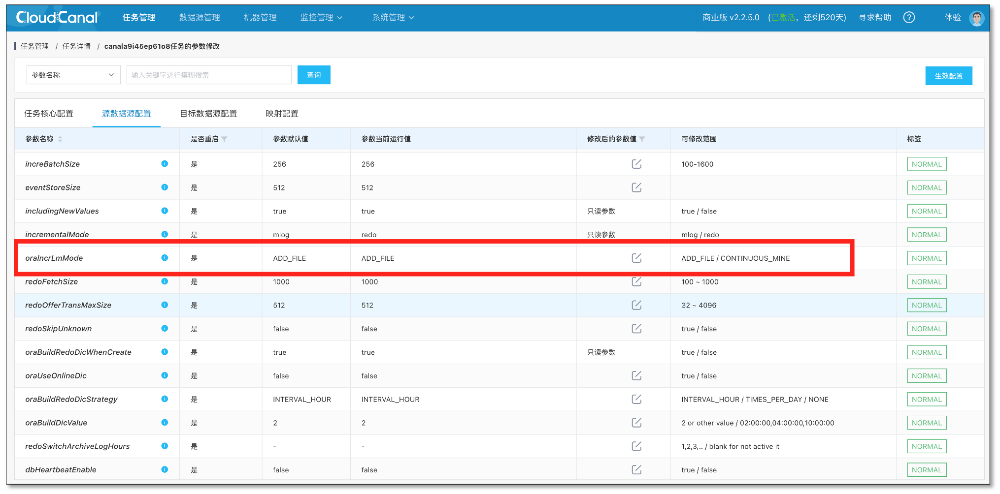
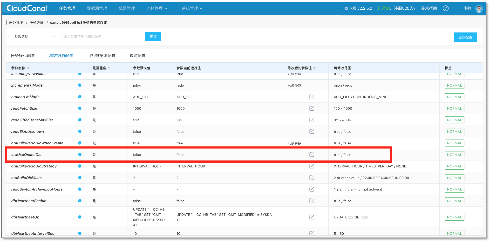
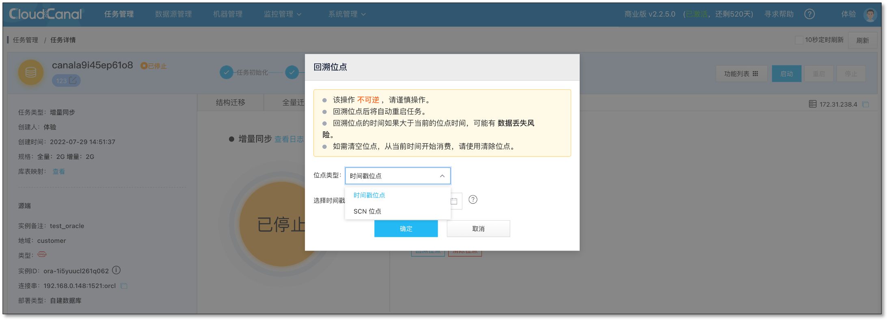
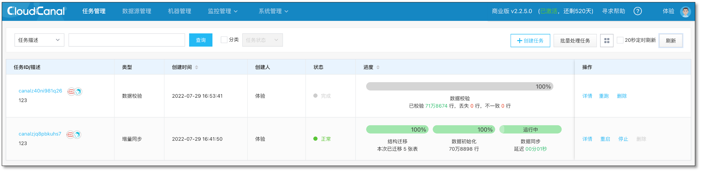
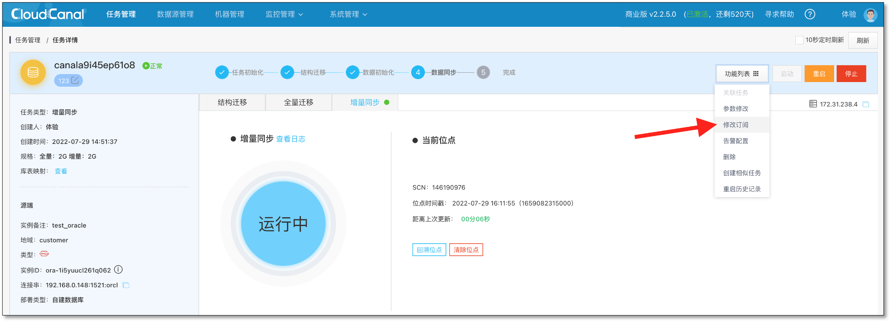
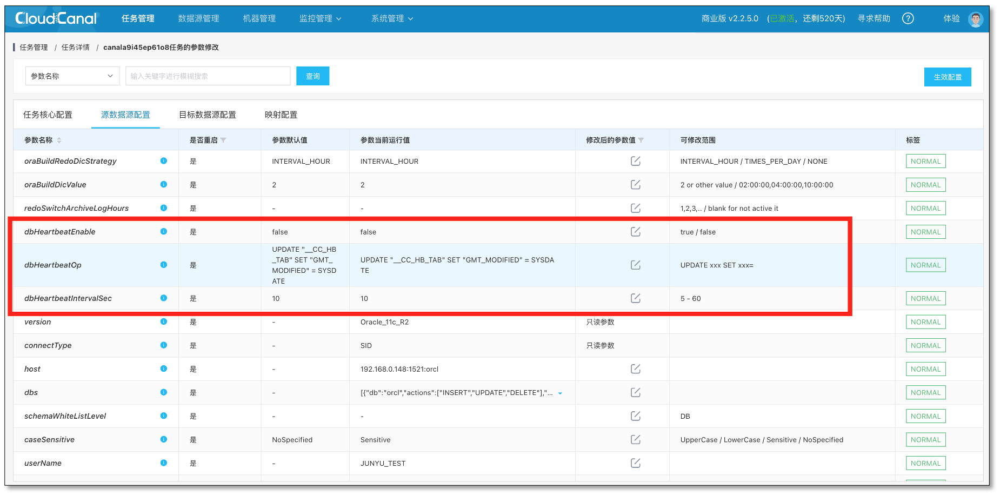
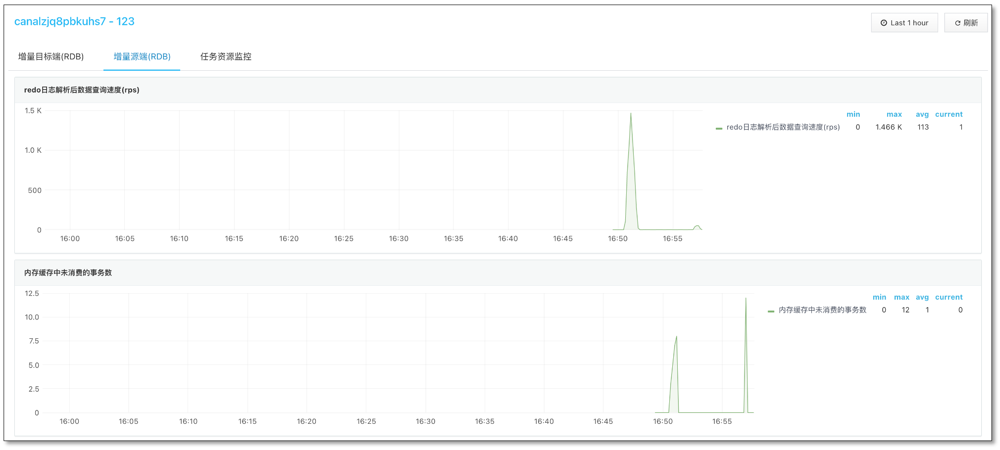

## 为什么我们要重构 Oracle 源端数据同步？
[CloudCanal](https://www.clougence.com?src=cc-doc-blog-oracle-cdc-optimize) 早期版本即支持了 Oracle 数据库，围绕**结构迁移**、**全量迁移**、**增量同步**三个核心步骤，构建了以 Oracle 数据库为源端的实时数据体系。

但之前的版本，也存在着不少问题，功能、性能、对数据库权限的挑战等方面都有所涉及，是 CloudCanal 产品的一个痛点，看着 MySQL 源端在线数据体系不断狂奔，不免有点落寞。

再者，市场的需求层出不穷，“CloudCanal 能否把 Oracle 数据同步到 Kafka?”CloudCanal 能否把  Oracle 数据同步到 ElasticSearch ？”我们在做业务重构，你们能做 Oracle 到 Oracle 的数据同步么？”...

为此，我们下定决心，决定在春夏之交，给 CloudCanal Oracle 源端动一场大手术。

## 如何优化？

### 两种实现方式的选择
最有力的改变往往来自于某一个特定方向的深入挖掘。

对于老版本 Oracle 源端增量实现的**物化视图**方式（类trigger）和 **LogMiner** (Redo日志解析) , 我们选择深度优化 **LogMiner**，理由有三

- **LogMiner**为 Oracle 官方提供 Redo 日志解析，方式相对可靠
- CloudCanal  实现的 MySQL / PostgreSQL / MongoDB  源端增量都偏向于**操作日志解析**，风格一致，组件可共用性概率高
- 从业界的调研来看，**LogMiner**在落地 Oracle 严格 CDC 场景下，表现可圈可点

## 确定我们核心追求的效果
**可持续稳定运行**成为我们优化的主要目标，这句话的含义可能并非字面所理解，实际包含以下几个问题的解决

- 能否在突发压力下（**5000 条数据/秒**）稳定运行？
- 能否在超级大事务下( **>1000万条数据数据订正**)稳定运行？
- 能否不中断任务**平滑新增表、减少表**？
- 能否自动处理源端常用 DDL 同步(**加列/改列/减列**)？
- 能否重复消费一段时间的增量数据(**回拉位点**)？

## 我们做了哪些事情？
确定了优化方向和目标，接下来事情就相对好办，我们从 **内核核心逻辑优化** 和 **产品层面优化** 两个方面进行改进。

### 内核核心逻辑优化

#### ADD_FILE 模式和 CONTINUOUS_MINE 模式支持
Oracle **LogMiner**本身并不是专门为实时 CDC 所设计，商业方向由其商业产品 GoldenGate 扛旗，免费工具层面又有 Oracle CDC 专用组件，但是 **LogMiner**主要胜在其被许多前辈所验证，古老且稳定，所以被选择演化为 Oracle 主要的实时同步组件也并不奇怪。

**LogMiner**最原始的使用方式包含以下几个步骤

- DBMS_LOGMNR_D.BUILD (构建解析的字典，可选)
- DBMS_LOGMNR.ADD_LOGFILE (添加需要解析的 redo 日志)
- DBMS_LOGMNR.START_LOGMNR (开始解析增量日志)
- V$LOGMNR_CONTENTS (从此视图中查询解析的增量日志)
- DBMS_LOGMNR.END_LOGMNR (结束解析)

事实上，这几个命令通过改变使用组合，增删具体的参数，即可达成增量日志效果，通用的模式即  **ADD_FILE** 模式，CloudCanal 对这种模式做了大量优化与验证，构成其 Oracle 源端增量同步的**基本盘**。

但是上述步骤中，**DBMS_LOGMNR.ADD_LOGFILE** 因为 Oracle 的日志结构构成，对于细节处理要求较高，如果没处理好，在某些场景下，**容易丢失数据**。

Oracle Redo日志如下结构

```
- online redo log (在线日志)
  - redo04
  - redo05
  - redo06
- archieved redo log (归档日志)
  - redo log with dictionary start
  - redo log with dictionary end
  - redo log with both dictionary start and end
  - redo log without dirctionary
```

其中**在线日志**有2+个组(完全镜像)，每一个组里面 2/3 个文件进行轮换，在线文件会归档到**归档日志**，所有文件通过递增 **sequence** 维持顺序。

请问怎么样往 **LogMiner**添加文件不会丢数据也不会重复解析日志？为了简化这个问题，Oracle 为 **LogMiner**推出了 CONTINUOUS_MINE ，也就是不需要指定日志文件，自动帮你添加，不断吐出新的变更。

当我们看到这个能力的时候，觉得 Oracle 挺厚道的，但是我们很快发现了不厚道的事情，Oracle 12.2  deprecated 此项特性，19c 直接去掉了这项能力 ...但是我们还是支持了这个能力，在 11 / 12 部分版本能够选择使用该项能力。


#### 更加实时
两种模式的支持过程中，我们大大 **缩小老版本解析 redo 日志的范围**，通过位点管理的重构，**杜绝可能的重复添加**已解析过日志文件，另外为了方便运维，DBA 同学可选择 CloudCanal **定时或相隔时间段构建字典**的能力。

#### Read Commited 级别可见性
关系型数据库 Redo 文件包含几乎所有的操作，所以也隐含了数据库对外可见性在日志中，**LogMiner**支持只吐出已提交(commited)的日志，但是我们并没有选择这种方式，原因有四

- V$LOGMNR_CONTENTS  是一个视图，会话级别，一个大型数据变更，选择 commited 数据消费将会影响 Oracle 稳定性
- 一个大型的数据变更，Oracle 等待 commit 再消费会导致大的数据延迟
- CloudCanal 对于超级大事务有刷盘机制，**LogMiner**边吐日志边处理，安全且高效
- 此种机制不阻塞在超级大事务之间并发执行的小事务提交

当日志不断从 **LogMiner**结果视图查询出来时，CloudCanal 的内存结构完美重现了一遍  Oracle Read Commit 级别的操作。

#### 大事务支持
CloudCanal 新版本对于源端大事务做了充分的支持，当单个事务变更数小于固定值(默认 512 个)，则**全内存操作**，一旦超过此数值，即**开始刷盘**，直到 commit 或 rollback 操作发生，进行后续的消费或者丢弃。

持久化变更操作到硬盘时，我们采用了**kyro 序列化**工具提升压缩比和 cpu 编解码效率，为了让数据序列化/反序列化可控，我们采用了最可靠的**自定义序列化器**方式，防止 kryo 通过反射制造各种惨案，将序列化类型**限定在 java 最基础的几种类型**上，让这块代码坚若磐石。

#### 可选择的字典（ONLINE or IN_REDO）
**LogMiner**分析的 Redo 时，必须包含日志的字典信息，否则解析出来的数据相当于乱码，无法识别，导致丢数据。可选择的两种字典类型，存在以下区别。

- **ONLINE** : 即当前字典，无法配置 DDL 参数 **DDL_DICT_TRACKING**进行历史日志分析（比如做了 DDL 在表中间加了一个列，DDL 之后的变更可以解析，但是之前的变更可能解析失败）
- **IN_REDO** ：即以归档日志中存在的字典作为基准，配合 **DDL_DICT_TRACKING**构建演进的字典，即可做历史日志的解析（无论发生多少个 DDL，每一个事件都能获取到精确的元信息）

CloudCanal 新版本默认采用 IN_REDO 模式的元数据（依赖字典数据构建），但是也提供了 ONLINE 形式的字典，让增量任务启动更加顺畅(无前置构建字典必要)


#### 更好的 redo 解析器
**LogMiner** 解析日志生成的核心数据 **redo / undo** SQL ，如果需要得到结构化数据，必须使用 SQL  解析，方案一般有三种

- Antlr 解析(自定义文法)
- 纯字符串解析
- 其他成熟工具解析(如阿里 **Druid**)

是的，因为老版本代码这部分有参考某著名开源产品 , 所以我们使用的是纯字符串解析，爽快没多久，惨案便发生，对于  redo sql 中，业务数据值的千变万化，手工解析无疑是一个定时炸弹，所以我们决定使用 Druid 的 SQL 解析器，原因有三

- 我们其他功能有使用 Druid 和他的 SQL 解析器，**摸透了她的特点**
- 能找到作者，而且作者**人很 nice**
- 即使最后我们需要自己维护，**难度层面完全可以接受**

#### 常见  DDL 同步支持
对于 DDL 同步，特别是 Oracle 数据库源端增量同步 DDL，国内有一个著名通信公司同事和我们说，如果你们支持，我们就买，因为太烦太痛。

数据同步工具对于 DDL 事件的处理，实际上分为两个部分

- 更新表元数据，以解析新事件
- 同步到对端，让源和对端结构保持一致

对于第一项，是一定要做的事情，否则同步可能中断以及解析增量数据可能出错。对于第二项，我们的建议是通过**统一的平台**来做(比如我们的 **CloudDM** )，而这个并不是我们不想或不能，而是因为历史/技术的局限性，对端数据库无法做到快速的 DDL 变更，导致同步延迟或加大同步链路稳定性问题（长时间延迟可能出现各种不确定事件）。
不过应最终客户的需求，我们在 CloudCanal 新版本中做到了这两项。其中对端同步到 MySQL  我们支持

- ALTER TABLE xxx ADD  xxx ;
- ALTER TABLE xxx DROP COLUMN xxx;
- ALTER TABLE xxx MODIFY xxx;

搭好了舞台，开了一个好头，后续不断完善。

#### 多版本 schema 以支持位点回拉

对于关系型数据库同步工具而言，**增量数据本身往往和元数据分离**，也就是消费到的增量数据和即时从数据库里面获取的元数据**不一定匹配（两个时间点之间有DDL）**。故维持一个多版本的元数据以应对增量数据解析是刚需。

CloudCanal 以每天的 schema  dump 为基准，辅以到当前位点的  DDL  语句列表，可构建出任何时间点的元数据(实际上是更加精确的 scn 位点)。单个 DDL 前后的数据变更事件，**能够精确匹配到相对应的元数据**，进行解析。

所以 CloudCanal 才有可能在此版本产品上提供了**回拉位点重复消费一段时间增量数据**的能力。


#### 更加高效的数据结构
CloudCanal 新版本参考 MySQL 源端增量，将**多个已提交事务批量交付**给写入端进行写入，而针对大事务，提交后**按照参数进行拆分**，一边从硬盘上**流式读取数据，一边写入对端**，安全又高效。

更加合理的存取结构，将数据同步性能由原来的 **几百 rps** 提升到**5000+ rps** ，满足业务突发流量的实时同步需求。

### 产品层面优化
#### 支持全量数据校验
同步工具如果没有数据校验能力，往往会存在丢失数据的风险。**显性层面**表现为是否有**数据校验功能**，而**隐性层面**表现为是否做过**多样化数据场景构建和数据校验**。

- 测试的时候有多少张表？
- 单表并发多少？
- 单事务操作数多少？
- 操作种类和比例多少？
- 跑了多长时间？
- 有没有暴力 kill ?
- 极限硬件测试(资源有限，压力大)?

CloudCanal 新版本对于 Oracle 源端链路补足了此项能力，几百万、上千万条数据中，一条遗漏、一个字段不一致都逃不过**数据校验**。在交付用户/客户使用前，我们已经做了这些事情。


### #支持 Oracle 源端的任务编辑
业务方a 给 DBA 提了一个需求，希望把数据库  A 中表 1、2、3 配置同步到 Kafka 中，DBA 同学顺利完成任务。过了一些天，业务方b 又给 DBA 提了另外一个需求，将数据库  A 中表 4、5、6 配置同步到 Kafka 中。这个时候，DBA 有两种选择

- 编辑下业务方 a 的任务，加4、5、6表进去，历史数据怎么办？
- 新开一个任务，占新机器资源、占新数据连接、不断增加的运维成本？

CloudCanal 提供了**平滑编辑订阅**的能力，如新增表，则**生成子任务**，可选择做全量迁移，待增量追上自动合并到主任务一起同步。


#### 支持 Oracle 源端心跳任务
当 Oracle 一段时间完全没有变更，如何确定是任务真的延迟还是没有流量？CloudCanal 新版本参考 MySQL 源端，通过参数配置，打开心跳开关，配置好变更语句和执行间隔，即可自动进行定时变更。准确识别延迟是因为下游不行还是 Oracle 没量。


#### 更加明晰的监控指标
新版本的 CloudCanal 对于 Oracle  源端新增了两个监控指标，**V$LOGMNR_CONTENTS 查询速率**能准确观察 **LogMiner** 解析效率，**内存中未提交事务数**能简明判断后端消费和解析的压力，某些情况下还能精确判定 **LogMiner**是否吐完数据。


#### 缩小的数据库权限要求
CloudCanal 对 Oracle 数据库的高权限要求，主要来自两个面向 DBA 的操作，**自动构建字典**和 **自动切换归档日志**，这两个操作初心比较简单，让用户使用更加自动化和便利，但是问题也比较明显，对数据库运维标准严苛的客户来说，这些操作在某些情况下是不可接受的。

所以新版本 CloudCanal ，通过参数配置，支持了**关闭自动字典构建能力（默认打开）** 和 **关闭自动切换归档日志能力（默认关闭）**。用户在关闭这些功能时，能够知道必须辅以哪些运维操作，才能让 CloudCanal 正常运行。

### 其他的功能和修复
通用能力方面，我们此次打开了创建 Oracle 源端任务 **支持数据过滤条件**的功能，但是语法依然仅限于**SQL92 的有限语法范围内**，和 MySQL 等其他源端数据源共用一套数据过滤系统。

**自定义代码能力**对于业务重构、新老系统替换是神器，新版本 CloudCanal 将这个能力打开，它依然和 MySQL 作为源端、PostgreSQL 作为源端，保持能力的一致性，数据过滤、打宽表、字段值变换、操作变化一样不少。

BUG 修复层面，新版本**修复了 Oracle 远端全量迁移进度不准问题**，**结构迁移类型映射不准确问题**。

## “术后” 效果如何？
“术后”效果，我们需要回答文章开始之时提出的一些问题。

对于能否在突发压力下（**5000 条数据/秒**）稳定运行？我们通过 **高效的数据结构**，**可调整内存参数阈值**优化，基本达到目标（还有提升空间）。

对于能否在超级大事务下( **>1000万条数据数据订正**)稳定运行？我们通过 **非commit数据接收模式**，**大事务支持**，**边获取边写入** 三个方法解决问题。

对于能否不中断任务**平滑新增表、减少表**？我们通过支持 **编辑订阅**达到目标。

对于能否自动处理源端常用 DDL 同步(**加列/改列/减列**)？我们通过 **多版本schema管理 ，DDL转换与同步**两个方法结合解决。

对于能否重复消费一段时间的增量数据(**回拉位点**)？我们通过支持**多版本 schema 管理**，**页面位点重溯功能**解决。

## 我们还将会围绕 Oracle 做些什么？
### 更多的对端数据源
目前 CloudCanal 源端为 Oracle , 则对端支持 **PostgreSQL**、**Greenplum**、**MySQL**、**TiDB**、**Oracle**、**Kudu**、**StarRocks**、**OceanBase**、**Kafka** 数据源，我们在期待解决这些链路可能存在的问题同时，也希望支持更多对 Oracle 在线数据生态有益的对端数据源，比如 **ElasticSearch** 、**ClickHouse**、**MongoDB**等

### 探索和其他数据源（如 MySQL）的双向同步可能性
Oracle 是否存在双向同步的可能性，对于很多业务来说，具有很强的实用性，我们希望能够探索出一条成熟类似 MySQL&lt;-&gt;MySQL 之间双向同步的方案。Oracle &lt;-&gt; MySQL（Oracle） 双向同步，我们相信对一些用户来说会比较有用。

### 物化视图（trigger方式）优化
CloudCanal 目前另外一种 Oracle 增量方案-物化视图，是一种**权限要求低**、**版本覆盖度好**的解决方案，在此次优化中，我们并没有把它列入优化能力点，在后续的一些项目中，我们希望能够将此方案也能够优化好，具有不错的场景适用性。

### 问题修复
问题修复是我们一直要做的工作，也仰仗各位用户/客户广泛**传播**、**使用**、**反馈**。沉淀到我们的社区论坛/issue中，我们将会一轮一轮优化，将产品推向极致。

## 总结
本文主要介绍了我们近段时间对于 Oracle 数据迁移同步的优化，通过这个优化，[CloudCanal](https://www.clougence.com?src=cc-doc-blog-oracle-cdc-optimize) 具备了相对稳态的 Oracle 数据迁移同步能力，围绕 Oracle 构建数据生态也成为可能，给用户更加广泛应用数据带去助力。
