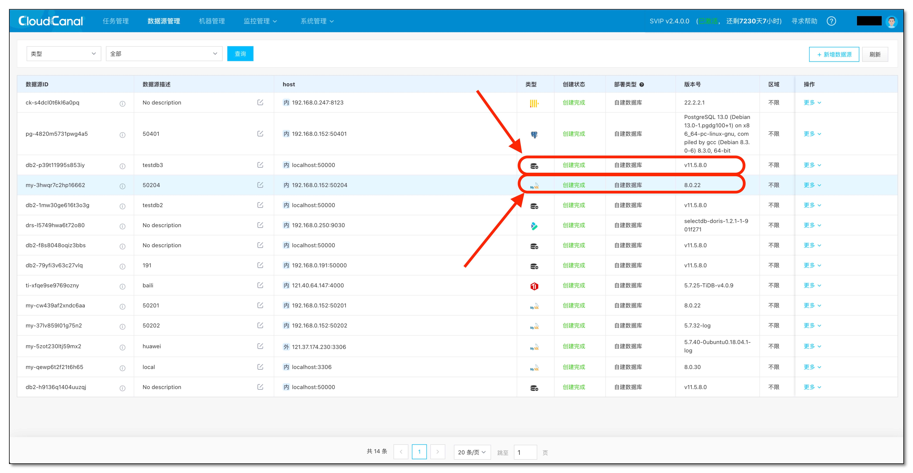
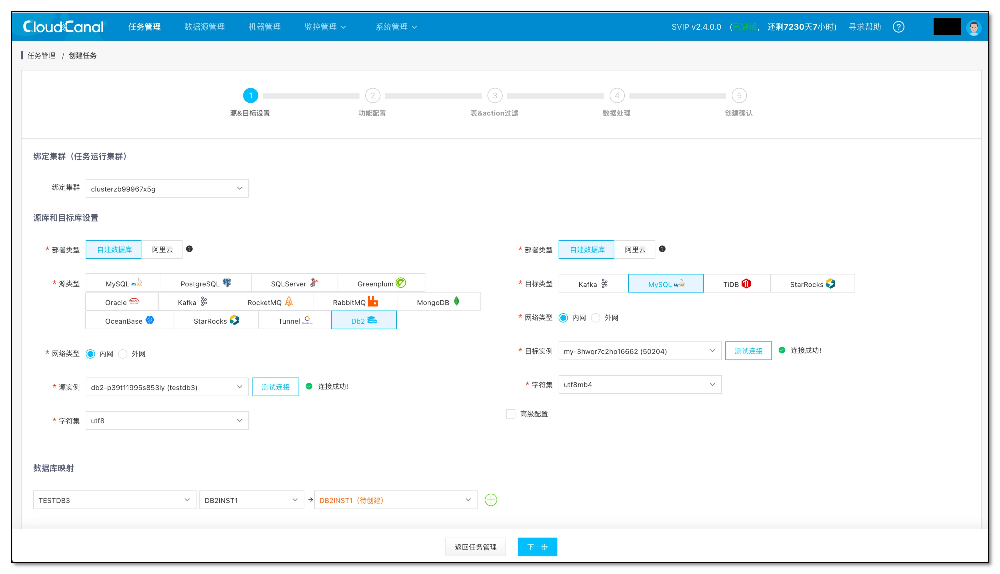
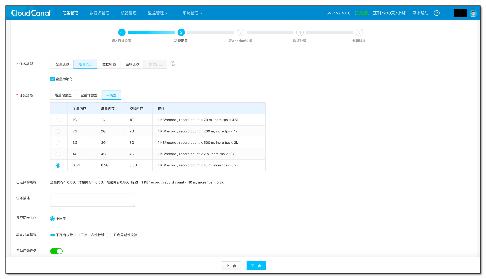
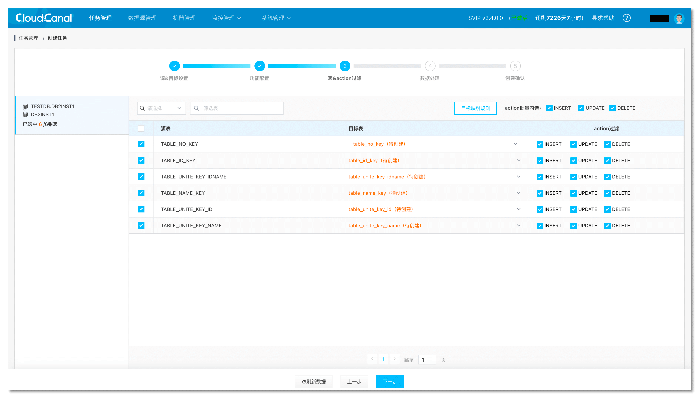
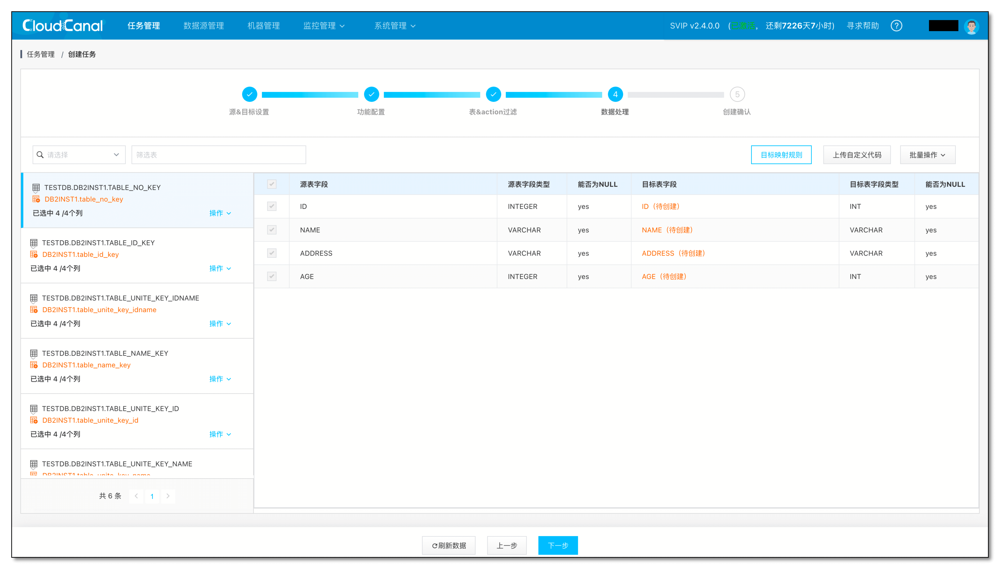
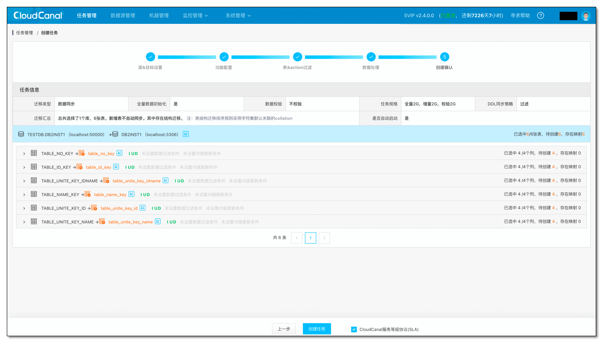
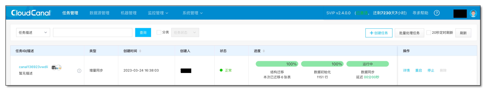
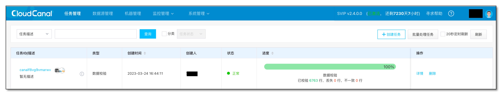

## 简述

[Db2](https://www.ibm.com/products/db2) 是一款具有悠久历史的关系型数据库，由 [IBM](https://www.ibm.com) 公司开发和维护，广泛应用于金融级业务场景。

[CloudCanal](https://www.clougence.com?src=cc-doc-blog-db2-cdc) 近期提供了 **Db2 为源端的数据迁移同步** 功能，用户可以便利地将 Db2 中数据实时同步到其他数据库，实现数据更广泛、更实时的应用。

## 功能介绍
### 目标数据库和能力
| 目标端数据源    | 结构迁移 | 数据初始化 | 增量同步 | 数据校验 | 数据订正 |
|------|------|------|------|------|------|
| MySQL     | 支持   | 支持   | 支持   | 支持   | 支持 |
| TiDB      | 支持   | 支持   | 支持   | 支持   | 支持 |
| Kafka     | -  | 支持   | 支持   | - | - |
| StarRocks | 支持   | 支持   | 支持   | 支持   | 支持 |

### Db2 源端特色能力
#### 基于 CDC 技术的数据同步
Db2 源端同步能力是基于 SQL 复制的 [ASN 捕获代理](https://www.ibm.com/support/pages/q-replication-and-sql-replication-product-documentation-pdf-format-version-101-linux-unix-and-windows)，CloudCanal 通过捕获 Db2 CDC 表中的增量数据来实现数据同步。

Db2 源端进行增量数据同步时，CDC 元信息表的维护过程会被**自动化管理**，无需用户手动操作。 

同时，CloudCanal 会**周期性地清理**已经同步到目标端的 CDC 记录，以避免 CDC 表的无限增长，从而保证同步数据的准确性和系统的稳定性。

#### 结构迁移类型自动处理
不同数据库对于数据类型支持存在差异，CloudCanal 结构迁移时会进行**类型自动转换**。

Db2 为源端的结构迁移也存在类似转换(5+，并不断细化)，如对端为 MySQL 或 TiDB，CloudCanal 将自动转换 VARCHAR FOR BIT DATA 为 VARBINARY。

#### 数据初始化支持断点续传
Db2 为源端的数据初始化，支持**字符或数字类型主键表**的断点续传功能。

对于亿级别数据量的大表，此能力不可或缺，**数据初始化断点续传**功能让此种暂停尽可能少的影响进度。

#### 数据同步支持断点续传
长周期的数据同步任务，暂停任务**调整参数**、**修复问题数据**、**优化性能**等情况很难避免，断点续传让这些维护操作变成可能。

CloudCanal 定时或定量保存提交后的位点(LSN，log sequence number)，确保增量同步任务重启后可继续，并且不丢失数据。

#### 配套数据校验与订正能力
在数据同步过程中，由于数据的**外部关联性**、**结构约束差异**、**数据库运维操作**、**软件bug**等情况，两端数据可能会不一致，此时数据校验和订正功能非常必要。

CloudCanal 为 Db2 为源端的数据同步能力额外提供了**数据校验**和**数据订正**功能，快速确定不一致数据范围，并针对差异数据进行修复。

#### 产品化能力支撑
##### 可视化创建
CloudCanal 创建 Db2 数据迁移同步任务是完全可视化的，通过**获取数据库元数据**，让用户**在 web 页面上决定哪些库、表、列进行迁移同步**，或者设定**过滤条件**、**自定义数据处理逻辑**等。

##### 自动化流程
Db2 数据迁移同步任务创建后，CloudCanal 将**自动流转**各个阶段的任务，用户无需干涉，直达数据实时同步状态。

##### 监控图表支撑
CloudCanal 为 Db2 数据迁移同步任务提供了多个实用监控指标，包括**增量缓存RPS**、**增量缓存延迟(ms)**、**内存队列数据个数**等，当调优任务性能或排查任务异常原因时，监控指标提供了很好的判断依据。

##### 告警支持
CloudCanal 为 Db2 数据迁移任务提供了包括**钉钉/企业微信/飞书/自定义**等 webhook 类型告警，对于企业级客户，可额外选择**邮件**，以及**短信告警**，实时保障同步任务的高可用。

## 简单示例
本示例以将数据从 Db2 数据库同步到 MySQL 数据库为操作案例，以便更好地说明 CloudCanal 在不同数据库之间进行数据同步的能力。

### 准备动作
- 下载安装 [CloudCanal 私有部署版本](https://www.clougence.com?src=cc-doc-blog-db2-cdc),使用参见[快速上手文档](https://www.clougence.com/docs/productOP/docker/install_linux_macos)
- 准备好 Db2 数据库（本例使用 11.5 版本）和 MySQL 数据库（本例使用 8.0 版本）
- 登录 CloudCanal 平台 ，添加 Db2 和 MySQL
- Db2 源端如果需要增量同步需要开启 CDC，详细请参考：[Db2 源端 CDC 同步准备](/docs/dataMigrationAndSync/datasource_func/Db2/prepare_for_db2)
  

### 任务创建
- 任务管理 -> 新建任务
- 测试链接并选择 源 和 目标 数据库
- 点击下一步
  

- 选择 数据同步，并勾选 全量数据初始化，其他选项默认
  

- 选择需要迁移同步的表和列
  
  

- 确认创建任务
  

- 任务自动做结构迁移、全量迁移、增量同步
  

- 增量阶段进行数据写入后，进行数据校验，数据校验通过
  

## 总结
本文主要介绍了 [CloudCanal](https://www.clougence.com?src=cc-doc-blog-db2-cdc) 支持 Db2 为源端数据迁移同步功能，通过这个能力，用户可以便利地将 Db2 中数据实时同步到其他数据库，实现数据更广泛、更实时的应用。
