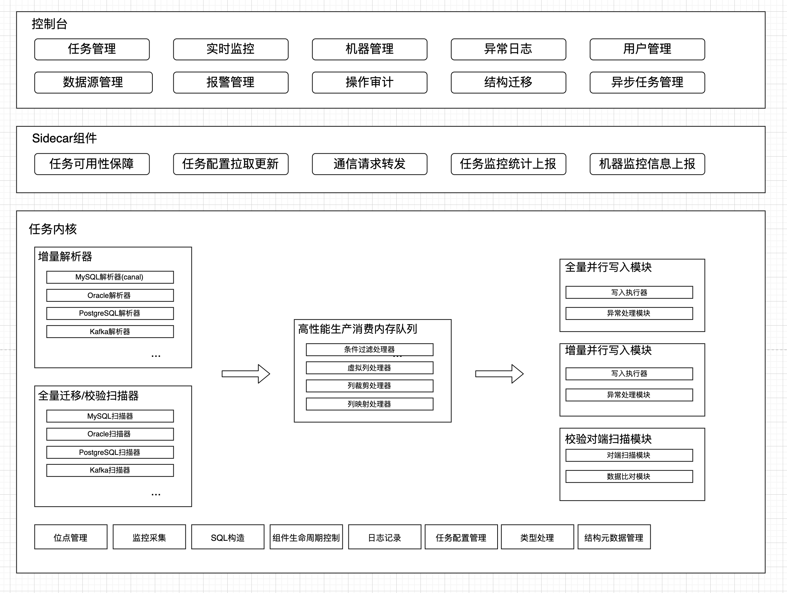

## 前言
近期 [CloudCanal](https://www.clougence.com?src=cc-doc-blog-cloudcanal-and-canal) 和 Canal 是什么关系的疑惑，这边统一回答下。

## 研发团队
CloudCanal 核心团队成员来自阿里巴巴中间件和数据库团队, 长期从事分布式数据库、数据库中间件、应用中间件工作，包括阿里云分布式数据库中间件产品 DRDS、内部核心系统数据同步工具精卫、阿里云数据湖产品 DLA 、开源数据网关 Hasor 等产品负责人和核心研发 。

## CloudCanal 命名
CloudCanal 取名初衷在于其原始意义：云管道。公司使命是做云时代的数据管理，产品名字高度匹配。和 Canal 名字关联性在于我们使用了一部分 Canal 的 binlog 解析，可以认为是一个全新的产品。

## 代码
### CloudCanal 和 Canal 代码有什么区别
CloudCanal 在 MySQL binlog 解析使用了 Canal 部分代码，其他均为自主研发，并且对 Canal 部分代码进行了大量重构，修复诸多问题并优化性能。Canal 在 CloudCanal 中的位置，可以用以下图片简单表示，可见 Canal 代码在 CloudCanal 产品中只占很小一部分。

## CloudCanal 和 Canal 功能差异
###
| 功能 | CloudCanal | Canal |
| --- | --- | --- |
| 可视化任务创建 | 是 | 否 |
| 可视化参数配置 | 是 | 否 |
| 任务生命周期管理 |全自动流转 | 无 |
| 数据库支撑度 | 高：10种源端/22种对端(阿里云加自建) | 中：源端以 MySQL 为主，对端支持RDB、kudu、hbase和es |
| 结构迁移 | 支持 | 不支持 |
| 全量迁移 | 支持 | 不支持 |
| 增量同步 | 支持 | 支持 |
| 数据校验 | 支持 | 不支持 |
| 数据订正 | 支持 | 不支持 |
| 数据条件过滤 | 支持 | 不支持 |
| 同步异常处理 | 支持 | 不支持 |
| 列裁剪 | 可视化配置 | blackField参数文件配置 |
| 列映射 | 可视化配置 | 不支持 |
| 自定义虚拟列 | 支持 | 不支持 |
| 限流 | 支持 | 不支持 |
| 可视化监控 | 支持 | 不支持 |
|告警(钉钉、短信)|支持|不支持|
| 位点回溯、重置 | 支持 | 参数文件设置 |
| 白屏化日志 | 支持 | 不支持 |
| 异常大盘 | 支持 | 不支持 |
| 阿里云数据源支持 | API级别集成 | 不支持 |
| 数据源管理能力 | 支持 | 不支持 |
| 机器管理能力 | 支持 | 不支持 |
| 操作审计 | 支持 | 不支持 |

### 写在最后
[CloudCanal](https://www.clougence.com?src=cc-doc-blog-cloudcanal-and-canal) 相比 Canal 具备更加丰富的数据源支持，产品化、自动化程度更高，也具备免费社区版和配套商业服务的商业版本，Canal为开源产品，社区更加强大和开放。
