## 简介
[SQL Server](https://www.microsoft.com/en-us/sql-server) 是一款老牌关系型数据库,自 1988 年由 Microsoft、Sybase 和 Ashton-Tate 三家公司共同推出，不断迭代更新至今，拥有相当广泛的用户群体。

如今，我们提到 SQL Server 通常指 Microsoft SQL Server 2000 之后的版本。

SQL Server 2008 是一个里程碑版本，加入了大量新特性,包括 **新的语法**、**更丰富的类型** 以及本文所提及的 **CDC 能力**，这个能力让数据从 SQL Server 实时同步到外部更加方便。

本文将介绍 [CloudCanal](https://www.clougence.com?src=cc-doc-blog-sqlserver-cdc-detail) 在新版本中对于 SQL Server 数据同步更进一步的优化和实践。

## SQL Server CDC 长什么样？

### 原始日志

常见的数据库往往存在以下两种日志
- **redo 日志**
  - 记录数据的正向变更，简单来说，事务的 commit 通常先记录在这个文件，再返回应用程序成功，可确保数据 **持久性**
- **undo 日志**
  - 用于保证事务的 **原子性**，如执行 rollback 命令即反向执行 undo 日志中内容以达成数据回滚

一条 DML 语句写入数据库流程如下

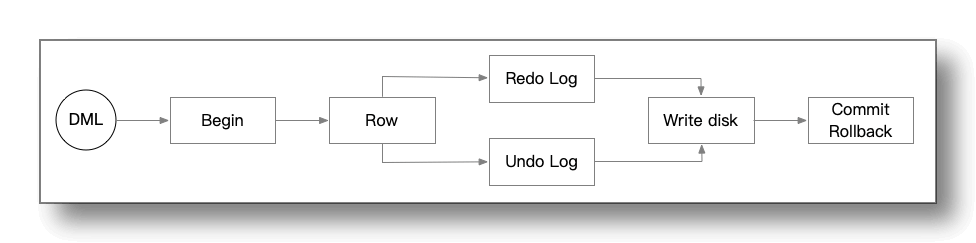
- 大部分关系型数据库中，一个或多个变更会被隐式或显式包装成一个事务
- 事务开始，数据库引擎定位到数据行所在的 **文件位置** 并根据已有的数据生成 **前镜像** 和 **后镜像**
- **后镜像** 数据记录到 redo 日志中，**前镜像** 数据记录到 undo 日志中
- 事务提交后，日志提交位点（检查点）向前推进，已提交的日志内容即可能被覆盖或者释放

SQL Server redo/undo 日志采用了 **ldf 格式** ,文件循环使用。

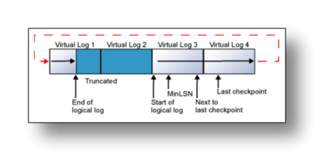
- ldf 日志文件由多个 VLF(逻辑日志) 组合在一起，这些 VLF 首尾相连形成完整的数据库日志记录
- ldf 在逻辑日志末端到达物理日志文件末端时，新的日志记录将回到物理日志文件开始，复写旧的数据

**ldf** 文件即 CDC 所分析的增量日志文件。

### 启用 CDC
在数据库上执行 `exec [console].sys.sp_cdc_enable_db` 命令为 console 数据库启用 CDC 功能，这个语句实际上会创建两个作业: **cdc.console_capture** , **cdc.console_cleanup**

使用 `exec sp_cdc_help_jobs` 命令可查看这两个作业详细信息。
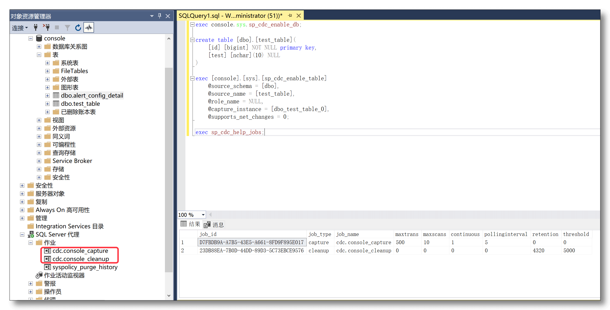
- **cdc.console_capture**
  - 负责分析 **ldf 日志** 并解析 console 数据库事件,再将其写入到 CDC 表中
  - 间隔 5 秒钟执行一次扫描，每次扫描 10 轮，每轮扫描最多 500 个事务
- **cdc.console_cleanup**
  - 负责定期清理 CDC 表中较老的数据
  - 默认保留 3 天 CDC 日志数据（4320秒）

开启 CDC 功能后，SQL Server 数据库会多出一个名称为 cdc 的 schema，里面会多出下列这些表。

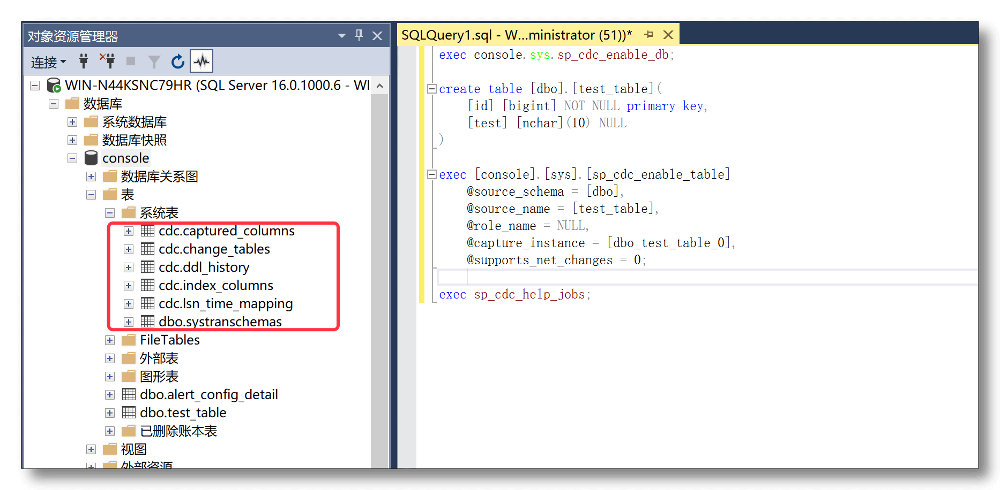
- **change_tables**
  - 记录每一个启用了 CDC 的 **源表** 及其对应的 **捕获表**
- **captured_columns** 
  - 记录对应 **捕获表** 中每个列的信息
- **index_columns**
  - 记录 **源表** 含有的主键信息(如果有)
- **lsn_time_mapping**
  - 记录每个事务的开始/结束时间及 LSN 位置信息
- **ddl_history**
  - 记录**源表**发生的 **增/减列** 对应的 DDL 信息，除此之外的 DDL 都不会被记录

有了上述准备动作和信息，即可开始对原始表开启 **change data capture(CDC)**，即增量数据捕获了。

### 捕获表变更

有如下 **源表**

```sql
create table [dbo].[test_table] (
  [id] [bigint] NOT NULL primary key,
  [test] [nchar](10) NULL
)
```

执行下列命令即可为它启用 CDC

```sql
exec [console].[sys].[sp_cdc_enable_table]
    @source_schema = [dbo],
    @source_name = [test_table],
    @role_name = NULL,
    @capture_instance = [dbo_test_table], -- 可选项
    @supports_net_changes = 0;
```

**cdc** schema 下多出一个名为 **dbo_test_table_CT** 的表，即 **捕获表**

- 对 **源表** `[dbo].[test_table]` 做若干 DML 操作，通常是 5 秒内就可在捕获表中看到变更记录
- 对 **源表** 做一些 **增/减 列** 操作,对应的 DDL 会出现在 ddl_history 表中

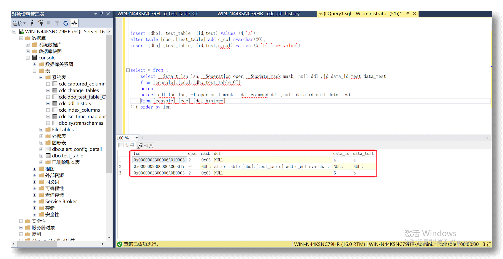

其他表也可通过类似设置，获取到相应的增量变更。整个机制看上去相当直观和简单。

## 挑战是什么？

### 难点1：DDL 同步困难
CDC 捕获表只反馈数据的变化，无 DDL 信息

DDL 需额外获取即和 DML 的顺序关系要额外处理
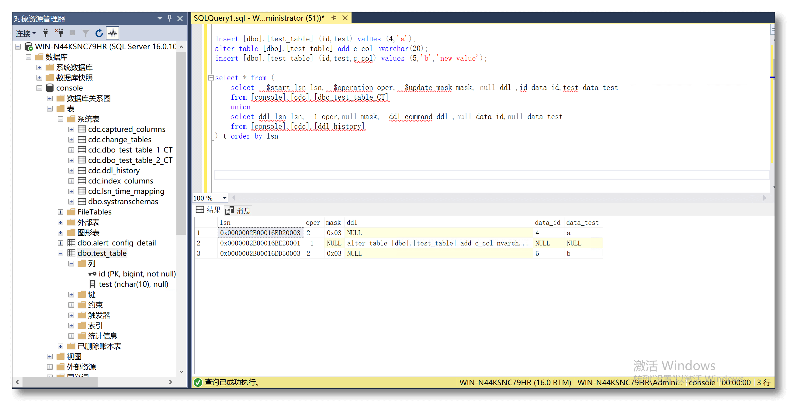


解决这个问题，需要通过执行以下的 SQL 将 DDL 和 DML 事件混合到一起并保证顺序，但是实际使用中会面临严重的性能问题。

```sql
select * from (
	select __$start_lsn lsn,__$operation oper,__$update_mask mask, null ddl ,id data_id,test data_test 
	from [console].[cdc].[dbo_test_table_CT]
	union
	select ddl_lsn lsn, -1 oper,null mask,  ddl_command ddl ,null data_id,null data_test 
	from [console].[cdc].[ddl_history]
) t order by lsn
```

### 难点2：无法获取新增列数据
CDC 捕获表的结构并不会随着 DDL 事件的发生而变化，这意味着无法获取新增列的数据
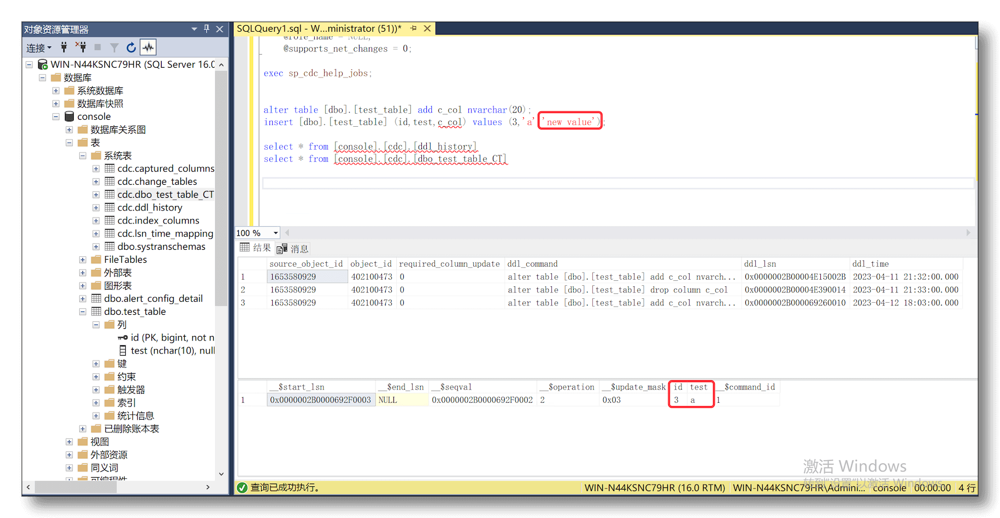

### 难点3：数据库限制

使用 CDC 功能本身也会产生一些硬性的限制，大致可以分为两类

**硬性限制**

- 已经启用 CDC 捕获的源表上不能执行 truncate table 语句,执行即报错

- CDC 捕获表本质上也是一个普通的表，大量订阅会导致整库表的数量扩大

- 依赖 SQL Server 代理,如没启动或作业运行失败，捕获表中不会有任何新数据写入

- 一张表只能创建 2 张对应的 CDC 捕获表,即无法做超过 2 个以上的增量订阅

- 一张表的 CDC 捕获只能设置启动和禁止，即不能通过重建 CDC 并指定 LSN 来获取新数据

**软性限制**

- CDC 捕获表中的数据存留时间默认 3 天

- 在插入或更新超大字段时默认 CDC 只会处理最大 64KB 个字节的数据
  - 数据内容如果超过这个限制会导致 CDC 捕获任务报错并停止工作
  - 受影响的类型有 7 个：`text`、`ntext`、`varchar(max)`、`nvarchar(max)`、`varbinary(max)`、`xml`、`image`

## CloudCanal 的解决方法

CloudCanal SQL Server 增量消费基础处理模型如下所述，保证单个表的数据变更顺序,满足大部分场景

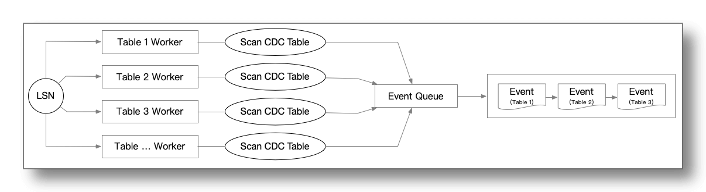

- 根据 `change_tables` 表确定一个工作队列
- 确定起始位点，对于捕获表的增量数据扫描从起始位点开始
- 并发处理工作队列上的事件
- 每个 Worker 会根据起始 LSN 扫描自身要处理的 CDC 捕获表
- 每个 Worker 扫描都会维护自身的 LSN 进度

### 解决难点1：DML/DDL重排序

CDC 捕获表中的每一条记录都有一个 LSN 信息，`ddl_history` 表也有 LSN 信息。因此可以借助 `插值` 的思想将 DDL 事件插入到正常的 DML 事件序列中去，原理如下图：

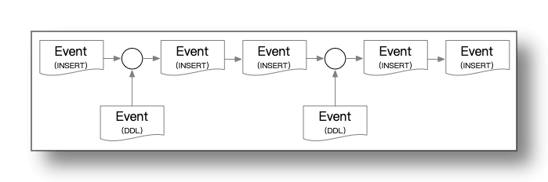
 1. 对 `ddl_history` 表进行预查询，获取到的 DDL 事件在稍后的处理中会进行位点比对处理
 2. 查询 `dbo_test_table_CT` 数据捕获表
 3. 处理每一条的捕获表的数据时检测 DDL 事件是否可以被插入
 4. 形成完整的事件流

### 解决难点2：反查补充缺失数据

SQL Server CDC 捕获表最多只能创建 2 张是硬性限制，但刚好能解决这个问题，在 DDL 发生后创建第二个 CDC 捕获表可以感知到 DDL 对数据的变化

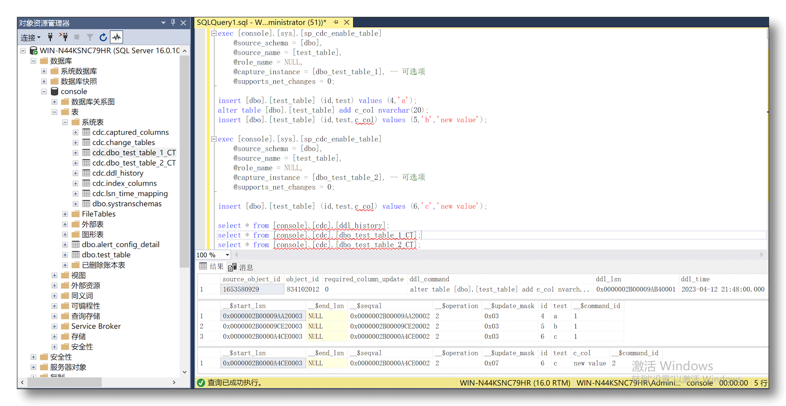
 1. 创建第一个 CDC 捕获表 `dbo_test_table_1_CT`
 2. 在两次数据插入的中间增加一个新的列
 3. 创建第二个 CDC 捕获表 `dbo_test_table_2_CT`
 4. 在插入一条新数据

通过上图可看到 `dbo_test_table_2_CT` 相比 `dbo_test_table_1_CT` 已经可以感知到新增的列数据

遗憾的是 DDL 发生后到第二个 CDC 捕获表创建出来之前这中间的数据仍然是缺失的

上面的例子如下图所示（灰色的 Event 表示事件或者数据有缺损）

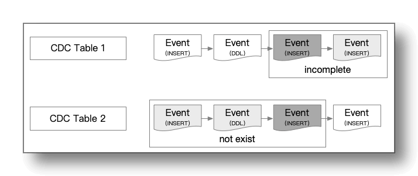

以 DDL 发生的 LSN 为分界点
- 在 DDL 发生之前 `dbo_test_table_1_CT` 表中的数据是完全可信的
- 在 DDL 发生之后由于 `dbo_test_table_1_CT` 表中并没有新列字段，因此它的数据是残缺的，不能完全信任
- 而 `dbo_test_table_2_CT` 是由于在 DDL 发生后才被创建出来，因此相比较 `dbo_test_table_1_CT` 它的数据是缺失的
- 此外 `dbo_test_table_1_CT` 和 `dbo_test_table_2_CT` 之间还存在一个盲区导致这个 INSERT 事件两个表都不可信

CloudCanal 解决办法是在此基础上将两张表都缺损的位点 **反向使用 PK 从源表中补齐** 的方式解决这个问题（上图中深灰色部分）

有一个极端情况是在第二张 CDC 捕获表创建过程中发生了新的 DDL ,这会导致新创建的捕获表也不可靠，因此需要重新创建第二个 CDC 捕获表,并且扩大中间需要反查补齐的数据范围（下图中深灰色部分）

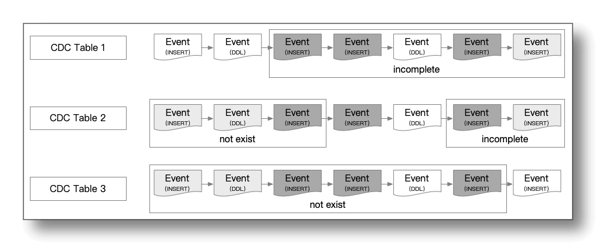

CloudCanal 正是基于上述一系列机制才解决了 DDL 事件导致无法获取增量数据的难题

### 解决难点3：提供专业优化方案

对于**硬性限制**，CloudCanal 没有正面解决的方案，而是后续提供更多样的方式(如 **trigger**,**定时增量扫描**,**新版本SQL Server CDC方案** 等)进行补充。

而 **软性限制**，可通过以下方式优化

- 通过以下命令中的 `retention` 参数来设置 CDC 捕获表中的数据存留时间
  ```sql
  exec console.sys.sp_cdc_change_job 
      @job_type = 'cleanup',
      @retention=4320 -- 单位:秒
  ```

- 通过以下命令调整 CDC 处理的最大数据字节
  ```sql
  exec sp_configure 'show advanced options', 1 ;   
  reconfigure;
  exec sp_configure 'max text repl size', -1; -- -1 表示不限制
  reconfigure;
  ```

## 总结

本文简单介绍了 SQL Server CDC 技术，然后基于此能力，[CloudCanal](https://www.clougence.com?src=cc-doc-blog-sqlserver-cdc-detail) 是如何实现稳定的增量 DML + DDL 同步， 并且解决了其中遇到的难题。