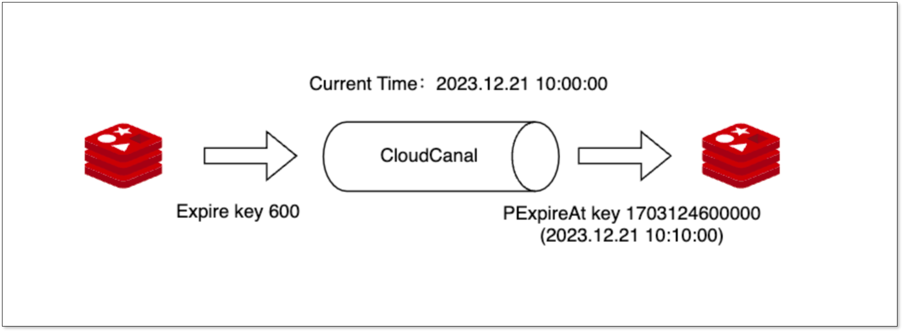
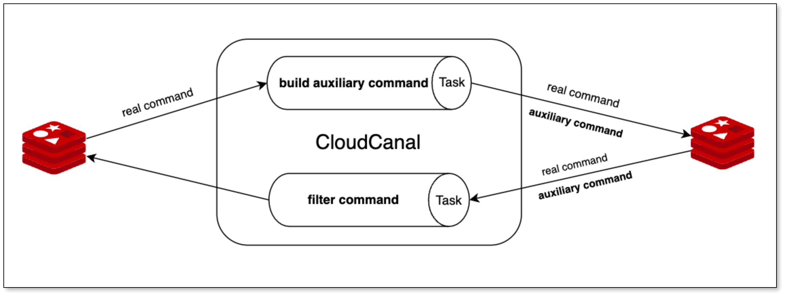

## 简述
[CloudCanal](https://www.clougence.com?src=cc-doc-blog-redis-cdc-optimize) 前一段时间支持了 Redis 到 Redis 数据迁移同步能力，并支持其双向同步，但是支持的指令种类有限。

随着用户使用，指令支持不全面成为一个比较大的问题，所以最近的版本，我们对此能力，结合用户实际碰到的问题，进行了新一轮优化。

此轮优化的特点是：
- 增加数据初始化的类型
- 增加数据同步的指令种类
- 双向同步策略优化

本文简要介绍以上优化点，并展望该链路未来的研发方向，希望对用户使用有所帮助。

## 优化点
### 指令支持范围提升

Redis 到 Redis 数据同步在原先支持 **Set、Hset、Del、Hdel、Expire** 五种指令的基础上，额外支持了 **Sadd、Zadd、LPushRename、Incr、Incrby、Hsetnx、Hmset、Lpush、Rpush、Lset、Zrem、Zremrangebyscore** 12 种命令。

数据初始化（FULL SYNC）在原先支持 **String、Hash** 类型基础上，额外支持 **List、Set、ZSet** 三种类型。

数据同步指令种类的丰富，以及数据初始化类型多样化，让此链路具备更好的可落地性。

### 指令优化

对于 **List** 类型数据初始化，因获取的成员数据默认倒序，CloudCanal 会对其内部成员进行 **重新排序**，然后使用 RPush 命令将数据统一写入目标端，确保源、目标数据准确。

对于 **Expire** 指令，数据同步如果直接应用到目标端，会导致目标端数据过期晚于源端，因此 CloudCanal 在处理这类命令时，将 Expire 转换为绝对时间命令 **PExpireAt**，从而实现源对端 Key 同时过期。

### 双向同步防循环优化
优化前，Redis -> Redis 双向同步防循环策略采用 **辅助指令进行判定**，当收到正常指令，计算 hash 值，构建辅助指令，以反查辅助指令 key 是否存在进行数据过滤。

这种策略存在以下问题：
- 辅助指令过期时间不好把控
- 辅助指令会占用内存空间
- 辅助指令未过期会导致同样的命令失效

而此次优化，总体延用辅助指令策略，但采用 **删除辅助指令** 判定是否进行数据过滤，虽然会导致性能下降，但能解决上述三个问题，在缓存写入量不大的情况下，效果良好(缓存常用场景读多写少)。

新策略的好处：
- 无需考虑辅助指令过期问题
- 能支持大部分指令防循环（Incr、IncrBy等）

### 指令解析 / 处理优化

本次优化对于指令解析、处理结构进行进一步重构，单个指令需要实现的逻辑更加清晰、独立，对于新指令添加，更加方便，为后续加快指令集支持打好基础。

## 演进方向

### 丰富指令集

CloudCanal 目前支持 **17 种** Redis 常用指令，但仍然只是 Redis 指令集冰山一角，后续我们将支持更多 Redis 指令同步（单向 / 双向）。

### 数据校验和订正

目前 Redis 到 Redis 链路 **暂未开通数据校验和订正功能**，对于数据迁移同步产品，事后补救和事前防范（同步逻辑的严谨性）同等重要，后续我们将补上这部分能力。

### 单独全量功能

目前 Redis 到 Redis 链路并没有开通单独的全量迁移能力，而是在增量任务中顺带完成全量迁移(FULL SYNC)，对于部分用户，需要针对该链路进行定时备份（周期性全量迁移），此功能是需要的。 

## 总结

本文简要介绍了 [CloudCanal](https://www.clougence.com?src=cc-doc-blog-redis-cdc-optimize) 近期对于 Redis 到 Redis 单向和双向同步链路的优化，并展望该链路未来的研发方向，希望能为用户构建在线数据生态和数据应用发挥一定的作用。

