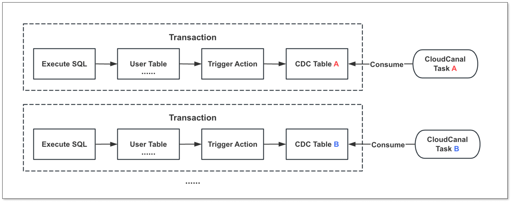
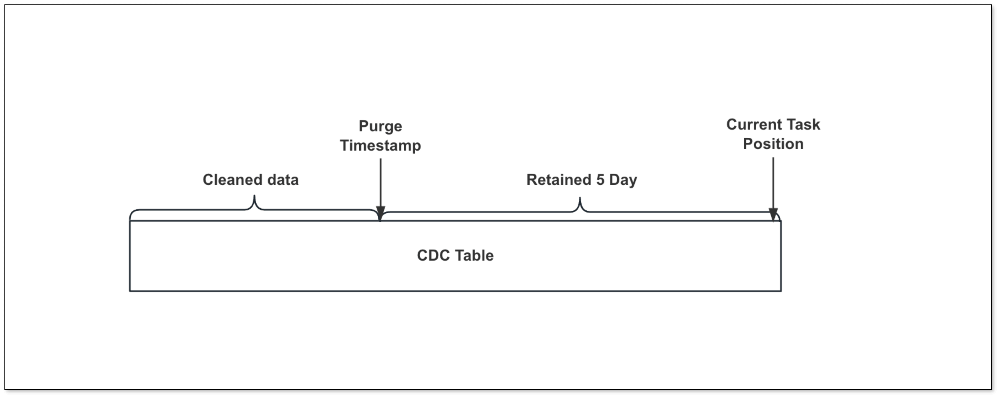
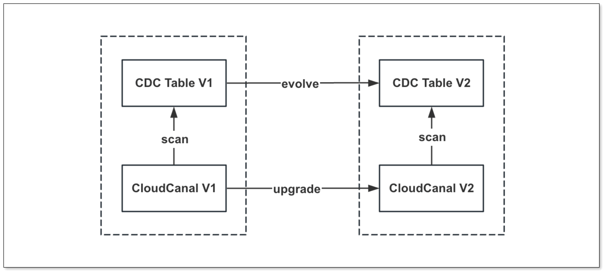

## 简述
[CloudCanal](https://www.clougence.com?src=cc-doc-blog-hana-cdc-optimize) 近期对 Hana 源端链路做了新一轮优化，优化点主要来自用户实际场景使用，这篇文章简要做下分享。

本轮优化主要包含:
- 新增任务级增量表
- 新增增量表定时清理能力
- 新增增量表表结构自动演进能力
- 任务延迟判定优化
- Hana 1.x 的兼容
- 产品化和文档优化

## 优化点

### 任务级增量表

CloudCanal Hana 源端任务原本不支持修改默认增量表，导致不同任务的触发器将增量数据写入同一个表，不同任务将相互影响。

比如，A 任务订阅的表积压大量数据，将影响B,C,D等订阅相同表的任务增量同步效率。

为解决这一问题，本轮优化支持 **每个任务可单独设置增量表** ，以此确保任务之间互不影响。

#### 增量表定时清理

触发器将增量数据写入增量表后，若未及时清理，可能导致空间占用增加。

在之前的版本中，用户只能手动定期清理，过程繁琐且具备一定风险(清理错)。

本轮优化增加设置任务参数 **triggerDataCleanEnabled** 打开自动定时清理增量表功能，并提供两个参数进行控制：

- **triggerDataCleanIntervalMin**：增量表清理间隔（单位：分钟） 
- **triggerDataRetentionMin**：增量表数据保留时间（单位：分钟）

通过这套机制，用户能够灵活控制增量表的清理操作，同时确保未消费的增量数据不会被意外清除。

#### 增量表自动演进

Hana 增量任务创建时自动生成增量表，CloudCanal 依赖于增量表实现各种能力，但随着 CloudCanal 版本更新，可能对增量表进行变更(比如加入新字段)。

由此带来的问题是：用户在更新 CloudCanal 后需要手动执行 DDL 以适应增量表结构的变化，若存在大量增量表，操作相当复杂。

为解决此问题，CloudCanal 新增 **增量表结构 DIFF 能力**，在任务启动时 **自动生成差异 DDL 实现对增量表的自动演进**。

### 延迟判定优化

Hana 源端增量同步使用位点(增量表自增ID)来判断延迟，当位点向前推进时可准确获取延迟，但若无变更事件导致位点不更新，延迟会持续增大，实际上并未发生延迟。

为解决这一问题，本轮优化 **通过查询增量表来判断是否存在延迟**，具体逻辑为:

- 若存在数据，系统根据增量数据的时间戳计算延迟。
- 若无数据，任务获取当前时间发送心跳事件，并根据心跳上的时间戳计算延迟。

时间戳仅在重置位点时才用于数据查找，且在查找时进行时区转换处理。

### Hana 1.x 的兼容
CloudCanal 之前版本只支持 Hana 2.x 版本，但是随着用户使用，我们发现一些用户还是在使用 Hana 1.x 版本。

**Hana 1.x 版本的触发器和 2.x 存在一定的差异，且元信息获取逻辑也不同**。

本轮优化对上述差异点进行了兼容性优化，使 CloudCanal 能够比较全面的支持 Hana 1.x 和 2.x 版本的数据同步。

### 产品化增强

本轮优化除了内核层面增强，对产品能力和文档做了一系列优化，有效解决用户在数据源添加、任务创建等环节中常见的权限问题。

- 完善 [Hana 权限准备文档](https://www.clougence.com/docs/dataMigrationAndSync/datasource_func/Hana/privs_for_hana)、[数据源创建 FAQ](https://www.clougence.com/cc-doc/faq/solve_hana_test_connection_fail?src=cc-doc-blog-hana-cdc-optimize)
- 创建任务时预检 Schema、增量表的权限
- 创建任务勾选表时，自动过滤当前任务增量表

这些优化举措让用户创建迁移同步链路更加流畅，节省时间。

## 未来方向

### 更多目标链路

目前 Hana 支持的目标端有 **MySQL**、**Starrocks**、**Doris** 等，接下来的版本将打通 **TiDB**、**OceanBase**、**AdbForMySQL** 等目标链路，这个需求主要来自于用户。

### 优化多字段触发的处理速度

在处理多字段表（**单个表 300+ 字段**）时，目前触发器的执行效率不满足预期，导致 DML 操作速度较慢，我们后续将对触发器模板进行性能优化，以提高处理速度。

## 总结

本文简要介绍 [CloudCanal](https://www.clougence.com?src=cc-doc-blog-hana-cdc-optimize) 近期对 Hana 源端数据同步的优化，以及链路未来的方向，希望对读者有所帮助。

