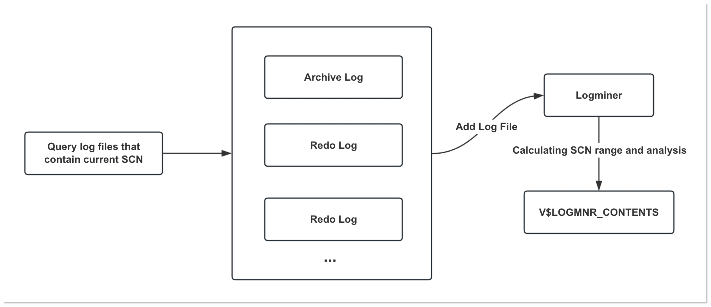
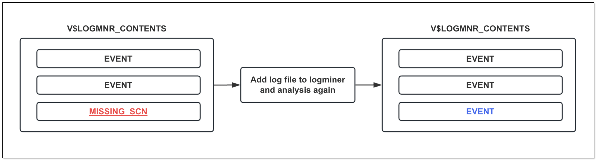
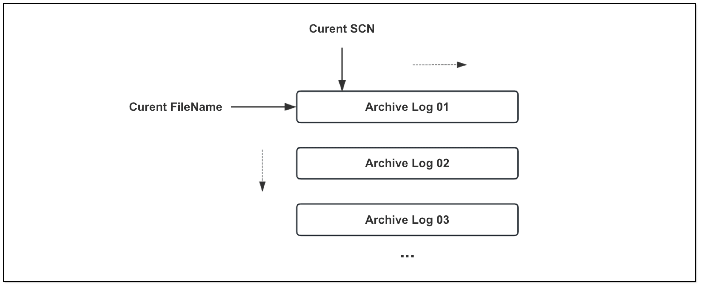

## 简述

[CloudCanal](https://www.clougence.com?src=cc-doc-blog-oracle-cdc-optimize) 最近再次对其 Oracle
源端数据同步进行了一系列优化，这些优化基于用户在真实场景中的反馈，具备很强的生产级别参考意义。

本文将简要介绍这些优化项，希望带给读者一些收获。

- 增量事件 SCN 乱序问题
- MISSING_SCN 事件干扰
- 新增的归档日志消费模式

## 优化点

### 增量事件 SCN 乱序问题

Oracle 源端 Logminer 数据同步原理大致如下：

- 获取所有包含当前 SCN 位点的 Redo 或 Archive 日志文件，并添加到 Logminer 中
- 计算本次需要分析的 SCN 范围（START_SCN, END_SCN）
- Logminer 对于 SCN 范围进行日志分析，分析结果展现在 V$LOGMNR_CONTENTS 视图中
- 扫描 V$LOGMNR_CONTENTS 视图，转换处理后同步到目标端

老版本 CloudCanal 扫描 V$LOGMNR_CONTENTS 视图时指定了 SCN 范围进行查询，但在实际客户场景中偶发 **SCN 乱序问题**。

同时 Oracle 官方也建议查询视图时不要进行过多的范围过滤或排序处理，以避免查询结果乱序。

因此我们首先 **进行了 2 个优化** ，以此解决该问题：

- 扫描 V$LOGMNR_CONTENTS 视图时直接查询所有记录，其 SCN 范围完全依赖于 Logminer 所指定的文件
- 设定 Logminer 分析的步长参数（**logMiningScnStep**）控制分析性能

### MISSING_SCN 事件干扰

使用 Logminer 分析 Redo 日志时，有时会出现 **MISSING_SCN 事件**，老版本 CloudCanal 遇到该事件则会忽略，但这会导致事件漏扫从而丢数据。

MISSING_SCN 事件具体意义为
- Logminer 分析 Redo 日志时，由于日志切换或其他特殊情况，导致部分 SCN 事件没有被 Logminer 分析到，因此在 V$LOGMNR_CONTENTS 视图中体现为
MISSING_SCN。

因此我们做了 **第 3 个优化**，当遇到 MISSING_SCN 事件时采取一定的策略规避漏扫问题，具体动作为:

- 停止扫描，回退当前 SCN
- 根据当前 SCN 重新分析和消费日志文件

重新分析后，缺失的 SCN 记录会被 Logminer 分析到，并且此类型事件出现频率较小，因此对同步效率影响非常小。

### 归档日志消费模式

Logminer 分析 Redo 日志时，如果 END_SCN 与最新 SCN 接近，可能会导致部分 SCN 无法被 Logminer 分析，从而出现数据丢失。

这种情况难以避免，因为很难在 Logminer 层面确定是否有 SCN 被漏掉。

CloudCanal 老版本通过设置 fallBackScnStep 参数与最新的 SCN 保持一定距离，这种做法虽牺牲了一部分实时性，但换取了数据的准确性，而该方式和 **只消费归档日志模式** 有一定的相似性。

归档日志不会再发生变化，从而能够保证 Logminer 分析的准确性，对于不太注重实时性的业务（比如日报），这是一个可接受的方式（**增量同步的好处不光只是实时性**）。

CloudCanal **第 4 个优化** 即增加了只消费归档日志模式（参数：**archiveLogOnlyMode**）。

在该模式下, 同步任务会根据 **Archive 日志文件 + SCN 双位点** 的方式，以 Archive 生成的时间顺序逐个消费，这样可以保证不漏扫任何一个 Archive 文件。

## 未来展望

### 优化性能

本次优化侧重于数据的准确性，优化了 **SCN 乱序问题**、**MISSING_SCN 问题**，但部分高并发场景回退 SCN 可能会导致性能下降。

所以优化性能是后续 CloudCanal Oracle 数据同步重要的一个方向。

### 数据订正能力

Oracle 部署形态多样，用户场景不一，数据类型复杂，在做足事前防范工作之后，事后如何补救也是非常重要的能力。

借助 CloudCanal 数据校验订正体系，后续丰富和优化 Oracle 源端数据校验和订正能力是一个重要的工作。

## 总结

本篇文章主要介绍 [CloudCanal](https://www.clougence.com?src=cc-doc-blog-oracle-cdc-optimize) 对于 Oracle 源端数据同步的深度优化，希望对读者有所帮助。
