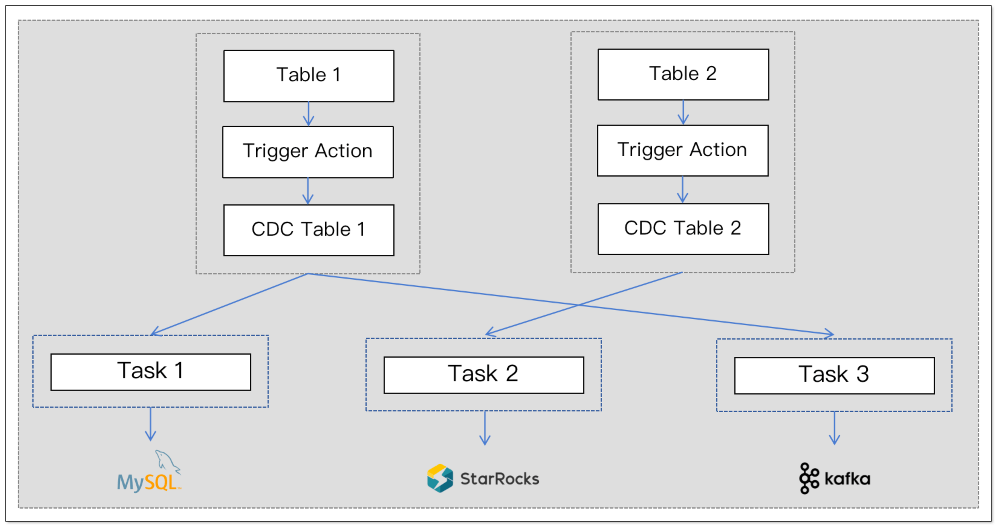
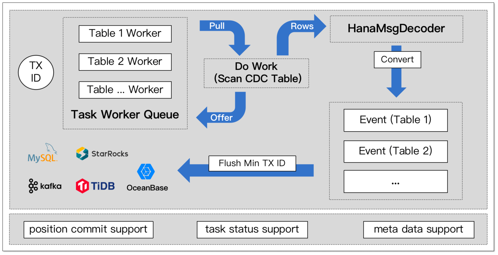
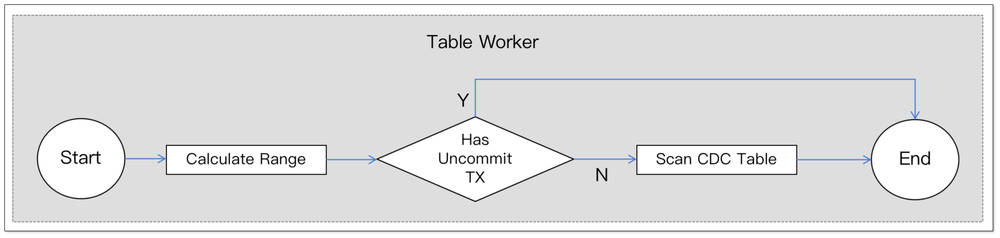

## 简述

[CloudCanal](https://www.clougence.com?src=cc-doc-blog-hana-cdc-optimize_two) 近期对 Hana 源端链路做了新一轮优化，这篇文章简要做下分享。

本轮优化主要包含:

- 表级别 CDC 表
- 表级别任务位点
- 表级别触发器

## 单 CDC 表的问题

CloudCanal 在实现 Hana 源端增量同步时，最初采用的是单 CDC 表的模式。

即所有订阅表的增量数据（插入、更新、删除）通过触发器统一写入同一张 CDC 表。这样设计的初衷是简化架构和实现，但是同时也带来了一些问题。

- **触发器执行效率低**：采用单个 CDC 表时，我们将订阅表的字段值拼接成 JSON 字符串；虽然这种方式统一，但增加了触发器的复杂性。当字段数量超过 300
个时，会导致触发器效率显著下降，影响同步性能。

- **增量数据积压**：所有订阅表的变更数据集中写入单个 CDC 表，当 A 表增量数据较多而 B 表较少时，混合写入会导致无法及时处理
B 表数据，造成 B 表数据积压，影响同步及时性。

## 优化点

### 表级别 CDC 表

本次优化实现了表级别的 CDC 表设计，每张源表都对应一张 CDC 表，CDC 表的结构仅在原表结构的基础上增加了几个位点字段，用于增量同步。

**原表**：

```sql
CREATE COLUMN TABLE "SYSTEM"."TABLE_TWO_PK" (
  "ORDERID" INTEGER NOT NULL ,
  "PRODUCTID" INTEGER NOT NULL ,
  "QUANTITY" INTEGER,
  CONSTRAINT "FANQIE_pkey_for_TA_171171268" PRIMARY KEY ("ORDERID", "PRODUCTID")
)
```

**CDC 表**：

```sql
CREATE COLUMN TABLE "SYSTEM"."SYSTEMDB_FANQIE_TABLE_TWO_PK_CDC_TABLE" (
  "ORDERID" INTEGER,
  "PRODUCTID" INTEGER,
  "QUANTITY" INTEGER,
  "__$DATA_ID" BIGINT NOT NULL ,
  "__$TRIGGER_ID" INTEGER NOT NULL ,
  "__$TRANSACTION_ID" BIGINT NOT NULL ,
  "__$CREATE_TIME" TIMESTAMP,
  "__$OPERATION" INTEGER NOT NULL 
);
-- other index
```

**触发器 (INSERT)**：
```sql
CREATE TRIGGER "FANQIE"."CLOUD_CANAL_ON_I_TABLE_TWO_PK_TRIGGER_104" AFTER INSERT ON "SYSTEM"."TABLE_TWO_PK" REFERENCING NEW ROW NEW FOR EACH ROW 
BEGIN 
  DECLARE EXIT HANDLER FOR SQLEXCEPTION BEGIN  END; 
  IF 1=1 THEN 
    INSERT INTO "SYSTEM"."SYSTEMDB_FANQIE_TABLE_TWO_PK_CDC_TABLE" (__$DATA_ID, __$TRIGGER_ID, __$TRANSACTION_ID, __$CREATE_TIME, __$OPERATION, "ORDERID","PRODUCTID","QUANTITY") 
    VALUES( 
      "SYSTEM"."CC_TRIGGER_SEQ".NEXTVAL, 
      433, 
      CURRENT_UPDATE_TRANSACTION(), 
      CURRENT_UTCTIMESTAMP, 
      2, 
      :NEW."ORDERID" ,
      :NEW."PRODUCTID" ,
      :NEW."QUANTITY"  
    ); 
  END IF; 
END;
```

这样的设计 CDC 表的好处如下：

- 表级别 CDC 表更加独立，方便进行多次订阅。
- 触发器只需要执行 INSERT 语句，因此对于字段较多的表也能够快速执行。
- 扫描消费 CDC 数据时，不需要做额外的处理，消费更简单。



### 表级别任务位点

表级 CDC 确实带来了许多好处，但在增量同步时，每个表都有自己的位点，原有的单一位点无法满足这种同步需求。

因此，CloudCanal 引入了表级别的增量同步位点，确保每个表能够消费各自对应的增量同步位点。位点的具体体现为：

```json
[
  {
    "db": "SYSTEMDB",
    "schema": "FANQIE",
    "table": "TABLE_TWO_PK",
    "dataId": 352,
    "txId": 442441,
    "timestamp": 1715828416114
  },
  {
    "db": "SYSTEMDB",
    "schema": "FANQIE",
    "table": "TABLE_TWO_PK_2",
    "dataId": 97,
    "txId": 11212,
    "timestamp": 1715828311123
  },
  ...
]
```

这样做的好处如下：

- **位点精细控制**：每个表都有自己的增量同步位点，使得增量任务可以针对特定表进行增量重放，而不是重放所有表的数据。这样可以实现更加精细的控制，减少不必要的数据传输和处理，提高同步效率。

- **数据并行处理**：由于每个表有自己的位点，可以实现表级别的并行处理。不同表的增量数据可以同时进行处理，避免了单一位点导致的串行处理瓶颈，从而加快了同步速度。

### 核心同步原理

对于一个增量任务来说，源端涉及到扫描多个 CDC 表，需要保证单个表变更数据的顺序。

增量消费基础处理模型如下：

* 根据源端订阅表数量，初始化相应数量的 Table Worker 工作线程。
* 每个 Table Worker 根据位点消费对应的 CDC 表数据。



实际的 Table Worker 工作线程会根据 **事务 ID** 计算本次扫描范围，判断该范围是否有未提交的事务：

- 如果有未提交事务：扫描线程进入等待队列，等待下一轮扫描。
- 如果没有未提交事务：根据确定的范围消费增量数据，并更新单表任务位点。



## 未来方向

### 表级别位点产品化

位点状态在增量同步过程中至关重要，但针对表级别的位点，目前尚未提供可视化的界面；

包括重置位点等功能都尚未支持产品化能力，后续会逐步完善。

## 总结

本文简要介绍 [CloudCanal](https://www.clougence.com?src=cc-doc-blog-hana-cdc-optimize_two) 近期对 Hana
源端数据同步的优化，以及链路未来的方向，希望对读者有所帮助。

