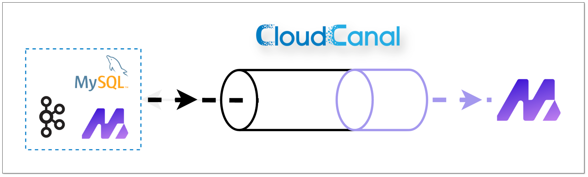
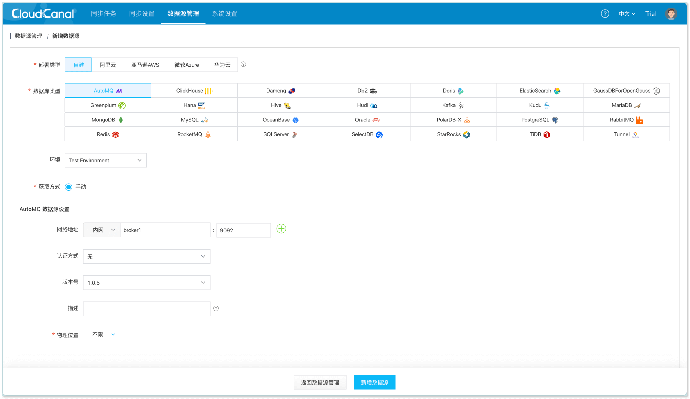
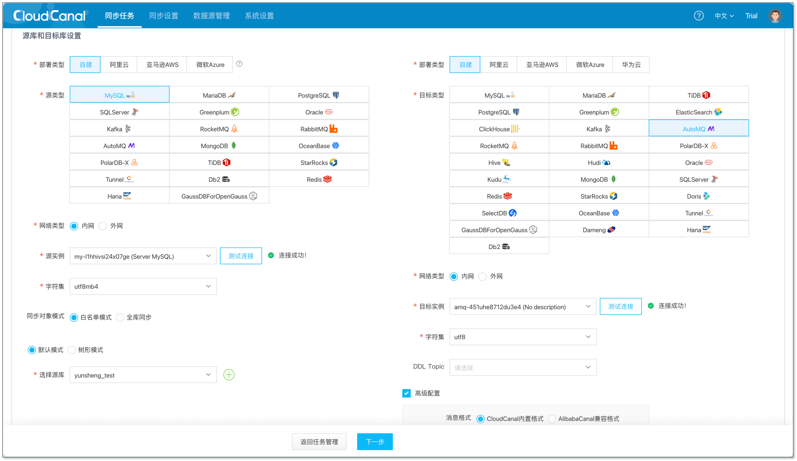
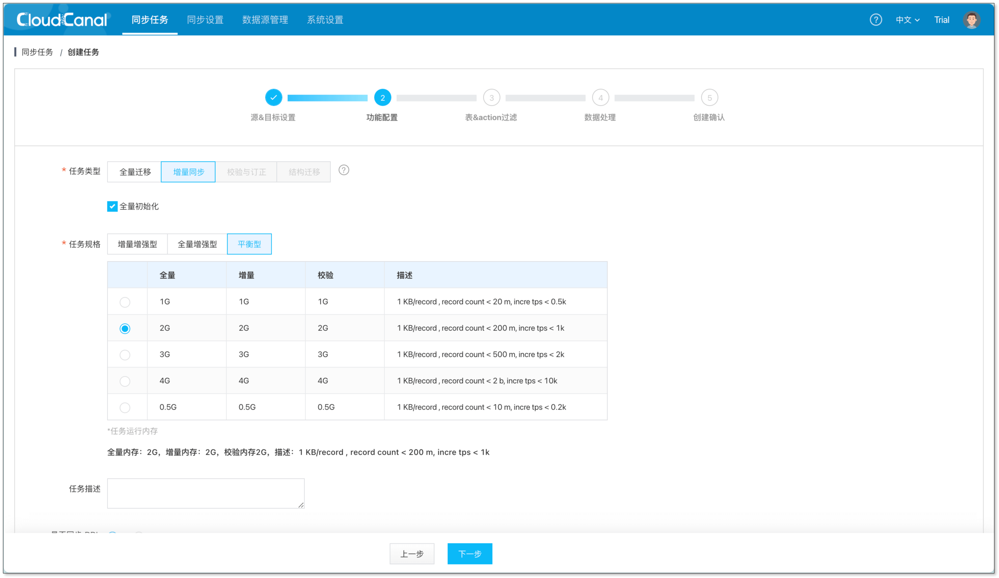
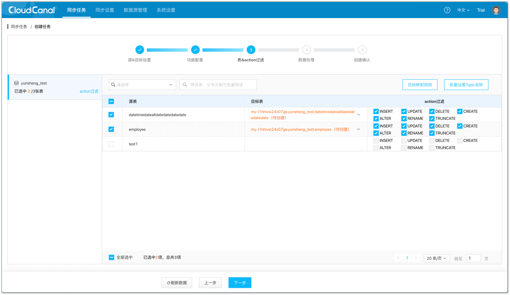
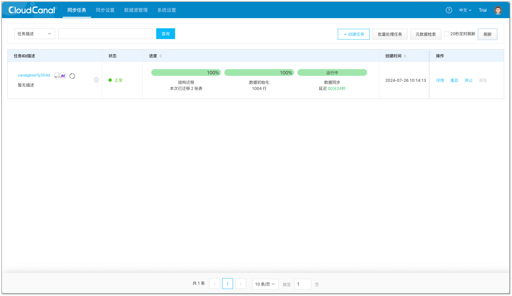

## 简述

[AutoMQ](https://www.automq.com) 是一款云原生消息中间件，通过对 Kafka 的存储进行云原生改造，实现不错的成本降低。

[CloudCanal](https://www.clougence.com?src=mysql-automq-sync) 最近接入了 AutoMQ，打通了多个数据同步链路，为用户使用 AutoMQ 助一臂之力。



本文将首先简要介绍 AutoMQ 的技术背景，然后通过 **MySQL -> AutoMQ** 链路展示其功能和优势。

## 为什么接入 AutoMQ ?

### 高度兼容 Kafka

AutoMQ 基于云原生将 Kafka 存储分离至对象存储，在保持与 Kafka 高度兼容的前提下，实现了不错的成本降低和资源弹性。

用户能够在不改变现有架构的情况下，轻松切换到 AutoMQ，同时享受到 AutoMQ 提供的额外优势。

### 性能与成本效益

AutoMQ 的计算层（Broker）是无状态的，支持 **自动扩缩容**、**自我平衡** 和 **秒级分区重新分配**。

## CloudCanal 做了哪些事 ?

### 继承自 Kafka

得益于 AutoMQ 的功能语义与 Kafka 高度兼容的特性，AutoMQ 相关链路沿用原 Kafka 数据管道迁移数据，使得其与 Kafka 相对应链路的特点与优势都继承了下来。

- **Topic 自动创建**：目前任务支持自动创建 Kafka 的 Topic，并且能自定义分区数量。

- **数据批量写入**：支持对同一表的相同操作合并到同一条消息体中，实现数据批量写入，从而减少网络带宽的使用，提高数据处理的效率。

### 打通关键链路

CloudCanal 目前实现了多个关键数据同步链路：

- **MySQL -> AutoMQ**：快速从 MySQL -> Kafka 转变为 MySQL -> AutoMQ，享受 AutoMQ 云原生的便利。

- **Kafka -> AutoMQ**：快速从 Kafka 迁移到 AutoMQ，轻松实现技术升级。

- **AutoMQ -> AutoMQ**：为 AutoMQ 之间提供数据同步，并确保数据的实时性和稳定性。

其他链路还包括 AutoMQ -> Kafka 和 AutoMQ -> MySQL，CloudCanal 后续会打通关于 AutoMQ 的相关链路，满足用户的多样化需求；如果有特定的链路需求，欢迎提出。

## 操作示例

### 准备 CloudCanal

- 参考 [全新安装(Docker Linux/MacOS)](https://www.clougence.com/cc-doc/productOP/docker/install_linux_macos) 在 Docker 上部署 CloudCanal 。

### 准备 AutoMQ

- 参考 [AutoMQ 安装文档](https://www.automq.com/docs/automq/getting-started/deploy-multi-nodes-test-cluster-on-docker) 在 Docker 上部署 AutoMQ 集群。

- 将 cloudcanal-sidecar 容器连接到 automq_net 网络。
   ```shell
   docker network connect automq_net cloudcanal-sidecar
   ```

### 添加数据源

- 登陆 CloudCanal 平台，选择 **数据源管理** -> **新增数据源**。
- 将源端 **MySQL** 和目标端 **AutoMQ** 分别添加；Docker 创建的 AutoMQ 集群，网络地址填写 **broker1:9092** 或 **broker2:9092**。
  

### 创建同步任务

- **同步任务** -> **创建任务**，选择对应的数据源，进行连接测试。
  
- 点击下一步，选择任务类型以及规格，规格建议 2G 及以上。
  
- 点击下一步，选择希望进行同步的表。
  
- 继续点击下一步，直到创建任务。
- 任务结构迁移、全量迁移、增量同步，正常运行.
  

## 常见问题

### AutoMQ 测试链接报错

- 需要将 cloudcanal-sidecar 容器连接到 automq_net 网络中。

    ```shell
    docker network connect automq_net cloudcanal-sidecar
    ```

- 检查网络地址是否正确，示例中 Docker 创建的 AutoMQ 集群，网络地址填写 **broker1:9092** 或 **broker2:9092**。

### AutoMQ 支持哪些消息格式

- 支持 **CloudCanal Json**、**Canal Json**、**Debezium Envelope** 等[多种消息格式](/docs/reference/kafka_msg_format_type)。

## 总结
本文介绍了 [CloudCanal](https://www.clougence.com?src=mysql-automq-sync) 与 AutoMQ 的整合，并通过 MySQL -> AutoMQ 展示其能力。