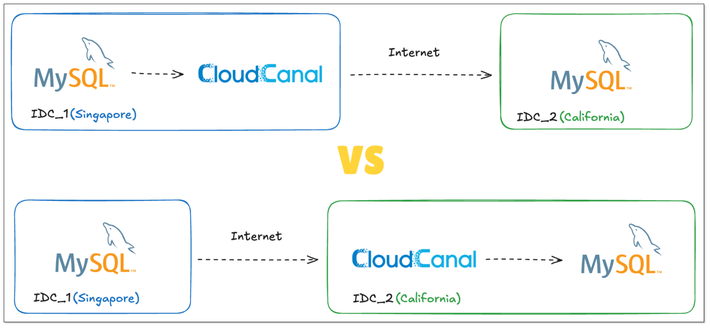
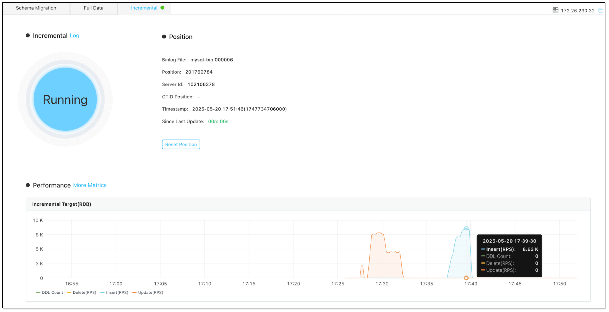
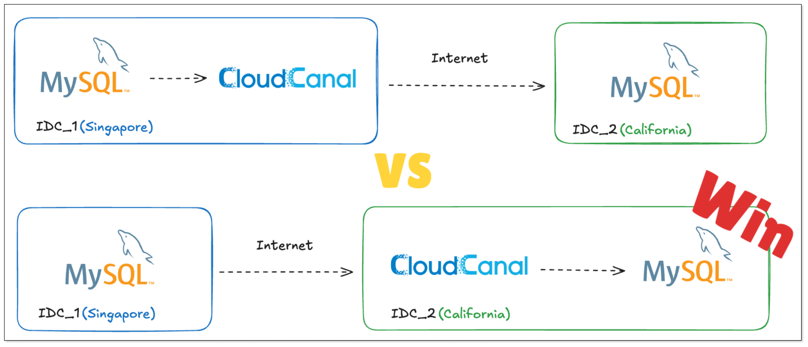

## 背景介绍

在 CloudCanal 长期支持企业业务数据迁移同步的过程中，跨省、跨国，乃至跨洲的业务数据迁移同步是常见的需求之一，许多客户经常问到：如何部署 CloudCanal 以及做任务调优比较好？

对于这个问题，我们从自身产品技术角度能够提供一些建议，但实际情况往往复杂得多，这也是本文要讨论的问题。本文将基于理论与实践，深入探讨跨洲际数据迁移同步的最佳实践方案。

## 跨洲际数据迁移同步的挑战

跨洲际数据迁移同步面临的主要挑战来自两个方面：
- **不可避免的网络延迟**：例如新加坡到美国的网络延迟通常在 150 ms～300 ms之间，相比关系型数据库单条按主键 INSERT/UPDATE 操作（通常小于 5 ms）高出两个数量级。
- **复杂的网络质量因素**：包括丢包率、网关路径和处理时间等问题。与内网传输相比，跨洲际传输需要经过机架、机房、骨干网上的多层交换机和路由器等设备。

另外针对数据库迁移同步，还需要考虑源、对端数据库的忙碌程度、网络带宽和数据传输量的匹配关系等。

如果使用 CloudCanal，则需要了解其源端数据获取和目标端数据写入机制，以初步确定部署方案。

## CloudCanal 迁移同步的优化

### 数据迁移技术
对于关系型数据库的数据迁移，CloudCanal 使用 **JDBC 逻辑扫描数据**，并且在表结构支持的情况下，通过分页等方式做到**断点续传**，另外支持自动**表间并行**，以及通过手动设定过滤条件实现**表内并行**（需多个任务）。

在数据迁移的目标端，因为所有来源数据均为 INSERT，且数据天然按表成批，所以固定优化写入方式包括：**攒批**、**拆分并行**、**batch 写入**、**INSERT 重写**（相同表多条数据转换成 `insert..values(),(),()`）。

### 数据同步技术
CloudCanal 数据同步过程中，获取增量数据的方式因源端数据库不同有所差别，如下表所示：

|  源端数据库类型   |增量获取方式  | 
| ------------ | ----- |
| MySQL   | Binlog 解析   |
|  PostgreSQL  |  logical wal 订阅   |
| Oracle | Logminer 解析 | 
| SQL Server | SQL Server CDC 表扫描      | 
| MongoDB | oplog 扫描 / ChangeStream 服务  | 
| Redis | PSYNC 指令      | 
| SAP Hana | Trigger      | 
| Kafka | 消息订阅      | 
| StarRocks | 周期性增量数据扫描  |
| ... | ...|

除了部分主动扫描技术，大部分都依赖数据库"吐"增量数据的效率，具有一定的不可控性。

数据同步的目标端，和数据迁移的区别在于 **操作种类更多**（INSERT/UPDATE/DELETE），且**需要保证数据顺序一致性**，故优化方式也有所区别。

|  优化方式   |说明  | 
| ------------ | ----- |
| 攒批   | 减少网络交互、实现部分目标端数据库高效合并   |
| 按数据唯一标识分区并行  |  满足基本的数据保序要求 |
| 按表级别分区并行 | 对于数据唯一标识变更的弱化并行方式 | 
| 多语句 | 关系型数据库普遍可以通过分号拼接操作优化网络传输      |
| bulk load | 对于具备全镜像，且目标端具备 upsert 能力的来源数据，将 INSERT/UPDATE 转换成 INSERT 批量写入并覆盖 |
| 分布式任务|创建多个任务对相同来源数据进行分区后写入|

## 跨洲际同步最佳实践探索

从 CloudCanal 技术实现来看，**目标端写入优化措施比源端更多且更可控**。因此，我们通常建议将 CloudCanal 与源端数据库部署在同一区域，以降低网络延迟、网络质量等因素对数据获取的影响。

但这一理论假设是否成立？我们通过 MySQL 到 MySQL 的跨洲际迁移同步进行了实际验证。

### 前置准备

**资源准备：**

- 源端 MySQL：新加坡机房（4 核 8GB 内存）
- 目标端 MySQL：美国硅谷机房（4 核 8GB 内存）
- 部署 CloudCanal：分别在新加坡和硅谷各准备一台虚拟机（Linux x64，8 核 16GB 内存）用于部署 CloudCanal

**实验计划**：进行两次相同的数据迁移和同步，对比数据迁移和数据同步的性能。

### 实验过程

1. 在 **新加坡 MySQL** 上新造 130 万行数据。
2. 使用部署在 **新加坡虚拟机上的 CloudCanal** 任务迁移 **新加坡 MySQL** 数据到 **硅谷 MySQL**，记录新加坡迁移任务的性能。  

3. 在 **新加坡 MySQL** 上变更一批数据（UPDATE 和 INSERT），记录新加坡同步任务的性能。 

4. 停止新加坡迁移同步任务，删除 **硅谷 MySQL** 上的数据。
5. 使用部署在 **硅谷虚拟机上的 CloudCanal** 任务迁移 **新加坡 MySQL** 数据到 **硅谷 MySQL**，记录硅谷迁移任务的性能。 

6. 在 **新加坡 MySQL** 上变更一批数据（UPDATE 和 INSERT），记录硅谷同步任务的性能。

### 实验结果与分析

|  任务位置   |类型  | 性能 |
| ------------ | ----- |----- |
| 新加坡   |  数据迁移  | 6.5k records/sec |
| 硅谷    |  数据迁移   | 15k records/sec|
| 新加坡   |  数据同步  | 8k records/sec |
| 硅谷    |  数据同步  | 32k records/sec |

从实际操作结果来看，**将 CloudCanal 部署在目标端（硅谷）环境时，数据迁移同步性能显著优于部署在源端（新加坡）的方案**，这与我们的初始假设相悖。

经过深入分析，可能的原因包括：

- 两地机房网关安全策略、上下行带宽存在差异。
- CloudCanal 批量写入因网络质量等因素影响，效率反而没有 binlog 传输或逻辑扫描效率高。
- 其他未知因素。

## 最佳实践

上述的验证，对跨洲际数据迁移同步有一定的参考意义，但可能和实际业务情况存在一定的差距，如：

- 业务数据库负载较重，实际应用中源端可能无法充分推送增量数据。
- 业务有不同质量的专线，网络质量相对较好。
- 机房网关安全策略和试验环境差异。

结合多种影响因素、性能、可控性综合考虑，**我们推荐验证期间，分别部署 CloudCanal 在数据库源端和目标端环境中进行性能测试，再从实际效果选择最佳的部署方式**。