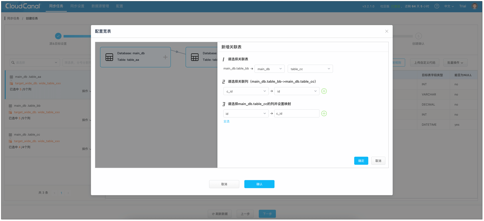
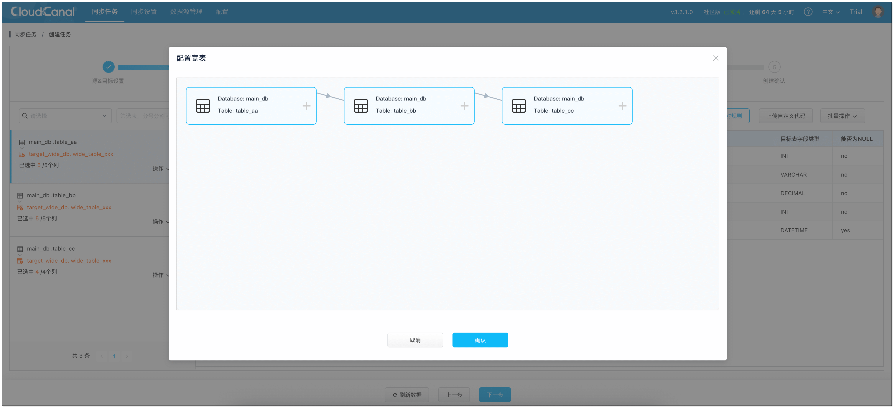

在企业级数据场景中，一个报表查询往往需要 3 张以上表的 JOIN，这类查询在数据量较大的场景下，需要数分钟甚至个把小时才能返回。

本文将简要探讨宽表技术的来龙去脉，以及它如何帮助解决多表关联带来的性能瓶颈，并结合 [CloudCanal](https://www.clougence.com) 最新推出的可视化宽表构建功能，无痛实现跨表数据的实时整合。

## 数据分析困境

在结构化数据系统中，随着业务模型的复杂化，数据表之间的关联不断增多。以电商系统为例，订单、商品、用户等表结构天然具有关联性：

- **订单数据**：商品 ID (关联 **商品数据**)、数量、总价、优惠信息、买家 ID (关联 **用户数据**)等
- **商品数据**：名称、颜色、质地、库存、商家 ID (关联 **用户数据**)等
- **用户数据**：账号、密码、昵称、手机、邮箱等

关系型数据库通过建立关系范式实现了存储效率最大化（冗余信息少），并优化了事务型操作的性能。但一旦进入数据分析阶段，这种表结构会给查询带来极大挑战。

在进行批量聚合、筛选等复杂分析时，如“计算过去 1 个月商品销售额 Top 10”，往往需要多表 JOIN 操作。而随着关联表数量增加，可能的执行计划（搜索空间）也呈几何级增长：

关联表数量|排列种类|
--------------|--|
2|2|
4|24|
6|720|
8|40320 |
10| 3628800 |

对于一个 ERP 或 CRM 系统而言，5 张表以上的关联是常态。面对如此庞大的执行计划可能性，**如何高效地找到最优解** 成为数据库分析查询的核心难题。

面对这一挑战，行业演进出了两种技术路线：**查询优化** 和 **预计算**。而 **打宽表** 是预计算的核心能力之一。

## 查询优化 vs 预计算
### 查询优化

面对这么多种可能性，解决方式之一就是通过减少可能性加快搜索，这就是数据库优化器术语——**剪枝**。其中衍生出两种技术：**基于规则的优化器（RBO: Rule-Based Optimizer）** 和 **基于代价的优化器（CBO: Cost-Based Optimizer）**。

- **基于规则的优化器（RBO）**：RBO不考虑数据实际分布，而是依据预设的静态规则对 SQL 执行计划进行调整。市面上的数据库产品，都有一些通用的优化规则，如谓词下推等。不同数据库产品基于其业务属性和架构特点，还拥有独特的优化规则，如 SAP Hana 承载 SAP ERP 业务，针对全内存和大量 JOIN 的场景，其优化器规则便与其他数据库存在显著差异。

- **基于代价的优化器（CBO）**：相较于 RBO，CBO 通过评估不同执行计划的 I/O、CPU 等资源消耗，选择代价最低的计划。这种优化方式会通过数据的具体分布与查询 SQL 的特点来动态调整，即使两条一模一样的 SQL，因为设置的参数值不一样，可能最后的执行计划大相径庭。CBO 一般具备一个精密复杂的统计信息子系统，包括各个表的数据量、基于主键或者关联维度的数据分布直方图等信息。

现代数据库内核一般会联合使用 RBO 和 CBO 对 SQL 进行优化。

### 预计算

预计算认为 **关联表之间的数据关系是确定的**，所以在数据生成时就进行聚合与关联，形成一张“宽”的表结构，从而避免后续每次查询都重新进行关联。数据发生变化时，仅需增量更新对应的宽表数据。它的早期实现可以追溯到关系型数据库的 **物化视图**。

从计算量消耗角度而言，预计算大幅优于即时查询优化。然而，其局限性亦不容忽视：

- **JOIN 语义实现受限**：预计算对于非 Left Join 语义的实现逻辑复杂且代价巨大，通常难以在流式处理中高效支持。
- **大量数据更新影响稳定性**：在 1 对 N 的数据关系中，若“1”端数据发生变化，可能导致宽表数据大规模更新，对服务稳定性构成挑战。
- **功能与性能权衡**：预计算通常无法像即时查询那样支持各种聚合、过滤条件及函数，部分是功能实现难度，部分是性能代价考量。

### 最佳实践

在真实场景中，业界普遍倾向于 **“双管齐下”** 的策略：预计算生成中间数据，而即时查询则在此基础上完成最终的聚合与过滤，实现功能与性能的平衡。

- **预计算**：当前最流行的方案即 **流计算**，近些年出现的流式数据库也在尝试更好地解决这类问题，传统关系型数据库或者数据仓库实现的物化视图也是一种很好的解决方案。

- **即时查询**：随着 **列式**、**行列混合** 数据结构普及，**AVX 512** 等新指令集落地，**FPGA、GPU** 等专用或高性能计算硬件尝试，以及 **知识网格**、**分布式计算** 等软件手段应用，实时分析数据库在数据筛选和聚合性能上获得了显著提升。

两者结合使用，为在线数据分析场景带来了巨大的助益。

## CloudCanal 的宽表历程

CloudCanal 在宽表构建方面的演进，实现了从“高代码门槛”到“零代码构建”的转变。早期版本中通过自定义代码支持用户在数据迁移同步过程中，自行查询关联表数据并构建宽表，再回写到目标端。尽管功能可行，但用户需要写代码，难度太高，因而未形成大规模应用。

为此，CloudCanal 实现了 **可视化宽表构建**。用户仅需在界面中选择需要打宽表的表，并选择关联的列，即可构建出一个既支持历史数据迁移，又支持实时更新的宽表任务。

目前，该功能已支持链路包括：     
- MySQL -> MySQL/StarRocks/Doris/SelectDB
- PostgreSQL/SQL Server/Oracle/MySQL -> MySQL
- PostgreSQL -> StarRocks/Doris/SelectDB

未来将持续开放更多链路。

## CloudCanal 可视化构建宽表

### 宽表定义

CloudCanal 宽表构建中的核心角色包括：

- **驱动表**：仅可选择一张，作为宽表的基准数据源。
- **关联表**：可选择多张，提供驱动表需要补充的字段信息。

CloudCanal 默认实现 **Left Join** 语义，确保返回驱动表所有数据，即使关联表中无匹配数据。

目前，CloudCanal 支持 2 种关联拓扑结构：
- **线形** 关系：A.b_id = B.id and B.c_id = C.id and ...，其中所有表均不可重复选择，且不支持形成环状关联。
- **星形** 关系：A.b_id = B.id and A.c_id = C.id and ...，不支持形成环状关联。

其中 A 表定义为驱动表，B、C 表定义为关联表。

### 数据变更处理策略

#### 对端为关系型数据库(如 MySQL)
- **驱动表 INSERT**：自动补全关联表字段。
- **驱动表 UPDATE/DELETE**：不做关联表字段关联。
- **关联表 INSERT**：如有下一层关联表，则做关联表字段关联，INSERT 操作转换为 UPDATE。
- **关联表 UPDATE**：如有下一层关联表，不做关联表字段关联。
- **关联表 DELETE**：如有下一层关联表，则做关联表字段关联，DELETE 操作转换为全字段为 NULL 的 UPDATE 操作。

#### 对端为整行覆盖类数据库(如 StarRocks/Doris)
- **驱动表 INSERT/UPDATE/DELETE**：自动补全关联表字段。
- **关联表 INSERT/UPDATE/DELETE**：自动忽略。
  
  :::info
  若需实现到覆盖类数据库 **关联表变更**，可以分阶段完成。
  
  首先创建 **源库 > 关系型数据库宽表** 迁移同步任务，再创建 **关系型数据库宽表 > 覆盖类数据库** 迁移同步任务。
  :::

### 操作示例

1. 进入 CloudCanal 控制台，点击 **同步任务** > **创建任务**。
2. 进入 **选择表** 步骤，选择需要打宽表的表，对端均选择宽表进行映射。
3. 进入 **数据处理** 步骤。
    1. 页面左侧选择 **驱动表**，并点击 **操作** > **宽表**，设定宽表定义。
       
        - **关联列** 选择和设置，支持多个。
        - 关联表 **其他列** 选择，以及宽表映射字段填写，此操作主要防止多张来源表字段名在目标宽表中重复。
          :::info
          **1.**
          关联表如果级联关联其他表，**务必选择其对应关联列**。如 A.b_id = B.id and B.c_id = C.id，则选择 B 的其他列时，必须选择 c_id。

          **2.**
          在复杂关联关系中，不同驱动表或关联表存在相同列名，故在选择其他列时，**映射到不同列以规避冲突**。
          :::

    3. 点击 **确定** 完成设置。
       
    4. 页面左侧选择 **关联表**，确认列和宽表列映射正确。
4. 继续完成任务创建流程，即可启动宽表同步任务。

## 总结
宽表作为一种核心的数据预计算策略，有效解决了关系数据库范式化设计在 OLAP 场景下多表关联查询的性能瓶颈。CloudCanal 提供的可视化宽表构建能力，不仅大幅简化了构建流程，而且显著降低了技术门槛。它为构建具备实时性与灵活性的数据分析平台提供了关键工具，助力数据架构师和 DBA 高效构建实时数据分析层。