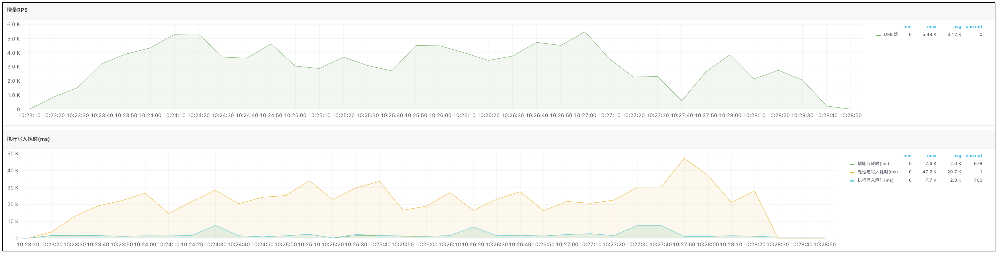

在企业级的数据同步和迁移场景中，Redis 凭借高性能和灵活的数据结构，常被用于缓存和高频读写场景。随着业务数据的积累，Redis 中不可避免会出现包含大量元素的“大 Key”，如包含几十万条数据的 List、Set 或 Hash 类型。在进行全量同步或迁移时，大 Key 往往成为性能瓶颈甚至故障源。

[CloudCanal](https://www.clougence.com) 作为专业的数据迁移同步工具，不断[优化 Redis 同步技术](https://www.clougence.com/blog/data_insights/redis_change_data_capture_optimize)，近期对 Redis 源端链路又完成了一系列优化，包括[更多指令支持](https://www.clougence.com/cc-doc/dataMigrationAndSync/connection/redis2)、[数据校验](https://www.clougence.com/cc-doc/dataMigrationAndSync/datasource_func/Redis/redis_check_simple)以及 **全量大 Key 同步优化**。本文重点介绍在大 Key 同步场景下，CloudCanal 的技术优化与性能提升。

## 大 Key 同步挑战

在高并发、高实时性的业务系统中，Redis 某个 Key 的元素可能高达数十万甚至上百万。一旦执行全量数据同步，容易带来如下问题：

- **内存占用剧增（OOM）**：一次性加载整个大 Key 会使任务程序的内存瞬时暴涨，严重时可能引发 OOM。
- **协议限制超限**：Redis 协议对单条命令的参数数量和请求体大小有上限（如 RESP 协议中为 512MB），超出即报错。
- **对端写入失败**：Redis 目标节点在处理过大命令时，可能因资源不足而拒绝执行，导致同步中断。

## CloudCanal 同步技术优化
为解决上述问题，CloudCanal 引入了针对大 Key 的延迟加载与分片同步机制，确保在不牺牲一致性前提下，顺利完成 Redis 全量同步。
### 延迟加载
传统同步方式往往一次性读取整个 Key 内容加载到内存中，CloudCanal 则采取延迟加载策略，即在全量同步过程中，源端 Redis 的数据不会立即加载到内存中，而是通过 **分片** 的方式逐步加载和处理。这种方式可以 **有效减少内存占用**，避免程序 OOM 问题。

### 大 Key 分片同步
CloudCanal 对 Redis 源端链路的核心优化是将大 Key 拆分成多个“小片段”，分片写入目标 Redis。每个片段包含的元素数量可以通过参数灵活控制：

- 参数名：`parseFullEventBatchSize`
- 默认值：1024
- 类型支持：List、Set、ZSet、Hash

例如，一个包含 50 万元素的 Set，可以被拆成约 490 个片段，每次发送一个 SADD 命令携带 1024 个元素。

### 分片同步流程
1. **分片计算**：CloudCanal 首先统计大 Key 中的元素总数，并根据设定的参数 `parseFullEventBatchSize` 将其切分成多个片段。
2. **片段构造与发送**：每个片段被构造成符合 Redis 协议限制的命令，多次发送，最终重建完整 Key 内容。
3. **顺序与原子性保证**：每个片段按顺序写入，确保目标端数据一致性。

## 实际效果
CloudCanal 测试了优化后的大 Key 同步效果，数据准备如下：
- 100w 普通大小 Key（包含：String、Set、ZSet、List、Hash）
- 5w 30 MB 大小 Key（包含：String、Set、ZSet、List、Hash，最大 Key 35 MB左右）

数据同步性能如下：

结果显示，CloudCanal 在 Redis 到 Redis 数据同步（包含大 Key 场景）中，基准 RPS 可达到 4-5 K 左右，基本能够满足业务日常同步需求，并确保数据准确。

## 总结
通过延迟加载与分片同步机制，CloudCanal 有效避免全量同步过程中可能出现的 OOM 问题和协议限制问题，从而提升全量同步的稳定性和可靠性。
