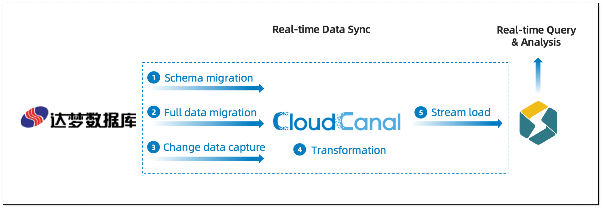
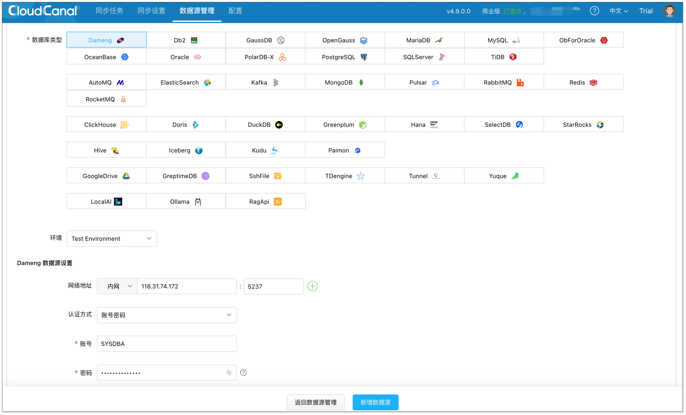
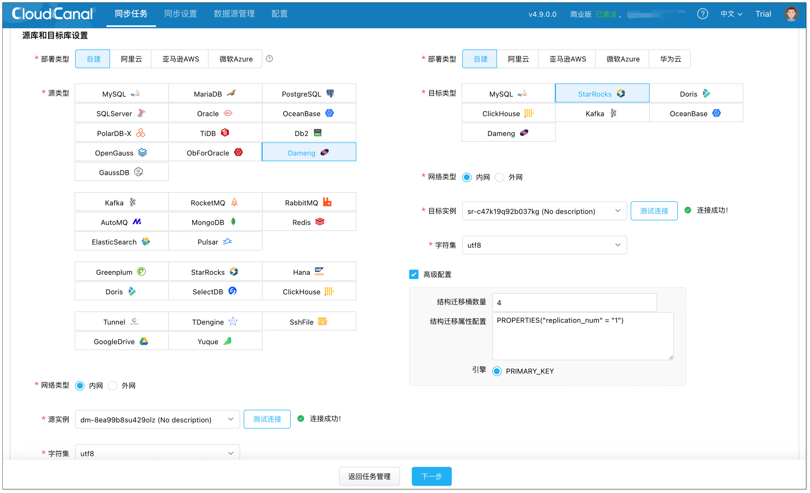
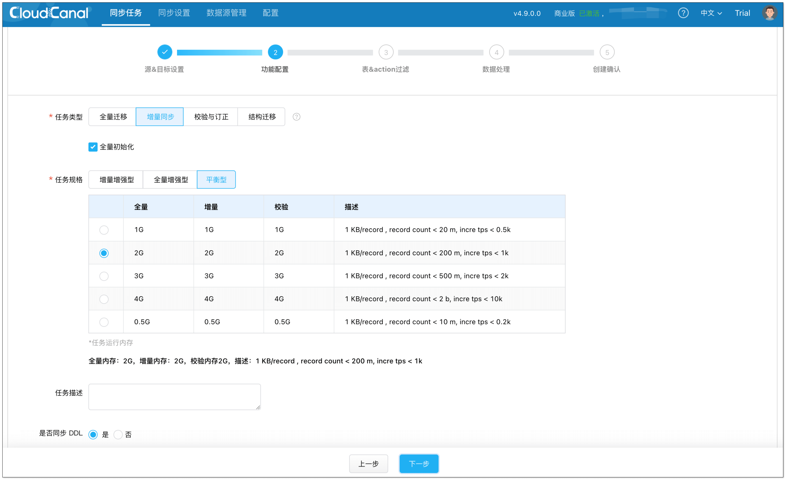
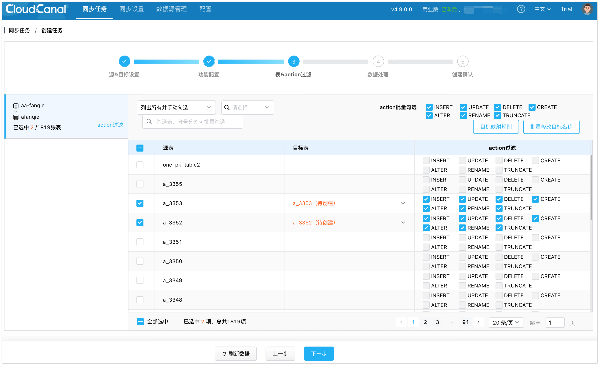
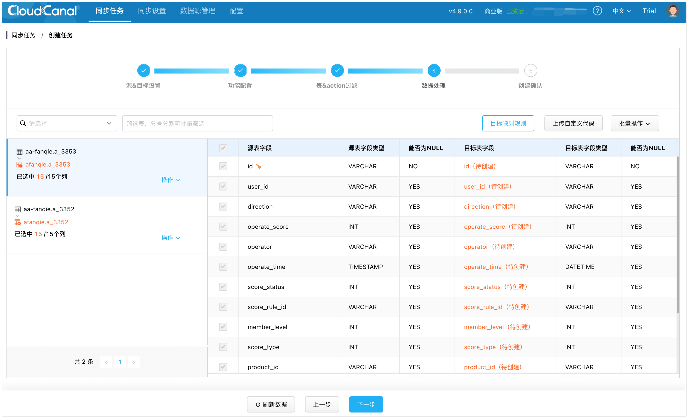
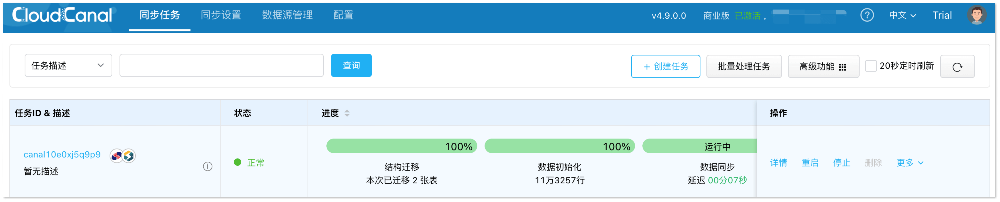

随着国产化趋势的推进，达梦数据库在政务、金融、电信等关键行业中被越来越多地采用，处理着核心业务数据。与此同时，企业对数据分析的要求也在不断升级，传统报表已难以满足日益增长的实时分析诉求。构建实时高效、稳定可扩展的数据同步链路，已成为许多技术团队的迫切需求。

今天，我们将分享如何快速将达梦数据实时同步至新一代数仓（以 StarRocks 为例），打造面向国产化环境的实时数仓方案，实现从数据生产到分析决策的闭环。

## 架构设计
为了让达梦中的业务数据服务于实时分析，我们需要将其高效地同步至数仓 StarRocks。构建这条链路，其关键在于**实时低延迟**、**稳定易维护**。

CloudCanal 作为专业的端到端数据实时同步工具，具备**低延迟**、**高可靠**的数据库变更捕获（CDC）能力，为达梦数据库到数仓（如 StarRocks）的迁移同步提供了**一站式、自动化的解决方案**。

关键部分说明：

+ **全量初始化**:CloudCanal 自动完成结构迁移和历史数据一次性迁移。
+ **增量采集**：监听达梦数据库变更（Insert/Update/Delete）事件，支持 DDL 同步。
+ **实时转换**：自动完成 **数据格式标准化**、**字段映射**、**类型转换**（如 DATE → DATETIME）。
+ **高速写入**：通过 **Stream Load** 模式将数据写入 StarRocks 。

## 技术挑战与解决方案
### 增量实时同步
达梦数据库的增量同步能力主要依赖 LogMiner 机制，通过解析归档日志获取 DDL 与 DML 操作记录。然而，LogMiner 的使用过程复杂，且对日志完整性、会话资源等有较高要求，开发与运维门槛较高。

**CloudCanal 的解决方案：**

CloudCanal 原生集成了达梦的 `DBMS_LOGMNR` 机制，实现了对归档日志的自动解析和增量变更提取，用户无需手动编写调用逻辑。整个过程主要包括以下几个步骤：

+ 添加分析日志（`ADD_LOGFILE`）
+ 解析日志（`START_LOGMNR`）
+ 查询日志结果（`V$LOGMNR_CONTENTS`）
+ 结束解析（`END_LOGMNR`）

通过这一过程，实现了**稳定、高效**的达梦增量同步能力。

### DDL 兼容问题
在解析达梦的 SQL DDL 时，常用的解析器（如 Druid）存在兼容性不足的问题，例如在 `ALTER TABLE ... ADD COLUMN` 等 DDL 语法上，Druid 无法正常解析，导致同步失败或中断。

**CloudCanal 的解决方案：**

CloudCanal 复用了 Oracle 解析器兼容达梦的 SQL，同时针对 DDL 不兼容的问题，提供了**内置的关键字替换策略**：用户只需开启一个可选参数，系统会在解析前**自动将不兼容的语法进行转换**（如 `ADD COLUMN` → `ADD`）。

这一设计有效解决了 DDL 同步中断的问题，提升了系统对达梦复杂 DDL 场景的适应能力，保障任务持续、稳定运行。

### 单一位点消费导致的性能瓶颈
传统同步架构中，增量同步往往采用单一消费位点，所有表的变更会按顺序串行处理。在某些场景下，这种模式会遇到性能瓶颈。例如，当一个同步任务包含 A、B、C 三张表，若 B 表在短时间内产生了数千万条海量变更，同步进程会因持续处理 B 表的数据而被长时间占用。这将导致 A 表和 C 表的增量数据被完全阻塞，出现严重的同步延迟。

**CloudCanal 的解决方案：**

CloudCanal 引入了**表级别位点机制**。该机制为每张表维护独立的消费位点，实现了不同表之间增量数据的并行拉取与消费，互不阻塞。这一机制显著提升了增量链路的吞吐能力与实时性。

## 实操演示
### 前置准备
1. 请参考 [全新安装(Docker Linux/MacOS)](https://www.clougence.com/cc-doc/productOP/docker/install_linux_macos)，下载安装 [CloudCanal 私有部署版本](https://www.clougence.com/?src=cc-doc-mongo-atlas-mongo-sync)。
2. 达梦作为源端需要具备一定的权限，具体请参考 [https://www.clougence.com/cc-doc/dataMigrationAndSync/datasource_func/Dameng/privs_for_dameng](https://www.clougence.com/cc-doc/dataMigrationAndSync/datasource_func/Dameng/privs_for_dameng)

### 步骤 1: 添加数据源
登录 **CloudCanal 平台**，点击 **数据源管理** > **添加数据源**，分别添加达梦和 StarRocks 数据源。

### 步骤 2: 创建任务
1. 点击 **同步任务** > [创建任务](https://www.clougence.com/cc-doc/operation/job_manage/create_job/create_full_incre_task)。
2. 选择源和目标实例，并分别点击 **测试连接**。

3. 在 **功能配置** 页面，选择 **增量同步**，并勾选 **全量初始化**。

4. 在 **表和操作过滤** 页面，选择需要迁移同步的表，可同时选择多张。

5. 在 **数据处理** 页面，保持默认配置。

6. 在 **创建确认** 页面，点击 **创建任务**，开始运行。

CloudCanal 将自动完成达梦的结构迁移、全量数据同步等工作，并实时捕捉并传输增量数据至 StarRocks。

## 总结
在国产化环境下，达梦与 StarRocks 之间的数据集成存在诸多挑战，特别是在实时性、兼容性与稳定性方面。CloudCanal 基于 CDC 技术，提供了面向达梦数据库的实时同步能力，支持表级位点、DDL 兼容性处理等关键能力，助力企业在国产化技术体系中构建稳定、可持续的实时分析平台。

