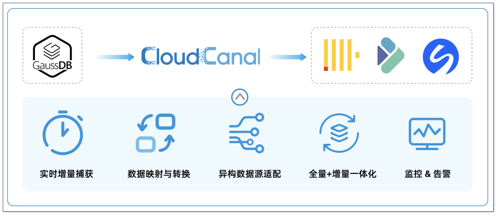
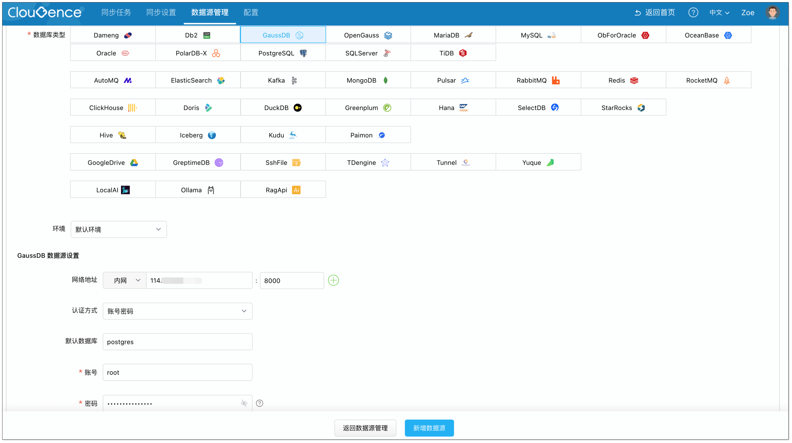
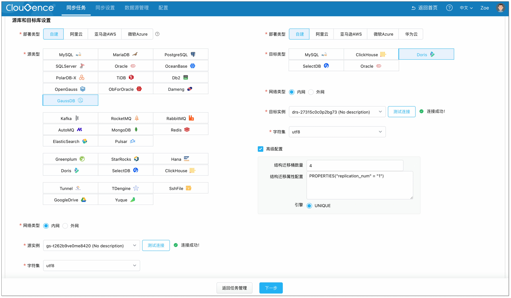
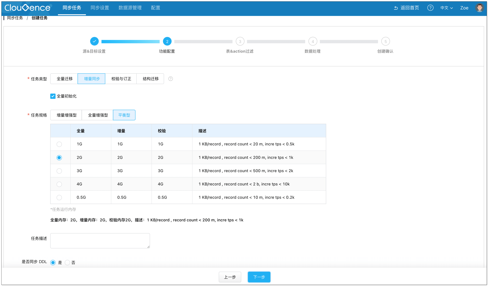
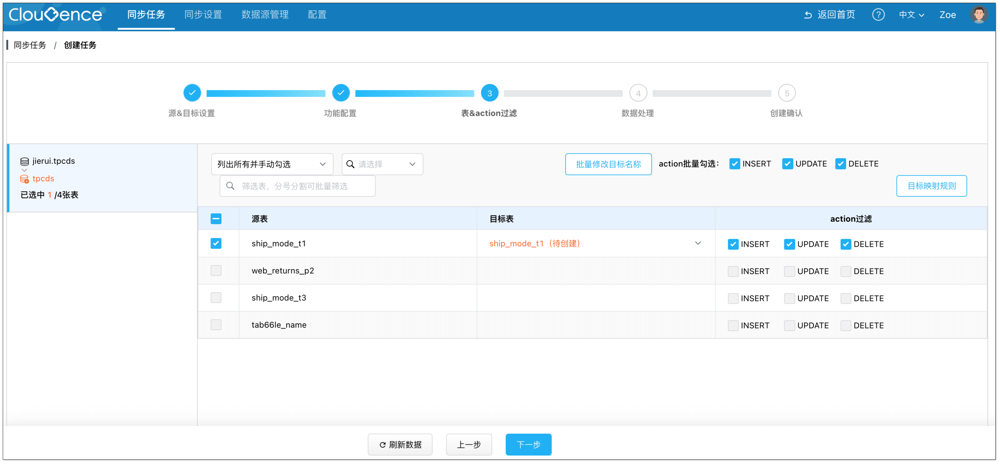
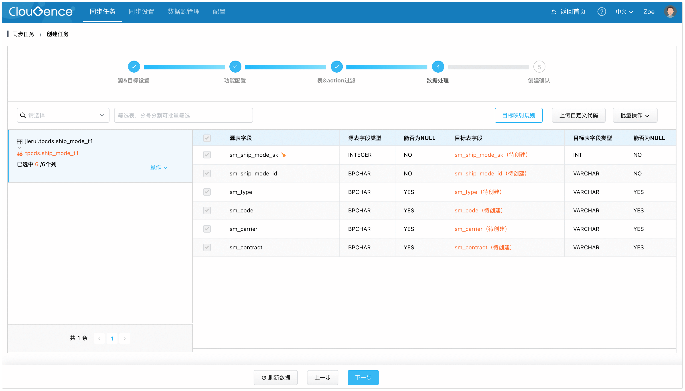
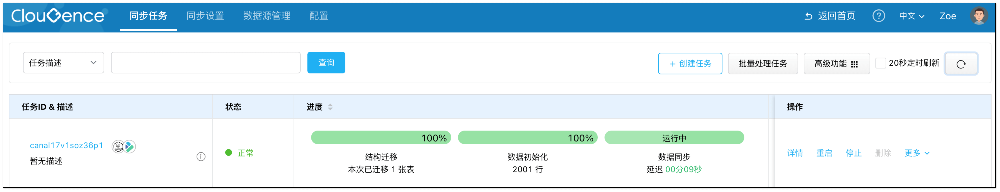

随着信创的加速推进，GaussDB 等国产数据库已经进入越来越多的核心业务系统。但新的问题也随之而来：数据该怎么流动？

要做实时报表、风控模型、用户画像，甚至 AI 应用，数据需要从业务库流向分析型数据库或消息中间件。但是，稳定高效的同步工具并不好找。开源工具对国产数据库支持不足，自研方案成本高、维护复杂，很多企业都被卡住了。

有没有一种方式，既能保证稳定与安全，又能让 GaussDB 的数据实时流向下游？今天我们就要聊聊 GaussDB 数据实时入仓的解决方案。

## GaussDB 数据入仓的技术难点
在实践中，要实现稳定高效的 GaussDB 数据同步，团队通常会遇到以下几大挑战：

+ **源库性能压力**：传统触发器或轮询方式侵入性强，容易拖慢核心 OLTP 业务。
+ **一致性与延迟**：需要保证数据不丢不重，同时延迟控制在秒级。
+ **异构适配难题**：数据类型、事务模型、写入方式差异大，需要专业适配。
+ **全量+增量衔接**：历史数据迁移和实时变更并行，数据容易出现重复或遗漏。
+ **运维复杂度高**：自研或开源链路缺乏可视化监控，出错时排查和恢复困难。

如果没有成熟工具，企业往往需要自研管道（如基于 Kafka+Flink）来解决这些难点，不仅成本高，而且容易出现隐患。

## CloudCanal 实时同步解决方案
针对 GaussDB 数据入仓中的五大挑战，CloudCanal 提供了完善的解决方案：

+ **高效的实时增量捕获**

CloudCanal 基于**逻辑复制槽**（logical slot）实时捕获 GaussDB 增量数据，不依赖触发器或轮询查询，对源库性能影响极小，适合支撑核心 OLTP 业务的高并发场景。

+ **智能的数据映射与转换**

内置丰富的数据处理能力，能够自动完成 GaussDB 与目标端的数据类型映射。同时，用户可以通过可视化的界面配置数据过滤、列裁剪、数据脱敏等，在同步过程中完成轻度的 ETL。

+ **强大的异构适配能力**

内置 **多种目标端支持**，针对 MySQL、ClickHouse、Doris、SelectDB 等不同数据库，提供字段映射、批量写入优化、引擎级适配（如 ClickHouse MergeTree），降低了异构同步的门槛。

+ **全量+增量一体化迁移**

CloudCanal 支持 **并行全量导入 + 实时增量同步** 的无缝衔接。迁移过程中可自动对齐数据快照与增量日志，保证数据不重不漏，真正实现业务不停机的平滑迁移。

+ **企业级的监控与告警**

提供 **可视化链路管理界面**，支持实时监控延迟、RPS、CPU 使用率等指标，并内置自动告警与故障恢复能力，大幅降低运维复杂度。

## 使用场景
通过 CloudCanal 将 GaussDB 数据实时同步，可以支撑多样化的业务需求：

+ **实时数仓与决策分析**：将数据同步至 Doris、ClickHouse 等，构建**实时数仓**，报表延迟从分钟级缩短到秒级，支持实时经营决策。
+ **用户画像与推荐引擎**：互联网、零售、运营商等企业，需要对用户行为进行分析。将用户行为数据同步到 **ClickHouse 或大数据平台**，实时计算用户画像，驱动个性化推荐，提升转化率。
+ **混合云与多活架构**：政企、能源等行业常有跨地域容灾或多云部署需求。将 GaussDB 数据实时同步至**公有云数据库或异地灾备中心**，实现多活架构，保证业务连续性和高可用。

## 操作演示
下面将以 GaussDB 到 Doris 的链路为例，展示如何五分钟实现数据实时同步。

### 前置准备
1. 请参考 [安装 SaaS 客户端](https://www.clougence.com/cc-doc/productOpByoc/docker/install_worker_docker)，下载安装 CloudCanal SaaS 版。
2. GaussDB 作为源端需要具备一定的权限，具体请参考 [https://www.clougence.com/cc-doc/dataMigrationAndSync/datasource_func/GaussDB/privs_for_gaussdb](https://www.clougence.com/cc-doc/dataMigrationAndSync/datasource_func/GaussDB/privs_for_gaussdb)

### 步骤 1: 添加数据源
登录 **CloudCanal 平台**，点击 **数据源管理** > **添加数据源**，分别添加 GaussDB 和 Doris 数据源。

### 步骤 2: 创建任务
1. 点击 **同步任务** > [创建任务](https://www.clougence.com/cc-doc/operation/job_manage/create_job/create_full_incre_task)。
2. 选择源和目标实例，并分别点击 **测试连接**。

3. 在 **功能配置** 页面，选择 **增量同步**，并勾选 **全量初始化**。

4. 在 **表和操作过滤** 页面，选择需要迁移同步的表，可同时选择多张。

5. 在 **数据处理** 页面，保持默认配置。

6. 在 **创建确认** 页面，点击 **创建任务**，开始运行。

CloudCanal 将自动完成 GaussDB 的结构迁移、全量数据迁移等工作，并实时捕捉并传输增量数据至 Doris。

## 总结
随着国产数据库的普及，数据的实时流动能力变得愈发重要。无论是构建实时数仓，还是支撑风控、画像、AI 应用，稳定的数据同步链路都是前提。CloudCanal 作为专业的数据迁移同步工具，能有效降低迁移复杂度，保障业务连续性，也让企业更快释放数据价值。

如果你正在寻找 GaussDB 数据同步方案，欢迎点击左下角 **阅读原文**，使用 CloudCanal SaaS 版快速上手，体验轻量、高效、稳定的数据同步新方式。

## 
