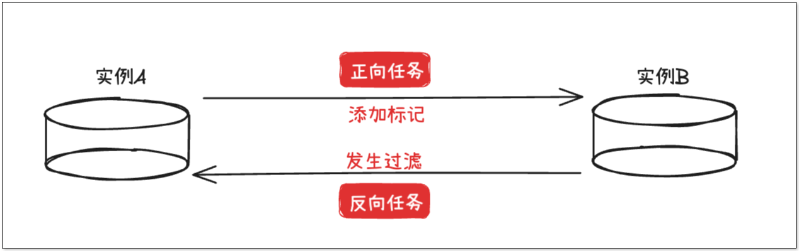
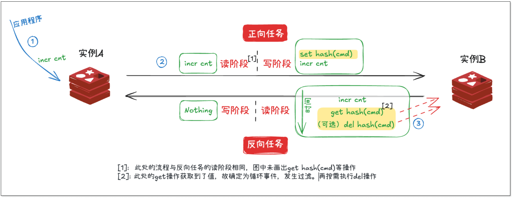
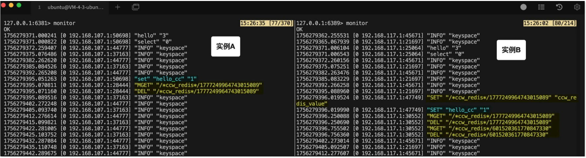
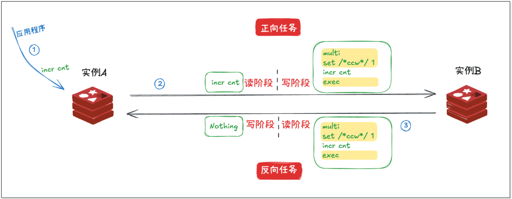
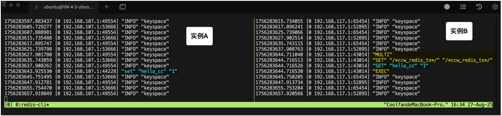
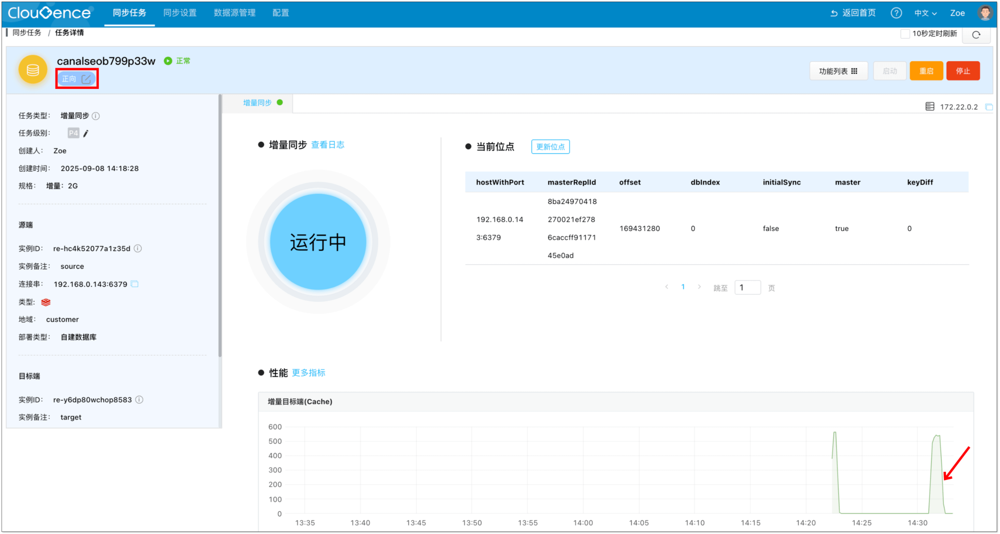
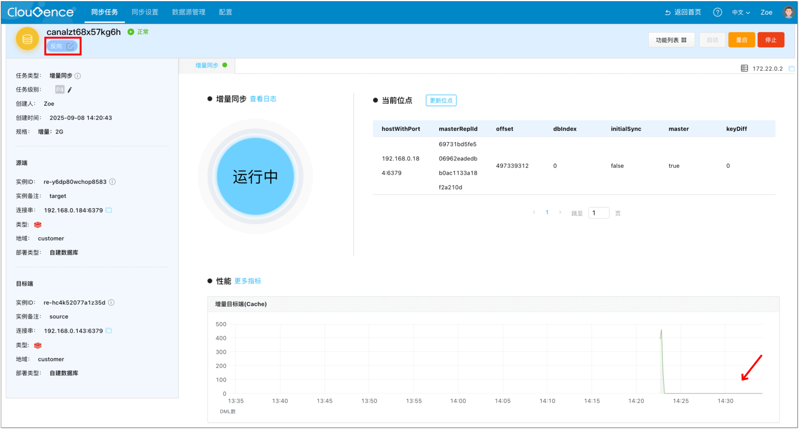
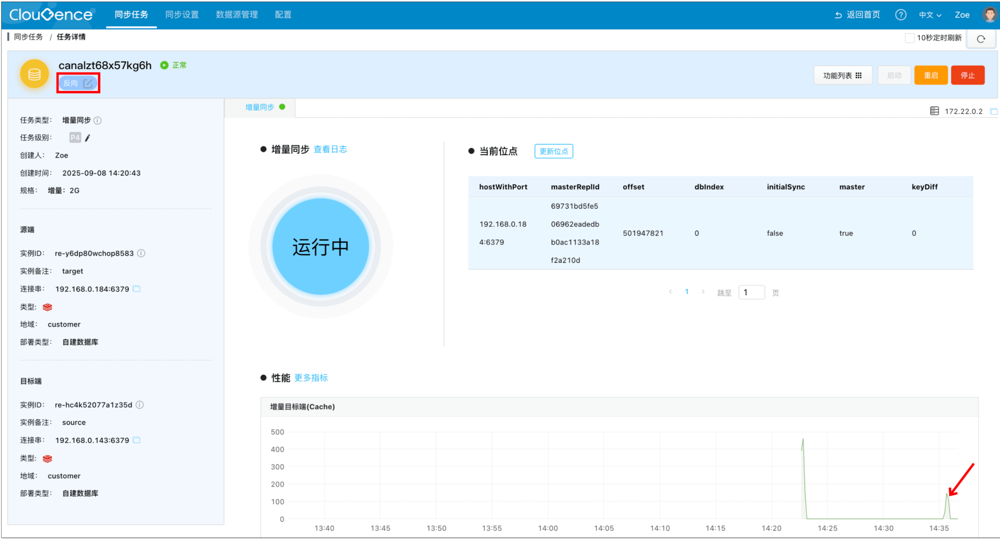
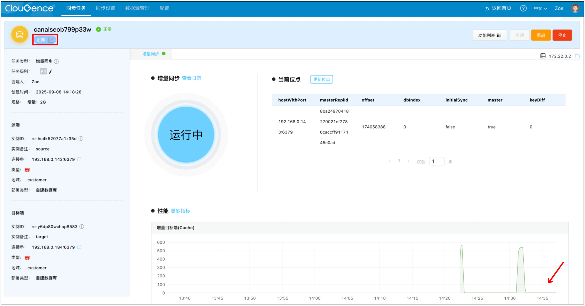
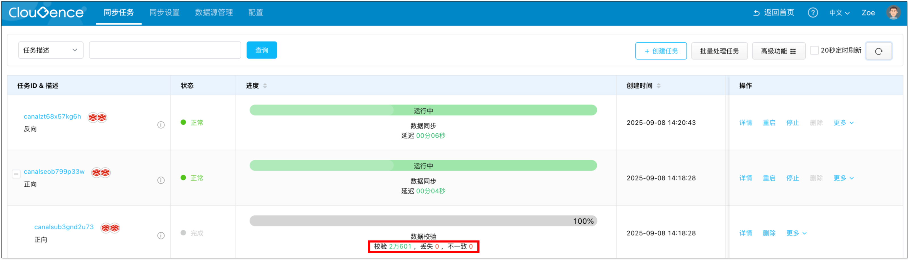

在跨机房高可用、主备切换、混合云架构中，Redis 双向同步是一个常见需求。要实现数据库的双向同步，最大的挑战就是**如何避免数据在两个实例之间无限循环**。

本文将从问题入手，带你了解双向同步防循环方案，并介绍一种更加高效、轻量的解决方式：基于事务标记的防循环模式，最后通过一个简单的实操演示，帮你快速上手。

## 为什么双向同步会陷入循环
我们以两个 Redis 实例 A 和 B 为例，同时配置了 A→B 和 B→A 的同步任务：

A 上的数据写入，会同步到 B。B 收到后，又会被同步回 A。如果没有循环检测机制，事件就会在 A、B 之间“打乒乓球”，循环往复。

在实现 MySQL、PostgreSQL 的双向同步功能中，CloudCanal 分别采用增量事件标记和事务记录实现循环事件过滤。任一方向的同步链路在收到新事件时都会判断事务中是否存在相应的标记，以此来选择是否**过滤**这一事件，从而打破数据循环。

相较于 PostgreSQL 等传统数据库，Redis 本身的特点让其双向同步的实现变得复杂：

+ Redis 命令粒度小（如 `INCR key`），并不总是事务
+ Redis 的事务（`MULTI/EXEC`）和传统关系型数据库事务不同，不具备完整的原子性

那么，该如何实现 Redis 的双向同步呢？

## 方案一：辅助标记
基于传统数据库双向同步的实现思路，在 Redis 双向同步的实践中，一种直观的防循环方案是**通过辅助指令来进行循环判定**。当收到正常指令，计算其 hash 值，构建辅助指令 key，反向查询辅助指令是否存在，如果存在则为循环，过滤即可。

这种方式的优势是：

+ **实现简洁**：逻辑清楚，能快速落地
+ **适应性强**：无论 Redis 是单点部署还是集群部署，都能完成双向同步

但也存在不足：

+ **性能开销大**：对任意事件，理论上会将操作的命令数量放大为原来的 3 至 4 倍，增加了 Redis 的写压力
+ **区分度有限**：在某些极端场景下，比如同时有应用在目标端执行了类似的写操作，反向任务很难区分这两条命令的来源，有可能导致误判，甚至丢失一次更新。

## 方案二：事务标记
除了使用额外标记，另一种做法是**借助 Redis 的事务机制**。

Redis 的事务（`MULTI ... EXEC`）和关系型数据库的事务不同，它没有实现事务原子性中的回滚，但有一个关键特性：**事务中的所有命令会按顺序执行，并且在执行期间不会插入执行来自其他客户端的命令**。

基于这个特性，对于正向任务，在接收到源端命令时，可将其包裹为事务，并在事务内第一条插入一条标记操作。反向任务发现这是一个事务，说明**可能**是来自正向任务的循环事件，通过判断事务内**第一条事件**是否为标记即可。如果是，说明整个事务都是循环，直接过滤。

这种方式的优势是：

+ **性能更优**：不需要为每条命令额外维护标记，系统开销小
+ **逻辑简明**：通过检查事务开头即可快速判断，不必逐条比对
+ **Redis 压力小**：大多数过滤动作都在程序内执行，减少对数据库的压力

不过，需要注意的一点是：Redis 的事务在分片集群模式下有局限，不能跨分片执行，因此目前事务标记模式**主要适用于单点或主从场景**。

## 操作演示
目前，CloudCanal 支持上述两种双向同步方案，可在控制台通过设置参数`deCycleMode`调整双向同步过滤事件模式。

如果感兴趣的话，欢迎跟着实操视频体验 [Redis 双向同步实操：教你彻底解决数据循环问题](https://www.bilibili.com/video/BV1VRYwzFEuw/)。

## 效果验证
成功进行双向同步后，可以进行防循环效果验证。

在源端数据库做数据变更，查看监控图表，可以看到，正向任务显示有变更，反向任务没有，即代表无数据循环。

在目标端数据库做数据变更，查看监控图表，可以看到，反向任务显示有变更，正向任务没有，即代表无数据循环。

创建数据校验任务，可以看到，两端数据库的数据保持一致。

## 总结
Redis 双向同步的最大难题，不在于能不能同步，而在于**如何避免数据在两个实例之间无限循环**。本文分析了辅助标记方案与事务标记方案，两种方案各有优劣势。对于大多数 **单点或主从场景**，事务标记模式是更值得推荐的选择，既能保证正确性，也能兼顾系统开销。而对于分片集群场景，则可尝试辅助标记方案。

如果你正在规划设计 Redis 双向同步，欢迎使用 [CloudCanal SaaS 版](https://www.clougence.com/?src=cc-doc)快速上手体验。
