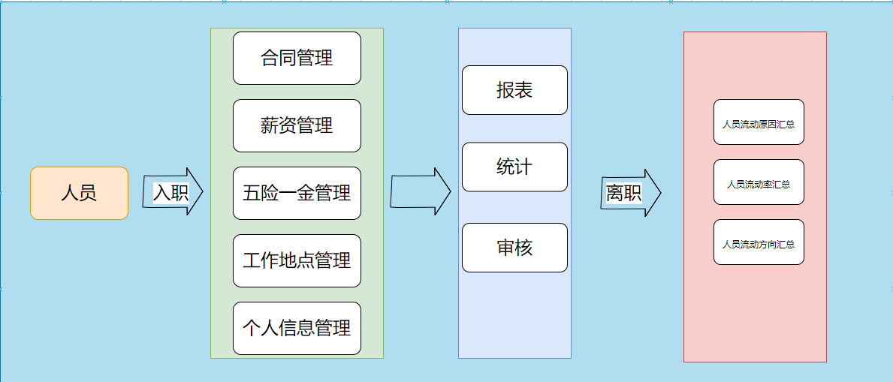
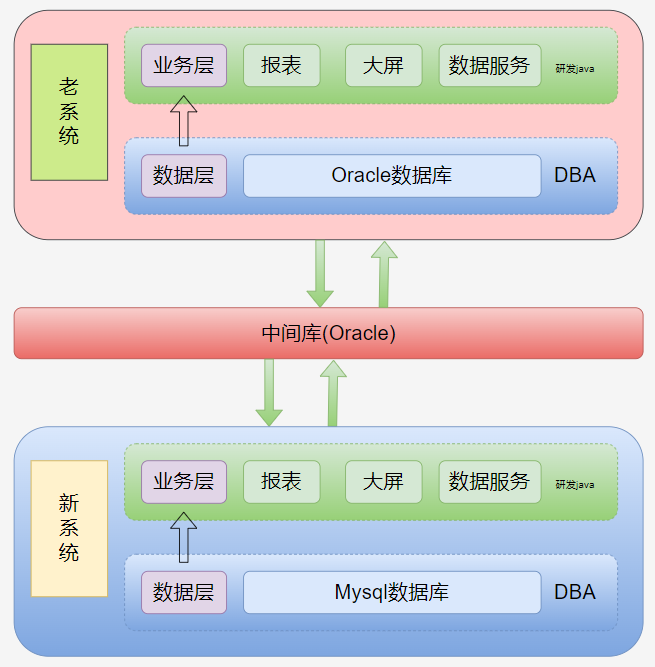
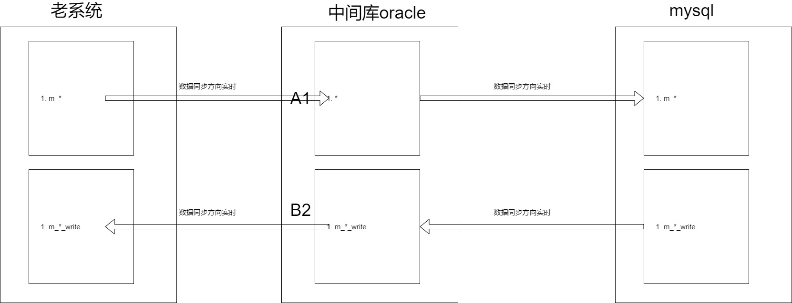

## 作者介绍
本文作者来自天津北方汉王科技有限公司（以下简称“北方汉王”），北方汉王是由国家级区域性人才市场--中国北方人才市场（以下简称北方人才）与国内人工智能行业领域先行者--汉王科技股份有限公司（以下简称“汉王科技”）合资成立的人力资源技术与服务提供商，具备国内领先的人力资源业务技术服务能力。
## 业务背景
在新一代信息化系统建设的大背景下，一些老牌企业对线上办公流程要求越来越高，现有办公系统无法满足需要，研发新系统、并将老系统替换掉成为一个普遍需求。

但是这类系统功能多、影响广，在不影响公司正常运转的要求下，如何平滑切换是一个难题。本文介绍通过引入 CloudCanal ，顺利解决此类问题的实际应用和实践。
## 业务架构
老系统业务类型是人事管理，包含企业员工的合同管理、薪资管理、五险一金管理、人员分布管理等一系列功能。

在企业要求下，需要对人事管理系统在功能上进行新增和升级，其中涉及对老系统原有数据的重构。

## 技术架构
老系统数据库为 ORACLE，新系统的数据库为 MySQL，新老系统通过一台 ORACLE 数据库进行数据交换。

考虑到老系统存在如下客观问题 , 我们决定采用中间库形式进行数据交互。
- 网络环境复杂
- 需要生产数据持续服务和安全
- 数据库数据使用逻辑不一致

老系统 ORACLE、中间库 ORACLE、新系统 MySQL 之间的数据流转方向和生命周期如下
- 老系统将现有的数据表 转换格式 放入中间库，并将新产生的数据 实时同步 到中间库
- 新系统将老系统需要的数据 实时同步 到中间库，再将中间库的数据 实时同步 回老系统数据库

## 数据同步方案对比
技术架构确认后，为了保证三个数据库之间数据同步达到实时、准确、稳定的效果，我们做了如下调研和对比。
### 初期使用 DataX
调研初期，我们首先接触到 DataX 工具，在实践中遇到如下问题
- 生成配置文件比较繁琐，对于新手较为困难
- 因为表结构变更，容易引起数据抽取失败
- 适合离线数据抽取，没有增量同步

因为无法满足需求，放弃该方案。
### 引入CloudCanal 产品
引入 CloudCanal 产品之后，最大的感受是操作非常便利，另外可以很好的适配当下团队人员能力和运维压力，具体表现为以下几点
- 通过界面即可完成迁移同步的配置，使用简单，上手容易
- 结构迁移、全量、增量一体化，自动化
- 任务管理功能完善，监控、报警一应具全，使得任务运维成本大大降低
- 异构数据源接入效率高，提供标准的库表列裁剪映射、各种维度的筛选能力等，免去开发成本

我们在考虑 CloudCanal 在运维效率、研发成本、功能需求满足度的优势后，最终选择 CloudCanal 作为我们本次项目数据迁移同步工具。
### 业务成果
通过 CloudCanal 很好的解决了新老系统数据同步的问题，目前我们的新系统已经正式上线运行多月。后续会有更多的产品进行落地。感谢 CloudCanal 团队一直以来提供专业的支持服务。
