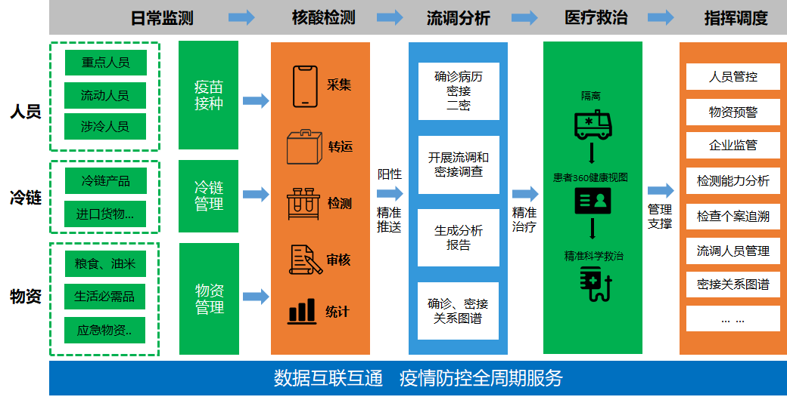
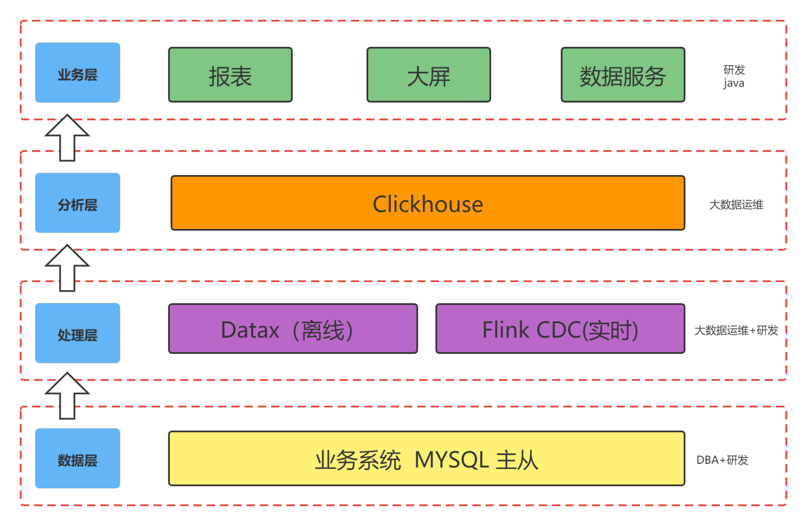
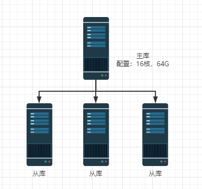
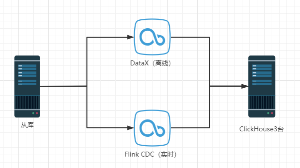
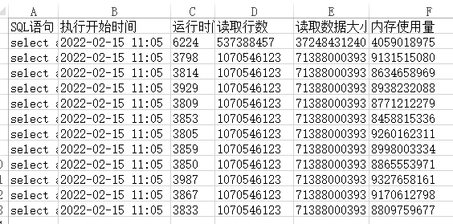
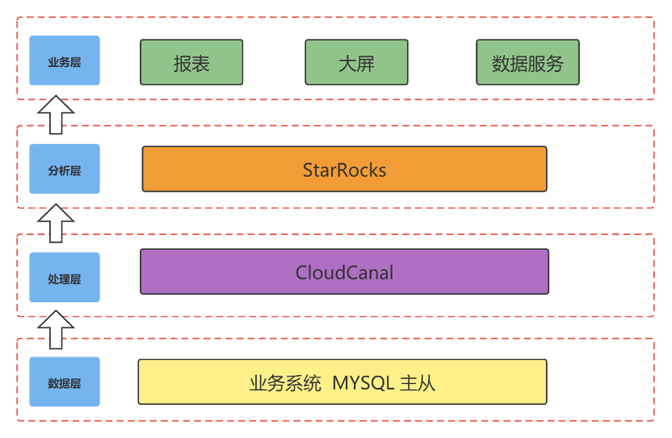
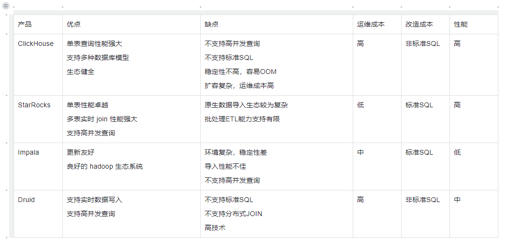

## 简述

本案例为国内某大健康领域头部公司真实案例(因用户保密要求，暂不透露用户相关信息)。希望文章内容对各位读者使用 CloudCanal 构建实时数仓带来一些帮助。

## 业务背景


大健康背景下，用户对报表和数据大屏的实时性能要求越来越高。以核酸检测为例，检测结果需要实时统计分析，并在决策大屏中进行可视化展现。数据的及时性直接关系到区域疫情防控的精准布施从而有效防止疫情的扩散，不容半点闪失。在此之上，业务的多样性和复杂性也对公司的研发和运维成本要求也越来越高。

例如疫情防控指挥决策大屏中，数据包括流调溯源数据、物资冷链数据、居住人口数据、重点人群数据、风险排查、隔离管控、核酸检测数据、疫苗接种数据。这些来源数据标准不一，分散的数据引发数据冗余、数据不一致、数据应用困难等问题，导致研发和运维成本的上升，需要通过一个良好的接入层将这些数据做汇总和统一管理。

在此背景下，我司在更高效数据ETL方式以及高性能数据分析工具选型方面不断尝试和创新。通过引入了 CloudCanal 和 StarRocks，在数仓建设、实时数据分析、数据查询加速等业务上实现了效率最大化。

## 业务架构

我司旗下拥有多款大健康产品。虽然各款产品的具体业务不同，但是数据流的链路基本一致：**数据接入**->**数据处理与分析**->**数据应用**。

下面以 **疫情防控系统** 为例简单介绍其中数据流的生命周期：

- **数据接入**：首先疫情防控系统的数据主要是三个来源、人员数据、冷链数据、物资数据。这些数据经过统一标准化处理之后才能用于分析
- **数据处理与分析**：原始的数据经过整合和标准化，可以从数据分析出密接人员、密接关系图谱等信息
- **数据应用**：数据处理与分析的指标可以用于实时监控大屏、以及相关预警



## 原有技术架构以及痛点

针对疫情防控系统，我们最初选择 ClickHouse 作为分析层，通过 DataX + Flink CDC 的模式实现实时+离线数据同步。随着业务的迭代，这套架构已经无法满足我们的需求。

### 技术架构



原有疫情防控的架构总体上分为四块，自底向上分别是：

- **数据层**：源端数据源主要是 MySQL 为主的关系型数据库。

  - 业务信息：以核酸检测业务功能为例，需要支撑单日 300万 核酸检测任务。要求支撑每秒 1000 并发

  - 技术信息：数据层采用 MySQL 主从同步，配置级架构如下：



- 痛点：

  - MySQL 从库查询效率满足不了常规读操作，查询效率低下，急需数据查询加速
  - 研发人员大量的精力和时间放到了数据库查询优化上
  - **处理层**：采用离线+实时的 lambda 架构。其中离线部分采用 DataX 和 Kettle 进行定时全量，迁移源端维表到分析层的宽表中。实时部分使用 Flink-CDC 获取增量数据，一般是用于加速中间数据和近期的热数据。离线和在线数据分别存储在 ClickHouse 不同表中，提供给业务侧查询使用。

- 业务信息：

  - 离线：将报表、大屏、数据交换服务采用离线方式构建 DM 主题数据集市。使用到的就是Datax 工具结合实现。
  - 实时：使用 Flink CDC 将MySQL 数据1:1同步到 ClickHouse 中。程序端通过改造查询SQL将慢语句通过 ClickHouse 实现。

  技术信息： 整体架构如下

  

- 痛点：

  - 报表、大屏、数据交换离线场景对数据的实时性要求越来越高。大部分场景已不适用DataX这种离线方案。
  - DataX 定时任务调度带来的运维成本和源库影响：各种定时调度任务大大增加了运维管理的难度；同时这种定时触发的 SQL 很容易产生慢 SQL 影响源端数据库的正常工作。
  - Flink CDC 通过主库 Binlog 同步时出现过锁表影响业务的情况，虽然之后替换为订阅从库解决，但是会出现延迟现象。
  - Flink CDC 运维成本较高：Flink CDC 实时同步机制需要研发人员专职进行维护。例如像源端新增字段这种DDL需求，研发需要不断调整调度任务才能确保业务正常运行。
  - **分析层**：分析层会保存计算好的指标数据以及用于加速查询的中间结果数据。

- 业务信息：

  - 搭建三台单体 ClickHouse，分别对应 报表业务、大屏业务、数据交换服务、数据查询加速。
  - 以大屏业务举例，前期由于需求变化大，研发直接使用 ClickHouse 对单表过亿的数据进行数据关联、分组统计。高并发情况下也造成 ClickHouse 出现 CPU 打满的情况。ClickHouse 慢语句如下图。

  

- 痛点：

  - 集群运维较复杂，需要使用Zookeeper 搭建ClickHouse集群，运维成本高。
  - SQL 语法不兼容 MySQL，开发上手门槛高、Join 不友好
  - 修改、删除以及数据去重性能损耗大：例如使用ReplacingMergeTree()引擎，需要处理重复数据同时去重对性能要求较高。
  - 并发能力差：单机ClickHouse在高并发下，CPU经常被拉满，出现崩溃情况。
    - 业务层：业务层主要是应用程序访问分析层的指标结果或者通过查询中间结果来加速查询性能。最终的查询结果会服务疫情防控系统的实时大屏、报表以及预警等相关数据服务。
    - Clickhouse集群运维门槛高，之前在20.3版本出现过DDL任务和查询陷入死锁BUG，造成集群故障，最后放弃集群方案。采用3个单机通过Flink-CDC负责数据同步。

- **业务层**

  - 业务信息：主要是BI业务（报表、大屏）、数据查询加速、数据交换。
  - BI业务：平台报表业务和大屏业务全部接入ClickHouse数据库。
  - 数据查询加速：通过监控MySQL慢语句将慢语句也接入ClickHouse进行查询呈现。
  - 数据交换：ClickHouse负责与第三方平台进行数据交换任务。

  ### 数据源接入

  接入的监测数据分散在各个数据库实例和数据库中。我们遇到的问题主要是：

- 结构迁移成本高：很多表是一对一同步的，每次需要人为在ClickHouse上进行建表，增加了数据接入的成本

- 人工操作多：需要接入的表人工筛选成本大

- 新增表接入不方便：新增表接入需要重新修改配置

  ## 现有系统架构以及优势

  ### 架构介绍

  

  新架构层次划分与原有架构基本相同，我们对处理层与分析层的技术栈选型进行了一些调整。在原有架构中，我们使用DataX+FlinkCDC的方案实现了数据的实时与离线同步传输。在替换CloudCanal后，统一实时离线两套技术栈，减少了运维成本。分析层中，通过使用StarRocks替换ClickHouse，在性能，运维成本，业务扩展上也带来了极大的提升。

  ### 新架构优势说明

  #### 引入 CloudCanal 数据同步工具

  - 异构数据源接入效率高：提供了库表列裁剪映射、各种维度的筛选能力等
  - CloudCanal人性化的操作页面以及低代码操作方式，释放了业务线的研发人员
  - 结构迁移、全量、增量一体化
  - 监控、报警运维便利

  ### 引入 StarRocks MPP 数据库

  #### OLAP 数据库产品选型

  针对于分析层的问题与挑战，我们着力于寻找一款高性能，简单易维护的数据库产品来替换已有的ClickHouse架构，同时也希望在业务层上能突破 ClickHouse 单表查询的限制，通过实时多表关联的方式拓展业务层的需求。

  目前市面上的 OLAP 数据库产品百花齐放，诸如 Impala、Druid、ClickHouse 及 StarRocks。在经过一些列的对比之后，我们最终敲定选择StarRocks替换原有的ClickHouse作为分析层的数据库引擎。

  

  #### 接入StarRocks

  StarRocks 是一款极速全场景MPP企业级数据库产品，具备水平在线扩缩容、金融级高可用，兼容 MySQL协议和 MySQL 生态，提供全面向量化引擎与多种数据源联邦查询等重要特性，在全场景 OLAP 业务上提供统一的解决方案，适用于对性能，实时性，并发能力和灵活性有较高要求的各类应用场景。

  经过初步的考量，我们认为，StarRocks 兼容 MySQL 协议与标准SQL，相比于 ClickHouse 对于业务开发人员更加友好。同时，强大的多表关联能力可以将原有的大宽表模型转换为星型/雪花模型，增加了建模的灵活性，更好的应对业务需求的迭代。在运维方面，自动化调度机制可以支持在线扩缩容，可以极大的减少在ClickHouse上的运维成本。

  #### 分析层改造收益

  在引入 StarRocks 对系统进行升级改造后，极大程度的减少了原本 ClickHouse 中的慢查询。整体查询效率提升2~3倍。下面是生产环境业务中两张核心表。其中以我们一个典型的统计SQL为例，可以看到StarRocks带来了明显的性能提升。

  | 表名                | 行数    |
      | ------------------- | ------- |
  | rhr_person_info     | 3451483 |
  | chm_children_should | 6036599 |

  **ClickHouse侧执行SQL**

  ```sql
  select count(0) from rhr_person_info a 
  inner join chm_children_should b 
  on a.id=b.person_id 
  where toDate(b.should_start) <= toDate('2022-03-01') 
  and  toDate(b.should_end) >= toDate('2022-03-02') 
  and (credentials_number = '%zz%' or en_name like '%zz%') 
  and create_type_code =2 
  and is_deleted =0 
  and district_id like '130926105%'
  ```

  **StarRocks侧执行SQL**

  ```sql
  --starrocks
  select count(0) from rhr_person_info a 
  inner join chm_children_should b 
  on a.id=b.person_id 
  where date_format( should_start,'%Y-%m-%d')  <= ('2022-03-01') 
  and date_format( should_end,'%Y-%m-%d') >= ('2022-03-02') 
  and (credentials_number = '%zz%' or en_name like '%zz%') 
  and create_type_code =2 
  and is_deleted =0 
  and district_id like '130926105%'
  ```

  **查询响应时间比较**

  |              | StarRocks | ClickHouse |
      | ------------ | --------- | ---------- |
  | 平均响应时间 | 368ms     | 3340ms     |

  在体验至极性能的同时，我们在维护性，灵活建模等方面也获得了极佳的体验：

  - StarRocks 兼容 MySQL5.7 协议和 MySQL 生态
  - 支持高并发分析查询
  - 不依赖于大数据生态
  - MPP 架构，分片分桶的复合存储模型
  - 运维简单，易用性强
  - 水平扩展，不依赖外部组件，方便缩扩容
  - 支持宽表和多表 Join 查询（复杂场景），数据查询秒级/毫秒级

  ## 新架构效果说明

  ### 服务器资源合理释放（以核酸检测业务为例）

  | 对比   | 数据层 | 处理层 | 分析层 |
      | ------ | ------ | ------ | ------ |
  | 原架构 | 4台    | 2台    | 3台    |
  | 新架构 | 2台    | 1台    | 3台    |

  ### 人力成本的释放

  原架构在数据层和处理层研发人员工作占比为60%，每一个业务的调整需要与 DBA 一起测试查询 SQL，防止出现慢语句同时业务系统随着需求的增加经常有增加字段的需求，研发人员需要不断调整和发布 Flink CDC 调度。新架构只需要 ETL 工程师负责运维即可，体现了 CloudCanal 低代码和便捷的运维优势。

  ### 运维成本的降低

  StarRocks 部署不需要大数据组件的支撑，部署运维都很简单。StarRocks 兼容Mysql生态，业务使用可直接使用Mysql JDBC 进行连接，不用再担心SQL语法差异问题。

  ## 未来规划

  目前，我们已经上线了 2 个产品线的 StarRocks 集群，通过 CloudCanal 更好的实现了实时数仓的搭建，已经在公司内部进行推广，后续会有更多的应用落地。感谢 CloudCanal 团队和 StarRocks 团队提供专业的支持服务。

  ## 参考链接

  - [CloudCanal社区版官方文档](https://doc-cloudcanal.clougence.com/intro/product_intro)
  - [StarRocks官方文档](https://docs.starrocks.com/zh-cn/main/introduction/StarRocks_intro)

