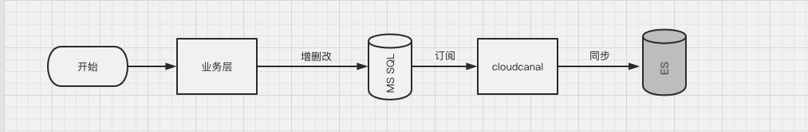
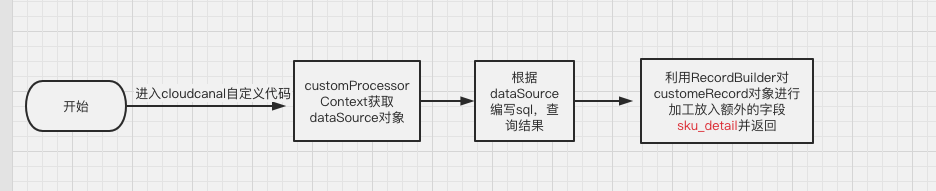
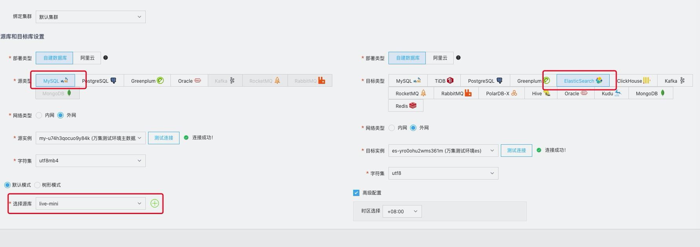
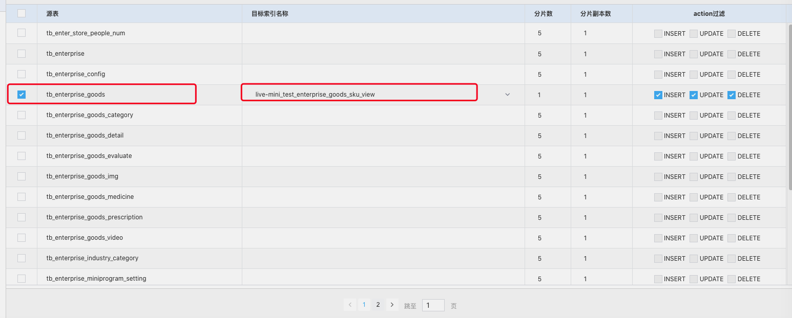
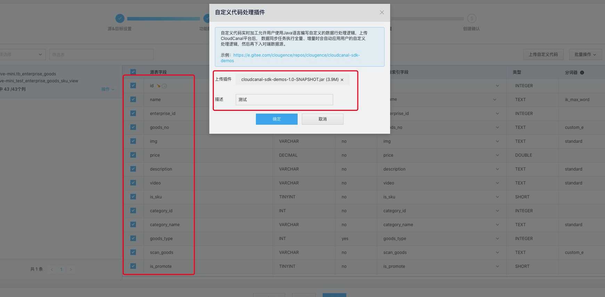
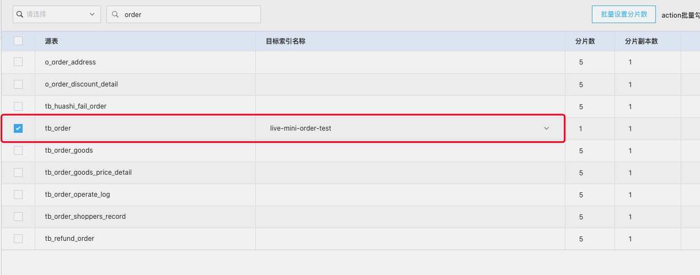
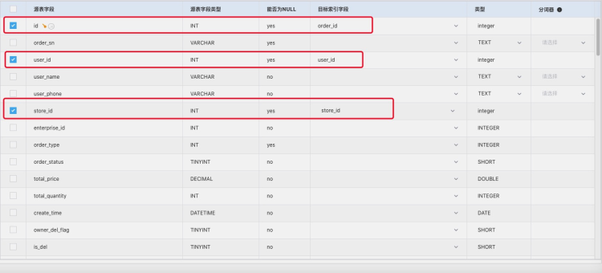
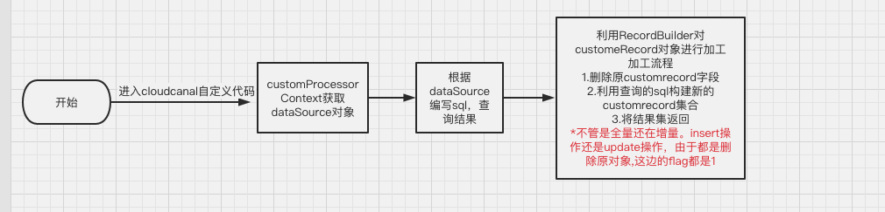

## 作者介绍
蒋鹏程，苏州万店掌软件技术有限公司

## 前言
CloudCanal 近期提供了自定义代码构建宽表能力，我们第一时间参与了该特性内测，并已落地生产稳定运行。开发流程详见官方文档 [《CloudCanal自定义代码实时加工》](https://www.clougence.com/docs/operation/job_manage/create_job/create_process_job)

能力特点包括：

- 灵活，支持反查打宽表，特定逻辑数据清洗，对账，告警等场景
- 调试方便，通过任务参数配置自动打开 debug 端口，对接 IDE 调试
- SDK 接口清晰，提供丰富的上下文信息，方便数据逻辑开发

本文基于我们业务中的实际需求(MySQL -> ElasticSearch 宽表构建)，梳理一下具体的开发调试流程，希望对大家有所帮助。

## 使用案例
### 案例一：商品表和SKU宽表行构建
#### 业务背景

在对接用户的小程序进行商品搜索时，需要如下几个能力
1.  基于分词的全文索引
2.  同时搜索不同表中的字段

需要全文索引的初衷是希望用户搜索商品的关键词就可以搜索到想要的商品。这在传统数据库中一般支持的都比较弱甚至不支持，因此需要借助 ES 分词器搜索

而第二个能力主要是由于业务数据通常分布在多个表中，但是 ES 并不能像需要关系型数据库那样联表查询，CloudCanal 自定义代码的能力则整号解决了我们多表关联的痛点。

#### 业务流程
在使用 CloudCanal 总体的流程变得十分清晰，在 CloudCanal 层面通过订阅表结合自定义代码中的反查数据库以及数据处理，可以直接生成可以写到对端 ES 的宽表行。

#### 表结构
准备的 mysql 表结构如下，一个商品会对应多个 SKU，我们在对端创建好索引，其中的 `sku_detail` 保存一个商品关联的 SKU 信息，是一个典型的一对多场景。

ES `mapping` 中的字段对应主表 `tb_enterprise_goods` 中字段，额外新增的 `sku_detail` 字段就是我们需要从子表 `tb_enterprise_sku` 中同步的数据。

```
## 商品表
CREATE TABLE `tb_enterprise_goods` (
  `id` int(11) NOT NULL AUTO_INCREMENT,
  `name` varchar(64) NOT NULL DEFAULT '' COMMENT '商品名称',
  `enterprise_id` int(11) NOT NULL DEFAULT '0' COMMENT '企业id',
  `goods_no` varchar(50) NOT NULL DEFAULT '' COMMENT '商家商品编号',
  PRIMARY KEY (`id`)
) ENGINE=InnoDB AUTO_INCREMENT=9410 DEFAULT CHARSET=utf8mb4;
```
```
## SKU表
CREATE TABLE `tb_enterprise_sku` (
  `id` int(11) NOT NULL AUTO_INCREMENT,
  `enterprise_goods_id` int(11) NOT NULL COMMENT '企业商品id',
  `name` varchar(255) NOT NULL DEFAULT '' COMMENT 'sku{1:2,2:1}',
  `sku_no` varchar(255) DEFAULT '' COMMENT '商品sku编码',
  `scan_goods` varchar(255) CHARACTER SET utf8 NOT NULL DEFAULT '' COMMENT 'sku条形码',
  PRIMARY KEY (`id`),
) ENGINE=InnoDB AUTO_INCREMENT=14397 DEFAULT CHARSET=utf8mb4 COMMENT='企业 sku';
```
ES 索引如下:
```
      "enterprise_id": {
        "type": "integer"
      },
      "goods_no": {
        "type": "text",
        "analyzer": "custom_e",
        "fields": {
          "keyword": {
            "type": "keyword"
          }
        }
      },
      "id": {
        "type": "integer"
      },
      "name": {
        "type": "text",
        "analyzer": "ik_max_word",
        "search_analyzer": "ik_smart",
        "fields": {
          "standard": {
            "type": "text",
            "analyzer": "standard"
          },
          "keyword":{
            "type": "keyword"
          }
        },
        "fielddata": true
      },
      "sku_detail": {
        "type": "nested",
        "properties": {
          "id": {
            "type": "integer"
          },
          "sku_no": {
            "type": "text",
            "analyzer": "custom_e",
            "fields": {
              "keyword": {
                "type": "keyword"
              }
            }
          },
          "scan_goods": {
            "type": "text",
            "analyzer": "custom_e",
            "fields": {
              "keyword": {
                "type": "keyword"
              }
            }
          }
```

> 注：为了方便大家理解，此处表字段进行了缩减

#### 自定义代码工作流程

#### 自定义代码源码
```
public List<CustomRecord> addData(CustomRecord customRecord, DataSource dataSource) {
        List<CustomRecord> customRecordList=new ArrayList<>();
        String idStr = (customRecord.getFieldMapAfter().get("id")).toString();
        List<EnterpriseSku> enterpriseSkuList = tryQuerySourceDs(dataSource, Integer.valueOf(Integer.parseInt(idStr.substring(idStr.indexOf("=") + 1, idStr.indexOf(")")))));
        if (enterpriseSkuList.size() > 0) {
            Map<String, Object> addFieldValueMap = new LinkedHashMap<>();
            addFieldValueMap.put("sku_detail", JSONArray.parseArray(JSON.toJSONString(enterpriseSkuList)));
            RecordBuilder.modifyRecordBuilder(customRecord).addField(addFieldValueMap);
        }
        customRecordList.add(customRecord);
        return customRecordList;
    }

public List<CustomRecord> updateData(CustomRecord customRecord, DataSource dataSource) {
        List<CustomRecord> customRecordList=new ArrayList<>();
        String idStr = (customRecord.getFieldMapAfter().get("id")).toString();
        List<EnterpriseSku> enterpriseSkuList = tryQuerySourceDs(dataSource, Integer.valueOf(Integer.parseInt(idStr.substring(idStr.indexOf("=") + 1, idStr.indexOf(")")))));
        if (enterpriseSkuList.size() > 0) {
            Map<String, Object> addFieldValueMap = new LinkedHashMap<>();
            addFieldValueMap.put("sku_detail", JSONArray.parseArray(JSON.toJSONString(enterpriseSkuList)));
            RecordBuilder.modifyRecordBuilder(customRecord).addField(addFieldValueMap);
        }
        customRecordList.add(customRecord);
        return customRecordList;
    }

private List<EnterpriseSku> tryQuerySourceDs(DataSource dataSource, Integer id) {
        try(Connection connection = dataSource.getConnection();
            PreparedStatement ps = connection.prepareStatement("select * from `live-mini`.tb_enterprise_sku where is_del=0 and enterprise_goods_id=" + id)) {
            ResultSet resultSet = ps.executeQuery();
            BeanListHandler<EnterpriseSku> bh = new BeanListHandler(EnterpriseSku.class);
            List<EnterpriseSku> enterpriseSkuList = bh.handle(resultSet);
            return enterpriseSkuList;
        } catch (Exception e) {
            esLogger.error(e.getMessage());
            return new ArrayList<>();
        }
    }
```
#### 思路
`customRecord` 对象即自定义代码传入的参数，传入的 `id` 为子表 `tb_enterprise_sku` 的外键 `enterprise_goods_id`，查询出子表关于这个外键的所有数据，放入 `addFieldValueMap` 中,再利用源码提供的方法`RecordBuilder.modifyRecordBuilder(customRecord).addField(addFieldValueMap)`，对 `customRecord` 进行加工。
#### 创建任务步骤
新建源端对端数据源

选择订阅表及同步到对端的索引

选择同步字段，选择自定义包

完成创建任务
#### 实现效果
```
{
  	"_index" : "live-mini_pro_enterprise_goods_sku_view",
        "_type" : "_doc",
        "_id" : "17385",
        "_score" : 12.033585,
        "_source" : {
          "img" : "https://ovopark.oss-cn-hangzhou.aliyuncs.com/wanji/2020-11-30/1606786889982.jpg",
          "category_name" : "无类目",
          "is_grounding" : 1,
          "del_time" : "2021-11-01T17:13:32+08:00",
          "goods_no" : "",
          "distribute_second" : 0.0,
          "uniform_proportion" : 0,
          "description" : "赠送私域直播流量转化平台万集&线上商城",
          "video" : "",
          "self_uniform_proportion" : 0,
          "update_time" : "2021-11-01T17:13:32+08:00",
          "allocate_video" : null,
          "self_commission_properation" : 0.0,
          "category_id" : 0,
          "is_promote" : 0,
          "price" : 0.03,
          "is_distributor_self" : 0,
          "limit_purchases_max_quantity" : 0,
          "limit_purchases_type" : 0,
          "is_del" : 0,
          "is_distributor" : 0,
          "activity_price" : 0.0,
          "id" : 17385,
          "stock" : 0,
          "distribute_first" : 0.0,
          "is_distribution_threshold" : 0,
          "refund_configure" : 1,
          "create_time" : "2021-11-01T17:13:32+08:00",
          "scan_goods" : "",
          "limit_purchases_cycle" : 0,
          "is_sku" : 1,
          "allocate_mode" : 0,
          "sku_detail" : [
            {
              "scan_goods" : "",
              "sku_no" : "",
              "id" : "19943"
            }
          ],
          "enterprise_id" : 24,
          "is_delivery" : 0,
          "is_limit_purchases" : 0,
          "name" : "测试商品测试商品测试商品测试商",
          "goods_type" : 0,
          "goods_order" : 0,
          "ts" : "2021-11-01T17:16:42+08:00",
          "delivery_price" : 0.0
        }
      }
```
### 案例二：订单表、商品表宽表构建
#### 业务背景
小程序商城中需要展示猜你喜欢的商品，对猜你喜欢商品是根据用户购买商品的频率来决定，主要涉及订单表，订单商品表，用户表，商品表等，使用ES 查询同样面临多表无法 `join` 的问题，本案例中依然采用 CloudCanal 自定义代码同步为扁平化数据。
#### 业务原使用技术及问题
同步 ES 的方案原先使用 `logstash` 的方式全量同步数据，由于数据量的问题，同步数据放在每日的凌晨，带来的问题为，数据同步不及时，并且只能是全量风险比较高。多次出现删除索引数据后并没有同步的情况。
#### 表结构
```
CREATE TABLE `tb_order` (
  `id` int(11) NOT NULL AUTO_INCREMENT,
  `order_sn` varchar(32) NOT NULL COMMENT '订单编号',
  `user_id` int(11) NOT NULL COMMENT '用户 id',
  `user_name` varchar(255) DEFAULT NULL COMMENT '用户名称',
  `user_phone` varchar(11) DEFAULT NULL COMMENT '用户电话',
  `store_id` int(11) NOT NULL COMMENT '门店 id',
  `enterprise_id` int(11) DEFAULT '1' COMMENT '企业id',
  `order_type` int(11) NOT NULL COMMENT '0：快递配送；1：门店自取; 2:美团配送即时单; 3:美团即时配送预约单;',
  `order_status` tinyint(11) DEFAULT '0' COMMENT '原订单状态：1：未付款，3：待发货/待打包，5：（待收货/待取货），6：交易完成，7：订单失效，8：交易关闭， 13：用戶取消,18:商家强制关闭，19同意退款但是退款失敗（未用到），30:美团即时配送状态异常',
  `total_price` decimal(10,2) DEFAULT '0.00' COMMENT '订单总价',
  PRIMARY KEY (`id`,`total_goods_weight`) USING BTREE
) ENGINE=InnoDB AUTO_INCREMENT=18630 DEFAULT CHARSET=utf8mb4 COMMENT='订单表';

CREATE TABLE `tb_order_goods` (
  `id` int(11) NOT NULL AUTO_INCREMENT,
  `user_id` int(11) NOT NULL COMMENT '用户 id',
  `order_id` int(11) NOT NULL COMMENT '订单 id',
  `goods_id` int(11) NOT NULL COMMENT '订单商品 id',
  `enterprise_goods_id` varchar(11) DEFAULT NULL COMMENT '企业商品id',
  `name` varchar(512) DEFAULT '' COMMENT '订单商品名称',
  `spec` varchar(100) DEFAULT NULL COMMENT '规格属性',
  `img` varchar(100) DEFAULT '' COMMENT '订单商品图片',
  PRIMARY KEY (`id`)
) ENGINE=InnoDB AUTO_INCREMENT=19159 DEFAULT CHARSET=utf8mb4 COMMENT='订单商品表';
```
ES 索引字段
```
"store_id":{
        "type": "integer"
      },
      "user_id":{
        "type": "integer"
      },
      "sex":{
        "type": "integer"
      },
      "birthday":{
        "type": "keyword"
      },
      "goods_name":{
        "type": "text",
        "analyzer" : "ik_max_word",
        "search_analyzer" : "ik_smart",
        "fields": {
          "keyword":{
            "type": "keyword"
          }
        },
        "fielddata": true
      },
      "goods_type":{
        "type": "integer"
      },
      "order_goods_id":{
        "type": "integer"
      },
      "enterprise_goods_id":{
        "type": "integer"
      },
      "goods_price":{
        "type": "double"
      },
      "order_id":{
        "type": "integer"
      },
      "order_create_time":{
        "type": "date"
      }
```
> 注：ES表结构中涉及多张表，为了方便举例，这边只贴出2张表。es_doc展示纬度为订单商品纬度。
#### 实现流程
订阅订单表

订阅字段



画出横线的即为需要同步的字段，有一个点需要特别注意：ES 中需要展示的字段一定要勾上同步，不勾上的话在自定义代码中 `add` 后 也不会被同步 官方给出的解释为字段黑白名单。

这里有几个细节点，订阅的表的维度并非 ES 存储数据的维度，所以这边的 `id` 并不是 ES 的 `_id`，对于这种需要在源端同步必须传的字段，设置对端字段可以随意设置一个对端已有的字段，在自定义代码中可以灵活的去重新配置需要同步的字段。（如果设置默认，ES 的 `index` 会创建出这个字段，这显然不是我们想要看到的效果）

#### 业务流程

#### 代码实现
查询扁平化数据
```
SELECT
	to2.store_id,
	tuc.id AS user_id,
	tuc.sex AS sex,
	tuc.birthday,
	tog.NAME AS goods_name,
	tog.goods_type,
	tog.goods_id AS order_goods_id,
	tog.goods_price,
	tog.create_time AS order_create_time,
	tog.id AS order_id,
	tog.enterprise_goods_id AS enterprise_goods_id 
FROM
	`live-mini`.tb_order to2
	INNER JOIN `live-mini`.tb_order_goods tog ON to2.id = tog.order_id 
	AND tog.is_del = 0 
	AND to2.user_id = tog.user_id
	INNER JOIN `live-mini`.tb_user_c tuc ON to2.user_id = tuc.id 
	AND tuc.is_del = 0 
WHERE
	to2.is_del = 0 
	AND to2.id= #{占位}
GROUP BY tog.id
```
思路:自定义代码获取 `order` 表的主键后，查询上面的 SQL，先将原 `customRecord` 中数据删除，再以查询出的结果维度新增数据。修改的逻辑亦如此。
```
public List<CustomRecord> addData(CustomRecord customRecord, DataSource dataSource) {
        List<CustomRecord> customRecordList=new ArrayList<>();
        String idStr = (customRecord.getFieldMapAfter().get("id")).toString();
        List<OrderGoods> orderGoodsList = tryQuerySourceDs(dataSource, Integer.valueOf(Integer.parseInt(idStr.substring(idStr.indexOf("=") + 1, idStr.indexOf(")")))));
        RecordBuilder.modifyRecordBuilder(customRecord).deleteRecord();
        if (orderGoodsList.size() > 0) {
            for (OrderGoods orderGoods:orderGoodsList){
                //添加需要的行和列
                Map<String,Object> fieldMap=BeanMapTool.beanToMap(orderGoods);
                customRecordList.add(RecordBuilder.createRecordBuilder().createRecord(fieldMap).build());
            }
        }
        return customRecordList;
    }

    public List<CustomRecord> updateData(CustomRecord customRecord, DataSource dataSource) {
        List<CustomRecord> customRecordList=new ArrayList<>();
        String idStr = (customRecord.getFieldMapAfter().get("id")).toString();
        List<OrderGoods> orderGoodsList = tryQuerySourceDs(dataSource, Integer.valueOf(Integer.parseInt(idStr.substring(idStr.indexOf("=") + 1, idStr.indexOf(")")))));
        RecordBuilder.modifyRecordBuilder(customRecord).deleteRecord();
        if (orderGoodsList.size() > 0) {
            for (OrderGoods orderGoods:orderGoodsList){
                //添加需要的行和列
                Map<String,Object> fieldMap=BeanMapTool.beanToMap(orderGoods);
                customRecordList.add(RecordBuilder.createRecordBuilder().createRecord(fieldMap).build());
            }
        }
        return customRecordList;
    }

    private List<OrderGoods> tryQuerySourceDs(DataSource dataSource, Integer id) {
        String sql="SELECT to2.store_id,tuc.id AS user_id,tuc.sex AS sex,tuc.birthday,tog.NAME AS goods_name,tog.goods_type,tog.goods_id AS order_goods_id,tog.goods_price,tog.create_time AS order_create_time,tog.id AS order_id,tog.enterprise_goods_id AS enterprise_goods_id FROM `live-mini`.tb_order to2 INNER JOIN `live-mini`.tb_order_goods tog ON to2.id = tog.order_id  AND tog.is_del = 0  AND to2.user_id = tog.user_id INNER JOIN `live-mini`.tb_user_c tuc ON to2.user_id = tuc.id AND tuc.is_del = 0  WHERE to2.is_del = 0  and to2.id=";
        try(Connection connection = dataSource.getConnection();
            PreparedStatement ps = connection.prepareStatement(sql + id+" GROUP BY tog.id")) {
            ResultSet resultSet = ps.executeQuery();
            BeanListHandler<OrderGoods> bh = new BeanListHandler(OrderGoods.class);
            List<OrderGoods> orderGoodsList = bh.handle(resultSet);
            return orderGoodsList;
        } catch (Exception e) {
            esLogger.error(e.getMessage());
            return new ArrayList<>();
        }
    }
```
#### 实现效果
```
 {
        "_index" : "live-mini-order-pro",
        "_type" : "_doc",
        "_id" : "359",
        "_score" : 1.0,
        "_source" : {
          "goods_type" : 0,
          "order_id" : 359,
          "order_goods_id" : 450,
          "order_create_time" : "2020-12-22T10:45:20.000Z",
          "enterprise_goods_id" : 64,
          "goods_name" : "【老客户专享】万店掌2021新年定制台历",
          "sex" : 2,
          "goods_price" : 1.0,
          "user_id" : 386,
          "store_id" : 1,
          "birthday" : ""
        }
      }
```
### 写在最后
CloudCanal 的自定义代码很好地解决了我们多表关联同步 ES 的问题，简洁易用的界面和有深度的功能都令人印象深刻，期待 CloudCanal 更多新能力。关于 CloudCanal 自定义代码的能力，也欢迎大家与我交流。
