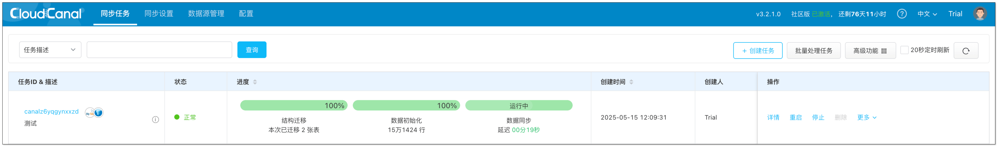
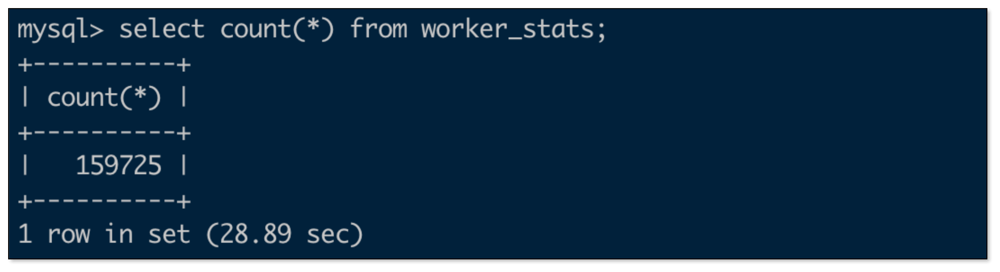

## 简述

本文主要介绍 [CloudCanal](https://www.clougence.com?src=cc-doc-mysql-iceberg-sync) 如何快速构建一条 MySQL 到 Iceberg 数据迁移同步链路。

## Iceberg 简介

### Iceberg 是什么？

Iceberg 是一种开放的数据表格式，包含 **Catalog** 和 **数据存储** 两种子概念。

**Catalog** 可简单理解为对数据的结构描述，如表列表、对应的表属性、包含的列、列类型、列长度等信息，这也是之所以为表格的原因。

**数据存储** 即以上 **Catalog 数据** 以及 **实际业务数据** 所组成的文件存放位置。

### Iceberg 有什么特点？

Iceberg 架构开放，定义了 **Catalog** 、**文件格式**、**数据存储**、**数据访问** 等标准，从而被众多第三方组件实现和支持。

- **Catalog**：AWS Glue、Hive、Nessie、Jdbc，或者专用的 Catalog 服务通过 Rest 方式读写。
- **数据文件格式**：Parquet、ORC、Avro 等。
- **数据存储**：AWS S3、Azure Blob Storage、MinIO、HDFS、Posix FS 等各类云存储或本地存储。
- **数据访问**：可通过类似 StarRocks、Doris、ClickHouse 等实时数仓，Spark、Flink、Hive 等流/批计算引擎检索、分析、操作数据和结构。

除了 **开放** 这一大特点，Iceberg 同时在 **超大数据量存储** 和 **准实时增、删、改** 之间实现了平衡。

下表从数据容量、增量实时性、事务支持、存储成本、架构开放度 5 个纬度，对各类数据库进行对比（仅作参考，欢迎讨论）：

| 数据库种类         | 关系型数据库  | 实时数据仓库  | 传统大数据  | 数据湖 |
| ------------ | -------------------|-------|----------- |------|
|  **数据容量**    |  几 TB 级别    |  百 TB 级别    | PB 级别   | PB 级别|
| **增量实时性**     |  业务级别增量写入，延迟毫秒级别，万级别 QPS    |  业务级别增量写入，延迟秒到分钟级别，千级别 QPS | 运维级别增量写入，延迟小时到天级别，个位数 QPS  |业务级别增量写入，延迟分钟级别，个位数 QPS(攒批) |
| **事务支持**      | ACID 强一致     |   ACID 强一致或最终一致  |    否   | 否 |
| **存储成本**      |  高     |    高或很高   |   很低  | 低 |
| **架构开放度**      | 低 |  中(存算分离)  |   否   | 高 |极高|

从上表来看，使用 Iceberg，即可得到一个 **低成本**、**超大数据存储容量**、**丰富数据检索分析工具的数据库**，从某种意义上来说，可以作为传统大数据系统的换代升级产品。

当然得益于其架构的开放性，还可以不断探索更多的数据使用场景。

## 技术点

### 典型 Catalog 和存储支持

CloudCanal 支持 Iceberg 3 种 Catalog 和 2 种存储方式，搭配关系为

- AWS Glue + AWS S3
- Nessie + MinIO / AWS S3
- Rest + MinIO / AWS S3

对于全栈数据上云，AWS RDS + EC2 部署 CloudCanal + AWS Glue + AWS S3 即可构建。

对于全私有数据，自建关系型数据库 + 虚拟机部署 CloudCanal + Nessis/Rest Catalog + MinIO 则可快速达成。

### 数据迁移同步一体化

对于数据同步开始之前的繁重工作，CloudCanal 一直尝试利用自身的数据库知识，自动将结构准备、历史数据迁移做好。

对于 Iceberg 这类非传统意义数据库交互的产品，也实现了数据迁移同步的自动化流程，包括结构定义转换、类型映射、约束清理、类型长度适配等工作，都可在 CloudCanal 一站式完成。

## 操作示例

### 准备 CloudCanal
下载安装 [CloudCanal 私有部署版本](https://www.clougence.com?src=cc-doc-mysql-iceberg-sync)。

### 添加数据源

本案例采用 **AWS Glue + AWS S3** 的组合, 测试数据来自自建的 MySQL 库。


1. 登录 CloudCanal 平台，点击 **数据源管理** > **添加数据源**，添加 2 个数据源。
2. 添加 Iceberg 所要填写的信息如下（`<>`内按实际情况替换）。
  - **网络地址**：本例填写 AWS Glue 服务地址。
    ```text
    glue.<aws_glue_region_code>.amazonaws.com
    ```
  - **版本**：保持默认值即可。
  - **描述**：用于辨别实例用途。
  - **额外参数**：
    - **httpsEnabled**：打开开关，即设置为 true。
    - **catalogName**：设置一个意义明确的名字，如 glue_\<biz_name\>_catalog。
    - **catalogType**：设置为 GLUE。
    - **catalogWarehouse**：元数据和数据文件最终存放位置，如 s3://\<biz_name\>_iceberg。
    - **catalogProps**：参考如下
    ```json
    {
      "io-impl": "org.apache.iceberg.aws.s3.S3FileIO",
      "s3.endpoint": "https://s3.<aws_s3_region_code>.amazonaws.com",
      "s3.access-key-id": "<aws_s3_iam_user_access_key>",
      "s3.secret-access-key": "<aws_s3_iam_user_secret_key>",
      "s3.path-style-access": "true",
      "client.region": "<aws_s3_region>",
      "client.credentials-provider.glue.access-key-id": "<aws_glue_iam_user_access_key>",
      "client.credentials-provider.glue.secret-access-key": "<aws_glue_iam_user_secret_key>",
      "client.credentials-provider": "com.amazonaws.glue.catalog.credentials.GlueAwsCredentialsProvider"
    }
    ```

### 创建任务
1. 点击 **同步任务** > [**创建任务**](https://www.clougence.com/cc-doc/operation/job_manage/create_job/create_full_incre_task)。
2. 选择源和目标实例，并分别点击 **测试连接**。其中 Iceberg 数据源 **结构迁移属性配置** 推荐如下：
   ```json
   {
     "format-version": "2",
     "parquet.compression": "snappy",
     "iceberg.write.format": "parquet",
     "write.metadata.delete-after-commit.enabled": "true",
     "write.metadata.previous-versions-max": "3",
     "write.update.mode": "merge-on-read",
     "write.delete.mode": "merge-on-read",
     "write.merge.mode": "merge-on-read",
     "write.distribution-mode": "hash",
     "write.object-storage.enabled": "true",
     "write.spark.accept-any-schema": "true"
   }
   ```

   :::info
   如遇到测试连接长时间不返回，可以刷新页面重新选择。   
   数据库连接信息错误或网络不通都可能造成该现象。
   :::

3. 在 **功能配置** 页面，选择 **增量同步**，并勾选 **全量初始化**。

   :::info
   任务规格选择默认 2 GB 或 1 GB 即可。**不建议**选择小于 1 GB 的任务，批量更新或写入较多可能造成任务内存紧张，性能急剧下降。
   :::

4. 在 **表&action过滤** 页面，选择需要迁移同步的表，可同时选择多张。

   :::info
   单个任务推荐选择不多于 1000 张表。   
   社区版当前支持最大 1000 张表选择，商业版不限。
   :::

5. 在 **数据处理** 页面，保持默认配置。
6. 在 **创建确认** 页面，点击 **创建任务**，开始运行。
   
   

### 测试并验证数据
1. 造增删改数据。
  

2. 停止造数据。
3. 创建一个按量 Aliyun EMR for StarRocks，添加 AWS Glue 的 Iceberg Catalog 并查询。
  - StarRocks 中添加 External Catalog 并设置查询环境。
     ```sql
     CREATE EXTERNAL CATALOG glue_test
     PROPERTIES
     (
       "type" = "iceberg",
       "iceberg.catalog.type" = "glue",
       "aws.glue.use_instance_profile" = "false",
       "aws.glue.access_key" = "<aws_glue_iam_user_access_key>",
       "aws.glue.secret_key" = "<aws_glue_iam_user_secret_key>",
       "aws.glue.region" = "ap-southeast-1",
       "aws.s3.use_instance_profile" = "false",
       "aws.s3.access_key" = "<aws_s3_iam_user_access_key>",
       "aws.s3.secret_key" = "<aws_s3_iam_user_secret_key>",
       "aws.s3.region" = "ap-southeast-1"
     )

    set CATALOG glue_test;
    
    set global new_planner_optimize_timeout=30000;
    ```

  - MySQL 数据量
   

  - Iceberg 数据源
   

## 总结
本文简单介绍了如何使用 [CloudCanal](https://www.clougence.com?src=cc-doc-mysql-iceberg-sync) 快速构建一条 MySQL 到 Iceberg 数据迁移同步链路，助力用户业务查询加速目标。