## 简述

PostgreSQL 是一个历史悠久且被大量用户使用的数据库，在海外尤甚，国内也被一众国产数据库做为 codebase 进行深度研发拓展，如 openGuass。

本文即以 [openGauss](https://opengauss.org/zh/) 为示例介绍如何使用 [CloudCanal](https://www.clougence.com?src=cc-doc-pg-loop-sync) 做双向同步并防循环。

## 技术点

### 辅助指令防循环

与 MySQL 双向同步原理不同，因 PostgreSQL 在常规增量事件无法标识循环，所以实现双向防循环需要换一种技术。

常规的三种防循环方式：**常规增量事件标记**，**辅助指令或操作**，**特殊账号**。我们选择 **辅助指令或操作** 实现这个功能。

在双向同步的两端数据库中各建一张 **标记表**，如下

```sql
create table "your_schema"."__cc_tx_de_cycle" (
    "id" bigint not null,
    "val" bigint null, 
    constraint "__cc_tx_de_cycle_pkey" primary key("id")
)
```

全量或增量写入前，同一个事务中 upsert 一条记录，并改变 val 值，产生 wal 日志。

另外一条链路接收到增量事件，如果识别该标记表操作（insert/update），则忽略整个事务变更，即循环事件。

## 操作示例

### 准备 CloudCanal
- 下载安装 [CloudCanal 私有部署版本](https://www.clougence.com?src=cc-doc-pg-loop-sync)

### 添加数据源
- 本案例采用阿里云上搭建 openGauss 作为源对端，可根据 [PostgreSQL 链路文档](https://www.clougence.com/cc-doc/dataMigrationAndSync/connection/postgresql2) 做增量设置。
- 登录 CloudCanal 平台 ，**数据源管理** -> **添加数据源**  , 将准备的数据库逐步添加进来
  
  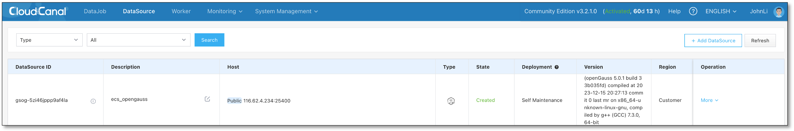

- 创建标记表

  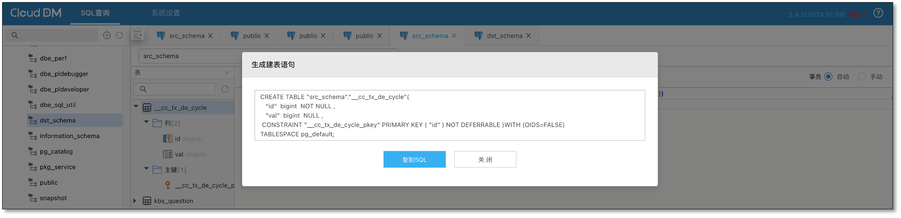

### 创建正向同步任务
- **任务管理**->**新建任务**
- 双向同步中，正向任务一般指源端有数据，目标端无数据的链路，涉及对端数据初始化
- 选择源端和目标端数据源
- 点击下一步
  
  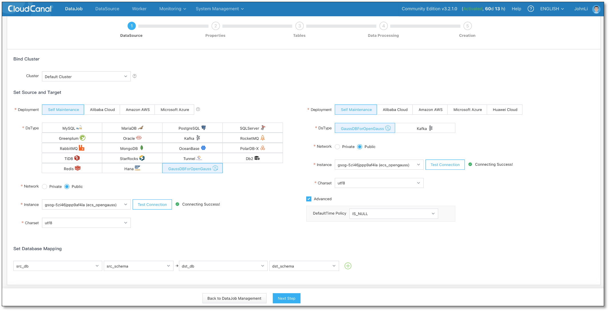

- 选择 **数据同步**，并且勾选 **全量数据初始化**
- **置灰自动启动**，以便创建任务后设置双向同步参数
- 点击下一步

  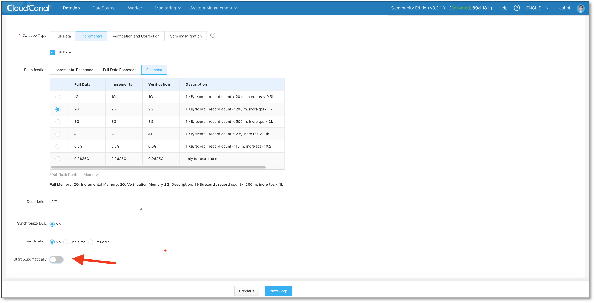
 
- 选表、列映射裁剪...省略，点击下一步
- **确认创建**
- **任务详情** -> **参数设置**
  - 设置源和目标数据源配置 **deCycle** 参数为 true
  - 设置源和目标数据源配置 **deCycleTable** 参数为标记表，如 `__cc_tx_de_cycle`
  - 生效配置
  - 启动任务

  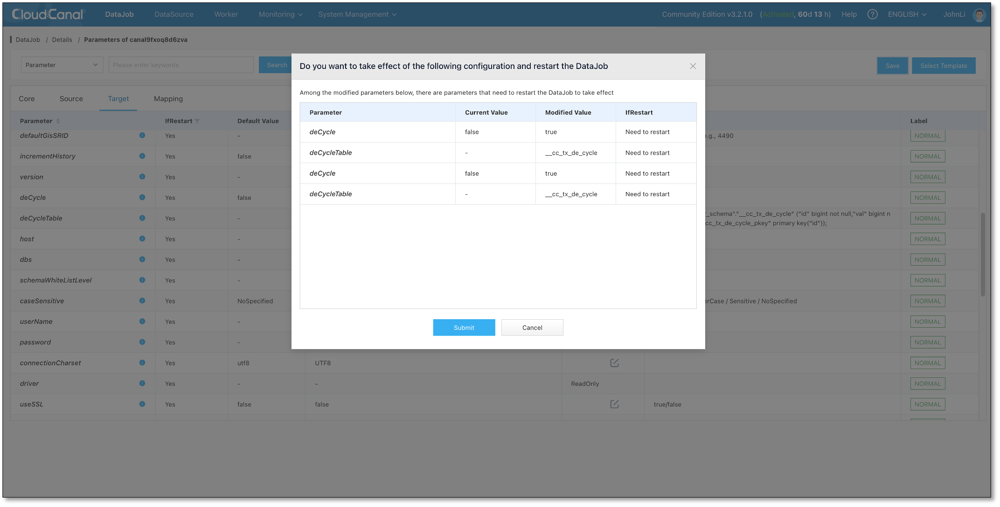

### 创建反向同步任务
- **任务管理**->**新建任务**
- 选择源端和目标端选择数据源（**请和正向任务所选数据源对调**）和相关信息
- 点击下一步

  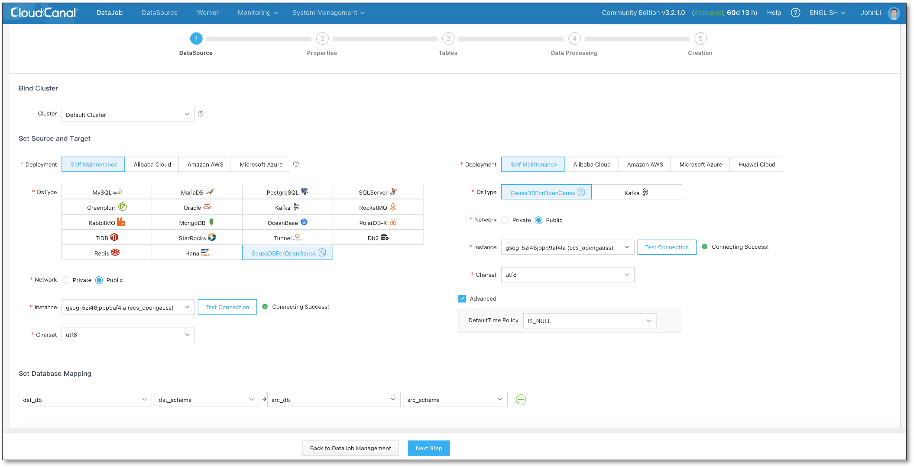

- 选择 **数据同步**，并去除**全量数据初始化**勾选
- **置灰自动启动**，以便创建任务后设置双向同步参数
- 点击下一步

  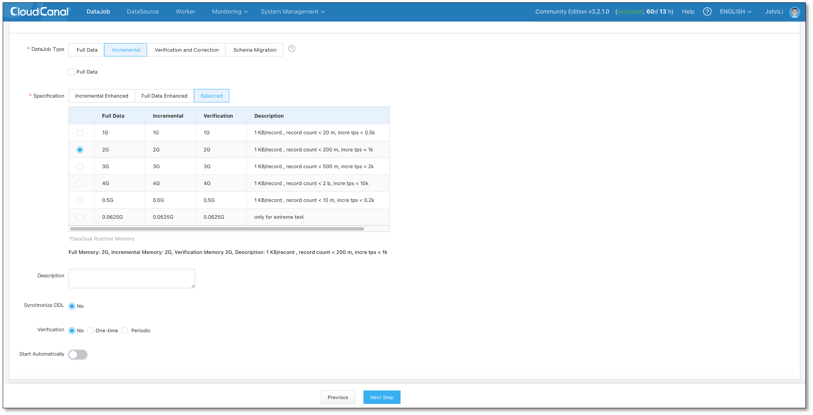

- 选表、列映射裁剪...省略，点击下一步
- **确认创建**
- **任务详情** -> **参数设置**
  - 设置源和目标数据源配置 **deCycle** 参数为 true
  - 设置源和目标数据源配置 **deCycleTable** 参数为标记表，如 `__cc_tx_de_cycle`
  - 生效配置
  - 启动任务

  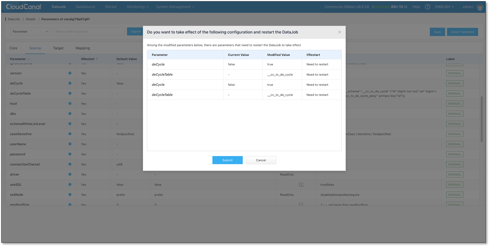

- 任务正常运行
  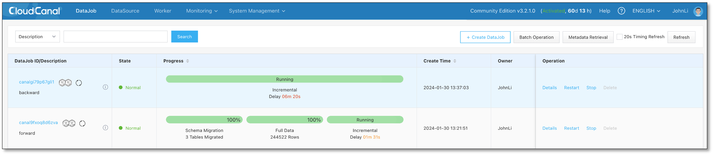

### 测试
- 源端数据库做数据变更，正向任务监控有变更，反向任务没有(即无循环)
  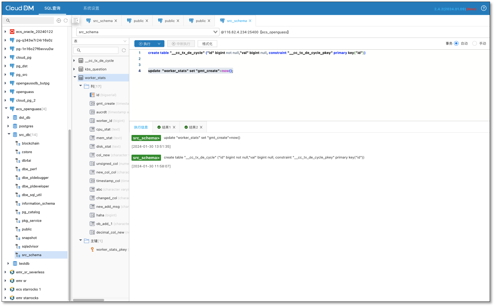
  
  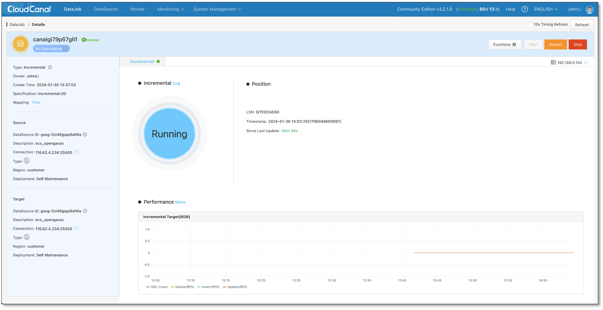

- 目标端数据库做数据变更，反向任务监控有变更，正向任务没有(即无循环)
  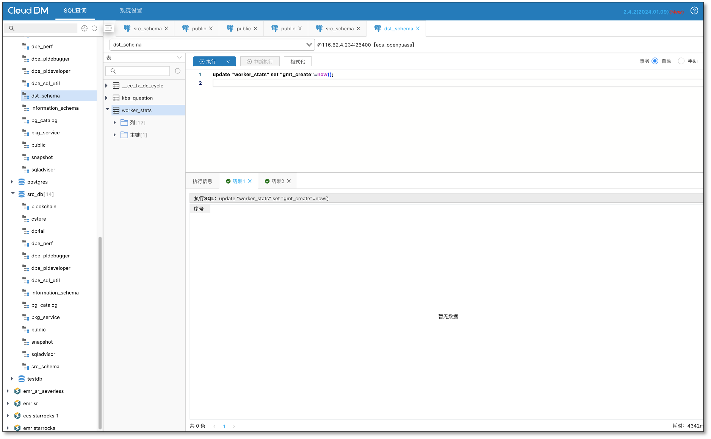
  
  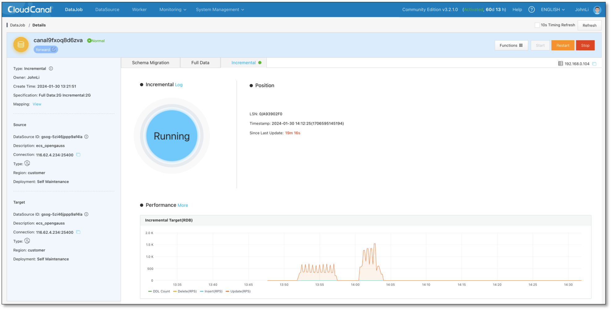

- 最后做下校验
  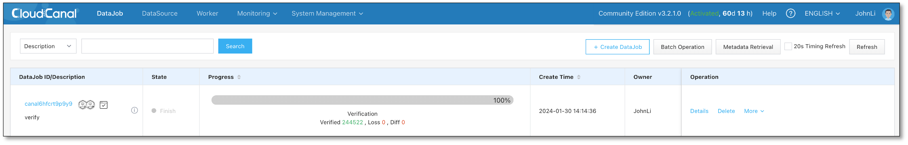

## 总结
本文即以 [openGauss](https://opengauss.org/zh/) 为示例介绍如何使用 [CloudCanal](https://www.clougence.com?src=cc-doc-pg-loop-sync) 做 PostgreSQL 双向同步并防循环，助力用户实现异地多活、灾备业务目标。