## 简述

本文主要介绍 [CloudCanal](https://www.clougence.com?src=cc-doc-redis-bidirection-sync) 如何做 Redis 双向同步并防循环,方案特点包括:

- 支持 Redis 单节点、主备、分片集群
- 支持数据初始化防循环
- 支持防循环辅助指令超时或永不超时设置

## 技术点

### 防循环事件

CloudCanal Redis 双向同步采用辅助指令进行循环判定，当收到正常指令，计算其hash值，构建辅助指令key，反向查询辅助指令是否存在，如果存在则为循环，过滤即可。

对于辅助指令对端写入以及源端查询，CloudCanal 进行了批量和多线程优化，同步性能得到有效提升。

防循环兼容 分片集群、单节点、主备节点任意组合之间的数据迁移同步。

### 单任务多节点事件订阅

Redis 集群普遍具备多个节点，为了简化任务配置，CloudCanal 采用单任务多 Redis 节点订阅方式，实现数据迁移和同步，整个过程更加便利可靠。

## 操作示例

### 准备 CloudCanal
- 下载安装 [CloudCanal 私有部署版本](https://www.clougence.com?src=cc-doc-redis-bidirection-sync)

### 添加数据源
- 本案例采用  **阿里云云市场购买的 2 个 Redis 集群**, 均位于杭州区域
- 登录 CloudCanal 平台 ，**数据源管理** -> **添加数据源**  , 添加 2 个 Redis 集群
- 建议对数据源进行描述修改，防止配置正反链路时，识别错数据库
   
  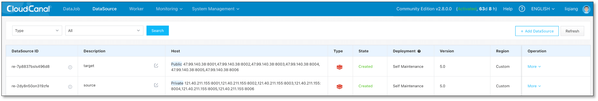

### 创建正向同步任务
- **任务管理**->**新建任务**
- 双向同步中，正向任务一般指源端有数据，目标端无数据的链路，涉及对端数据初始化
- 第一个页面，选择源端和目标端数据源和相关信息，点击**下一步**

  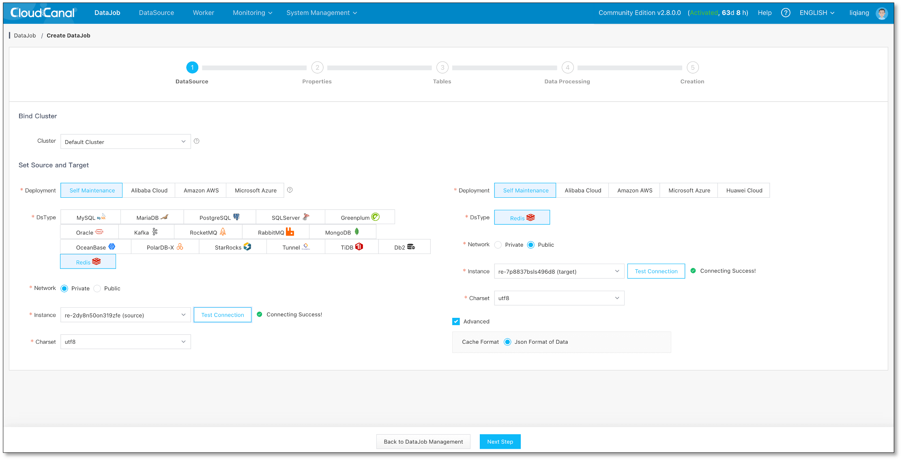

- 第二个页面
  - 选择 **数据同步**，并且勾选 **全量数据初始化**
  - **置灰自动启动**，以便创建任务后设置双向同步参数
  - 点击 **下一步**

  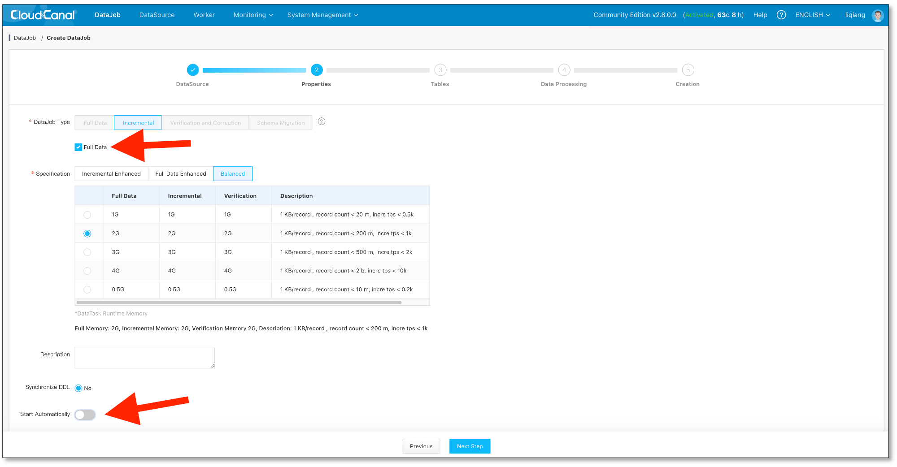

- 第三个页面,点击**确认创建**
- **任务详情** -> **参数设置**
  - 设置源端数据源配置 **deCycle** 参数为 true 
  - 设置源端数据源配置 **deCycleEventExpireSec** 参数为 1200 秒 (防循环辅助指令超时事件，超过后防循环即无效)
  - 生效配置并启动

  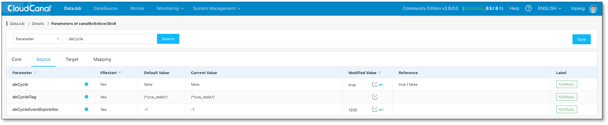

- 等待正向同步任务初始化完数据并正常同步
  > 此处不建议在正向同步任务创建后立即创建反向任务，涉及到 repl-backlog-size 设置不足时，反向任务启动强制走 FULL SYNC 导致新数据被老数据覆盖问题

  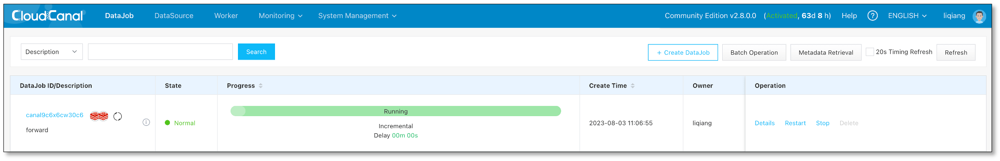

### 创建反向同步任务
- **任务管理**->**新建任务**
- 第一个页面，选择源端和目标端选择数据源（**请和正向任务所选数据源对调**）和相关信息，点击**下一步**

  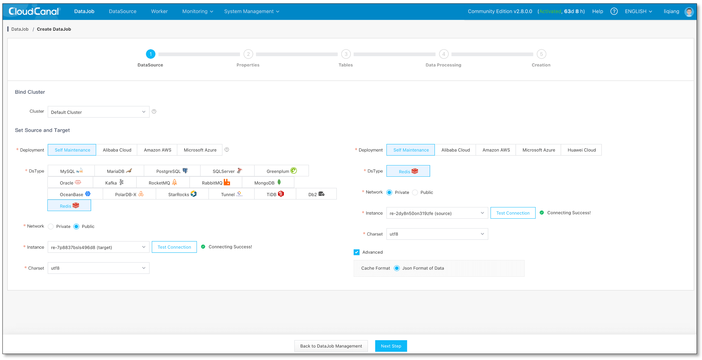

- 第二个页面
  - 选择 **数据同步**，并去除**全量数据初始化**勾选
  - **置灰自动启动**，以便创建任务后设置双向同步参数
  - 点击 **下一步**

  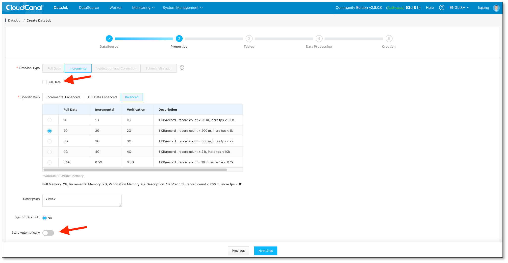

- 第三个页面，点击**确认创建**
- **任务详情** -> **参数设置**
  - 设置源端数据源配置 **deCycle** 参数为 true , **deCycleEventExpireSec** 参数为 1200 秒
  - 生效配置并启动

  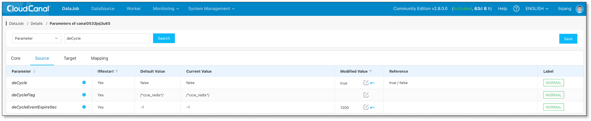

- 任务正常运行

  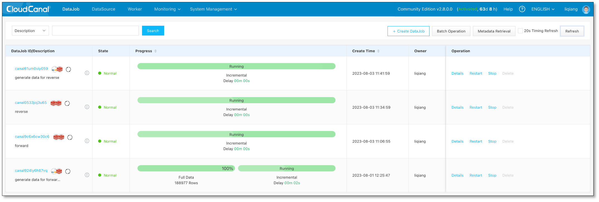

### 测试
- 源端数据库做数据变更，正向任务监控有变更，反向任务没有(即无循环)
  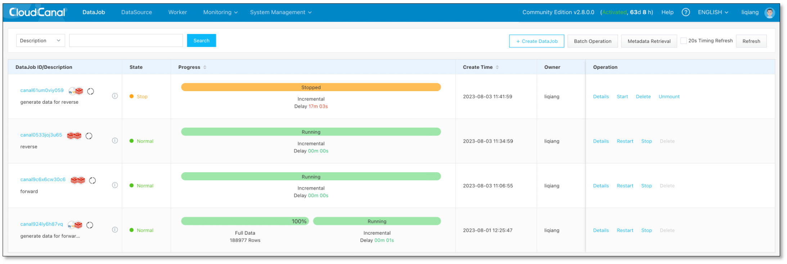
  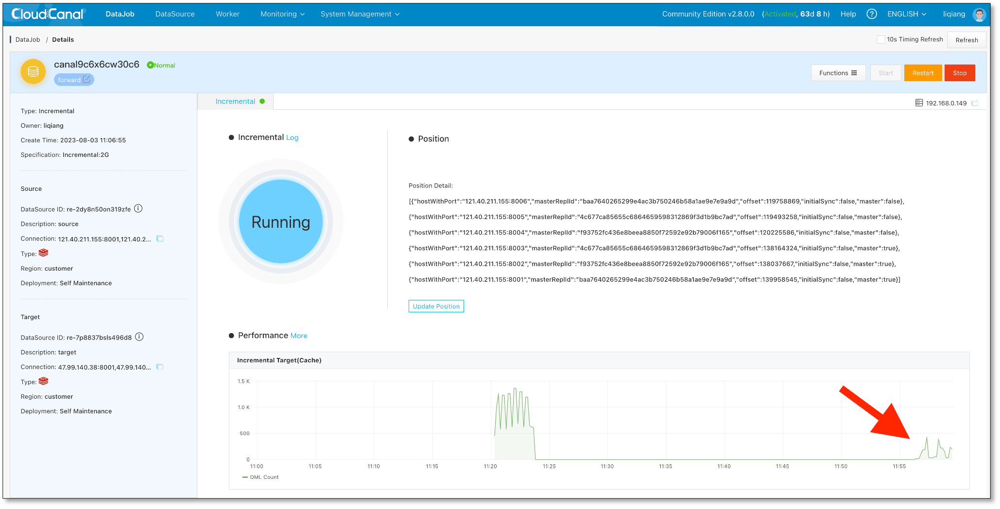
  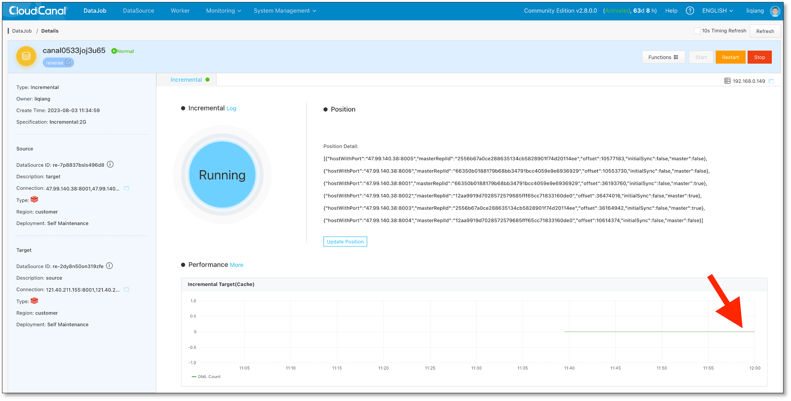

- 目标端数据库做数据变更，反向任务监控有变更，正向任务没有(即无循环)
  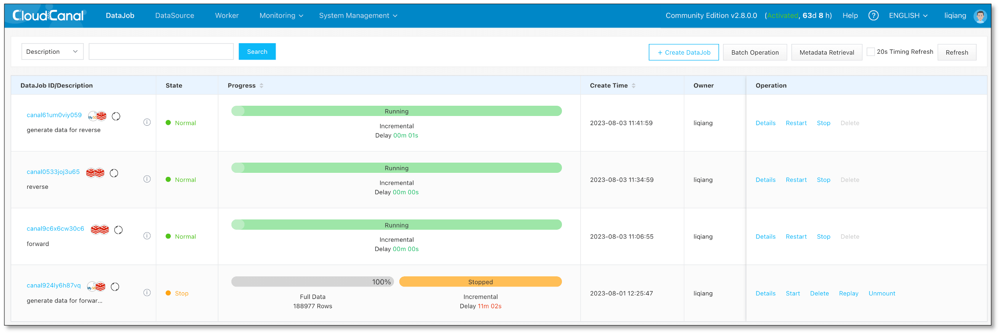
  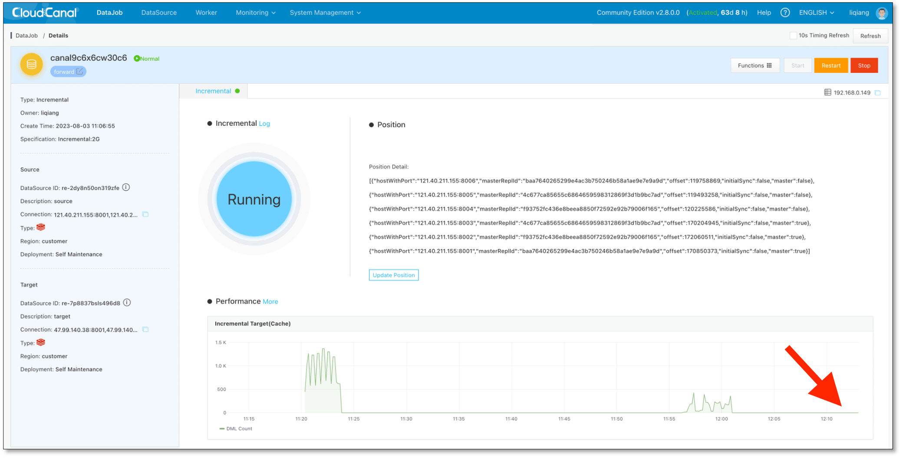
  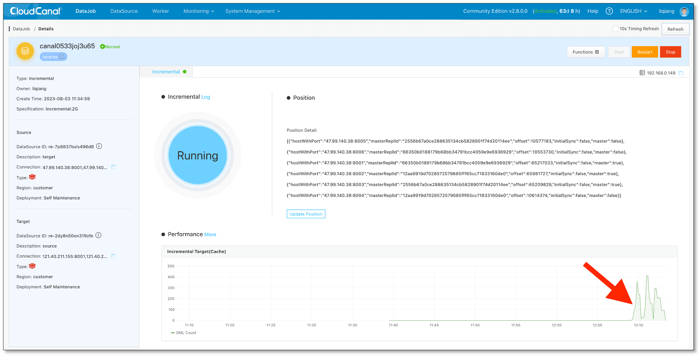

- 等待两边防循环辅助指令过期，检查数据一致
  - 源端
  
  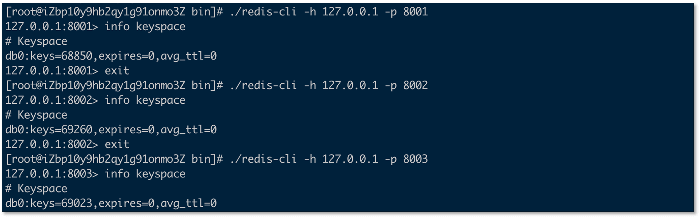
  
  - 目标端
  
  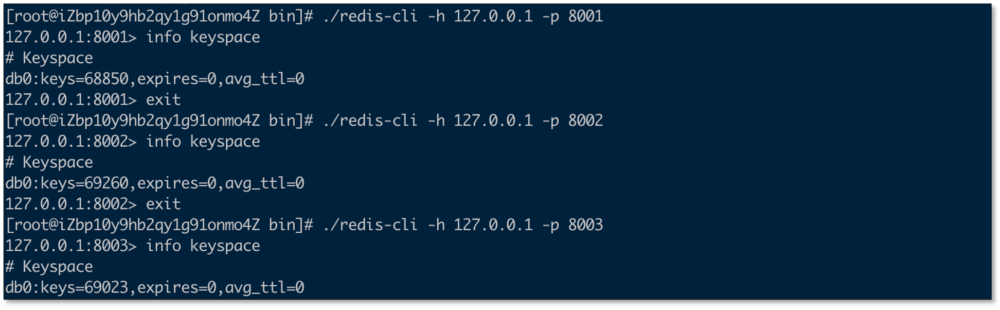

## 常见问题

### 目前遗留的问题

- 对于主备切换或者位点过老导致 FULL SYNC 控制还不够精准，存在因全量迁移导致老数据覆盖新数据问题
- 防循环指令目前较有限: FULL DUMP 、 SET 、 HSET 、DEL，后续需要丰富常见指令防循环

## 总结
本文简单介绍了如何使用 [CloudCanal](https://www.clougence.com?src=cc-doc-redis-bidirection-sync) 构建 Redis 双向同步，助力用户实现异地多活、灾备业务目标。