## 背景

StarRocks 和 Doris 是近两年来非常流行的开源实时数仓，不仅数据检索、分析能力出众，而且数据准备能力性能好、准确度高，相当丝滑，可如同在线数据库般使用。

CloudCanal 在早期即支持此两种实时数仓，并且经过多次迭代，无论功能、性能、稳定性都趋于成熟。

这篇文章主要介绍如何使用[阿里云 EMR for StarRocks/Doris](https://emr-next.console.aliyun.com/) 作为 CloudCanal 数据源，快速、低成本接入业务数据，实现"极速一体"的实时数据分析体验。

## 云资源入口

- [阿里云官网](https://www.aliyun.com) > **产品** > **大数据计算** > **开源大数据平台 E-MapReduce**
  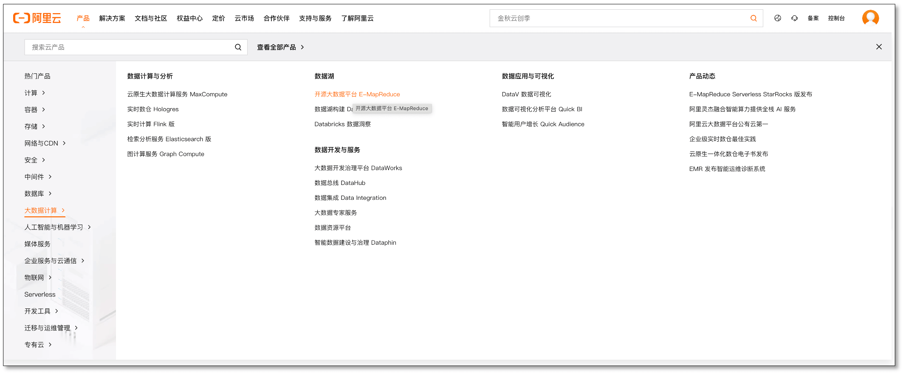

- **EMR on ECS** > **创建集群** , 选择数据分析 tab
  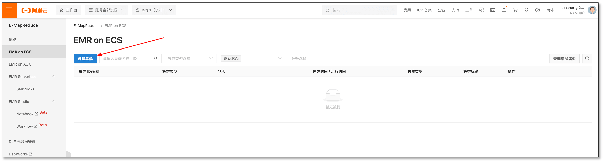

## 创建并添加 Aliyun EMR for StarRocks
- 选择一个 StarRocks 版本，点击下一步
  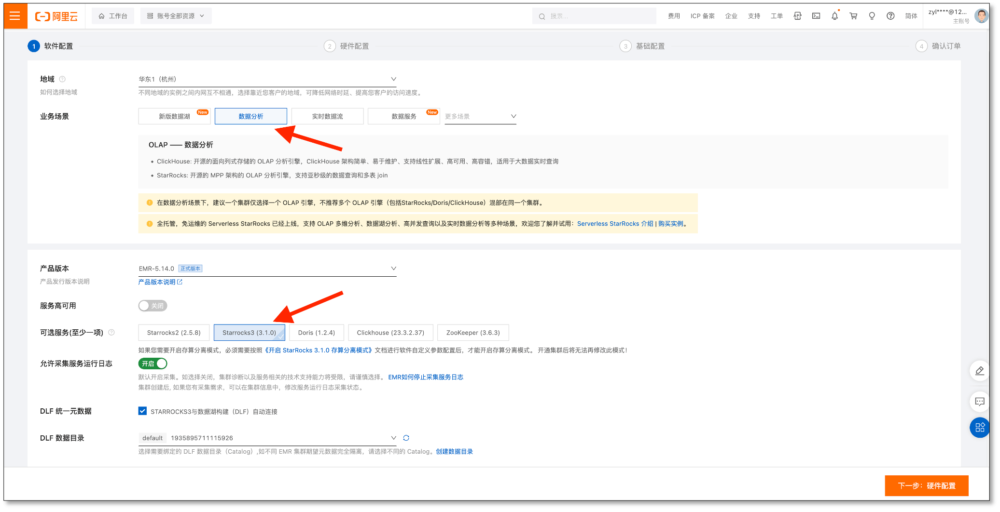

- 各个节点都挂载公网（如 VPC 内使用，则忽略），点击下一步
  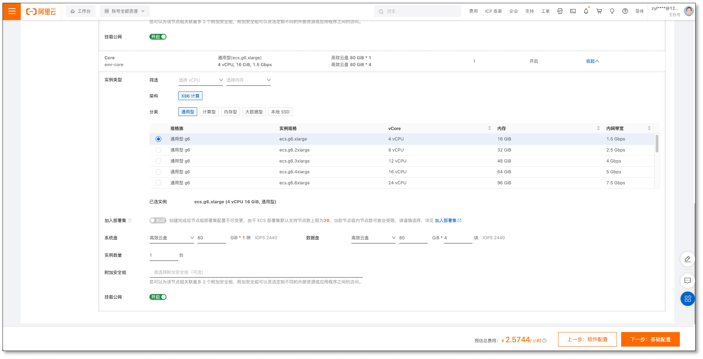

- 查看 StarRocks be/fe 节点和端口, 和默认有所区别, 其中 fe 端口名称为 **query_port**, 走 MySQL 协议, be 端口 **webserver_port**, 可走 HTTP 协议(stream load)
  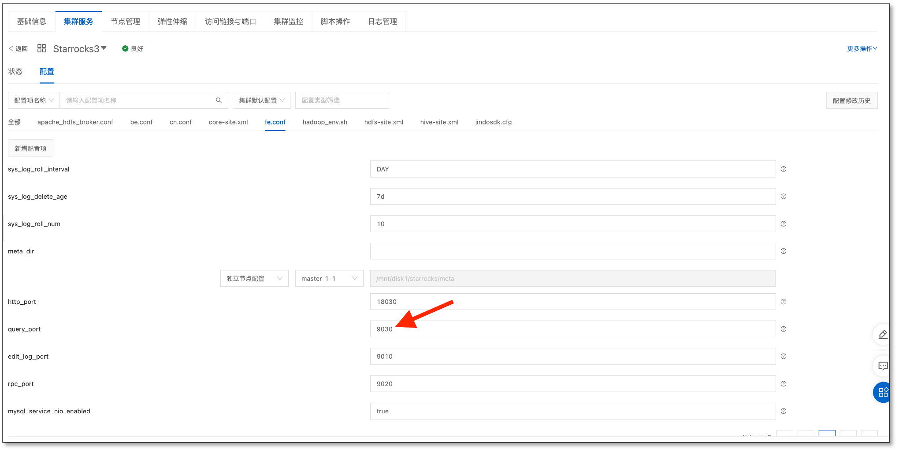
  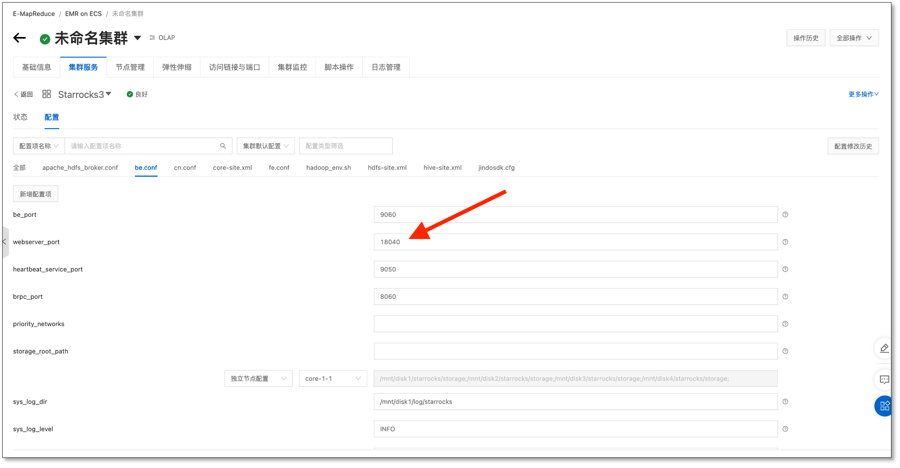

- **CloudCanal 控制台** > **数据源管理** > **添加数据源**, 选择添加 **自建 StarRocks**
  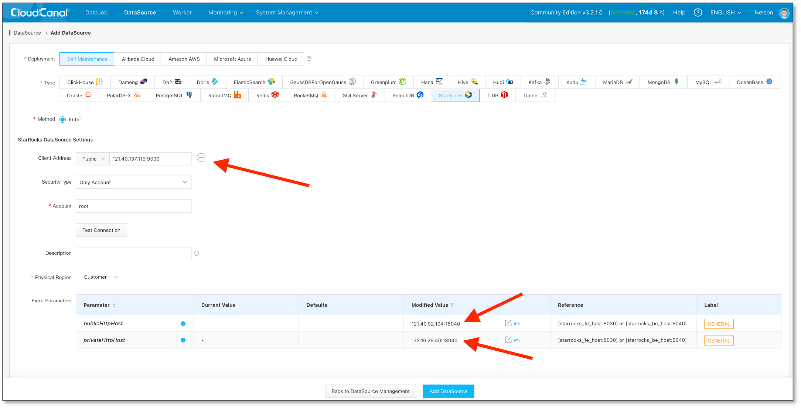

## 创建并添加 Aliyun EMR for Doris
- 选择一个 Doris 版本，点击下一步
  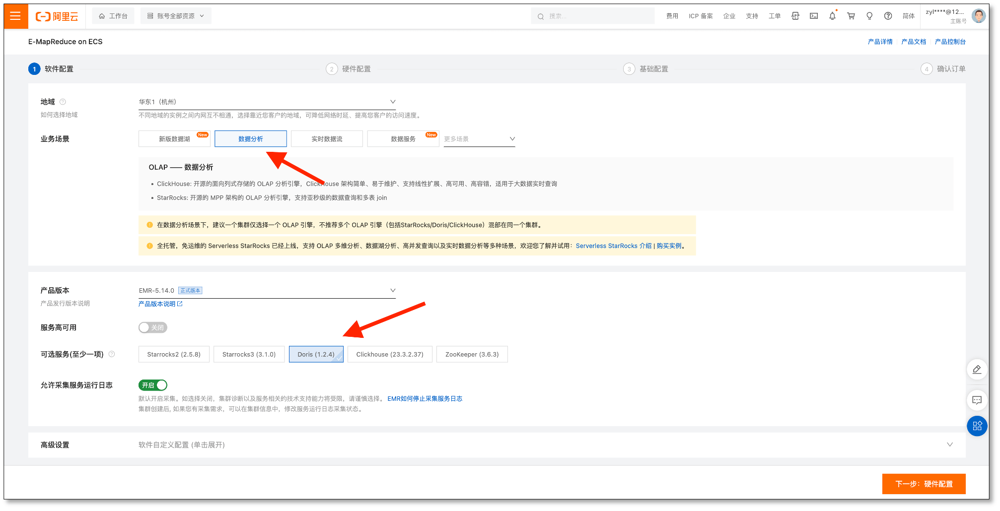

- 各个节点都挂载公网（如 VPC 内使用，则忽略），点击下一步
  

- 查看 Doris be/fe 节点和端口, 和默认有所区别, 其中 fe 端口名称为 **query_port**, 走 MySQL 协议, be 端口 **webserver_port**, 可走 HTTP 协议(stream load)
  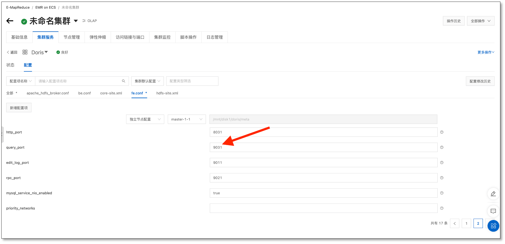
  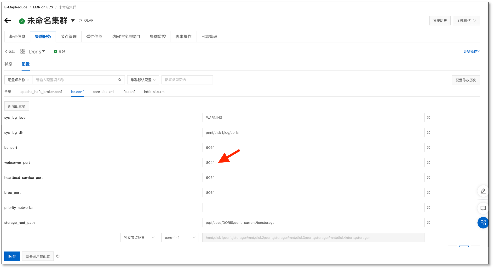

- **CloudCanal 控制台** > **数据源管理** > **添加数据源**
  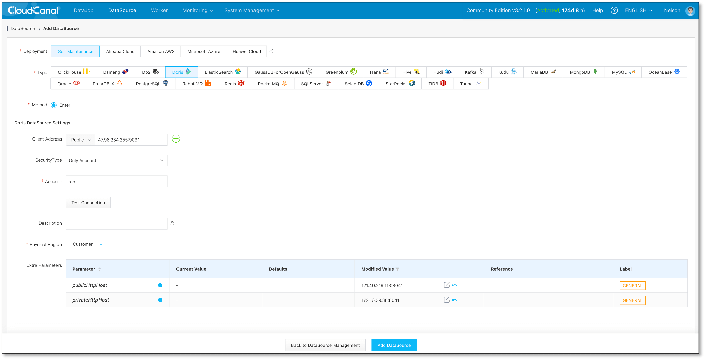

## 使用

- 创建 CloudCanal 任务，实时同步数据到 StarRocks/Doris
- 使用 MySQL 客户端/[CloudDM](https://www.clougence.com/clouddm-personal) 连接 StarRocks/Doris 进行检索分析体验

## 总结

本文主要介绍如何使用阿里云 EMR 快速体验 StarRocks/Doris 数据查询分析，步骤相对简单且价格低廉。