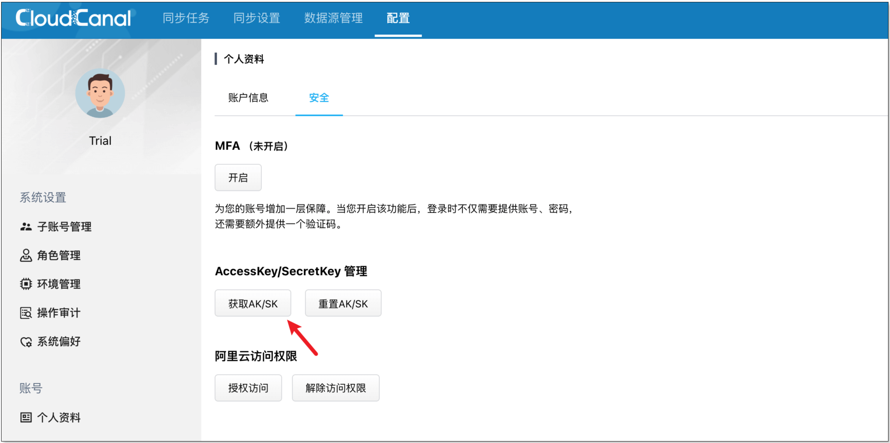

## 简述
本文介绍 [CloudCanal](https://www.clougence.com?src=cc-doc-blog-cloudcanal-openapi) 开放 API，以便被用户集成到自己的数据平台或系统中，其特点包括

- 基于 HTTP 交互协议
- AK / SK 认证
- 基于 RequestId 的 API 调用链跟踪（更容易排查问题）
- 细颗粒度

## 技术点

### API 粒度设计

CloudCanal OpenAPI 并不像公有云厂商完全封闭资源选择，我们将任务运行集群开放给用户自定义选择；一方面我们认为自己的资源调度做得不一定贴合用户需求，另外 CloudCanal 无论是 SaaS 模式还是私有化部署，底层软硬件均由用户提供（所以他们更加熟悉这些资源）。

CloudCanal 将较复杂的异构数据库元数据映射裁剪能力开放，所以 API 中涉及一部分较难理解的抽象数据结构设置。这个特点带来的好处是数据任务可定制性更强，坏处是门槛过高。

CloudCanal 为了便利应用查询各种常量，开放了一系列常量接口供用户选择调用，而不单单通过文档维护。对于文档维护能力不强，而且往往和软件严重脱节的现状下，这个可能是一个好选择。

总体而言，此版本 OpenAPI 相对细颗粒度和具备一定的丰富性，后续随着用户逐步使用和反馈，CloudCanal 会推出更加高层、自动化的 API 能力。

### API 用户

对 CloudCanal 用户来说，无论是数据平台、还是业务平台，其包含的组件和场景众多，不仅仅是大家耳熟能详的调度组件、元数据管理组件、数据开发组件、数据备份等，甚至包含具体的运维流程、业务流程（比如初始化缓存数据）等。

通过 OpenAPI，能够相对容易地定制这些数据需求，达成业务目标。我们也非常热忱地期盼大家把 CloudCanal 通过 OpenAPI 集成到你们的平台，让我们 1 份的智慧和劳动带来 N 份价值。

## 操作示例

接下来以 MySQL 到 Kafka 为例，按步骤将 CloudCanal 任务创建出来，并可查看和启停。

### 前置条件

用户已经将 **集群**、**机器** 和 **数据库** 在 CloudCanal 上初始化完毕。

### 获取 AK/SK

登录 CloudCanal 控制台，点击菜单 **配置** -> **个人资料** -> **安全** ->**获取AK/SK**。


### API 认证代码

调用 API 需要带上相应的认证信息，通过 HTTP GET 参数进行传递，可参考 [公共参数文档](../openCenter/openApi/apiUseReference/api_common_parameters.md)。

目前提供了 Java 代码参考，其他程序语言请按照相同语义进行计算和 HTTP 请求构建和发送。

### 查询可用集群

通过接口  [查询可用集群](../openCenter/openApi/clusterApi/api_cluster_listclusters.md)，主要是为了获得可以运行任务的机器所在集群(`id`)。

如果接口返回的集群信息中 **runningCount** 字段为 0 ，则该集群实际上无法运行任务，应该避免被选中。

选中的集群，需要确保其机器需要能够正常连接 **迁移同步的数据源**，否则创建出来的任务将无法运行，特别对于跨网络、云数据库等存在白名单需要提前识别，可通过接口 [链接数据源](../openCenter/openApi/dataSourceApi/api_datasource_connectds) 测试集群与所选数据源的连通性。

当前示例任务中
- clusterId 为 **1**

### 查询数据源

通过接口 [查询可用的数据源](../openCenter/openApi/dataSourceApi/api_datasource_listds.md)，从中选取业务想要迁移同步的源端数据库( `id` )和目标数据库( `id`)。

建议通过接口 [链接数据源](../openCenter/openApi/dataSourceApi/api_datasource_connectds.md) 先测试所选集群与所选数据源的连通性。

当前示例任务中
- srcDsId 为 **61**
- dstDsId 为 **22**

### 构建库、表、列元数据和映射

数据库元数据包括源 ([**srcSchema**](../openCenter/openApi/dataTaskApi/api_datajob_schema.md)) 和目标端 ([**dstSchema**](../openCenter/openApi/dataTaskApi/api_datajob_schema.md)) 库、表、列、分区等信息描述，以及源和目标元数据映射 ([**mappingDef**](../openCenter/openApi/dataTaskApi/api_datajob_mapping))

当前示例任务中
- srcSchema:
    ```json
    [
        {
            "db": "dingtax",
            "dbPattern": "",
            "tables": [
                {
                    "table": "kbs_no_pk_have_uniq",
                    "tablePattern": "",
                    "columns": [
                        {
                            "column": "name",
                            "targetAutoCreate": true,
                            "inBlackList": false
                        },
                        {
                            "column": "uniq_id",
                            "targetAutoCreate": true,
                            "inBlackList": false
                        },
                        {
                            "column": "col_add_i",
                            "targetAutoCreate": true,
                            "inBlackList": false
                        },
                        {
                            "column": "col_add_v",
                            "targetAutoCreate": true,
                            "inBlackList": false
                        }
                    ],
                    "actions": [
                        "INSERT",
                        "UPDATE",
                        "DELETE"
                    ],
                    "inBlackList": false,
                    "targetAutoCreate": true,
                    "specifiedPks": [
                        "uniq_id"
                    ]
                },
                {
                    "table": "worker_stats",
                    "tablePattern": "",
                    "columns": [
                        {
                            "column": "id",
                            "targetAutoCreate": true,
                            "inBlackList": false
                        },
                        {
                            "column": "gmt_create",
                            "targetAutoCreate": true,
                            "inBlackList": false
                        },
                        {
                            "column": "worker_id",
                            "targetAutoCreate": true,
                            "inBlackList": false
                        },
                        {
                            "column": "cpu_stat",
                            "targetAutoCreate": true,
                            "inBlackList": false
                        },
                        {
                            "column": "mem_stat",
                            "targetAutoCreate": true,
                            "inBlackList": false
                        },
                        {
                            "column": "disk_stat",
                            "targetAutoCreate": true,
                            "inBlackList": false
                        },
                        {
                            "column": "col_new",
                            "targetAutoCreate": true,
                            "inBlackList": false
                        }
                    ],
                    "actions": [
                        "INSERT",
                        "UPDATE",
                        "DELETE"
                    ],
                    "inBlackList": false,
                    "targetAutoCreate": true,
                    "specifiedPks": []
                }
            ],
            "targetAutoCreate": false,
            "inBlackList": false
        }
    ]
    ```
- dstSchema:
    ```json
    [
        {
            "topic": "my-6716s8rryux1366.dingtax.kbs_no_pk_have_uniq",
            "topicPattern": "",
            "partitions": 4,
            "partitionKeys": []
        },
        {
            "topic": "my-6716s8rryux1366.dingtax.worker_stats",
            "topicPattern": "",
            "partitions": 4,
            "partitionKeys": [
                "id"
            ]
        }
    ]
    ```
- mappingDef:
    ```json
    [
        {
            "serializeMapping": {
                "{\"parent\":{\"value\":\"dingtax\"},\"value\":\"kbs_no_pk_have_uniq\"}": "{\"value\":\"my-6716s8rryux1366.dingtax.kbs_no_pk_have_uniq\"}",
                "{\"parent\":{\"value\":\"dingtax\"},\"value\":\"worker_stats\"}": "{\"value\":\"my-6716s8rryux1366.dingtax.worker_stats\"}"
            },
            "method": "TABLE_TOPIC",
            "serializeAutoGenRules": {},
            "commonGenRule": "MIRROR"
        },
        {
            "method": "COLUMN_COLUMN",
            "serializeMapping": {},
            "serializeAutoGenRules": {},
            "commonGenRule": "MIRROR"
        }
    ]
    ```

### 创建任务

接口 [创建任务](../openCenter/openApi/dataTaskApi/api_datajob_create.md) 会有较多的参数，重要的几个参数已经在前面几步已经说明，其他参数按照参数说明填写。

对于示例任务，规格参数 **specId** 我们选择了 16，即 2GB 内存规格，常见的规格代码 15 / 16 / 17 / 18
  - 15：1GB 内存分配
  - 16：2GB 内存分配
  - 17：3GB 内存分配
  - 18：4GB 内存分配

因为对端选择了 Kafka，属于消息中间件，则需要指定 **dstSchemaLessFormat** 参数值为 **CLOUDCANAL_JSON_FOR_MQ** 或 **CANAL_JSON_FOR_MQ**，具体可以参考：[消息值格式](../openCenter/openApi/constApi/api_constant_mqvalueformats.md) 和 [MQ 消息同步格式说明](../reference/kafka_msg_format_type.md)。

不过在创建之前，建议分别调用 [基础任务预检](../openCenter/openApi/dataTaskApi/api_datajob_precheckbasic.md) 和 [详细任务预检](../openCenter/openApi/dataTaskApi/api_datajob_precheckdetail.md) 进行任务预检，确保创建的成功率。

### 查询任务列表

通过接口 [查询任务列表](../openCenter/openApi/dataTaskApi/api_datajob_list.md)，得到已经创建或者创建中的任务信息，具体状态由 **lifeCycleState** 字段表示

如果任务刚提交创建，任务信息中包含 **consoleJobId** 字段可以提供创建任务对应的 [异步任务进度和状态](../openCenter/openApi/asyncTaskApi/api_consolejob_queryconsolejob.md)

### 启动 / 停止 / 删除任务

任务 [启动](../openCenter/openApi/dataTaskApi/api_datajob_start.md) / [停止](../openCenter/openApi/dataTaskApi/api_datajob_stop.md) / [删除](../openCenter/openApi/dataTaskApi/api_datajob_delete.md) 接口相对简单，但是其各自的操作必须在相应状态下执行，如果状态不对，后端将返回各种异常。

## 常见问题

### 后续是否有 SDK
目前已有 Java SDK，其他 SDK 暂未提供。 Java SDK 因为工作量巨大，还在不断完善中，也欢迎各位一起参与。

SDK 开源地址：https://gitee.com/clougence/cloudcanal-openapi-sdk

## 总结
本文简单介绍了快速对接 [CloudCanal](https://www.clougence.com?src=cc-doc-cloudcanal-openapi) OpenAPI 的开发指南，后续我们将提供简单代码 Demo 给大家。
