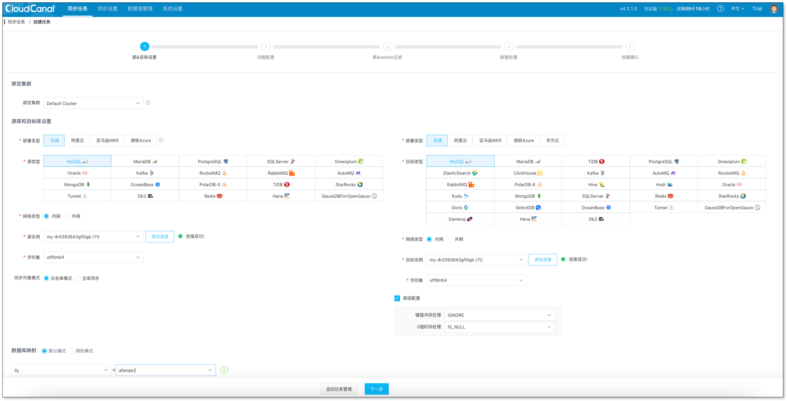
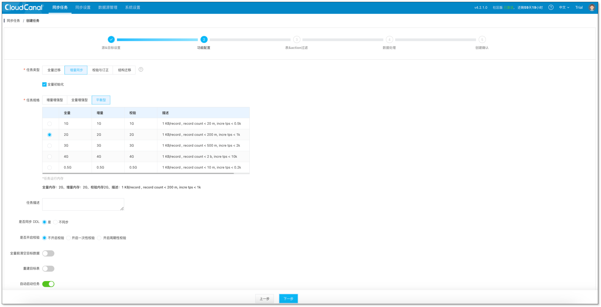
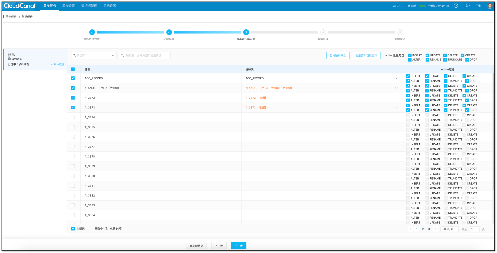
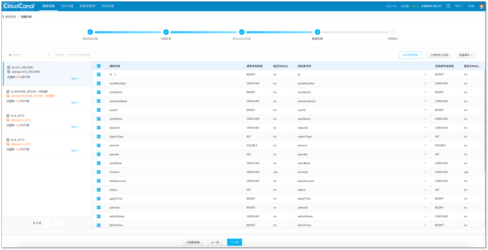
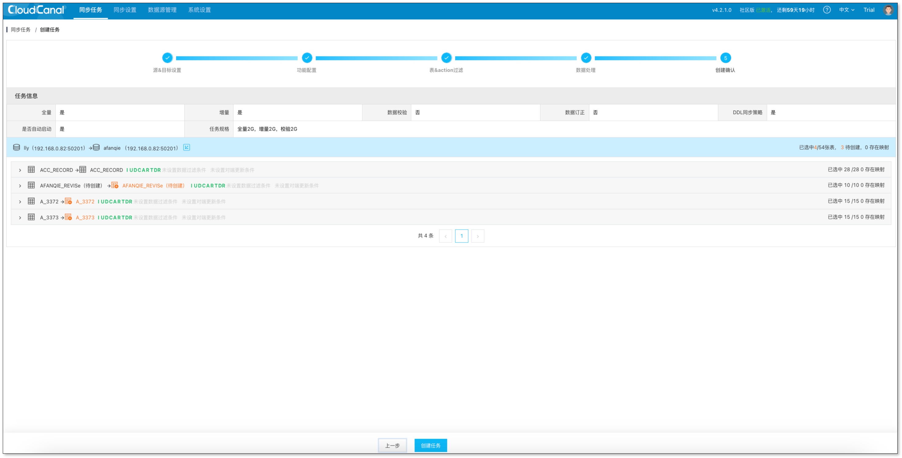
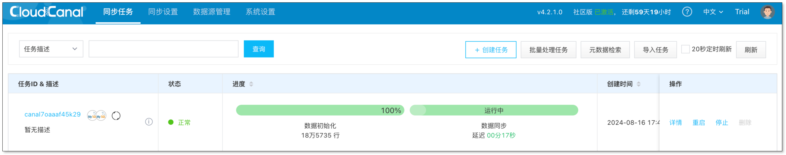
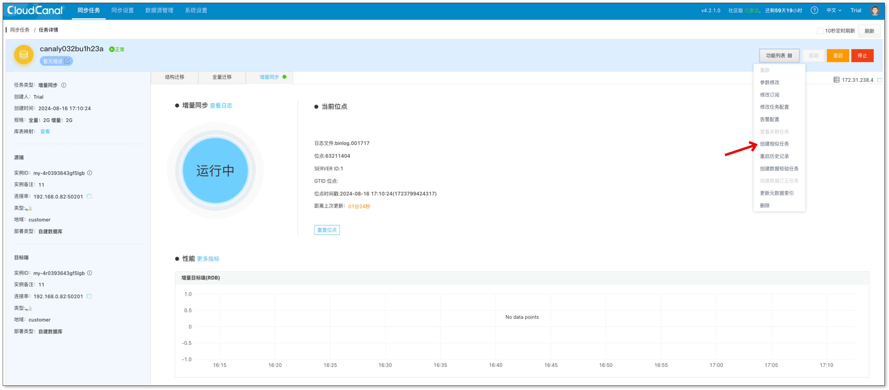
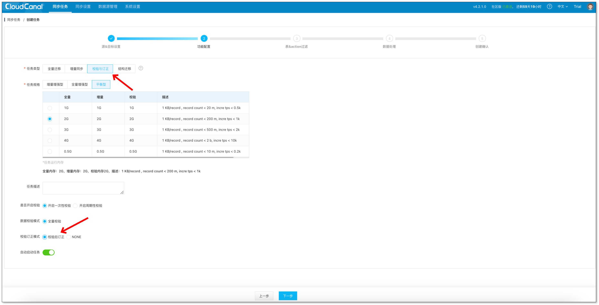
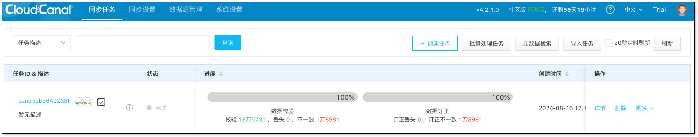
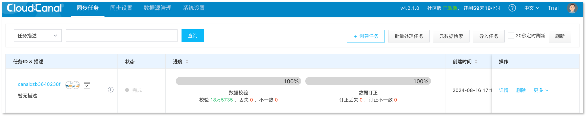

## 简述
本文主要介绍如何使用 [CloudCanal](https://www.clougence.com?src=cc-doc-data-verification-and-correction) 实现数据校验和订正。

## 技术点
### 逐字段对比
CloudCanal 通过源端数据库扫描数据，批量从对端查出数据，逐字段对比，找出丢失（loss）和差异（diff）数据，记录到日志中。

其中需要解决扫描效率、字段类型兼容、类型精度匹配等问题。

### 覆盖式订正
采用对端覆盖式订正，对于对端数据源具备 REPLACE 语意的，均可打开订正能力。

所订正的数据为差异数据，即校验任务的校验结果。

### 一体化
校验和订正作为一个数据任务的两个步骤进行，类似数据同步任务中全量数据初始化和数据同步的关系。

订正步骤可在创建任务时忽略，待校验任务完成后，额外加到任务中来。

### 重跑
校验和订正任务支持重跑。在订正步骤完成之后，若需要看下效果，可点击 **重跑** 按钮再一次执行任务。

### 定时执行
校验和订正任务支持定时启动，在完成相应的职能同时，自动记录结果，并清理关联日志。

## 操作示例

### 安装 CloudCanal
下载、安装并激活 [CloudCanal 私有部署版本](https://www.clougence.com?src=cc-doc-data-verification-and-correction)。

### 创建数据同步任务
1. 点击 **同步任务** > **创建任务**，进入创建任务流程。
2. 选择源端和目标端数据库，点击 **下一步**。
  

3. 选择任务类型为 **增量同步**，并勾选 **数据初始化**，点击 **下一步**。
  

4. 选择需同步的表、列，点击 **下一步**。
  
  

5. 确认任务信息后，点击 **创建任务**。
  

6. 任务创建成功，自动执行结构迁移（如有）、全量迁移、增量同步。
  

### 造差异数据
对端数据源删除并修改一些数据。

### 创建校验订正任务
1. 点击 **任务详情** > **功能列表** > **创建相似任务**，进入任务创建流程。
  

2. 第二步中，任务类型选择 **校验与订正**，校验订正模式选择 **校验后订正**，其他步骤不需要变动。
  

3. 任务创建后，自动执行数据校验和订正任务，并显示状态。
  

4. 点击任务列表操作栏中的 **更多** > **重跑**，重跑数据校验和订正任务，结果显示数据一致。
  

## 注意事项
- 对于对端多出来的数据，无法进行校验，需要配置一个反向的校验任务解决。
- 对于无主键、时间戳类型表默认忽略校验，前者无法定位到数据，后者因为时间精度差异，导致定位困难。
- 对端数据源如没有实现 REPLACE 能力，则无法开启订正任务。
- 源端表如果没有主键，则无法开启订正任务。

## 总结
主要介绍使用 [CloudCanal](https://www.clougence.com?src=cc-doc-data-verification-and-correction) 完成数据校验和订正，支持校验订正一体化、单次/定时校验和订正等能力。