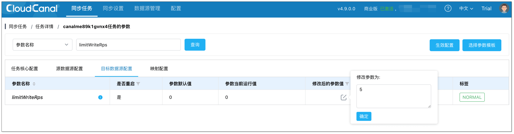

## 功能说明
全量迁移时，对端数据库写入数据量较大时可能导致数据库负载较高, 可开启写入限流功能，降低写入频率。

## 操作说明

1. 进入任务详情页，点击 **功能列表** > **修改任务参数**。
2. 选择 **目标数据源配置** 页签，搜索 **limitWriteRps**，设置写入时的最大 RPS，CloudCanal 执行写入时会按照设置的值进行限流。
  
3. 点击 **生效配置**，修改成功。
