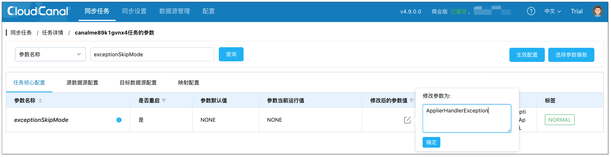

## 功能说明
当任务出现异常无法继续同步，且这些异常可以被略过时，可以采取跳过异常的措施，让任务跳过导致异常的数据继续同步，不影响后续的数据写入对端。

## 注意事项
跳过写入异常开启后，后续任何导致异常的事件都将会被直接忽略。**建议在跳过引发异常的数据之后及时还原该参数配置**，并且订正跳过的数据，以免产生数据不一致问题。

## 操作说明

1. 进入任务详情页，点击 **功能列表** > **修改任务参数**。
2. 选择 **核心任务配置** 页签，搜索 **exceptionSkipMode**。默认值为 NONE，即不忽略任何异常。将运行值改为 **ApplierHandlerException**，即忽略对端写入异常。（目前 ALL 值和 ApplierHandlerException 效果一样）
  
1. 点击 **生效配置**，修改成功。