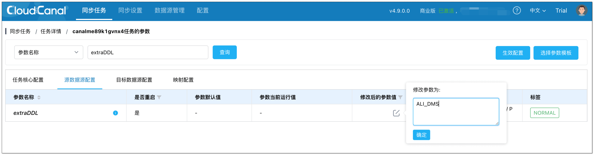
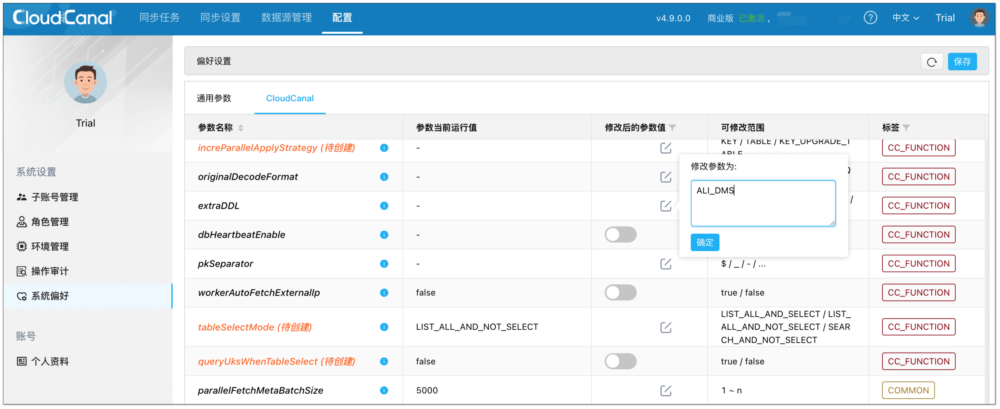

## 功能说明
任务源端数据源使用（GH-OST、PT-OSC、阿里云 DMS 无锁变更）Online DDL 工具做 DDL 时，任务默认不会同步工具产生的临时表，这将导致任务 DDL 同步异常，用户可设置参数来主动订阅临时表。

## 参数说明
- 配置参数：**extraDDL**    
- 参数值说明：
  - **NONE**：不订阅 Online DDL 临时表（默认）
  - **PT**：订阅 PT-OSC 产生的临时表
  - **GHOST**：订阅 GH-OST 产生的临时表
  - **ALI_DMS**：订阅阿里云 DMS 无锁变更产生的临时表
  - **PT_GHOST**：同时订阅 PT-OSC + GH-OST 两类临时表（混用场景）

  :::info
  开启订阅后，任务会自动识别并处理对应工具的临时表/日志表，避免 DDL 同步缺失或异常。
  :::

## 操作说明

### 单个任务应用
该配置方法适用于已创建任务：
1. 进入任务详情页，点击 **功能列表** > **修改任务参数**。
2. 搜索 **extraDDL**。根据使用的 Online DDL 工具，设置对应的参数值。
  
3. 点击右上角 **生效配置**，修改成功，任务将订阅 Online DDL 工具临时表。
  

### 系统全局应用
该配置方法适用于后续新建任务：
1. 点击 **配置** > **系统偏好**。
2. 在 CloudCanal 页签下找到 **extraDDL**，根据使用的 Online DDL 工具，设置对应的参数值。
   
3. 点击 **保存**，修改成功。后续所有支持该参数的新建任务都将订阅 Online DDL 工具临时表。
  
## 支持链路
 
  - MySQL -> MySQL
  - MySQL -> StarRocks
  - MySQL -> Doris
  - MySQL -> RabbitMQ
  - MySQL -> RocketMQ
  - MySQL -> Kafka

  