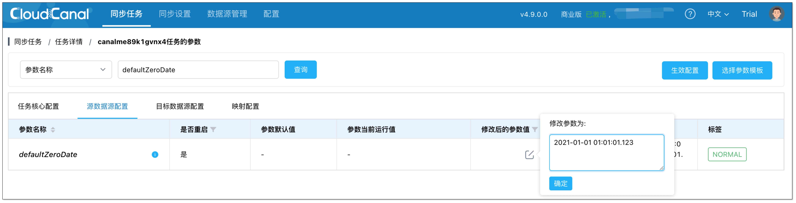

## 功能说明
当时间为 `0000-00-00 00:00:00` / `0000-00-00` 值时，很多数据库不支持这种 0 值时间写入，例如 MySQL 的 safe mode 如果未设置允许 0 值写入，默认不允许写入 0 值。可通过参数给定一个对端数据库兼容的时间字段确保任务正常写入，例如设置为 1970-01-01 00:00:00。

## 操作说明

1. 进入任务详情页，点击 **功能列表** > **修改任务参数**。
2. 选择 **源数据源配置** 页签，搜索 **defaultZeroDate**，设置遇到`0000-00-00 00:00:00` / `0000-00-00`值时用于替换的默认值。
  
3. 点击 **生效配置**，修改成功。
