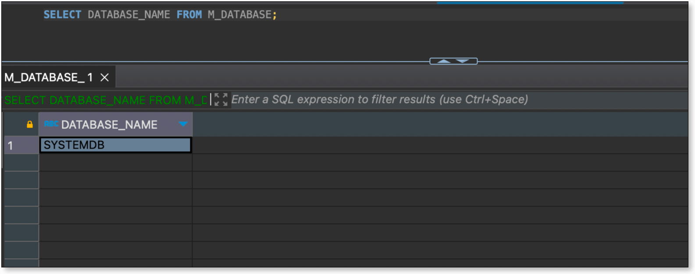

本文介绍新增数据源时，如何解决 Sap Hana 测试连接报错的问题。

## 现象描述
新增 Sap Hana 数据源时，测试连接出现相关报错, 如下图:
  

## 问题排查
默认数据库填写错误。
  
## 解决方法
1. Sap Hana 执行 `SELECT DATABASE_NAME FROM M_DATABASE;` 查询 **数据库名**。
  
2. 将查询结果中 **DATABASE_NAME** 的值重新填写到 **新增数据源** 页面 **默认数据库** 后，点击 **测试连接**。
