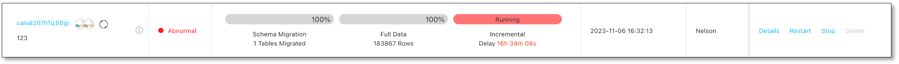
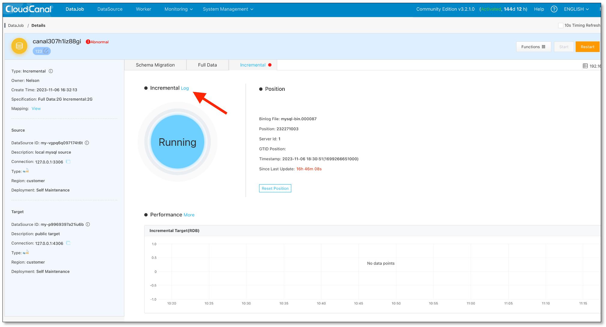
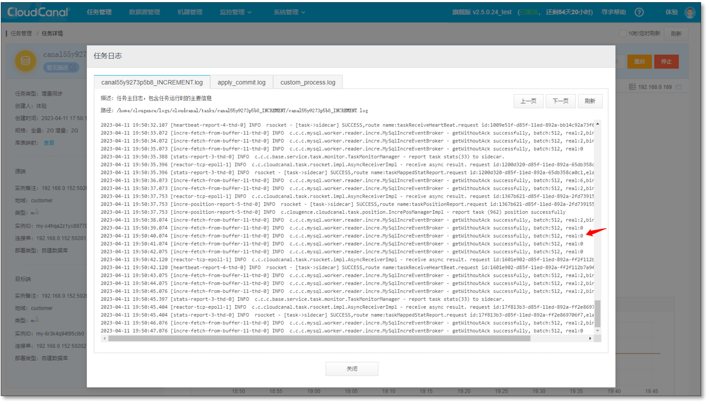
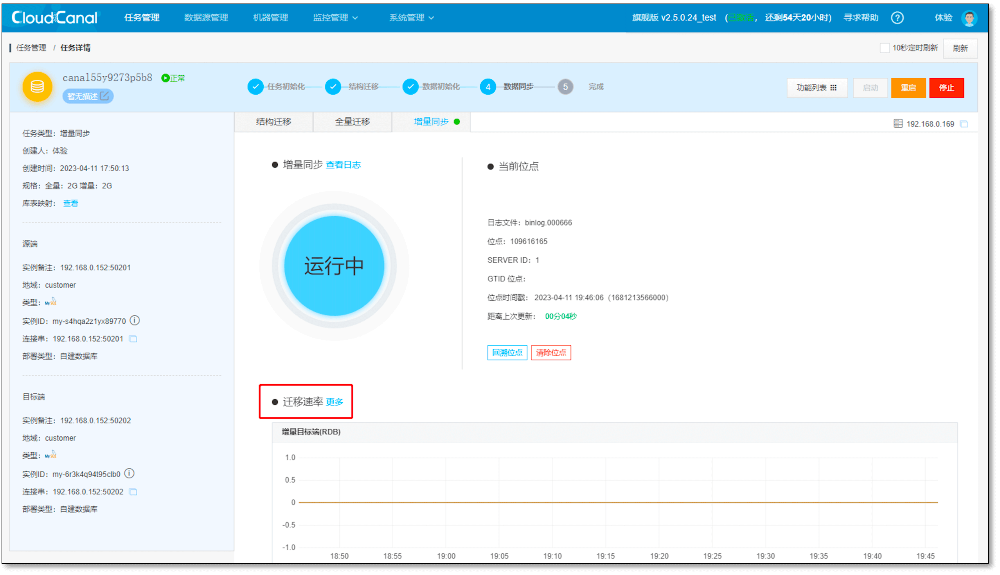
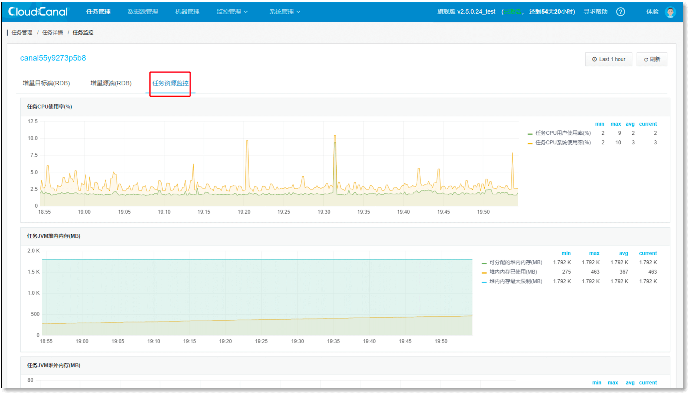
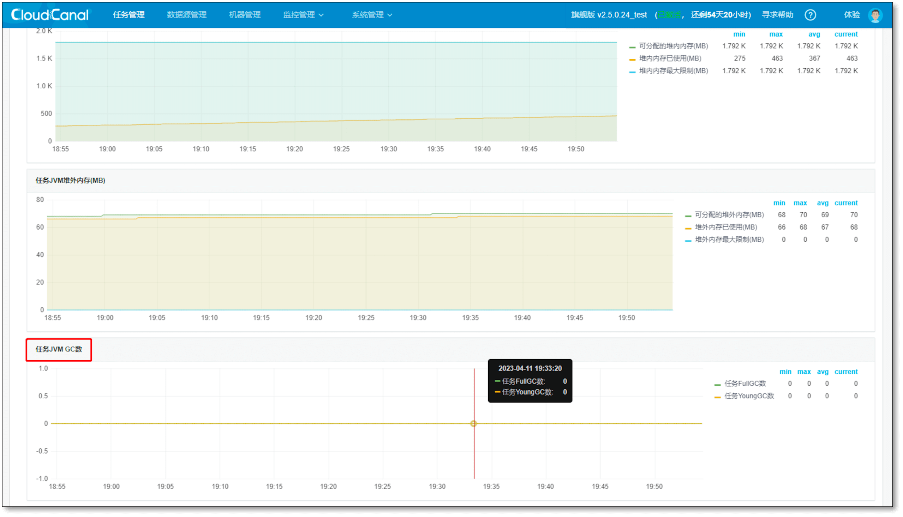
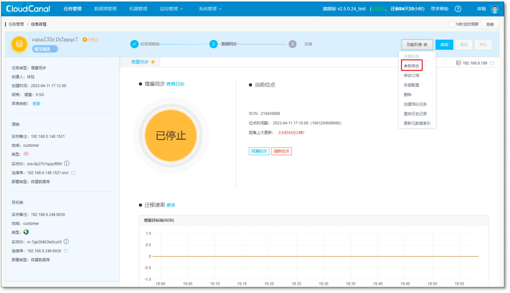
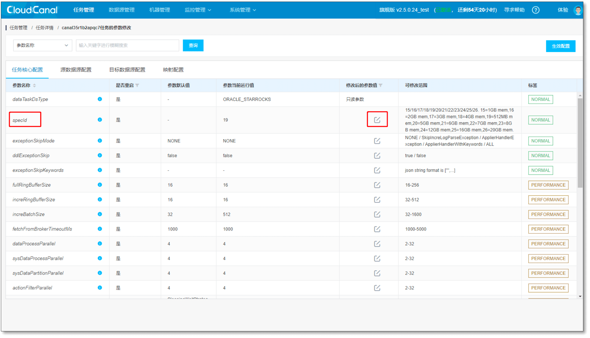

## 现象

- 增量同步任务运行中，但是延迟不断增大
  

## 排查

### 原因
- 任务因各种原因报错，无法同步数据
- 源端无任何变更，也没有心跳事件
- 对端数据源写入响应不理想或任务性能需要调优
- 源端数据拉取慢(物理距离远，被拉取多次数据，业务压力等）

### 步骤

#### 排除任务异常
- **登录CloudCanal控制台** > **监控管理** > **异常监控** , 选择**任务异常**
- 也可以进入 **任务详情** > **查看日志**，查看是否有异常日志堆栈(关键词:Exception)
  

#### 排除源端无写入无心跳
- **任务详情** > **查看日志**，观察文本中 real 值
  - 如长时间为0，则源端没有增量以及心跳(参考[open_mysql_heartbeat](../dataMigrationAndSync/datasource_func/MySQL/open_mysql_heartbeat.md))
  - 如几百上千，则说明流量较大，需要进行性能调优

 

#### 排除性能不给力
- **任务详情** > **任务资源监控** > **任务 JVM GC 数**。如果曲线观察到 FullGC 数量常常大于 2～3，表明任务内存比较紧张。
 
 
 

- FGC 过多， **任务详情** > **功能列表** > **参数修改** 进行参数调整
  - 增量同步：调整 **increRingBufferSize**、**increBatchSize** 参数，将原有值调小一半，避免一批同步太多数据导致 FGC
  - 全量迁移：调整 **fullRingBufferSize**、**fullBatchSize** 参数，将原有值调小一半，避免一批迁移太多数据导致 FGC

- 另可调整任务规格参数 **specId**
 
 

