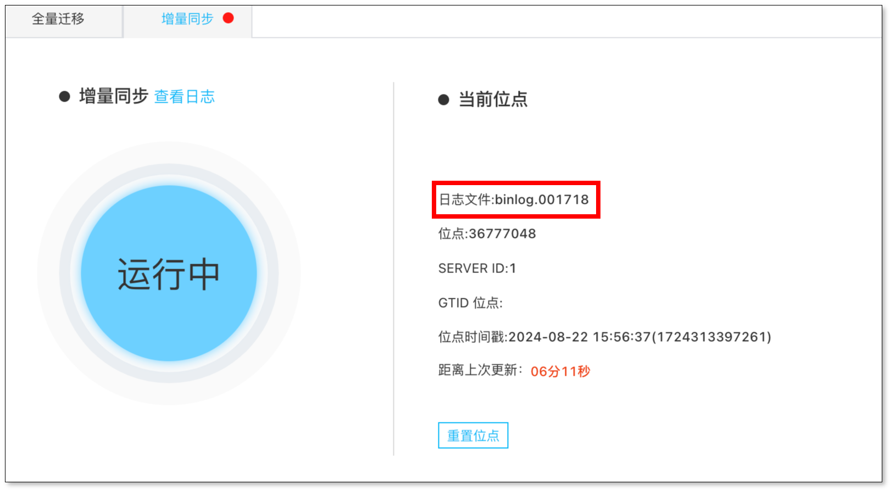

:::info
本文档同样适用于 MySQL 系数据源。
:::

本文介绍 MySQL 源端找不到 binlog 文件导致同步任务中断的解决方法。

## 现象描述
MySQL 源端同步任务中断，日志中出现：

```
java.io.IOException: Received error packet: errno = 1236, sqlstate = HY000 errmsg = Could not find first log file name in binary log index file
```

## 问题排查
MySQL binlog 文件被清理，任务未能及时消费 binlog 文件，有以下两个原因：
  - 任务异常导致任务无法继续消费位点。
  - 任务消费过慢，binlog 清理过快。任务消费过慢可参考 [性能调优](../faq/performance_optimization.md)。

## 解决方法
1. 在任务详情页面查看当前任务正在消费的 binlog 文件。



2. 检查当前消费的 binlog 文件是否存在。参考命令：`show binary logs`。
   
3. [重置位点](../operation/job_manage/job_op/job_position.md)。
4. [数据校验和订正](../bestPractice/verification_and_correction.md)。
5. 调整 MySQL binlog 文件保留时间（推荐设置 24 小时及以上）。
