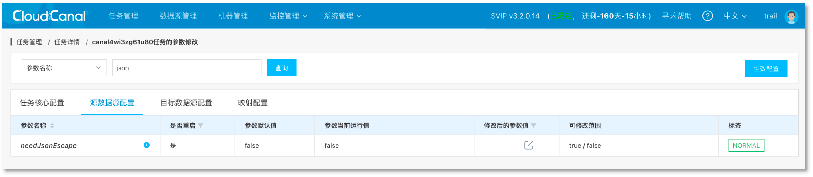

## 现象
MySQL 源端同步任务中断，日志中出现 

> Caused by: com.mysql.cj.jdbc.exceptions.MysqlDataTruncation: Data truncation: 
Invalid JSON text: The document root must not be followed by other values.

## 排查

### 原因

- JSON 字段值中特殊字符没有转义，导致 JSON 数据被截断

### 步骤
1. **任务详情** > **更多功能** > **参数修改** > **源数据源配置**，设置参数 **needJsonEscape** 为 true
   
2. 点击右上角 **生效配置** 并确认
